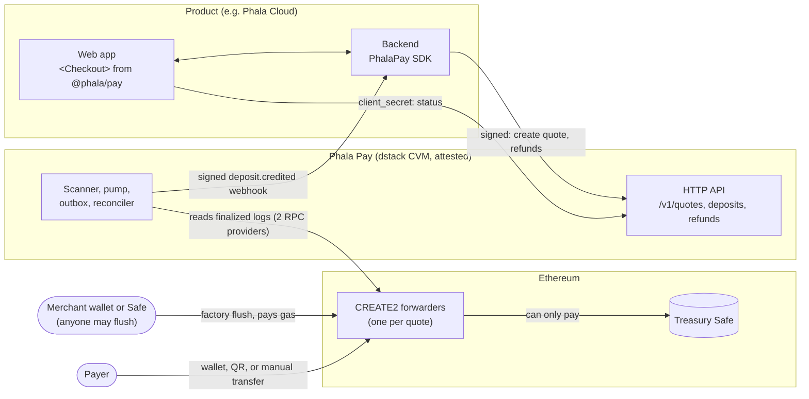

# Phala Pay

A service, called by the Phala Cloud billing backend, that turns finalized ERC-20
deposits into idempotent USD credits. Deposit addresses are CREATE2 forwarder contracts that
can only pay the treasury; the service runs inside a dstack confidential VM and tells products what
to credit with signed `deposit.credited` webhooks, which they fulfill once per deposit. The default flow is quote first: the user locks a
price, receives an exact amount and a single-use address, and pays within the window; quotes are
the only flow, as Stripe's PaymentIntent is.

First route: Ethereum Mainnet PHA → Phala Cloud USD credit. Further assets, chains, and products
are added through route configuration and adapters.

## Flow



```text
product asks for a quote; the account is created with it
  → service locks the price and computes a CREATE2 forwarder address (no key, nothing deployed)
  → a display-only head scan shows the payment as "seen, N confirmations" within a block
  → scanner reads finalized blocks and records the transfer
  → a second RPC provider confirms block hash and log; the quote is taken at that instant
  → sanctions screening and per-deposit bounds
  → credited: a signed deposit.credited webhook, retried until the product fulfills it once
  → the merchant (or anyone) flushes forwarders to the treasury; the service sends no transaction
    and marks deposits swept from the finalized Flushed events
  → reconciliation of chain, service, and product ledger
```

There is no operator step and no failure state: anything that cannot complete retries with
backoff and raises an alert on age. Deterministic denials are recorded with evidence and never
credited.

## Ownership

The service owns addresses, chain evidence, finality, screening, pricing, deposit state,
credits and their webhooks, the swept status it reads from the chain, and reconciliation. The
merchant sweeps its forwarders and pays that gas. The product owns customer identity, spendable
balance, debt, entitlements, and billing policy.

## Documents

- [Design](docs/architecture.md) — goal, trust model, schema, state machine, contracts, deployment, policies, acceptance
- [First route profile](examples/phala-cloud-pha.yaml)
- [Integration guide](docs/integration.md) — quickstart, quotes, webhooks and fulfillment, refunds, testing, reference
- [Plan to production](docs/plan.md) — what is done, what remains, and who owns it

## Database roles

Runtime commands use `DATABASE_URL`, whose login role must be a member of the migration-created
`topup_app` NOLOGIN role. The application role has operational CRUD privileges but no `TRUNCATE`,
and append-only `transitions` and `audit` permit only `SELECT` and `INSERT`.

`topup migrate` uses only `MIGRATE_DATABASE_URL`. It must identify the trusted database owner with
permission to create roles and schema objects; the command never falls back to the application URL.

## Scanner configuration

`topup run` reads `DATABASE_URL` and accepts each enabled route version through a repeated
`--route FILE` option. Provider ids in each route file resolve to `TOPUP_RPC_<ID>_URL` after
uppercasing and replacing non-alphanumeric characters with underscores; a URL with the placeholder
`{key}` takes the API key in `TOPUP_RPC_<ID>_KEY` there, so the URL can be attested while the key
stays sealed (deploy/README.md, "Sealing the secrets"); the first provider is
provider A for finalized scanning. For each chain and asset the scanner uses the highest supplied
route version. The scanner poll interval is `--scanner-poll-interval-s`, defaulting to 15 seconds.
A display-only head scan on provider A reads `[finalized + 1, latest]` every 12 seconds (or the
scanner poll interval, if shorter) for the pending view and wakes the finalized scan as soon as
`finalized` advances; it never creates or changes a deposit.

The same command serves the HTTP API on `0.0.0.0:8080` by default; `--bind` overrides the socket
address. `TOPUP_PUBLIC_ORIGIN` is required: the public scheme and authority clients call, such as
`https://topup.example` (no path). Request signatures are verified against this origin plus the
request path and query, so behind an ingress it must be the public URL (in a CVM, the custom
domain of `deploy/README.md`), not the internal address; `Host` and `X-Forwarded-*` headers are
never trusted.

## Restore

`topup restore-check` runs the architecture §13 post-restore reconciliation, which GETs and
adopts the product's answer for every deposit at or beyond `cleared`. Run it only while `topup`, `heartbeat`, and `backup` are stopped; the
[restore runbook](deploy/RESTORE.md) keeps the service stopped until the check reports `ok`.

## Status

Staging runs on Sepolia at `https://pay-api-staging.phala.com`. Nothing is deployed to mainnet:
[the plan to production](docs/plan.md) lists the remaining integration, inputs, and reviews.

## License

[Apache-2.0](LICENSE). Report vulnerabilities as described in [SECURITY.md](SECURITY.md).
