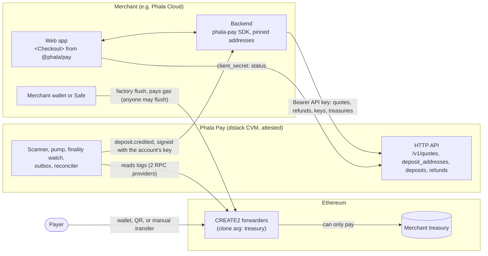

# Phala Pay

Open-source, self-hosted software for an API-only, multi-tenant crypto payments service in
Stripe's shape. Each operator runs its own instance in its own dstack confidential VM, for its own
merchants: [self-hosting](docs/self-hosting.md) is the path from a fork to a credited deposit.
Phala runs an instance only for Phala Cloud and offers no hosted service to others.

The operator onboards each merchant as an account (`acct_…`) through the admin API; the merchant
does everything else with its API keys and the SDKs (there is no dashboard). Phala Cloud is an
ordinary account of Phala's instance. The service
turns deposits of configured ERC-20 tokens into USD-valued credits and tells the merchant what to
credit with signed `deposit.credited` webhooks, which it fulfills once per deposit. It is
software, not custody: deposit addresses are CREATE2 forwarder contracts that can only pay the
merchant's own treasury, the service holds no funds and sends no transactions, and the merchant
sweeps and refunds from its own wallet or Safe. The service runs inside a dstack confidential VM,
and each account pins its own webhook signing key from attestation.

A **quote** locks a price: the customer receives an exact amount and a single-use address and pays
within the window. Each customer can also have one persistent, rotatable **deposit address** for
every supported token on every chain (the same address wherever the treasury is the same),
credited at spot for any amount, like the stable bank-transfer details of Stripe's customer
balance.

Routes (a chain and a token each) are route files each operator commits to its fork; further
merchants are accounts, not configuration. Phala's first route is Ethereum Mainnet PHA, for Phala
Cloud's account.

**Website and live demo:** [pay.phala.com](https://pay.phala.com/), Phala's page with a working
demo, a cloud console's billing page on Sepolia with test PHA; the page is served by Cloudflare and
its demo is run by Phala's staging reference product
([deploy/README.md](deploy/README.md#staging-reference-product)).

## Flow



```text
merchant backend creates a quote (or the customer's deposit address) with its API key
  → service locks the price and computes a CREATE2 forwarder address over the merchant's treasury
  → the merchant recomputes the address from its own pins before showing it
  → the per-block scan shows the payment as "seen, N confirmations" within seconds of its block
  → recorded once its block reaches the confirmation (2 on Ethereum, or the account's stricter policy)
  → a second RPC provider confirms block hash and log; the quote is taken at that instant
  → sanctions screening and per-deposit bounds
  → credited: a signed deposit.credited webhook, retried until the merchant fulfills it once
  → watched to finality; a dropped transaction becomes deposit.reversed
  → the merchant (or anyone) flushes forwarders to its treasury; the service marks deposits swept
    from the finalized Flushed events
  → reconciliation of chain and service ledger per forwarder
```

There is no operator step in a payment and no failure state: anything that cannot complete
retries with backoff and raises an alert on age. Deterministic denials are recorded with evidence
and never credited.

## Ownership

The service owns addresses, chain evidence, finality, screening, pricing, deposit state, credits
and their webhooks, the swept status it reads from the chain, and reconciliation. The operator
creates accounts, decides live access, issues first and recovery keys, and handles incidents. The
merchant owns its keys, treasuries, webhook endpoints, sweeps, and refunds, pays that gas, and owns
its customers' identity, balances, entitlements, and billing policy.

## Documents

- [Design](docs/design/multi-tenant.md) — the multi-tenant, API-only design and its decisions
- [Architecture](docs/architecture.md) — the specification: trust model, schema, state machine, contracts, API, deployment, policies
- [Integration guide](docs/integration.md) — for merchants: quickstart, quotes, deposit addresses, treasuries, sweeps, webhooks, refunds, keys, reference
- [API reference](https://phala-network.github.io/phala-pay/) — built from [crates/topup/openapi.json](crates/topup/openapi.json)
- [First route profile](examples/phala-cloud-pha.yaml)
- [Self-hosting](docs/self-hosting.md) — for the operator: running your own instance, in order
- [Deployment](deploy/README.md) and [runbooks](deploy/runbooks/README.md) — for the operator: the reference
- [Plan to production](docs/plan.md) — Phala's instance: what is done, what remains, and who owns it

## Database roles

Runtime commands use `DATABASE_URL`, whose login role must be a member of the migration-created
`topup_app` NOLOGIN role. The application role has operational CRUD privileges but no `TRUNCATE`,
and append-only tables (among them `transitions`, `audit`, `events`, and the finalized chain facts
`flushed` and `flush_failures`) permit only `SELECT` and `INSERT`.

`topup migrate` uses only `MIGRATE_DATABASE_URL`. It must identify the trusted database owner with
permission to create roles and schema objects; the command never falls back to the application URL.

## Scanner configuration

`topup run` reads `DATABASE_URL` and accepts each enabled route version through a repeated
`--route FILE` option. Provider ids in each route file resolve to `TOPUP_RPC_<ID>_URL` after
uppercasing and replacing non-alphanumeric characters with underscores; a URL with the placeholder
`{key}` takes the API key in `TOPUP_RPC_<ID>_KEY` there, so the URL can be attested while the key
stays sealed (deploy/README.md, "Sealing the secrets"); the first provider is
provider A for scanning. For each chain and asset the scanner uses the highest supplied route
version. A head loop on provider A polls `eth_blockNumber` once per block time
(`--head-poll-interval-s`, 12 seconds by default) and reads each new block's transfers to every
issued address in one request; `finalized` is read at most every `--finalized-poll-interval-s`
(60 seconds), and its advances drive the finalized backstop, the finality watch, and reconciliation
(`--reconcile-interval-s`, at most every 600 seconds). docs/architecture.md §8 has the cadences,
and deploy/README.md ("Measuring RPC usage") the call counters and a cost formula.

The same command serves the HTTP API on `0.0.0.0:8080` by default; `--bind` overrides the socket
address. `TOPUP_PUBLIC_ORIGIN` is required: the public scheme and authority clients call, such as
`https://topup.example` (no path). The admin API's RFC 9421 signatures are verified against this
origin plus the request path and query, and treasury challenges (EIP-4361) name it, so behind an
ingress it must be the public URL (in a CVM, the custom domain of `deploy/README.md`), not the
internal address; `Host` and `X-Forwarded-*` headers are never trusted.

## Restore

A database restored from backup starts in **restore mode** (docs/architecture.md §14): reads work,
every merchant write answers `503 service_restoring`, and nothing is credited or delivered until
the operator has reconciled the restore with each merchant's records through
`/v1/admin/restore/…` and unfrozen it. `topup restore-check` validates the restored database
read-only and records the restore; the [restore guide](deploy/RESTORE.md) and the
[reconciliation runbook](deploy/runbooks/restore.md) have the steps.

## Status

The software is pre-1.0 and has not had its independent security review. Phala's instance is not
on mainnet yet, and its staging deployment (Sepolia, `https://pay-api-staging.phala.com`) is reset
for the multi-tenant schema: [the plan to production](docs/plan.md) lists what remains.

## License

[Apache-2.0](LICENSE). Report vulnerabilities as described in [SECURITY.md](SECURITY.md).
