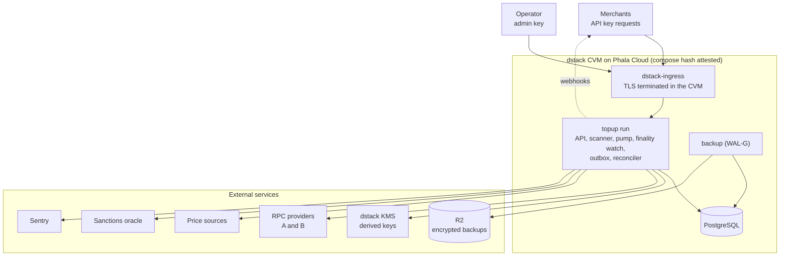
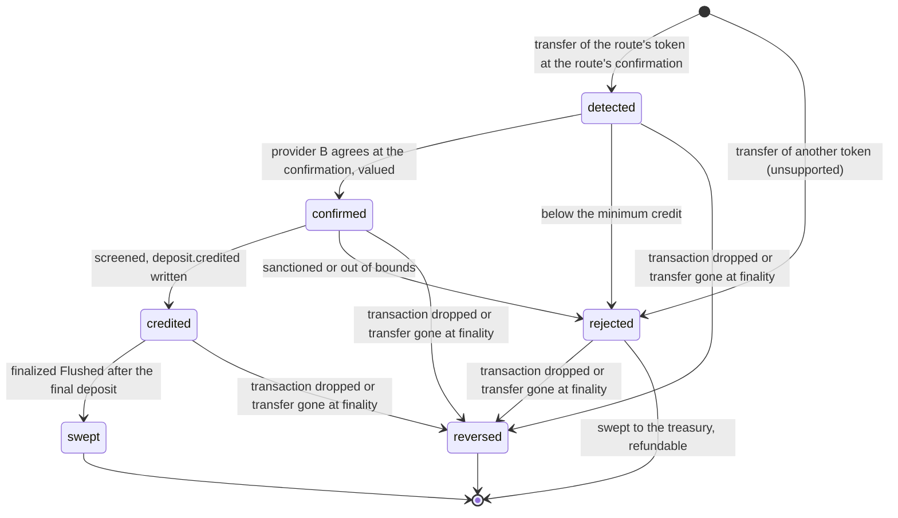
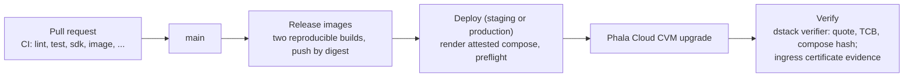

# Phala Pay — Design

Status: v7 (Stripe-style product API). Single specification and implementation design. Numbers marked *(policy)* are set
by finance and risk; this document fixes what they mean.

## 0. Standards used

Every mechanism follows a named practice. Where this design adapts a practice, the row says so.

| Mechanism | Standard or reference | Adaptation |
|---|---|---|
| Deposit addresses | CREATE2 forwarders, EIP-1167 via OpenZeppelin `Clones` with immutable args (BitGo `ForwarderFactory` as reference pattern) | The treasury is each clone's only immutable argument instead of per-clone init |
| Same address on every EVM chain | Arachnid deterministic deployment proxy `0x4e59b44847b379578588920cA78FbF26c0B4956C`, plain CREATE2 salts | The factory has no constructor arguments, so its init code is the build |
| Contract roles | None: public `flush` (BitGo's `flush()`), per-target failure isolation (Multicall3 `allowFailure`) | — |
| Rate-locked deposits | Invoice model (BTCPay Server, Coinbase Commerce): unique address, fixed amount, expiry | Exception rules (§9) are this service's policy profile, not a processor standard |
| Chain reads | JSON-RPC `latest`, `safe`, and `finalized` tags, `eth_getLogs`, receipts, two independent providers | Credit at a confirmation depth like exchanges and BTCPay's confirmation setting; watch to finality |
| Price | Coin Metrics Reference Rate (benchmark methodology), checked against the deepest market | — |
| Sanctions | Chainalysis sanctions oracle `isSanctioned(address)` | Direct list screening only; not KYT |
| Deposit identity | UUIDv5 (RFC 9562) over `chain_id:lowercase_tx_hash:decimal_receipt_log_index` | The log's position in its transaction's receipt, which survives re-inclusion |
| Reversal | Etherscan "Dropped & Replaced", ethers `TRANSACTION_REPLACED`; Stripe's dispute after a failed ACH payment | A proven-dropped deposit becomes `reversed` and `deposit.reversed` |
| Job queue | PostgreSQL `SELECT … FOR UPDATE SKIP LOCKED` | — |
| Outbound effects | Transactional outbox; at-least-once with idempotent receivers | — |
| Product fulfillment | Stripe Checkout fulfillment: one signed event per paid session, one idempotent fulfillment function | The signature is asymmetric (the product holds only the public key); retries never stop; the event id is derived from the deposit id (§11) |
| Product API shape | Stripe's API conventions: top-level resources, the list object, the error object, prefixed ids, `expand[]`, the Event object, `client_secret` | Token amounts are decimal strings; §12 lists every departure |
| Idempotent product API | `Idempotency-Key` on every `POST`, kept per account and mode with a request fingerprint and the response for 24 hours (Stripe; the IETF Idempotency-Key draft) | An API key's secret is never stored for a replay |
| Merchant authentication | Bearer secret keys `ppay_sk_{test,live}_…`, stored as SHA-256, with GitHub's token format (prefix, random body, CRC32 checksum); Stripe's roll with an overlap of at most 7 days | Keys are created, rolled, and revoked through the API; the operator issues the first and recovery keys (design D7, D8) |
| Admin request signing | RFC 9421 HTTP Message Signatures, ed25519, `content-digest` | The operator's admin API only |
| Webhooks | Standard Webhooks | — |
| Money | Integer minor units; 8-decimal scaled prices | Precision is an application choice |
| Backup | WAL-G base backups plus continuous WAL, `archive_timeout` bounding RPO | — |
| TEE | dstack KMS derivation and attestation verification flow | — |

## 1. Goal

A private service, called by the Phala Cloud billing backend, that turns confirmed and
screened deposits of configured tokens into USD credit and tells the product what to credit
with one signed webhook per deposit, which the product fulfills once. A deposit is credited at
the route's confirmation (two blocks on Ethereum, about 30 seconds after paying) and watched to
finality; the rare deposit whose transaction leaves the chain is reversed with a signed
`deposit.reversed`, which the product handles like a refund. Quotes are the only way to
deposit, as Stripe's PaymentIntent is the only way to pay: the user states a USD amount,
receives a locked price, an exact token amount, a single-use address, and a countdown, then
pays. This is the checkout model of Coinbase Commerce and BitPay. A payment that does not match
its quote (late, wrong amount, second payment) is still credited, at the price observed when it
is confirmed. Persistent addresses issued before quotes became the only flow stay watched
by the finalized scanner and their payments are credited at spot, but none is issued again.

Customer contract: *tokens are converted to non-transferable Phala Cloud USD credit at the
published rate observed when the deposit is confirmed on Ethereum; the USD value is fixed
after crediting, unless the payment is reversed before finality.*

Success: eligible deposits are credited exactly once with no operator step, also after any
outage; balances reach the treasury whenever anyone flushes them, and the service sends no
transaction; chain, service, and product ledger reconcile.

First route: Ethereum Mainnet PHA → Phala Cloud USD. New tokens and EVM chains are new route
files; new products are new routes and a registered webhook receiver.

Out of scope: withdrawals, trading, fiat, on-chain credits, bonuses, and everything the
product owns (identity, balance, debt, entitlements, billing policy, welcome promotions).

## 2. Design rules

1. **Addresses have no keys and no service state.** Every address is a CREATE2 forwarder that
   can only pay the treasury, and every salt derives from identifiers the product holds.
2. **Fast credit, recoverable reversal.** A deposit is recorded once its block reaches the
   route's confirmation on provider A and credited once both providers show the same log there
   (§8). A watch re-reads every deposit by its receipt until it is final: a re-included
   transaction is followed, and only a transaction proven dropped (its nonce consumed by another)
   or a transfer missing at finality makes a deposit `reversed`. The display-only head scan shows
   a transfer as seen within seconds of its block; it never creates, rejects, values, or credits
   anything.
3. **Custody location is a chain fact, not a state.** A flush, sent by anyone, moves an
   address's whole balance to its treasury at log position `(block, log_index)`; a final deposit
   is flushed iff a finalized `Flushed` event on its address, token, and treasury is later than
   the deposit's own log position. This is computed from indexed finalized events, never stamped
   from database timing, and never depends on an unfinalized sweep.
4. **One state column, no failure state.** Five progress states plus `rejected` and
   `reversed`; anything else retries forever with capped backoff, and "stuck" is an alert on age.
   Finality is a timestamp (`final_at`), not a state.
5. **Price is observed together with the confirmation.** One step records the confirmation and
   the quote at the same instant; there is never a historical price lookup.
6. **Everything that affects money is measured.** Contracts, treasury, thresholds, and spreads
   live in the attested compose. Pause flags are the only runtime-mutable state.
7. **Cross-check every input, and let the product cap the output.** Two RPC providers, two
   price sources; the product may cap credits and verify chain evidence on its own node.

## 3. Trust model

The service runs in a dstack confidential VM. The host and cloud provider cannot read keys or
alter code without changing the attested measurement; products verify by attestation which
code holds the settlement key; the database is inside the boundary.

Deposit addresses are forwarders with an immutable treasury, so **a full compromise of the
service cannot redirect deposited funds**. A credit exists only as a `deposit.credited` event
signed by the attested service's key, which the product pins from attestation. A compromised
service could still sign a credit no deposit backs; as with a card processor, the product
trusts the processor's signed event, and it may bound or check that trust with its own
per-deposit and per-period caps and by verifying the cited log on its own node (§11). The service
holds no key that can send a transaction, so it has no gas balance to lose.

## 4. Contracts

The contracts follow [design D3](design/multi-tenant.md#d3-contracts).

```solidity
contract Forwarder {                                   // EIP-1167 implementation; clone args = abi.encodePacked(treasury)
    address public immutable factory;                  // the factory that created the implementation
    uint256 public constant NATIVE_SEND_GAS = 50_000;
    function treasury() public view returns (address); // Clones.fetchCloneArgs(address(this))
    function flush(address token) external onlyFactory returns (uint256 amount);
        // SafeERC20 full balance → treasury; token == 0 → ETH via call{gas: NATIVE_SEND_GAS}
}
contract ForwarderFactory {                            // no roles, no admin, no constructor arguments
    Forwarder public immutable implementation;         // created in the constructor
    function addressOf(address treasury, bytes32 salt) external view returns (address);
        // Clones.predictDeterministicAddressWithImmutableArgs
    function flush(address treasury, bytes32[] calldata salts, address token) external; // anyone
        // per salt: skip a forwarder holding nothing; clone if no code (ForwarderCreated); call its
        // flush with revert data truncated to 256 bytes; Flushed on success, FlushFailed and continue
}
```

- A forwarder's CREATE2 address commits to the factory, the implementation, its treasury (the
  clone's only immutable argument), and its salt, so its funds can reach only that treasury.
  Anyone may call `flush`; its only effect is moving funds to their owner.
- Events carry the treasury: `ForwarderCreated(salt, forwarder, treasury)`,
  `Flushed(salt, forwarder, token, treasury, amount)`, and `FlushFailed(salt, forwarder, token,
  reason)`. `amount` is what left the forwarder. The factory emits events for every caller and
  treasury, so readers filter by treasury.
- A failing target (a blacklisted forwarder or treasury, a treasury refusing ETH) emits
  `FlushFailed` and the batch continues, like Multicall3's `allowFailure`. Native sends forward at
  most `NATIVE_SEND_GAS` and copy no return data, so a treasury cannot consume the batch's gas;
  the factory's `flush` is non-reentrant (`ReentrancyGuardTransient`). Treasury `address(0)` is
  refused.
- `salt = keccak256(abi.encode(account, account_id, "lock", quote_id))`, where `account` is the
  merchant's `acct_…` id, `account_id` its customer's identifier, and `quote_id` the
  service-assigned `qt_…` id. The merchant holds every input, including the treasury, so it
  recomputes an address before showing it.
- One factory per chain, deployed by anyone through the deterministic deployment proxy with the
  fixed salt `keccak256("phala-pay.ForwarderFactory.v2")`: no constructor arguments, so the same
  factory and implementation addresses on every chain. Each route records `forwarder_factory`,
  its `implementation`, and (until addresses carry their own) the `treasury` its quotes use.
- Plain ERC-20s with verified behaviour (PHA), including tokens whose `transfer` returns nothing.
  Fee-on-transfer and rebasing tokens are unsupported and must not be enabled in a route.
- Startup verifies on chain, on every provider: the canonical Multicall3 code hash (balance and
  `addressOf` reads go through it, §14; `topup run` refuses a chain without it), the factory and
  implementation runtime code against the recorded build, `implementation()`, the
  implementation's `factory()`, and `addressOf(treasury, sample salt)` against local derivation.
- The contracts are two files built from audited OpenZeppelin components (Clones, SafeERC20,
  ReentrancyGuardTransient); unit, fuzz, and invariant tests cover them. The independent review
  before mainnet (`docs/plan.md`) covers them.

## 5. Stack

Rust stable, `#![forbid(unsafe_code)]`, release `overflow-checks = true`. `tokio`, `axum` +
`utoipa`, `sqlx`, `alloy`, `dstack-sdk = "=0.1.3"` for the guest API of dstack 0.5.9, whose
guest agent the deployed OS image `dstack-0.5.9` runs (§14), `secrecy` + `zeroize`. That
crates.io release is the `rust-sdk-v0.5.9` source (commit
`282eeb27d22d8f091ad0fa5a90e638f85cf68751`) with only `hickory-dns` dropped from its `reqwest`
features (commit `f67b4f67ebabef0a27795705121698280a1038dc`); changing the SDK or the OS image
requires a spec change. The dstack 0.6 `/v1` guest API derives different keys for the same domain and no Phala
Cloud node offers a 0.6 image, so it is out of scope until a key migration is specified. `core` denies `arithmetic_side_effects`, `float_arithmetic`, `as_conversions`,
`unwrap_used`. `cargo-deny`, committed lockfile, reproducible distroless image by digest.
Contracts: Solidity with OpenZeppelin, Foundry; no external audit (§4).



```text
crates/core       pure, no I/O: money, route schema, CREATE2 math, state machine, valuation, screening
crates/adapters   chain::evm, signer::dstack, pricing::{coinmetrics,binance,kraken}, risk::oracle
crates/topup      binary: db, pump, scanner, finality, outbox, reconciler, api, cli
contracts/        Forwarder.sol, ForwarderFactory.sol, deploy scripts, Foundry tests
config/routes     route files (attested)   deploy/  compose + Dockerfile   tests/  integration + contract
```

## 6. Schema

Amounts are `numeric(78,0) CHECK (>= 0)` mapped to `U256`; `transitions` and `audit` are
append-only. Physical addresses belong to a quote, and so to an account, a mode, and a chain;
routes are selected per deposit by `(chain_id, asset_contract)`. The multi-tenant tables (API keys, treasuries, confirmation policies, limits, idempotency keys, and
the authorization table) are listed in [design §14](design/multi-tenant.md#14-data-model); the
tables the service uses today:

```text
accounts      id, public_id (acct_ + hex, generated), name, contact, due_diligence, charges_enabled,
              restricted, paused_scopes text[], …   -- the tenant, created by the operator
              -- scopes: quotes | settlement | refunds; empty = active
api_keys      id (key_ + hex), account_id, livemode, kind (secret|restricted), name, prefix, last4,
              key_hash UNIQUE (SHA-256), created_by (key_… | admin), expires_at, last_used_at,
              revoked_at                                              -- design D7
idempotency_keys  account_id, livemode, key, fingerprint, response jsonb, created_at
              PRIMARY KEY (account_id, livemode, key)                  -- pruned after 24 h
customers     id, account_id, livemode, client_reference_id, paused_scopes text[]
              UNIQUE (account_id, livemode, client_reference_id)
              -- client_reference_id is the API's account_id; created by the customer's first quote
              -- (`settlement` stops crediting: deposits wait in `confirmed`)
quotes        id (qt_ + hex), account_id, livemode, customer_id, route, amount_atomic, price_scaled,
              credit_minor, expires_at, status, consumed_by (deposit_id) UNIQUE, client_secret_hash,
              metadata jsonb
addresses     id, account_id, livemode, chain_id, quote_id UNIQUE, salt, treasury, address,
              deployed_block                      -- finalized ForwarderCreated for the pair
              UNIQUE (chain_id, address)          -- treasury: the forwarder's clone argument
cursors       chain_id PK, scanned_block, scanned_block_time,       -- finalized scanner
              confirmed_block                                       -- fast scan (§8)
pending_transfers  chain_id, tx_hash, log_index, receipt_log_index, block_number, block_hash,
              block_time, head_block, address_id, asset_contract, from_address, amount_atomic,
              first_seen_at
              PRIMARY KEY (chain_id, tx_hash, log_index)          -- display only (§8)
deposits      id, account_id, livemode, customer_id, chain_id, tx_hash, receipt_log_index,
              log_index, block_number, block_hash, block_time, address_id, route, route_version,
              asset_contract, from_address, amount_atomic, tx_from, tx_nonce, confirmations_at,
              final_at, state, reason, attempt, next_attempt_at, lease_token, lease_until,
              valuation_at, price_scaled, price_source (spot|lock), credit_minor, quote jsonb,
              metadata jsonb, created_at, updated_at
              UNIQUE (chain_id, tx_hash, receipt_log_index)
              -- account, mode, and customer are the address's; log_index and the block columns are
              -- evidence that follows re-inclusion; tx_from and tx_nonce prove a dropped
              -- transaction; swept requires final_at; metadata starts as the quote's
transitions   id, deposit_id, from_state, to_state, attempt, evidence jsonb, created_at
              -- also the finality watch's `final` and `followed` records (from_state = to_state)
flushed       chain_id, tx_hash, log_index, address_id, token, treasury, amount_atomic,
              block_number, block_hash      PRIMARY KEY (chain_id, tx_hash, log_index)
              -- finalized Flushed events, whoever sent them, for a known (address, treasury)
flush_failures  chain_id, tx_hash, log_index, address_id, token, reason (revert data, hex),
              block_number, block_hash      PRIMARY KEY (chain_id, tx_hash, log_index)
              -- finalized FlushFailed events for a known address; its deposits stay unswept
refunds       id, account_id, livemode, deposit_id, amount_atomic, to_address, tx_hash,
              status (requested|approved|sent|confirmed), requested_by, approved_by,
              metadata jsonb, created_at   -- executed from the treasury Safe
webhook_endpoints  id (we_…), account_id, livemode, url, enabled_events text[], status
events        id (evt_…), account_id, livemode, type, object_type (deposit|quote|api_key|account),
              object_id, actor (key_… | admin | system), data jsonb, created
              -- data: the object, rendered at the first delivery attempt
webhook_deliveries  event_id, endpoint_id, next_attempt_at, attempts, delivered_at, response jsonb
              PRIMARY KEY (event_id, endpoint_id)   -- one per enabled endpoint of the event's scope
audit         id, account_id, actor_type (api_key|admin|system), actor_id, action, subject,
              reason, created_at
```

`metadata` on quotes, deposits, and refunds is Stripe's (§12, Metadata): `NOT NULL DEFAULT '{}'`
with `CHECK (metadata_is_valid(metadata))`, the same limits the API validates.

Composite foreign keys tie each tenant row to its parent's account and mode (a quote to its
customer, an address to its quote, a deposit to its address and customer, a refund to its
deposit), so no row joins two accounts or two modes. `flushed` and `flush_failures` are finalized chain facts: the service inserts them
and never rewrites them.

Any ERC-20 transfer to one of our addresses becomes a deposit row. The route is chosen by
`(chain_id, asset_contract)`; no route → `rejected(unsupported_asset)`.

Credit: `exp = asset_decimals + price_scale − unit_decimals`,
`credit_minor = floor(amount_atomic × price_scaled / 10^exp)` (multiply when `exp < 0`),
512-bit intermediate, checked into `u64` or `rejected(out_of_range)`. Property tests:
monotone; splitting into `n` parts loses at most `n − 1` minor units.

## 7. States and pump



`core::next(state, outcome)` is the only function that picks a step's target;
`core::reverse(state)` is the finality watch's only transition, into `reversed` (terminal). A step that cannot
finish leaves the state, records the attempt in `transitions`, and retries with exponential
backoff and jitter, 30 s → 1 h, forever; an alert fires past the per-state age *(policy)*.
`rejected` is terminal for credit; its funds reach the treasury with any other when the forwarder
is flushed, and are handled there by finance. A `credited` deposit has no age alert: it waits for
its merchant's sweep, which has no deadline.

Transitions are applied with `UPDATE … WHERE id = $1 AND state = $expected AND lease_token =
$token`, writing transition and outbox rows in the same transaction. `N` pumps claim with
`FOR UPDATE SKIP LOCKED`, hold a 5-minute lease, run one step with shorter timeouts, persist
once. A step panic aborts the process; the lease expires and another pump re-claims the deposit.

| Step | Does |
|---|---|
| `detected → confirmed` | From both providers, by the transaction's receipt: the log at the deposit's receipt position, in the same block (same hash), and that block has reached the route's confirmation on each (§8, §14). A lagging provider is waited for at the head poll interval (2 s), 12 s for `finalized`. While `detected`, evidence is provisional: if both providers agree on different canonical evidence for the same identity, the row is corrected. If both are final past the row and neither has the log, the step retries with `log_absent_at_finality` until the finality watch decides; before finality it waits. When both providers' `finalized` covers the block, the deposit is marked final (`final_at`) in the same transaction. In the same step, fetch the quote (§8) and store `valuation_at`, `price_scaled`, `credit_minor`, `quote`. Below `min_credit_minor` → `rejected(below_minimum)`. |
| `confirmed → credited` | `isSanctioned(from)` on both providers at a recorded block; `min ≤ amount ≤ max` *(policy)*; account, product, and route not paused for `settlement` (paused → `Wait`, never a rejection). On a pass, the same transaction writes the `deposit.credited` outbox row (§11): the credit is owed to the product, whatever the product answers, unless the deposit is reversed before finality. |
| `credited → swept` | The deposit is final and a `flushed` row (a finalized `Flushed` event for its address, token, and treasury, whoever sent it) exists at a log position `(block_number, log_index)` greater than the deposit's. Applied in SQL, with the finalized `Flushed` event as evidence, when the scanner indexes the event, when the deposit is credited or becomes final, and by the reconciler's repair pass; the pump's credited step only waits. |

**Finality watch.** Whenever provider A's `finalized` advances (polled every 12 s), every deposit
of the chain that is neither final nor reversed is re-read on both providers by its transaction's
receipt:

| Both providers show | Then |
|---|---|
| The receipt at or below `finalized`, with the same transfer at the deposit's receipt position | `final_at` is set, the evidence follows the block, and a credited deposit is swept by a finalized `Flushed` event after it. |
| The receipt in a newer block that is not final, with the same transfer | The transaction was re-included: the evidence (block, hash, block-wide `log_index`) is followed; nothing is reversed. |
| The receipt at or below `finalized` without the transfer at that position | `reversed` (a `detected` deposit with other agreed evidence to its address is left to its confirm step). |
| No receipt, and the transaction's sender's nonce at `finalized` is past its nonce | Proven dropped, another transaction consumed the nonce: `reversed`. |
| No receipt, nonce unused | Pending again; wait, and `TopupDepositPendingAfterReorg` after an hour. |
| Anything else (the providers disagree) | Wait for the next advance. |

A reversal is one transaction: the `reversed` transition with its evidence; `deposit.reversed`
(event id `uuid_v5(NS, "deposit.reversed:" + deposit UUID)`) when the product was told of the
deposit (`credited` or `rejected`); and a quote the deposit consumed opens again while its window
lasts, or expires with `quote.expired`. A pending refund cannot exist: refunds require a final
deposit (§12). The watch raises `TopupDepositReversed`. A reversed deposit is never claimed again,
never swept, and not counted in custody reconciliation (§13).

## 8. Chain, valuation, screening

**Confirmation** (design D1) is per chain family, in reviewed code: a chain joins a family only
through a code change. The route's `chain.confirmations` is a depth `n` (`latest − block + 1 ≥ n`),
`safe`, or `finalized`; a block at or below `finalized` always qualifies, so `finalized`
reproduces crediting only final deposits.

| Chain family | Values | Default |
|---|---|---|
| Ethereum L1 (mainnet 1, Sepolia, Holesky, Hoodi, Anvil 31337) | a depth ≥ 1, or `finalized` | 2 (about 24 s): depth-1 reorgs are routine, deeper ones were not observed |
| OP-stack L2 (OP 10, Base 8453, Base Sepolia, OP Sepolia) | `safe` (derived from data posted to L1) or `finalized`; never the sequencer's unsafe head | `safe` |
| Any other chain | `finalized` | `finalized` |

**Head loop** per chain, on provider A, every 2 s (a sixth of a slot, or the scanner poll
interval if shorter): the fast scan, then the display-only head scan.

**Fast scan** (routes with a depth or `safe`): read the heads the confirmation needs, and fetch
`Transfer(*, watched addresses)` (below) from any contract in
`(max(finalized cursor, fast cursor), horizon]`,
at most one 2 000-block window below the horizon, where the horizon is the highest block that has
reached the confirmation. Each transfer's receipt gives its receipt position (its identity, §0)
and its transaction's sender and nonce. New transfers become `detected` deposits
(`ON CONFLICT DO NOTHING` on the identity), and the fast cursor advances in the same transaction;
the pump confirms them on both providers at once, so a payment is typically credited within
about 30 seconds (inclusion, one more slot, polling). A transfer the fast scan does not record,
such as a payment to an address no open quote watches or one a reorg deeper than the
confirmation introduced below its cursor, is recorded by the finalized scanner and credited at
finality.

**Finalized scanner** per chain: read `finalized` from provider A; fetch
`Transfer(*, our addresses)` from any contract in windows ≤ 2 000 blocks and ≤ 1 000 addresses;
insert with `ON CONFLICT DO NOTHING` on the identity, so a deposit the fast scan recorded is left
to the finality watch. In the same windows it indexes the route factory's `ForwarderCreated`,
`Flushed`, and `FlushFailed` events whose forwarder topic is one of our addresses, whoever called
the factory, and keeps only those of a known `(address, treasury)` pair (`FlushFailed` carries no
treasury; the forwarder address commits to it): `ForwarderCreated` sets the address's
`deployed_block`, `Flushed` inserts a `flushed` row and sweeps the address's final credited
deposits before it (§7), and `FlushFailed` inserts a `flush_failures` row, leaving the deposits
unswept. Every other factory event is ignored: anyone can call the factory. The cursor advances
after both are committed, so everything at or below it is indexed at finality. New addresses
backfill from creation (the chain's committed cursor when the address is issued); retired and
lock addresses stay in the filter. Later option: Helios as one provider.

**Head scan (display only)** per chain, on provider A, in the head loop: read non-zero `Transfer` logs emitted by the chain's routed token contracts to
watched addresses in `[finalized + 1, latest]` and, in one transaction, upsert the rows seen into
`pending_transfers` and delete rows in that range not seen this time (reorged, or no longer
watched). Other tokens are never requested, so they cannot create pending rows or
notifications; they appear only after finality, as `rejected(unsupported_asset)`. Block times are
read by block hash. The head scan reads the finalized cursor `FOR SHARE`, and the finalized
scanner deletes rows at or below its cursor in the transaction that advances it, so a transfer
moves from pending to deposit atomically and no row below the cursor is written afterwards.
Pending rows never feed deposits, transitions, locks, exposure, credits, or reconciliation;
lock amount and timeliness are computed when read, never stored. When the head scan sees
`finalized` advance it wakes the finalized scanner. A row that is already a deposit is shown as
the deposit (§12). While reconciliation has frozen
a chain its head scan stops too, so the pending view stops updating.

Watched addresses, read by the fast scan and the head scan: quote addresses whose quote is neither
completed nor canceled, until one hour after `expires_at`. Open quotes are bounded by the exposure caps (each reserves at least
`min_credit_minor` against the global cap) and, for the hour after expiry, by the per-account
creation rate limit; any number is requested in batches of 1 000. A payment to any other issued
address (a closed quote's, or a legacy persistent one) shows no `payment` before finality and is
not credited before it; the finalized scanner records it, and it is credited at spot.

**Valuation** happens inside the confirm step, so `valuation_at` is the confirmation
observation and the price is always current at fetch time. Every route's pricing configuration declares
`mode: spot | stablecoin`; the service never infers the mode from an asset symbol. Spot: primary
Coin Metrics `ReferenceRateUSD` (1-minute), check Binance `PHAUSDT` × Kraken `USDT/USD`; each
observation aged ≤ `max_age` *(policy)* at fetch; `|primary − check| / primary ≤
max_deviation_bps / 10 000`; FX within `max_fx_deviation_bps`; the primary is used. Any failure
retries the whole step. Stablecoin routes use fixed `1.0` with the primary reference rate as a
depeg guard; check and FX observations are not required for that mode.

**Screening** is direct sanctions-list screening plus per-deposit bounds. KYT is a separate
adapter that compliance may require before GA.

## 9. Quotes

Invoice model, enabled from the pilot, with this service's exception profile:

- `POST /v1/quotes {account_id, amount, currency, chain_id, asset}` returns the quote `{id,
  amount, amount_atomic, exchange_rate, address, payment_uri, status, expires_at, …}`.
  `price_lock = price_spot / (1 + spread)` with `spread = spread_bps / 10 000` *(policy)*; the
  user states USD cents and the token amount is rounded up, then up again to
  `quote.amount_decimals` token decimals so the payer reads and types a short amount (the
  overpayment, below one unit of the last decimal, is the payer's; the credit is unchanged).
  `expires_at = now + window` *(policy)*. Quotes count against open-exposure caps per account,
  per product, and global *(policy)*, reserved atomically at creation; creation is rate-limited
  per customer. Repeating an `Idempotency-Key` with the same request within 24 hours returns the
  first response (another request is `400 idempotency_error`), also while `quotes` is paused.
- The lock is consumed by the first deposit to its address whose `block_time ≤ expires_at`,
  `asset` matches, and `|amount − locked| ≤ lock_tolerance_bps` *(policy)*; consumption is a
  single `UPDATE … WHERE consumed_by IS NULL`, in the confirm step. If that deposit is reversed
  (§7), the quote opens again while its window lasts (reserving its exposure again), or else
  expires with `quote.expired`. That deposit is valued at `price_lock` and the
  product receives exactly the `credit_minor` it showed the user.
- Any other deposit to a lock address (late, wrong amount, second payment) is valued at spot
  and still credited; the product shows this rule before payment.
- Expiry uses chain time, like eligibility. A lock expires unconsumed, releasing its exposure
  and emitting `quote.expired`, only once the chain's scanner has committed through a
  finalized block whose time is past `expires_at` (the finalized head's time, read with the
  head, is stored with the cursor) and no deposit mined inside the window still awaits its
  confirm step. A payment mined inside the window is therefore consumed at the lock price and
  never reported as expired. Exposure stays reserved until finality, about 15 minutes after
  `expires_at`, and longer while the scanner is stalled (§16). Until then the API
  shows the quote `open` past `expires_at`, and cancellation is refused once the window has
  closed (`409 quote_window_closed`). A quote whose address has received any payment, even a
  rejected one, can no longer be cancelled (`409 quote_payment_received`).
- Exposure counters sum `credit_minor` across routes, so every route must use the same
  `unit_decimals`; the service refuses to load routes that differ.
- A "quote, then pay to a reusable address" variant is deliberately not offered: matching a
  quote by amount alone is ambiguous, and the single-use address is the processor-standard
  answer.

## 10. Signing and sweeping

```rust
pub trait Signer {
    async fn sign_settlement(&self, payload: &[u8]) -> Result<Signature>;
    async fn settlement_public_key(&self) -> Result<PublicKey>;
}
```

`signer::dstack` derives `settlement/v1` (ed25519) on demand and zeroizes it (dstack 0.5 derives a
key from its domain alone; each domain has one algorithm). The service holds no transaction key:
it sends no transactions and pays no gas (design D2, D4).

**Sweeping** is the merchant's transaction. Anyone may call the permissionless factory's
`flush(treasury, salts[], token)`; each forwarder pays only the treasury its address commits to,
so the only effect is moving funds to their owner. The merchant sends it from its own wallet or
Safe when sweeping is worth the gas (design D4); the SDK builds the call or a Safe Transaction
Builder batch (design PR 10). The service learns of every sweep from the chain: the finalized scanner indexes `Flushed` and
`FlushFailed` for its addresses (§8), and deposits are swept by the rule in §7. A `FlushFailed`
target (a token or treasury refusing the transfer) keeps its balance and its deposits stay
`credited`; it is recorded in `flush_failures` for the merchant, not raised as a platform alert.

## 11. Fulfillment webhook

The service tells the product what to credit with one signed event per deposit, and the product
fulfills it once: the pattern of Stripe Checkout fulfillment. The deposit's state never depends
on the product's answer; delivery is tracked on the outbox row.

```http
POST {webhook_url}
webhook-id: evt_<hex of uuid_v5(DEPOSIT_NAMESPACE, "deposit.credited:" + deposit UUID)>
webhook-timestamp: <Unix seconds of this attempt>
webhook-signature: v1a,<base64 ed25519 by settlement/v1 over "{id}.{timestamp}.{raw body}">

{ "id": "<webhook-id>", "object": "event", "type": "deposit.credited", "created": 1790409590,
  "data": { "object": { "id": "dep_…", "object": "deposit", "account_id": "<account>",
                        "quote": "qt_…", "status": "credited", "amount": 1234,
                        "currency": "usd", "price_source": "quote", … } } }
```

- The screen step writes the event in the transaction that moves the deposit `confirmed →
  credited` (§7), seconds after the transfer reaches the route's confirmation (§8). The outbox row names the product and the deposit; `data.object`, the deposit
  as `GET /v1/deposits/{id}` returns it, is rendered on the first delivery attempt and stored,
  so retries and replays send the same body. `amount` is the quoted credit when `price_source`
  is `quote`, otherwise the spot credit at finality (§9). `quote` is the receiving address's
  quote, also when a late or wrong-amount payment was valued at spot.
- A credited deposit whose transaction leaves the chain before finality (§7) is `reversed`, and
  `deposit.reversed` follows, with the same derived-id rule. This is Stripe's pattern for a
  payment that fails after success (an ACH failure after `succeeded` becomes a dispute): rare,
  signed, and handled by the product like a refund.
- Delivery is the outbox (§12): at least once, in no order, `2xx` acknowledges, anything else or
  no answer within 20 s is retried with full-jitter backoff (ceiling 30 s doubling to 1 h),
  forever; an undelivered event raises the outbox age warning after 24 hours and the operator
  can replay it. The daily report counts undelivered `deposit.credited` per route.
- The event id is derived from the deposit id, so every retry, replay, and re-emission after a
  restore carries the same `webhook-id`, and the outbox stores one row per deposit. Rows written
  before prefixed ids (outbox `format` 1) keep their flat payload and old envelope
  (`event_id`, `created_at`, `data`) and bare-UUID `webhook-id`, so their replay is byte-identical.

Product obligations:

1. Verify the Standard Webhooks `v1a` signature over the raw body against the pinned
   `(keyid, public key)`, with a timestamp tolerance of 300 seconds.
2. Credit `amount` to `account_id` at most once per deposit id (`dep_…`): the credit
   and its record in one transaction under a unique index, committed before answering `2xx`.
   A repeat is acknowledged without a second credit. A repeat with a different amount can
   only follow a service restore that re-priced a spot deposit (§14); keep the first credit and
   report it.
3. Refuse by holding, never by failing the delivery: a credit for an unknown or closed
   workspace, a suspended account, or above the product's own caps is recorded as held, answered
   `2xx`, and returned through a refund request (§15).
4. On `deposit.reversed`, claw back the credit applied for that deposit id, exactly as for
   `deposit.refunded`, at most once per event id; a held credit was never applied. Until a
   deposit is final (about 15 minutes on Ethereum), its credit can still be reversed.

Optional hardening, each the product's choice: fetch `GET /v1/deposits/{id}` and require
`credited` or `swept` with the same amount; recompute the deposit UUID `uuid_v5(NS,
"{chain_id}:{tx_hash}:{receipt_log_index}")`, where `receipt_log_index` is the transfer's
position among its transaction's receipt logs, and verify the cited log on its own node at
finality;
per-deposit and per-period caps as review holds. None is needed for correctness: the credit is
authorized by the service's signature alone.

Phala Cloud: find-or-create an `Order` (`provider = crypto_topup`, `order_flow_code =
'crypto-top-up'`, `provider_order_id` = the deposit id `dep_…`, partial unique index on
`(team_id, provider_order_id)` for that flow), the credit transaction tagged `funding_source =
crypto:<asset>:<chain>`, and `complete_order_payment`, in one transaction. Non-card top-ups skip
the welcome promotion by existing rule.

## 12. API and events

The product API follows Stripe's documented conventions, so an integrator who knows Stripe
knows it. Where it departs, the last column says why.

| Convention | Stripe | Here |
|---|---|---|
| Resources | Top-level nouns, actions as `POST …/{id}/cancel` ([API reference](https://docs.stripe.com/api)) | `/v1/quotes`, `/v1/deposits`, `/v1/refunds`, `POST /v1/quotes/{id}/cancel` |
| Caller | The secret key identifies the account | Same: `Authorization: Bearer ppay_sk_…`; the key also selects the mode |
| Customer reference | Checkout's `client_reference_id` | `account_id`, the product's own id for its customer (a workspace); an account is created by its first quote |
| Ids | Prefixed opaque ids | `qt_`, `dep_`, `re_`, `evt_` and the 32 hex digits of a UUID; the deposit and event UUIDs are UUIDv5, so they stay recomputable (§0, §11) |
| Amounts | Integer minor units, lowercase currency ([currencies](https://docs.stripe.com/currencies)) | `amount` in US cents with `currency: "usd"`; token amounts are decimal strings (`amount_atomic`), since 18-decimal values exceed JSON's safe integers |
| Timestamps | Unix seconds | Same: `created`, `expires_at`, `valued_at` |
| Lists ([pagination](https://docs.stripe.com/api/pagination)) | `{object: "list", url, has_more, data}`, newest first; `limit` 1–100, `starting_after` or `ending_before` | Same |
| Expansion ([expanding](https://docs.stripe.com/api/expanding_objects)) | `expand[]`, depth ≤ 4 | `expand[]` for a deposit's `quote`, a quote's `deposit`, and a refund's `deposit`; depth 1 |
| Errors ([errors](https://docs.stripe.com/api/errors)) | `{error: {type, code, message, param, doc_url}}` | `{error: {type, code, message, param}}`; `type` is `invalid_request_error`, `idempotency_error`, or `api_error` |
| Metadata ([metadata](https://docs.stripe.com/api/metadata)) | `metadata` on updatable objects: ≤ 50 string pairs, keys ≤ 40 characters without `[`/`]`, values ≤ 500; merged on update, `""` unsets a key, `metadata=""` unsets all | Same on quotes, deposits, and refunds, as JSON; a deposit starts with a copy of its quote's (below) |
| Updates | `POST /v1/{object}/{id}` with the updatable parameters | Same, for `metadata` only |
| Idempotency ([idempotent requests](https://docs.stripe.com/api/idempotent_requests)) | `Idempotency-Key` on `POST`, pruned after 24 h | Same, per account and mode; a different request with the same key is `400`, and a replayed key creation omits the key's `secret` |
| Browser reads | A PaymentIntent's [`client_secret`](https://docs.stripe.com/api/payment_intents/object#payment_intent_object-client_secret) with a publishable key | A quote's `client_secret` alone, for a public subset (below) |
| Events ([Event object](https://docs.stripe.com/api/events/object)) | `{id, object: "event", type, created, data: {object}}`, `Stripe-Signature` | Same body; Standard Webhooks `v1a` signatures, asymmetric, so the product holds only a public key |
| Test mode | `livemode` and test keys | Each key is live or test and sees only its mode's routes and objects; `livemode` in objects comes with design PR 10 |
| Onboarding | Connect accounts created through the API, `stripe_dashboard.type = none` | The operator creates every account after offline due diligence; there is no dashboard (design D8) |

Every merchant request carries a secret key, `Authorization: Bearer ppay_sk_{test,live}_…`
(design D7); HTTP Basic is refused. A key whose checksum fails is refused without a database read;
otherwise its SHA-256 is looked up, and a revoked or unknown key is `401 api_key_invalid`, a rolled
key past its expiry `401 api_key_expired`. The server builds the request's scope, the key's account
and mode, from the key alone, and every query filters on both (design D13); the authorization
table then grants the key kind's permissions. A live key of an account the operator has not
enabled for live mode is `403 testmode_charges_only`. Requests are rate-limited per account and
mode in the process, 100 per second live and 25 test, with a 500 per second test-mode ceiling
across accounts (`429 rate_limit`). Every `POST` is idempotent by `Idempotency-Key` (above). A
request for another account's object, or for the same account's object in the other mode,
answers `404` as for a missing one.

A secret key manages its mode's keys (`/v1/api_keys`): create, list, roll (the old key works for
up to 7 days, or is revoked at once), and revoke, except the mode's last key that is neither
revoked nor expiring. The operator's admin API, authenticated with RFC 9421 signatures of the
admin key (verified against the configured public origin `TOPUP_PUBLIC_ORIGIN`, §14, single-use
within the acceptance window), creates accounts with their contact, due diligence record, live
mode, and first keys, updates them, issues recovery keys, pauses and resumes, nudges, drives the
refund workflow, lifts reconciliation blocks (§13), and replays webhook events; each change writes
`audit`, and each key or account change is also an `api_key.*` or `account.updated` event with
its actor.

```text
GET    /v1/account                                                the key's account, in its mode
GET|POST /v1/api_keys, GET|DELETE /v1/api_keys/{id}, POST /v1/api_keys/{id}/roll {expires_in}
GET    /v1/config                                                 assets, limits, quote terms
POST   /v1/quotes {account_id, amount, currency, chain_id, asset, metadata?} single-use address + locked price; Idempotency-Key
GET    /v1/quotes/{id}                                            resume a checkout; with ?client_secret= and no key: the payer's view
POST   /v1/quotes/{id} {metadata}                                 update metadata, in any status
POST   /v1/quotes/{id}/cancel                                     cancel an unpaid quote; later payments credit at spot
GET    /v1/deposits?account_id&quote&status&tx_hash&created[gte|lte]&limit&starting_after&ending_before
GET    /v1/deposits/{id}                                          expand[]=quote
POST   /v1/deposits/{id} {metadata}                               update metadata (`deposits.write`)
POST   /v1/refunds {deposit, destination_address, amount_atomic?, metadata?}  rejected, or credited on the product's request; finance approves (§15)
GET    /v1/refunds/{id}
POST   /v1/refunds/{id} {metadata}                                update metadata
GET    /v1/attestation?nonce=…                                    settlement key (§14)

POST   /v1/admin/accounts {name, contact, due_diligence, charges_enabled, reason, webhook_url?}   + first keys
POST   /v1/admin/accounts/{acct} {charges_enabled?, restricted?, contact?, webhook_url?, reason}   enabling live → first live key
POST   /v1/admin/accounts/{acct}/api_keys {livemode, revoke_existing, reason}   recovery key
GET    /v1/admin/deposits/{id}            stored facts, transitions, and webhook events (support)
POST   /v1/admin/accounts/{acct}/customers/{account_id}/pause | resume {scopes, livemode}
POST   /v1/admin/routes/{r}/pause | resume {scopes}
POST   /v1/admin/deposits/{id}/nudge          next_attempt_at = now; no state change; audited
POST   /v1/admin/refunds/{id}/approve | record {tx_hash}
POST   /v1/admin/reconciliation-blocks/{block_key}/lift {reason}   manual lift (§13); repeat → same lift
POST   /v1/admin/outbox/{event_id}/replay {reason}   redeliver an existing event unchanged
GET    /v1/admin/report/daily                 treasury, unflushed, open quotes, rejected holds, undelivered credits, global exposure, reconciliation blocks
```

**Metadata.** Quotes, deposits, and refunds carry Stripe's
[`metadata`](https://docs.stripe.com/api/metadata): up to 50 key/value pairs of strings, keys of
1 to 40 characters without square brackets, values of up to 500 characters, set on create and by
`POST /v1/{quotes|deposits|refunds}/{id}`. An update merges into the object's metadata
([Metadata guide](https://docs.stripe.com/metadata)): a key with a value is set, a key with `""`
is unset, other keys are kept, and `metadata: ""` unsets every key; the 50-key limit applies to
the result. A violation is `400 parameter_invalid` naming `metadata` or `metadata[key]`, and the
database checks the same rules. A deposit's metadata is initialized from its quote's when the
deposit is recorded and is independent afterwards, as Stripe Checkout's
`payment_intent_data.metadata` sets the PaymentIntent's and a PaymentIntent's metadata is
snapshotted to its Charge; this lets an order id set at checkout arrive in `deposit.credited`.
Every API key read and webhook `data.object` returns it; the payer's `client_secret` view omits
it, as Stripe omits metadata from publishable-key reads. An `Idempotency-Key` identifies the
whole request, metadata included. The service never reads metadata; merchants must not store
sensitive information in it.

Admin paths take an object's prefixed id or, for ids handed out before prefixed ids, its bare
UUID; admin responses show prefixed ids.

**Config.** One `assets` entry per loaded route of the key's mode (its current version):
chain, asset code, contract, decimals, pricing mode, `min_amount` (the route's minimum credit in
cents), `max_deposit_atomic`, `min_refund_atomic`, the quote window, spread, and tolerance, the
route's `confirmations` (a depth such as `"2"`, `"safe"`, or `"finalized"`), the typical credit
time (`typical_credit_seconds`: 30 at depth 2), and the typical finality time; plus `max_open_amount_per_account`, the per-account open exposure cap,
which also bounds any single quote. The remaining exposure is not served: a quote above it fails
with `409 exposure_cap_exceeded`, whose message states the remaining amount. The forwarder factory
and implementation are not served: the product pins them from the attested deployment, like the
settlement key, because the service cannot vouch for its own addresses.

**Quote.** `{id, object: "quote", account_id, amount, currency, chain_id, asset, amount_atomic,
exchange_rate, address, payment_uri, status, expires_at, created, payment, deposit,
client_secret}`. `exchange_rate` is the locked price in USD per token, exactly, with 8 decimal
places. `status` is `open`, `complete` (a matching payment consumed it), `expired`, or `canceled`
(Checkout Session's and PaymentIntent's names; the database keeps `consumed` and `cancelled`).
`chain_id` and `asset` are required, so a second route for the same asset is not a breaking change.
Cancel returns `canceled`, also on a repeat, and refuses with `409 quote_payment_received`,
`quote_window_closed`, or `quote_unexpected_state` (complete or expired).

`payment` (display only, §8) is the payment the page should show, chosen by the §9 consumption
rule: the deposit that consumed the quote; otherwise the first payment that would consume it,
recorded deposits before transfers seen above `finalized` that are not deposits yet; otherwise
the first payment at all. A reversed deposit is no payment. It carries `status` (`seen` in a
block, `final` once it is a deposit at the route's confirmation; the wire value predates fast
credit), `tx_hash`, `amount_atomic`, and, while `seen`, `confirmations` and `estimated_final_at`
(block time plus 15 minutes, the typical Ethereum delay to `finalized`; an estimate);
`matches_quote` (right asset, in time, and within tolerance: it will be credited at the quoted
price); and `deposit`, the `dep_` id it has or will have. On a canceled quote no payment matches.
A seen transfer can disappear in a reorg; only deposits and `deposit.credited` reflect credit. The view ignores pause
scopes, and while a chain is frozen (§13) it stops updating.

**Client secret.** `POST /v1/quotes` returns `client_secret`, `{quote id}_secret_{48 random hex
digits}`, for the payer's checkout page. Only its SHA-256 is stored with the quote, so no read
returns it; a repeat with the same `Idempotency-Key` within 24 hours replays the first response,
secret included. `GET /v1/quotes/{id}?client_secret=…` without `Authorization` returns the public subset `ClientQuote`: `{id, object, status, amount,
currency, asset, decimals, chain_id, amount_atomic, address, payment_uri, expires_at,
payment_status, confirmations}`, where `payment_status` is `none`, `seen`, `confirming` (at the
route's confirmation, being valued and screened), `credited`, or `rejected` (the reason is not
exposed). No account,
price, deposit id, or transaction hash. Every such response, errors included, allows any
origin (`Access-Control-Allow-Origin: *`); the secret is the bearer. A secret that is not the
quote's is `404`. These reads are limited in the process to 120 per quote and 6 000 in total per
minute (`429 rate_limit`).

**Deposit.** `{id, object: "deposit", account_id, quote, status, rejection_reason, chain_id, asset,
asset_contract, amount_atomic, amount, currency, exchange_rate, price_source, valued_at, address,
from_address, tx_hash, log_index, block_number, amount_refunded_atomic, refunded, created}`.
`status` is the state machine (§7), including `reversed`; a refund is not a state, because it neither moves custody nor
has to be whole: like Stripe's Charge, the deposit carries `amount_refunded_atomic` and
`refunded`. `amount` and `exchange_rate` are set once valued; `price_source` is `quote` or `spot`;
`asset` is `null` for a token without a route; `quote` is `null` only for a legacy persistent
address. Routes, versions, and valuation evidence are in the admin view.

**Refund.** `{id, object: "refund", deposit, amount_atomic, destination_address, status, tx_hash,
created}`. `amount_atomic` defaults to the unrefunded remainder. `status` is `pending` while
requested, approved, or sent, and `succeeded` once the transfer is final; finance's steps are
visible in the admin API. An ineligible deposit is `409 deposit_not_refundable`; one that is not
final yet, and so could still be reversed, is `409 deposit_not_final`; an amount above the
remainder is `400 amount_too_large`. A reversed deposit is not refundable.

**Errors.** Codes are stable; messages are not.

| Status | `type` | `code` |
|---|---|---|
| 400 | `invalid_request_error` | `parameter_missing`, `parameter_invalid`, `parameter_unknown`, `amount_too_small`, `amount_too_large` (each with `param`) |
| 400 | `idempotency_error` | `idempotency_key_reused` (the same key with another request) |
| 401 | `invalid_request_error` | `api_key_missing`, `api_key_invalid`, `api_key_expired`; `signature_invalid` (admin) |
| 403 | `invalid_request_error` | `testmode_charges_only`, `permission_denied` |
| 404 | `invalid_request_error` | `resource_missing` |
| 409 | `idempotency_error` | `idempotency_key_in_use` (a request with the key still runs; retry) |
| 409 | `invalid_request_error` | `api_key_inactive`, `last_api_key`, `signature_replayed` (admin), `exposure_cap_exceeded`, `quote_payment_received`, `quote_window_closed`, `quote_unexpected_state`, `deposit_not_refundable`, `deposit_not_final`, `paused`, `chain_frozen` |
| 429 | `invalid_request_error` | `rate_limit` (requests per account and mode; quote creations per customer; quote reads by `client_secret`) |
| 503 | `api_error` | `unavailable` (no fresh price, database unavailable) |
| 500 | `api_error` | `internal_error` |

The SDK retries `429`, `5xx`, transport errors, and `idempotency_key_in_use`, with the same
`Idempotency-Key`.

**Events** (Standard Webhooks, signed with the settlement key) are Stripe's Event object,
`{id: "evt_…", object: "event", type, created, data: {object}}`: `deposit.credited`,
`deposit.rejected`, `deposit.reversed` (the deposit's transaction left the chain before finality;
sent for a deposit reported as credited or rejected), and `deposit.refunded` (one per final
refund) carry the deposit, and `quote.expired` the quote. `data.object` is the object as the API returns it, rendered on the first
delivery attempt and stored, so every retry and replay sends the same body. Every event id is
`uuid_v5(NS, "{type}:{object UUID}")`, the object being the refund for `deposit.refunded`, so a
re-emission after a restore deduplicates for every type. `deposit.credited` is the fulfillment
event (§11) and `deposit.reversed` claws it back like `deposit.refunded`; the others are
informational and never change balances. Nothing is sent before the route's confirmation: the
checkout page reads the quote's `payment`. The outbox does not order events, so
`quote.expired` can arrive after the `deposit.credited` of a late payment; receivers must act on
state (the deposit or quote they fetch), never on event order. Object changes are additive;
receivers must ignore unknown fields.

OpenAPI comes from `utoipa`; the SDKs are generated from it and ship with a runnable integration
example, a signing helper, and a versioning and deprecation policy. A sandbox (Sepolia, test
token, product credentials, scripted late/under/over/rejected scenarios) is available to
integrators before mainnet.

### Customer experience obligations (product UI)

These follow exchange and payment-processor conventions and are part of the integration
checklist:

| Topic | Requirement |
|---|---|
| Default flow | Quote first: amount input → locked price, exact token amount, single-use address, QR as an EIP-681 URI carrying token and amount, countdown to `expires_at`, and the rule for late or wrong-amount payments. |
| Warnings | Network name and chain id, full token contract, "only PHA on Ethereum", minimum deposit, and that below-minimum deposits are not credited. Never truncate addresses or hashes. |
| Waiting | After payment the user sees "Payment received" within seconds of the block, then "Credited" about 30 seconds after paying (depth 2), from the quote's `payment` and the payer's `payment_status`, with a transaction-hash lookup and an explorer link. A seen payment is not credited and may still disappear in a reorg. |
| History | Each deposit shows token amount, rate, valuation time, USD credited, transaction hash, status, and quote. |
| Quote page | Shows spread, that network and exchange withdrawal fees are the user's, the lock window, remaining limits, workspace name, promotion eligibility, and what happens on underpayment, overpayment, or late payment. Supports cancel and re-quote; the page is resumable by the quote id. |
| Underpayment | Shows the amount received, the shortfall, and a "top up the difference" re-quote; multiple payments are not accumulated against one lock. |
| Exceptions | Wrong asset or below minimum: "contact support"; the funds are held (§15) and finance may return them per the refund policy. Overpayment beyond tolerance is not an exception: it is credited at spot for the full amount (§9). Sanctions: "under compliance review, contact support"; the reason code stays server-side. A credit the product held (closed or suspended workspace, the product's caps): "under review, contact support", then a refund to an address the user supplies (§15). Paused: "deposits temporarily unavailable", address hidden. |
| After credit | Shows the new available balance, debt settled, and whether service resumed. |
| Notifications | Email or in-app notice on `deposit.credited`, `deposit.rejected`, `deposit.reversed`, `deposit.refunded`, and `quote.expired`; the waiting screen's "payment received" comes from the quote's `payment`. |
| Support | Support staff can look up by transaction hash, address, quote, workspace, or order and see the full timeline; every case has an owner and a response target. |

### Deposit status for exchange users (product UI)

Exchange users expect one progress line per deposit. The product maps service states to these UI
states. The service reports a deposit once it reaches the route's confirmation (§8); the first
state comes from its display-only pending view (§12): the quote's `payment` with
`status: "seen"`. That view is not a
credit and can disappear in a reorg, and only routed tokens
appear in it; other tokens first show as `rejected(unsupported_asset)` once confirmed. Drive the UI
from fetched state, never from webhook order.

| UI state | Service state | Copy |
|---|---|---|
| Detected, N confirmations | none yet: the quote's `payment.status` `seen` (display only) | "Payment received: N confirmations. Crediting in about 30 seconds." When `matches_quote` is false, add: "This payment does not match the quote, so it will be credited at the rate when it is confirmed." |
| Confirming | `detected` | "Confirmed on Ethereum. Checking the payment and fixing the rate." |
| Crediting | `confirmed`, or `credited` before the product has applied the credit | "Crediting your balance." |
| Completed | `credited`, `swept`, and the product's own credit recorded | "Credited $X at $rate." When a lock-address payment was valued at spot (late, wrong amount, second payment), add: "Credited at the rate when your payment became final because it did not match the quote." |
| Needs attention | `rejected` | By reason, below. The reason code itself is never shown. |
| Reversed | `reversed` | "This payment was dropped from the Ethereum chain before it became final, so its credit was reversed. If you still want to top up, pay a new quote." |

| `reason` | "Needs attention" copy |
|---|---|
| `unsupported_asset` | "This token is not accepted here, so it was not credited. Contact support to have it returned." |
| `below_minimum` | "This payment is below the minimum deposit of X, so it was not credited. Contact support; amounts at or above the refund minimum can be returned." |
| `out_of_bounds`, `out_of_range` | "This payment is outside the deposit limits, so it was not credited. Contact support to have it returned." |
| `sanctioned` (and `product_refused` on historical deposits) | "This payment is under compliance review. Contact support." |

### Quote and address copy (product UI)

- Quote page, next to the single-use address: "Paying from an exchange? Exchanges may hold new
  withdrawal addresses and deduct withdrawal fees; the amount received must still equal the
  quote, or it is credited at the rate when it is confirmed."
- QR codes: a quote's QR is an EIP-681 URI (token and amount), always shown with copy-address
  and copy-amount buttons for wallets and exchanges that do not read the URI.
- When a quote's `expires_at` has passed, hide its QR code and address and show "Payment
  window closed. A payment sent in time is still credited at the quoted price." Offer a re-quote; the quote stays `open` until chain-time expiry (§9).
- Network warning on every address: "Ethereum mainnet only. Payments sent on any other network
  are not credited." Support handles such a payment with the
  [wrong-network deposit runbook](../deploy/runbooks/wrong-network-deposit.md).

## 13. Reconciliation

The reconciler runs every 10 minutes and stores each finding once; repairs are silent, every
other finding raises `TopupReconciliationMismatch` (§16).

| Check | Action |
|---|---|
| Finalized transfer to our address with no deposit row, in the range the scanner has committed | insert `detected` |
| `credit_minor` ≠ recomputation from stored inputs | alert |
| Final `credited` deposit with a `flushed` row at a later log position | sweep it (replay of indexed events) |
| Per forwarder with activity, at block `B` = min(`finalized`, scanner cursor): its token balance at `B` ≠ Σ deposits at or below `B` (not reversed) − Σ `flushed.amount_atomic` at or below `B` | freeze chain, alert |
| `addressOf(treasury, salt)` on chain ≠ stored address, with each address's own treasury | freeze chain, alert |
| After a restore, in the read-only restore-check instance (§14) | the checks above, on the restored ledger alone: the service's record is authoritative for its credits, so the restore asks the product nothing and does not depend on it being reachable |

**Reconciliation per forwarder** (design §13). Every transfer to a watched address and every
factory event about one is indexed at or below the scanner cursor, and only finalized events are
indexed, so at `B` the chain and the ledger describe the same state whoever flushed. A forwarder is
compared only once it is backfilled and every deposit of it at or below `B` is settled (final or
reversed); one the finality watch has not settled waits a round. Anyone can flush, so no sweep is
"in flight" from the service's side. A mismatch means the ledger is wrong: crediting on the chain
stops (§7, the freeze) until an operator lifts it.

The missing-deposit log check is incremental: it resumes from a durable cursor, reads at most 64 windows of 2 000 finalized blocks per
round, and stores its progress after every window, so a round reads only what finalized since the
last one, and a restart or a failed round resumes where the stored progress ends until the whole
history has been covered once. A round's reads run one at a time on provider A. The first round
after a restart runs while every other task starts on the same provider, so a provider refusal
that asks for a retry (HTTP 429, JSON-RPC `-32005`, and the other rate-limit answers alloy
classifies) is retried within the round with exponential backoff and jitter, up to six retries
and at most 32 s of backoff per read. Any other failure, or a refusal outlasting the retries,
fails only its check and withholds the round's heartbeat; the next round runs it again.

A block (`freeze chain`) stays until an operator lifts it with the
admin-signed `POST /v1/admin/reconciliation-blocks/{block_key}/lift {reason}` once the cause is
investigated and signed off; the daily report lists active blocks. Lifting is manual: the service
does not re-check first, and a finding that still reproduces blocks again on the next round. The
lift writes `audit` with the reason and the removed block in the same transaction.

## 14. Configuration and deployment



One route file per chain and asset pair, with its chain settings inline, in the compose, hence
attested. The file names only what differs per route or environment: route name and version,
`livemode` (false on a test network such as Sepolia or Anvil, true on a mainnet; startup checks it
against a built-in list of test networks), chain id, forwarder factory, treasury, asset symbol,
contract, and decimals, price sources, and the policy limits (minimum credit, maximum deposit,
refund floor, exposure caps). A route names no product: every account quotes on the routes of its
key's mode.
Every other value is a code default, overridable under its key in the same file, and as attested
as the file because the image digest is part of the compose hash. `topup route show FILE` prints
the resolved route, every value explicit (JSON, itself a valid route file); preflight reads the
defaulted addresses from it. The defaults and why:

| Value | Default |
|---|---|
| `chain.confirmations` | per chain family (§8): 2 on Ethereum L1, `safe` on OP-stack, `finalized` elsewhere; a route may require more (for example `finalized`), and a family accepts only its values |
| `chain.implementation` | the factory's first `CREATE` (nonce 1), which its constructor deploys; startup verifies `implementation()` on chain (§4) |
| `chain.sanctions_oracle` | the Chainalysis oracle published for the chain (Ethereum and most EVM chains `0x40C5…aC8fb`, Base `0x3A91…D739B`); required on any other chain, such as Sepolia |
| `chain.rpc_providers` | `[provider-a, provider-b]`, whose URLs are `TOPUP_RPC_PROVIDER_A_URL` and `_B_URL` |
| `pricing.mode`, `pricing.check.fx` | `spot`; Kraken `USDT/USD` for a USDT-quoted market, required otherwise |
| `pricing.max_age_s`, `max_deviation_bps`, `max_fx_deviation_bps` | 120 (two Coin Metrics intervals), 100, 50 |
| `limits.min_deposit_atomic` | 0: `min_credit_minor` rejects dust *(policy: finance confirms before production)* |
| `quote.window_s`, `spread_bps`, `tolerance_bps`, `max_creations_per_minute` | 900, 50, 100, 10 |
| `quote.amount_decimals` | 4, or `asset.decimals` if fewer: a quote asks for, say, `273.9185` PHA rather than 18 decimals; at most `asset.decimals` |
| `alerts.stuck_after_s` | detected 1 800, confirmed 1 800 (a credited deposit waits for its merchant's sweep and has no threshold) |
| `unit_decimals` | 2 (USD cents) |

The defaults are the pilot's numbers *(policy)*: finance confirms each, including the zero token
floors, before production, and a route overrides any it does not accept.

Crediting before `finalized` is limited to the reviewed chain families of §8. Accounts, their API
keys (hashed), and their webhook endpoints live in the database, not in configuration.
Changing a value, including a default, is a new version and compose hash; deposits keep the
version that created them. The service sends no transactions, so a route has no operator key,
flush schedule, or gas policy (design §14). Pause flags are the only runtime-mutable state. Every
other setting (RPC URLs, admin key, object storage location, public origin, Sentry environment)
is rendered into the compose, so it is attested too; a keyed RPC URL is attested with a `{key}`
placeholder. The only dstack encrypted environment variables are the object-storage credentials,
the Sentry DSN, and the RPC providers' API keys that fill those placeholders. The in-CVM database's passwords
are the hex of `get_key("db/owner/v1")` and `get_key("db/app/v1")`, handed to PostgreSQL and its
clients as tmpfs files (`POSTGRES_PASSWORD_FILE`, `PGPASSFILE`), identical on every CVM of the app
id. Startup refuses to run without the dstack
socket, two RPC providers, or the on-chain contract checks of §4.

All enabled versions are loaded at startup. The highest enabled version of a route is current for
new API operations, while older versions remain available for historical deposits. A chain is
scanned only while it has a loaded route, and its quotes expire only by its scanner's cursor
(§9), so a route version or a chain's last route is removed only after its open locks and
in-flight deposits have resolved (`deploy/runbooks/route-retirement.md`).

Engineering limits that do not decide money are code constants, such as the RPC timeout. Reads
over every issued address (token balances, `addressOf`) are
aggregated through the canonical Multicall3 (`0xcA11bde05977b3631167028862bE2a173976CA11`) with
`aggregate3` and `allowFailure = false`, one `eth_call` per 200 calls (a code constant bounding
calldata and gas), at the block each read needs (`finalized` for custody reconciliation). They
never use JSON-RPC batches, which public providers throttle far below their single-request limits
(Tenderly's public gateway refuses a batch of more than five `eth_call`s), nor one request per
address, which grows with every address ever issued. The price scale (8) and the Coin Metrics
metric (`ReferenceRateUSD`, 1m) are fixed by §8 and §11, not configured.

```yaml
services:
  topup:    { image: ghcr.io/phala-network/phala-pay@sha256:…, command: ["topup", "run"] }
  postgres: { image: ghcr.io/phala-network/postgres-walg@sha256:…,     # postgres:18 + WAL-G
              volumes: [pgdata:/var/lib/postgresql] }   # archive_timeout=60, archive_command=walg-cron wal-push %p
  backup:   { image: ghcr.io/phala-network/postgres-walg@sha256:…, command: ["walg-cron", "backup-push", "0 3 * * *"] }
```

`TOPUP_PUBLIC_ORIGIN` is the service's public scheme and authority, `https://<custom domain>`
(no path), whose TLS the official dstack-ingress terminates inside the CVM with the certificate
evidence published (`deploy/README.md`, "Custom domain"); `topup run` refuses to start without a
valid value.

Postgres on the CVM's encrypted disk; WAL-G daily base backups and continuous WAL with
`archive_timeout=60` and a one-row heartbeat a minute, encrypted with `get_key("backup/v1")`
before leaving the CVM, one key per backup prefix (RPO ≤ 1 min, RTO ≤ 1 h). Restore is a
bootstrap from backup: a new instance of the same app boots the attested restore-check variant of
the compose, whose PostgreSQL restores and promotes with archiving off, whose `topup` is
read-only on its own port, and which runs the post-restore check (§13) and reports it on
`/healthz`; resume upgrades that instance to the service compose (`deploy/RESTORE.md`). A
restore loses at most the RPO window. A deposit whose `credited` transition was lost is rebuilt
and credited again with the same `deposit.credited` event id and deposit id, so the product
ignores the repeat; a lock-priced deposit gets the same amount, while a spot-priced one is
re-priced, and the product keeps its first credit and reports a differing amount (§11). The
restore drill runs weekly in CI on a local stack; the staging drill restores staging's real
backups. Addresses need no restore because salts derive from product data. Ingress via the
dstack gateway to dstack-ingress, which terminates TLS for the custom domain in the CVM; egress limited to providers, price sources, object storage, product URLs, and
Sentry. The CVM runs the non-dev OS image `dstack-0.5.9`, the latest dstack release a Phala
Cloud node offers; deploy preflight refuses any other image and a node set that does not offer
it. Upgrade = reproducible build → digest (Release images on `main`) → compose hash → CI
deploy (the dispatcher is accountable; no approval gate) → attested read-back. Keys come from Phala Cloud's
KMS, with no on-chain compose-hash allow-list: funds go only to the immutable treasury, so a
malicious upgrade could cause downtime, read service data, or sign credits no deposit backs, up
to whatever caps the product keeps (§3, §11), but not move funds; the attested compose hash makes
it detectable.
`GET /v1/attestation?nonce=` returns the dstack attestation (TDX quote and event log) of
`/Attest` with `report_data = sha256(nonce ‖ settlement_pubkey)`; the service holds no
transaction key, so nothing else is bound. Verifiers
run the official dstack verifier of the pinned release on it (`deploy/dstack-verifier.sh`: quote
and TCB, RTMR3 event-log replay, OS image; then the app id and deployed compose hash), check that
the verified report data is this hash zero-padded to 64 bytes, and then pin
`(keyid, public key)`; a production CVM exposes no logs or shell.

## 15. Operating policies

| Topic | Rule |
|---|---|
| Addresses | Every address is a quote's, single-use; a later payment to it is credited at spot. Legacy persistent addresses stay monitored by the finalized scanner and are never issued again. |
| Dust and mistakes | Below-minimum and unsupported-asset deposits are recorded, visible, and not credited. Rejected deposits of a routed token reach the treasury with everything else when the forwarder is flushed; an unsupported token stays in its forwarder until someone flushes that token. |
| Refunds | Only a final deposit is refunded (`409 deposit_not_final` before), so nothing is paid back for a payment that could still be reversed; a reversed deposit is not refundable. Refundable: wrong token; below the minimum credit but at or above `min_refund_atomic` *(policy)*; rejected for any reason other than sanctions; funds arriving after the workspace closed. A credited deposit is refunded only on the product's request, for a credit the product did not apply or has reversed; an overpayment beyond tolerance is credited at spot for the full amount (§9) like any other credit. Not refundable: sanctioned funds and dust under `min_refund_atomic`. The user requests a refund with a destination address they control (never defaulted to `from_address`, which may be an exchange hot wallet); finance approves and executes from the treasury Safe; the service records the transaction, emits `deposit.refunded`, and reconciles it. Refunds are in the original token net of gas, within a published processing time. |
| Workspace closure | Unused credit and in-flight deposits follow the product's closure policy; the old address stays monitored, and later funds are held for refund: the product holds a `deposit.credited` for a closed workspace instead of crediting it and requests its refund (§11); the service has no closure check of its own. |
| Compliance | Direct sanctions screening from the pilot; region and Travel Rule applicability decided in Phase 0; KYT adapter and a compliance case flow (customer information request, reviewer role, response time, disposition) before GA. Record requests follow a documented verification, approval, and delivery procedure. |
| Fees and exposure | The merchant pays its own sweep gas and the payer its payment gas; the service pays none, and credit is never reduced. The merchant bears price exposure between valuation and its sweep, and open quote exposure up to the caps. |
| Rotation | Settlement key: add `settlement/v2`; products accept both for 30 days. API key: the merchant rolls it (`POST /v1/api_keys/{id}/roll`), the old key working for up to 7 days; the operator issues a recovery key to an account that lost its keys (§12). Backup key: a new domain and a new prefix; the old prefix is kept until the new one holds a full retention window. |
| Retention | Deposits, transitions, audit, and the read-only history of the retired settlement protocol (`settlements`): 7 years *(policy)*, append-only. |
| Kill switches | Pause scopes (`quotes`, `settlement`, `refunds`) at account, customer, or route level; no pause stops a sweep, since anyone can flush a forwarder to its own treasury. Each scope's customer-facing effect is documented and shown; `settlement` stops crediting (deposits wait in `confirmed`); pausing never rolls back a credited fact. Incidents are announced on the product status page with affected routes and updates. |
| Runbooks before pilot | API key compromise and key recovery, provider disagreement, price outage, outbox backlog (undelivered credits), restore, chain frozen, treasury change, refund execution, rejected funds at treasury, deposit reversed. |

## 16. Observability and tests

A production CVM has no logs, no shell, and no metrics collector, so Sentry is the one monitoring
pipeline. Errors and panics are events. An alert is a warning tagged with its name and
low-cardinality grouping tags (route, state, check, chain, scope), fingerprinted by them and
linked to its runbook: `TopupDepositStateAgeExceeded` (age in state past the route's
`alerts.stuck_after_s`), `TopupReconciliationMismatch`, `TopupLockExposureNearCap`,
`TopupLockExpiryFailing`, `TopupUnsupportedInflows`, `TopupDepositReversed` (a deposit's
transaction left the chain before finality: a chain-health signal), `TopupDepositPendingAfterReorg`
(a deposit's transaction has been out of every block for an hour with its nonce unused). Alerts
are platform health only (design §13): an unswept balance or a `FlushFailed` target is the
merchant's, recorded for it, not an alert. Each loop checks in to a Sentry Crons
monitor, which pages on scanner lag, backup age over 2 minutes, a failed reconciliation check, and
any stopped loop; a Sentry Uptime monitor watches `/healthz`. Business state (deposits by state and
age, unflushed balance, open lock exposure, undelivered `deposit.credited` events and their age,
reconciliation) is in the daily admin
report (`GET /v1/admin/report/daily`). Log lines and their spans (`deposit_id`, `chain_id`,
`state`, `attempt`) serve local stacks.

Tests. `core`: exhaustive transitions, `proptest` on credit math, CREATE2 math against
Foundry, route schema. Contracts: Foundry unit, fuzz, and invariant tests (`flush` can only
pay the treasury; clone address prediction; ETH path; reentrancy with a hook token).
Integration on `anvil` + Postgres: happy path; duplicate logs; provisional evidence corrected
after provider agreement; racing pumps; stale lease; stale or divergent prices; sanctions hit;
credit and its `deposit.credited` event (payload and derived id) in one transaction; a repeated
event id stored once; lock exact, over, under, late, double payment; a third party's flush
sweeping a final deposit only once it is finalized, and a deposit not yet final only when it
becomes final; a `FlushFailed` target recorded and left unswept while the batch's other target
is swept; factory events about unknown `(address, treasury)` pairs ignored; a forwarder whose
balance disagrees with its ledger freezing crediting on the chain; a
restore check that asks the product nothing and keeps recorded credits; the migration that
retired `cleared`; fast credit with `anvil_reorg` (a depth-1 reorg before credit changes
nothing; a transaction re-included in a later block keeps its deposit id and is followed, not
reversed, when its block-wide `log_index` changes; a transaction replaced with the same nonce is
reversed with one `deposit.reversed` and its quote reopened; a lagging provider B delays the
credit; inclusion to `deposit.credited` under 30 s on 12 s blocks); the fast-credit migration on
recorded deposits. The suite's shared route fixture credits at `finalized`, so it also checks
that `finalized` reproduces crediting only final deposits. The reference product's tests cover the §11 obligations (credit once across
redeliveries, forged deliveries refused, holds); `topup-sdk send-test-event` checks any receiver;
`signer::dstack`
against the simulator when explicitly enabled; attestation report-data construction against a known vector and the simulator
response when available.

## 17. Delivery

**Phase 0**: deterministic deployment on Sepolia and mainnet;
finance Safe verified on each chain; two RPC providers; object storage; treasury; policy
numbers; compliance determination of region, Travel Rule, and KYT timing; refund policy
signed off by finance.

**Phase 1, capped pilot**: full pipeline including merchant sweeps and quote-first deposits, on Sepolia
then mainnet with a per-deposit `max`, small lock-exposure caps, product-side caps, and
allow-listed accounts. Acceptance:
address issued without an operator and recomputable by the product; a quote-first deposit is
credited at exactly the amount shown to the user, and a late or wrong-amount payment at spot;
deposit recovered after restart and provider interruption; credit only after two-provider
finality; duplicates and
concurrency yield one ledger mutation; outages only delay; every forwarder's balance matches its
deposits minus its finalized `Flushed` events; reconciliation repairs the two safe cases and alerts on the rest; restore issues
no duplicate; every deposit has a full evidence timeline; support lookup and `nudge` used on a
real case; one refund executed end to end; the daily finance report delivered; runbooks
exercised once.

**Phase 2, GA**: bounds and lock-exposure caps raised; KYT adapter and compliance case flow;
dashboards; CSV and accounting exports; webhook replay and delivery logs; notification
preferences; reconciliation exception queue with sign-off; localization.

**Phase 3**: Base PHA and USDC routes through chain and route files; same addresses on both
chains.

Issue #2 is split along Phase 0 and 1; the Phala Cloud endpoint is filed in the monorepo.

## 18. Product feature map

Ownership: **S** service, **P** product (Phala Cloud UI and billing), **F** finance, **C** compliance.

| Feature | Owner | Pilot | GA | Later |
|---|---|---|---|---|
| Quote-first checkout: spread and fee disclosure, exact amount, EIP-681 QR, countdown, resume by quote id, cancel, re-quote | S+P | ✓ | | |
| Underpayment shortfall and top-up re-quote; overpayment beyond tolerance credited at spot | S+P | ✓ | | |
| Wallet and exchange payment guidance, mobile deep link, copy fallback | P | ✓ | | |
| Waiting screen with distinct stages, last update, when to ask for help | P | ✓ | | |
| Pre-finality "seen" payment view (the quote's `payment`; the payer's `payment_status`) | S | ✓ | | |
| Deposit history with filters and pagination; receipt per deposit | S+P | ✓ | | |
| CSV export; accounting and cost-basis export; valuation evidence bundle | S+F | | ✓ | |
| Notifications on credited, rejected, refunded, lock expired; preferences and history | P | ✓ (basic) | ✓ | |
| Support lookup by hash, address, lock ref, workspace, order; case owner and response target | S+P | ✓ | | |
| Manual `nudge` of a deposit; audited | S | ✓ | | |
| Refund policy and treasury refund workflow (request → approve → Safe → record → notify) | S+F+P | ✓ | | |
| Limits page: caps, remaining, reset time; allowlist and limit-increase requests | S+P | ✓ | | |
| Workspace roles for deposit, history, export, refund request | P | ✓ | | |
| Post-credit view: balance, debt settled, service resumed; low-balance prompt to prefilled quote | P | ✓ | | |
| Promotion eligibility display and interplay rules | P | ✓ | | |
| Workspace closure and late-funds handling | S+P+F | ✓ | | |
| Daily finance report; treasury, exposure and PnL dashboards | S+F | ✓ (report) | ✓ | |
| Reconciliation exception queue with sign-off | S+F | | ✓ | |
| Sanctions screening; KYT adapter and compliance case flow; region and Travel Rule determination | S+C | ✓ (screening, determination) | ✓ (KYT, cases) | |
| Record request and privacy procedure | C | | ✓ | |
| Pause scopes with customer-facing effect; status page and incident communications | S+P | ✓ | | |
| Localization, currency and time display | P | | ✓ | |
| SDK with signing helper, idempotent client, examples; versioning policy; sandbox | S | ✓ | | |
| Webhook delivery log, test send, replay | S | admin replay | ✓ | |
| Multi-product tenancy administration; self-serve product onboarding | S | | | ✓ |
| Sender address book and source whitelisting | S+P | | | ✓ |
| Built-in token purchase, withdrawal, trading account | — | | | never |
