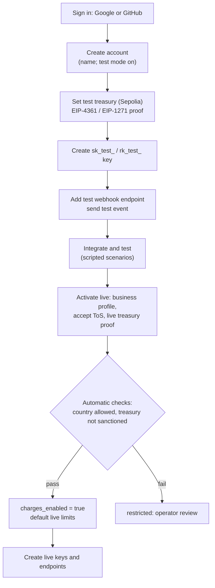
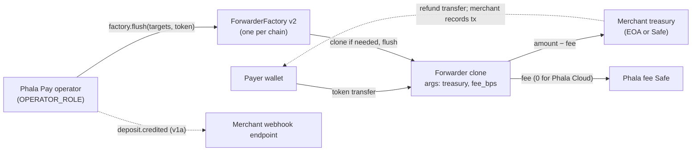

# Design: standard multi-tenant Phala Pay

Status: accepted (the owner delegated every decision). Scope: turn Phala Pay from Phala Cloud's
internal cashier into a self-serve, Stripe-shaped crypto payments platform for third-party
merchants, with Phala Cloud as the first tenant. This document records decisions; the
[architecture](../architecture.md) stays the specification and is updated by the PRs in §12.

Every mechanism names the established practice it follows. External claims were checked on
2026-09-27 against the linked sources.

## 1. Context

Today (architecture §3, §4, §6, §12, §14):

- A **product** is the tenant. The operator registers it (`POST /v1/admin/products {slug,
  public_key, webhook_url}`) and names it in an attested route file (`product: phala-cloud`).
  `account_id` is the product's own id for its end customer; an `accounts` row is created by the
  first quote.
- Requests are signed with RFC 9421 ed25519 (`keyid = {product}/v1`); the service stores only the
  public key. Webhooks are Standard Webhooks `v1a` (ed25519) signed with the attested
  `settlement/v1` key.
- Every route's `ForwarderFactory` has one immutable `treasury` (Phala's finance Safe), bound in
  the shared `Forwarder` implementation's constructor. Changing it is a new factory and route
  version. Forwarders are EIP-1167 clones at `CREATE2(factory, salt, clone(implementation))`.
- Refunds are requested by the product, approved by finance, executed from the treasury Safe, and
  recorded by the operator through the admin API.
- Test and live are separate deployments (staging = Sepolia, production = mainnet, not deployed
  yet). Mainnet contracts are not deployed. Phala Cloud's integration is a draft PR in its monorepo
  and is not live.

A merchant platform needs: tenants that sign themselves up, funds that go to each merchant's own
wallet, credentials merchants create and rotate themselves, test and live data under one account,
per-merchant webhooks, a dashboard, and isolation between tenants.

## 2. Decisions at a glance

| # | Topic | Decision | Standard followed |
|---|---|---|---|
| D1 | Custody | Non-custodial: each forwarder sweeps to the merchant's own treasury; Phala Pay never holds merchant funds | BTCPay Server; FinCEN FIN-2019-G001 §4.2 control criteria |
| D2 | Contracts | One factory per chain (v2); clones carry `(treasury, fee_bps)` as immutable args, so the CREATE2 address commits to them | OpenZeppelin `Clones.cloneDeterministicWithImmutableArgs` (OZ ≥ 5.2, pinned 5.7.0) |
| D3 | Names | Tenant = **account** (`acct_`); end customer = **`client_reference_id`**; team **members** with roles; **API keys**; **webhook endpoints** | Stripe Account, Checkout `client_reference_id`, team roles, API keys, webhook endpoints |
| D4 | API auth | Stripe secret and restricted keys (`sk_live_`, `sk_test_`, `rk_live_`, `rk_test_`), stored hashed; RFC 9421 dropped for merchants; admin API unchanged | Stripe API keys; GitHub token format |
| D5 | Dashboard login | OAuth 2.0 authorization code + PKCE with Google (OIDC) and GitHub; server-side sessions | RFC 6749, RFC 7636, OpenID Connect Core |
| D6 | Test/live | One production deployment serves both modes; the key's mode selects data; Sepolia routes are test mode, mainnet routes live; `livemode` on every object | Stripe test mode and `livemode` |
| D7 | Treasury proof | Setting a treasury requires an EIP-4361 message signed by the treasury (EOA) or accepted by it through EIP-1271 (Safe) on that chain | EIP-4361, EIP-1271, Safe message signing |
| D8 | Webhooks | Keep Standard Webhooks asymmetric `v1a`, one attested key per mode; per-account endpoints (≤ 16 per mode) with `enabled_events`; no URL challenge | Standard Webhooks (prefers asymmetric); Stripe endpoints |
| D9 | Go-live gate | Automatic activation after email-verified owner, business profile, ToS acceptance, a verified live treasury; low default limits raised on request; no document KYB | Stripe account activation (`details_submitted`, `tos_acceptance`, `charges_enabled`) |
| D10 | Fees and gas | 1% platform fee taken on-chain at sweep to Phala's fee Safe; operator pays sweep gas; Phala Cloud's account fee is 0 | Coinbase Commerce (1%, fee paid on-chain to the operator); Stripe keeps fees on refunds |
| D11 | Refunds | The merchant pays refunds from its own treasury and records the transaction; the service verifies it at finality | Non-custodial consequence; Stripe `out_of_band` recording |
| D12 | Dashboard | Static SPA built into the attested image, served same-origin under `/dashboard/`; operator console stays the admin API | Stripe Dashboard scope; same-origin session cookies (OWASP) |
| D13 | Isolation | `(account_id, livemode)` on every tenant row; a typed `Scope` required by every tenant query; per-account rate limits 100/25 rps; per-account pause, caps, fee | Stripe rate limits; pool-model multi-tenancy |

Sections 3 to 9 give the reasoning and alternatives; §10 the data model; §11 the API; §12 the PR
plan; §13 the legal review list.

## 3. Custody and contracts (D1, D2, D10, D11)

### D1: non-custodial

**Decision.** Each merchant sets a treasury address per chain (an EOA or a Safe). Every forwarder
issued for that merchant can pay only that treasury (and the platform fee, D10). No Phala key,
contract role, or database row can move a merchant's funds anywhere else. This is BTCPay Server's
model: "Payments with BTCPay go directly to your wallet"
([BTCPay FAQ](https://docs.btcpayserver.org/FAQ/General/)).

**Why (high level, not legal advice).** FinCEN's 2019 guidance classifies intermediaries by four
criteria, the last being "whether the person acting as intermediary has total independent control
over the value" ([FIN-2019-G001](https://www.fincen.gov/sites/default/files/2019-05/FinCEN%20Guidance%20CVC%20FINAL%20508.pdf)
§4.2), and says CVC payment processors that "collect the CVC from the customer and then transmit"
it to the merchant are generally money transmitters (§4.6). A custodial design (sweep to Phala,
then pay out) is that second case. With immutable per-merchant forwarders the service never has
control over merchant value; it only triggers a transfer whose destination was fixed when the
address was created. Whether this holds in each jurisdiction where Phala offers the service, and
under EU MiCA, is on the legal review list (§13).

**Alternatives.** Custodial pooled treasury with payouts (Coinbase Commerce's original model,
Stripe's balance model): simpler per-merchant accounting, but makes Phala a custodian and money
transmitter, adds payout operations and balance liabilities. Rejected.

**Consequences.**

- Refunds come from the merchant's treasury (D11). Rejected deposits (wrong token, below minimum,
  sanctioned) are swept to the merchant with everything else, as today they reach Phala's
  treasury; the merchant's own compliance handles them, notified by `deposit.rejected`.
- Phala no longer bears price exposure between valuation and sweep for third-party merchants; the
  merchant does. Quote spread and exposure caps stay as service policy.
- Tenant #1, Phala Cloud, sets Phala's finance Safe as its treasury: nothing changes for Phala's
  own money flow.

### D2: one factory per chain, treasury as an immutable clone argument

**Decision.** Deploy `ForwarderFactory` v2 once per chain. Each forwarder is an ERC-1167 clone
with immutable arguments `abi.encodePacked(treasury, fee_bps)` (22 bytes), created with
`Clones.cloneDeterministicWithImmutableArgs(implementation, args, salt)` and predicted with
`predictDeterministicAddressWithImmutableArgs`. The implementation reads its arguments with
`Clones.fetchCloneArgs(address(this))`. The pinned OpenZeppelin submodule is v5.7.0
(`cab19933`); these functions were added in 5.2.0
([CHANGELOG](https://github.com/OpenZeppelin/openzeppelin-contracts/blob/v5.7.0/CHANGELOG.md#520-2025-01-08),
[Clones.sol](https://github.com/OpenZeppelin/openzeppelin-contracts/blob/v5.7.0/contracts/proxy/Clones.sol)).
The CREATE2 address commits to the factory, the implementation, the arguments, and the salt, so
a merchant recomputing the address proves where the funds will go.

```solidity
contract Forwarder {                                   // implementation; state-free
    address public immutable factory;
    address public immutable feeRecipient;             // Phala fee Safe, per factory
    uint16  public constant MAX_FEE_BPS = 1_000;       // defence in depth: ≤ 10%
    function args() public view returns (address treasury, uint16 feeBps); // fetchCloneArgs(this)
    function flush(address token) external onlyFactory returns (uint256 amount, uint256 fee);
        // fee = amount * feeBps / 10_000 (floor) → feeRecipient; amount − fee → treasury;
        // token == 0 → ETH via call; the treasury balance-decrease check stays
}
contract ForwarderFactory is AccessControl {           // DEFAULT_ADMIN = Phala finance Safe
    Forwarder public immutable implementation;         // created in the constructor
    struct Target { bytes32 salt; address treasury; uint16 feeBps; }
    function addressOf(Target calldata t) external view returns (address);
    function flush(Target[] calldata targets, address token) external onlyRole(OPERATOR_ROLE);
        // per target: clone if no code (reverts if feeBps > MAX_FEE_BPS or treasury == 0),
        // then flush; emits Flushed(salt, forwarder, token, amount, fee)
}
```

- **Salt** (v2): `keccak256(abi.encode(account, client_reference_id, "quote", quote_id))`, with
  `account` the `acct_…` id. The merchant holds every input. v1 salts stay stored and
  authoritative for v1 addresses.
- **Constructor args** `(admin, feeRecipient)` are identical on every chain, so the Arachnid
  deterministic deployment (architecture §0) gives one factory address across chains, as today.
- **Operator role** unchanged: the attested service key per chain holds `OPERATOR_ROLE`; the admin
  Safe only grants and revokes it. Neither can change a clone's destination.

**Alternatives.**

| Option | Verdict |
|---|---|
| (a) One factory per merchant (today's pattern, treasury as constructor arg) | Rejected: every signup needs an on-chain deployment by a funded key (HUMAN-ONLY today), per-merchant contract verification, a route version per merchant; it cannot be self-serve. |
| (b) One factory per chain, treasury as clone immutable arg | **Chosen**: no deployment at signup, same audited library, address still commits to the treasury. |
| (c) Treasury in factory storage per merchant (mapping + setter) | Rejected: a setter lets the admin or a compromised key redirect future sweeps of existing addresses; breaks the "address commits to destination" property. |
| (d) Treasury folded into the salt only | Rejected: the forwarder must know its destination at flush time; it would need storage (initializer) or calldata trust. |

**Migration of deployments.** Mainnet has no factory yet: it deploys v2 only. Sepolia keeps the v1
factory for addresses already issued (route v2 stays loaded until retired, per
`deploy/runbooks/route-retirement.md`); a new route version points at the Sepolia v2 factory. The
v2 factory uses a new fixed salt (`keccak256("crypto-topup-service.ForwarderFactory.v2")`), a new
`expected-codehashes.json`, and the same HUMAN-ONLY deployment runbook.

**Audit impact.** A contract change reopens the no-external-audit decision (architecture §4), and
`docs/plan.md` already requires an independent review before mainnet. The v2 contracts are in that
review's scope and must pass it before the mainnet deployment. New invariants for Foundry fuzz and
invariant tests: a forwarder pays only `(treasury, feeRecipient)` from its own args; `fee ≤ amount
× MAX_FEE_BPS / 10 000`; `addressOf` equals the deployed clone for random `(salt, treasury,
feeBps)`; different args never collide on one address.

### D10: platform fee and gas

**Decision.** A flat **1%** platform fee (`fee_bps = 100`) is taken on-chain at each sweep and paid
to Phala's fee Safe, fixed per factory. The fee is stored per account and committed into each
address; Phala-owned accounts (Phala Cloud) have `fee_bps = 0`. Phala's operator pays sweep gas;
the existing gas-ratio rule (a sweep only when gas ≤ `max_gas_ratio_bps` of value, architecture §10)
bounds that cost, and the fee covers it. Refunds do not return the fee, as Stripe states:
"Stripe's processing fees from the original transaction aren't returned"
([Stripe refunds](https://docs.stripe.com/refunds)).

**Precedent.** Coinbase Commerce charges a 1% fee and its onchain protocol transfers the fee to the
operator's fee destination in the payment transaction (`feeAmount` in
[Transfers.sol](https://github.com/coinbase/commerce-onchain-payment-protocol/blob/master/contracts/transfers/Transfers.sol)).
Taking the fee in the sweep is the same pattern without custody.

**Alternatives.** No fee (BTCPay): sustainable only for self-hosted software where the merchant pays
its own infrastructure and gas; a hosted service paying gas for free invites abuse. Monthly
invoicing: needs billing, credit risk, and collections. Fee deducted from gas only (merchant pays
actual gas): variable and hard to explain. Rejected.

The fee rate is a commercial number; 1% is the market reference above. Changing the default later
affects only new addresses.

### D11: refunds recorded, not executed

**Decision.** The merchant sends the refund from its own treasury, then records it:
`POST /v1/refunds {deposit, transaction_hash, log_index?}`. The service creates the refund
`pending`, and at finality verifies on both RPC providers that the log is a `Transfer` of the
deposit's token from the account's treasury for that chain, not above the deposit's unrefunded
remainder, and not already used by another refund. Then the refund is `succeeded` and
`deposit.refunded` is emitted; otherwise `failed` with a `failure_reason`. The destination and
amount are read from the log. Stripe records money moved outside Stripe the same way
(`paid_out_of_band` invoices, credit notes' `out_of_band_amount`); the Refund object keeps
Stripe's `pending | succeeded | failed` statuses.

Phala Cloud's finance keeps its approval step inside its own Safe (the Safe threshold is the
approval) and records the transaction in the dashboard. The admin refund workflow (`approve`,
`record`) is retired after the refunds it holds are finished.

## 4. Tenant model and names (D3)


| Concept | Today | Decision | Stripe reference |
|---|---|---|---|
| Tenant (merchant) | product (`slug`) | **account**, `acct_…`; `GET /v1/account` | [Account](https://docs.stripe.com/api/accounts/object) |
| People | none (operator only) | **user**, a login identity; **membership** with a role | [Team roles](https://docs.stripe.com/get-started/account/teams/roles) |
| Roles | — | `owner`, `administrator`, `developer`, `view_only` | Account owner, Administrator, Developer, View Only |
| Credentials | product ed25519 key | **API key** `sk_…`/`rk_…` | [API keys](https://docs.stripe.com/keys) |
| Webhook target | `products.webhook_url` | **webhook endpoint** `we_…` | [Webhook endpoints](https://docs.stripe.com/webhooks) |
| End customer | `account_id` | **`client_reference_id`** (≤ 200 chars), stored in `customers` | Checkout Session [`client_reference_id`](https://docs.stripe.com/api/checkout/sessions/create) |
| Payout destination | route `treasury` | **treasury** per account and chain | external account (bank) for payouts |

Role permissions (subset of Stripe's): `owner` everything and ownership transfer; `administrator`
everything except ownership; `developer` API keys, webhook endpoints, read everything, record
refunds; `view_only` read. Treasury changes, members, and live activation need `owner` or
`administrator`.

**Why rename now.** "Account" in our API means the end customer, the opposite of Stripe; keeping
it would make every Stripe-literate integrator misread the API. The end customer is not a Stripe
`Customer` object (no `cus_` object is created or needed: the merchant already owns its customer
records), so `client_reference_id` is the exact Stripe field for "your id for this customer".
Phala Cloud is not live, so it adopts the final names once (§12, "Phala Cloud").

**Alternative.** An explicit `POST /v1/customers` → `cus_…` (Stripe-exact Customer): an extra
round trip and a mapping table on the merchant side for no function here. Rejected. An
organization layer above accounts (Stripe Organizations): not needed; a user can be a member of
many accounts.

## 5. Authentication (D4, D5)

### D4: API keys

**Decision.** Merchant API calls authenticate with `Authorization: Bearer <key>` (Stripe also
accepts HTTP Basic with the key as username; the SDKs send Bearer).

- Types: secret `sk_{live|test}_…` (all merchant API permissions) and restricted
  `rk_{live|test}_…` with per-resource `none | read | write` on `quotes`, `deposits`, `refunds`,
  `events`, `webhook_endpoints`. Stripe recommends restricted keys for most uses
  ([keys](https://docs.stripe.com/keys)); the dashboard offers "restricted" first.
- Format: prefix + 32 random bytes in base62, plus a CRC32 checksum suffix so secret scanners can
  validate candidates offline (GitHub's token format,
  [GitHub blog](https://github.blog/engineering/platform-security/behind-githubs-new-authentication-token-formats/)).
- Storage: SHA-256 of the full key (the key is 256-bit random, so a slow password hash adds
  nothing); the dashboard shows the prefix and last four characters. Shown once at creation, as
  Stripe does for live keys.
- Rotation: "roll" issues a replacement; the old key keeps working until a chosen expiry of at
  most 7 days (Stripe's grace period), or expires now. Expired key → `401` with Stripe's code
  `api_key_expired`; a restricted key without the permission → `403` (Stripe's status for a key
  that lacks permissions, [errors](https://docs.stripe.com/api/errors)).
- `last_used_at` is recorded (coarsened to a minute) for the dashboard.

**Alternatives.**

| Option | For | Against | Verdict |
|---|---|---|---|
| Keep RFC 9421 ed25519 (today) | Key never leaves the merchant; request integrity; the service stores only a public key | Every SDK and language must implement signing, `Content-Digest`, target-URI reconstruction, clock skew and replay tables; no `curl`; key creation needs a CLI; unfamiliar to Stripe users | Rejected for merchants |
| Stripe keys only | Universal, curl-able, trivial SDKs, dashboard-managed | A bearer secret travels in each request | **Chosen** |
| Both | — | Two auth paths to test and document | Rejected |

**TEE threat model.** TLS terminates inside the CVM (dstack-ingress, architecture §14), so only
attested code ever sees a bearer key; the host and cloud provider cannot. The database stores only
hashes, so a leaked database or backup does not yield usable keys. A compromised service could
accept requests without any key, so signing never protected against that. The residual difference
is replay of a key stolen from the merchant's side, which restricted keys, rotation, and prefix
scanning address as they do for Stripe.

The **admin API** (operator only) keeps RFC 9421 with the attested admin key: it is used through
the existing runbooks and signing script, and it is not part of the merchant surface.

### D5: dashboard login

**Decision.** "Sign in with Google" (OpenID Connect, `email_verified` required) and "Sign in with
GitHub" (OAuth 2.0; the primary verified email from `GET /user/emails`), both authorization code
with PKCE ([RFC 7636](https://www.rfc-editor.org/rfc/rfc7636)) and `state`. A user is keyed by
`(provider, subject)`; invitations bind to an email and are accepted by a login whose verified
email matches. Sessions are server-side: a random 256-bit id in a `__Host-session` cookie
(`Secure; HttpOnly; SameSite=Lax; Path=/`), stored hashed, 12-hour idle and 7-day absolute expiry;
state-changing dashboard requests also require a matching `Origin` header (OWASP
[Session Management](https://cheatsheetseries.owasp.org/cheatsheets/Session_Management_Cheat_Sheet.html)
and [CSRF](https://cheatsheetseries.owasp.org/cheatsheets/Cross-Site_Request_Forgery_Prevention_Cheat_Sheet.html)
cheat sheets). Sensitive actions (treasury change, live key creation, member role change) require a
login within the last 10 minutes (re-authentication).

**Alternatives.** Email magic links: needs deliverability for every login and is vulnerable to link
scanners; passwords: storage, reset flows, and MFA to build. The identity providers already enforce
MFA and verified email. Transactional email is still needed for invitations and security notices
(SMTP relay; credentials as a dstack encrypted variable).

## 6. Test and live modes (D6)

**Decision.** Follow Stripe: "Each mode has its own set of API keys, and objects in one mode aren't
accessible to the other" ([keys](https://docs.stripe.com/keys)).

- One production deployment (`https://pay-api.phala.com`) serves both modes. A key's mode selects
  the data; every tenant-scoped row carries `livemode`; every object and event has
  `livemode: true|false` (Stripe's field).
- Routes declare `livemode` in the attested route file. Testnet chains (Sepolia) must be
  `livemode: false`, mainnets `true`; startup refuses a mismatch against a built-in list of
  testnet chain ids. `/v1/config` lists only the key's mode's routes; a quote for a route of the
  other mode is `400 livemode_mismatch` (Stripe's code).
- Test mode has its own settlement key (`settlement-test/v1`) so a test event can never verify
  as live, as Stripe's per-mode webhook secrets do; both keys are attested (§8).
- Test mode keeps Sepolia's scripted scenarios and the mintable test PHA token. Rate limits are
  lower in test mode (D13).
- The staging deployment stays as Phala's internal pre-production (test mode only). Integrators,
  including Phala Cloud's staging backend, use production with `sk_test_` keys.

**Alternative.** Separate test and live deployments (today): a merchant would need two accounts,
two dashboards, and two sets of credentials, and self-serve signup would have to be mirrored.
Rejected.

## 7. Onboarding and go-live (D7, D9)



### D7: treasury ownership proof

**Decision.** Setting a treasury for a chain requires a signature from the treasury over an
EIP-4361 (Sign-In with Ethereum, Final) message whose `domain` is the dashboard origin, `address`
the treasury, `chain-id` the route's chain, `nonce` a single-use server nonce, and `statement`
"Set as treasury of account acct_… on Phala Pay". EOAs are verified by `ecrecover`; contract
accounts through EIP-1271 `isValidSignature` on that chain, as EIP-4361 specifies ("For Contract
Accounts, the verification method specified in ERC-1271 SHOULD be used";
[EIP-4361](https://eips.ethereum.org/EIPS/eip-4361), [EIP-1271](https://eips.ethereum.org/EIPS/eip-1271)).
A Safe signs through Safe{Wallet}'s message signing
([Safe signatures](https://docs.safe.global/advanced/smart-account-signatures)).

**Why, although custody is the merchant's.** The proof does not authorize anything; it proves the
merchant controls the address on that exact chain. That removes the costly failure modes:
a typo, an exchange deposit address, or a Safe address that exists on one chain but not another
(an EIP-1271 check requires code on that chain). The address is also screened against the
sanctions oracle (architecture §8) when set and daily.

A treasury change applies to addresses issued afterwards; existing forwarders keep theirs forever.
It needs `owner` or `administrator` with re-authentication, writes `audit`, and emails every owner
and administrator.

### D9: go-live gate

**Decision.** Test mode is available immediately after signup. Live mode is activated
automatically, Stripe-style (`details_submitted` → `charges_enabled`), when:

1. the owner's email is verified by the identity provider;
2. the business profile is submitted: legal name, country, website, support email;
3. the Terms of Service are accepted by clickwrap, recorded as Stripe's `tos_acceptance`
   `{date, ip, user_agent}`;
4. a live treasury is set with proof and is not sanctioned;
5. the country is not on the blocked-jurisdiction list (configuration, owned by legal).

New live accounts start with low limits (per-account open exposure and per-deposit maximum,
*(policy)*, default $1 000 open per account); the operator raises them on request after a manual
look (admin API). The operator can restrict an account at any time (pause scopes, D13). No document
KYB: Phala Pay does not custody or transmit merchant funds (D1). Whether KYB is required anyway in
some jurisdictions is on the legal list (§13).

**Alternatives.** Manual review before any live payment: slows every merchant and needs a review
team; full KYB vendor (documents, UBOs): the regime of custodial processors. Rejected for the
non-custodial model.

### D8: webhooks

**Decision.** Keep Standard Webhooks with the asymmetric `v1a` scheme and the attested keys, one
per mode. The spec says "Prefer asymmetric signature schemes over symmetric ones"
([Standard Webhooks](https://github.com/standard-webhooks/standard-webhooks/blob/main/spec/standard-webhooks.md));
the merchant holds only a public key, the service stores no per-endpoint secret, and attestation
proves which code signs. The dashboard shows both public keys; `GET /v1/attestation` still proves
them. Key rotation sends two signatures during the overlap, as the spec defines.

Endpoints follow Stripe: up to 16 per account and mode, each with a URL and `enabled_events`
(default all). Stripe performs no URL challenge; neither do we. Registration requires `https` in
live mode (http allowed in test mode only for public hosts); the dashboard's "Send test event"
(`deposit.credited` with `livemode: false` and a fixed test object) replaces the challenge, like
`stripe trigger`.

Delivery keeps architecture §11: at least once, full-jitter backoff to 1 h, retried forever,
per endpoint. A merchant can list events (`GET /v1/events`) to recover anything missed, and replay a
delivery from the dashboard (Stripe's "Resend").

**Alternative.** Stripe's per-endpoint HMAC secrets (`whsec_`, Standard Webhooks `v1`): familiar,
but the service must store every secret recoverably (reveal), and a leak on either side allows
forgery. Rejected; the SDKs already verify `v1a`.

## 8. Security and trust model changes

| Property | Before | After |
|---|---|---|
| Where funds go | Immutable factory treasury, attested | Immutable per-address `(treasury, fee_bps)`; platform `feeRecipient` immutable per factory, attested |
| Money-affecting config | All in the attested compose (architecture rule 6) | Platform level stays attested (factory, implementation, fee recipient, routes, global caps). Tenant level (treasury, `fee_bps`, account caps) is database data, bound on-chain per address and checked by the merchant (below). Rule 6 is amended to say so. |
| Compromised service | Cannot redirect deposited funds; could sign unbacked credits | Same for issued addresses. It could issue *new* addresses with another treasury or fee. Defence: the SDK recomputes every quote's address from `(factory, implementation, treasury, fee_bps, salt)` and, when the merchant configures `expected_treasuries` and `expected_fee_bps` (recommended; the SDK default for live keys warns if unset), refuses a mismatch. |
| Hijacked dashboard session | — | Could set an attacker treasury (the attacker can sign their own proof). Mitigations: role gate, re-authentication, email to all owners and administrators, audit, and the SDK pin above fails closed. |
| Merchant credentials | ed25519 public key stored | SHA-256 hashes of API keys; plaintext only inside the attested CVM (TLS terminated there) |
| Webhook keys | `settlement/v1` | `settlement/v1` (live) and `settlement-test/v1` (test), both reported by attestation: `report_data` gains the test key after the live key |
| Egress | Product URLs listed | Arbitrary merchant URLs: SSRF guard resolves once, refuses private, loopback, link-local, and metadata ranges, pins the resolved IP for the connection, no redirects (Stripe treats 3xx as failure), 20 s timeout ([OWASP SSRF](https://cheatsheetseries.owasp.org/cheatsheets/Server_Side_Request_Forgery_Prevention_Cheat_Sheet.html)) |
| Sanctions | Payer screening | Payer screening unchanged; treasury screening at set time and daily; a sanctioned treasury pauses the account's `quotes` scope |
| Operator gas | Phala's route only | All tenants; bounded by the gas-ratio rule; dust cannot force sweeps; open addresses are bounded by exposure caps |

## 9. Isolation, limits, abuse (D13)

- **Data isolation.** Every tenant-scoped table carries `account_id` and `livemode`. Repository
  functions for merchant requests take a `Scope { account_id, livemode }` built only by the auth
  layer, and every query filters by it; an object of another account or mode is `404
  resource_missing` (as today across products). Integration tests assert cross-account and
  cross-mode `404` for every endpoint. PostgreSQL row-level security is not added now: one
  application role, one service, and the typed scope give the same guarantee with less moving
  parts; revisit if a second service reads the database.
- **Rate limits.** Per account and mode, token bucket in process (single instance): 100 requests/s
  live, 25 test, Stripe's global numbers ([rate limits](https://docs.stripe.com/rate-limits));
  `429 rate_limit` as today. Existing per-customer quote-creation and unsigned client-secret limits
  stay.
- **Quotas.** Open exposure caps become `{customer, account, global}` (today `{account, product,
  global}`): route defaults, per-account overrides by the operator. 16 webhook endpoints and 50 API
  keys per account and mode.
- **Pause.** Today's product pause scopes become account pause scopes (`quotes`, `settlement`,
  `flush`, `refunds`), plus the existing customer and route scopes.
- **Signup abuse.** Identity-provider login only, one account creation per user per hour, test mode
  has no money at stake; live mode needs D9.

## 10. Data model

Changes to architecture §6. New tables and columns only; unchanged columns are omitted.

```text
accounts        -- renamed from products
                id, public_id (acct_…), name, legacy_slug (phala-cloud; v1 salts and key ids),
                fee_bps smallint CHECK (0..1000) DEFAULT 100,
                business_profile jsonb, country, tos_acceptance jsonb,
                details_submitted bool, charges_enabled bool,
                max_open_minor_account, max_open_minor_customer, max_deposit_minor  -- overrides, nullable
                paused_scopes text[], created_at
users           id, email, name, created_at
identities      user_id, provider (google|github), subject    UNIQUE (provider, subject)
memberships     account_id, user_id, role (owner|administrator|developer|view_only)
                PRIMARY KEY (account_id, user_id)          -- exactly one owner per account
invitations     id, account_id, email, role, token_hash, invited_by, expires_at, accepted_at
sessions        id_hash PK, user_id, created_at, last_seen_at, authenticated_at, expires_at
api_keys        id, account_id, livemode, kind (secret|restricted), name, permissions jsonb,
                prefix, last4, key_hash UNIQUE, created_by, created_at, expires_at,
                last_used_at, revoked_at
treasuries      id, account_id, chain_id, address, proof_message, proof_signature,
                verified_at, screened_at, created_by, retired_at
                UNIQUE (account_id, chain_id) WHERE retired_at IS NULL
customers       -- renamed from accounts
                id, account_id, livemode, client_reference_id, paused_scopes
                UNIQUE (account_id, livemode, client_reference_id)
addresses       + factory, treasury, fee_bps                -- the clone args; v1 rows: fee_bps 0,
                                                            -- treasury = the v1 factory's
rate_locks      + account_id, livemode; UNIQUE (account_id, livemode, idempotency_key)
deposits        + account_id, livemode                      -- denormalized for scoped lists
flushed         + fee_atomic
refunds         + account_id, livemode, log_index, failure_reason; status pending|succeeded|failed;
                UNIQUE (chain_id, tx_hash, log_index)       -- one log funds one refund
webhook_endpoints  id (we_…), account_id, livemode, url, enabled_events text[],
                status (enabled|disabled), created_at
events          id (evt_…, UUIDv5 as today), account_id, livemode, type, object_type, object_id,
                data jsonb, format, created                 -- the outbox's payload half
webhook_deliveries event_id, endpoint_id, next_attempt_at, attempts, delivered_at, response jsonb
                PRIMARY KEY (event_id, endpoint_id)         -- the outbox's delivery half
audit           + account_id, actor_type (user|api_key|admin|system), actor_id
```

`outbox` rows migrate into `events` plus one `webhook_deliveries` row for the account's endpoint
created from `products.webhook_url`; format 1 and 2 payloads replay byte-identically as today.

**Route file.** `product` is removed (routes belong to the platform); `livemode` is added; the
chain block gains `factory_version` and `fee_recipient` (verified on chain at startup like
`treasury()` today); `chain.treasury` remains only on v1 route versions; `limits.max_open_minor`
keys become `{customer, account, global}`.

## 11. API surface

Merchant API (key auth, D4). Existing resources keep their shape with these changes:

```text
GET    /v1/account                                     the caller's account (id, name, livemode, charges_enabled, fee_bps)
GET    /v1/config                                      routes of the key's mode; + treasury and fee_bps per route
POST   /v1/quotes {client_reference_id, amount, currency, chain_id, asset}   Idempotency-Key
GET    /v1/quotes/{id}                                 + unsigned ?client_secret= (unchanged)
POST   /v1/quotes/{id}/cancel
GET    /v1/deposits?client_reference_id&quote&status&tx_hash&created[...]&limit&starting_after&ending_before
GET    /v1/deposits/{id}
POST   /v1/refunds {deposit, transaction_hash, log_index?}                   Idempotency-Key (D11)
GET    /v1/refunds/{id}
GET    /v1/events?type&created[...]&limit&starting_after&ending_before       (Stripe Events API)
GET    /v1/events/{id}
GET|POST        /v1/webhook_endpoints                  (Stripe webhook_endpoints)
GET|POST|DELETE /v1/webhook_endpoints/{id}
GET    /v1/attestation?nonce=…                         + settlement-test key
```

- `account_id` → `client_reference_id` everywhere (request, filters, Quote, Deposit). Objects and
  events gain `livemode`; events gain `account` (the `acct_` id).
- Quote gains `treasury` and `fee_bps` (the clone args), so the SDK can recompute the address.
  Deposit gains `fee_atomic` (its share, `floor(amount_atomic × fee_bps / 10 000)`). Refund gains
  `transaction_hash`, `log_index`, `failure_reason`; `destination_address` and `amount_atomic` are
  read from the log.
- Errors, with Stripe's codes ([error codes](https://docs.stripe.com/error-codes)): `401
  invalid_request_error` for an unknown key and `api_key_expired`; `403` for a restricted key
  without the permission; `testmode_charges_only` for a live quote on an account without
  `charges_enabled`; `livemode_mismatch` for a route of the other mode (instead of
  `parameter_invalid`). `signature_invalid` and `signature_replayed` are removed.

Dashboard API (session auth, same origin, `/dashboard/api/…`, not part of the public SDKs):
members and invitations; API keys (create, roll, expire); treasuries (nonce, set with proof);
business profile, ToS acceptance, live activation; webhook delivery list and resend. Dashboard
reads use the same handlers as the public resources, scoped by the session's selected account and
mode.

Admin API (RFC 9421 admin key, operator): `POST /v1/admin/products` and `PUT /v1/admin/products/…`
are replaced by `POST /v1/admin/accounts {name, fee_bps, owner_email}` (operator onboarding, used
for Phala Cloud before the dashboard exists), `POST /v1/admin/accounts/{id}/api_keys {livemode,
kind, name}` (returns the key once), `POST /v1/admin/accounts/{id}/treasuries {chain_id, address,
proof}`, `POST /v1/admin/accounts/{id}/webhook_endpoints`, `PATCH /v1/admin/accounts/{id} {fee_bps,
limits, charges_enabled}`, and account pause/resume. Refund `approve`/`record` are removed once
empty. Every admin change writes `audit`.



## 12. Migration and PR plan

Phala Cloud becomes account #1: migrated from product `phala-cloud`, `legacy_slug =
phala-cloud`, `fee_bps = 0`, treasury = Phala's finance Safe per chain, webhook endpoint = the
product's webhook URL. Staging's existing product data migrates in place; production has no data.

Each PR below is sized for one agent, lands on its own branch through review and green CI, and
updates the docs it touches (architecture, integration, deploy README, CHANGELOG). "Launch" is
Phala Cloud going live on mainnet. **Pre-launch** PRs must land first, so Phala Cloud adopts the
final names, auth, and contracts once.

| PR | Pre-launch | Depends on |
|---|---|---|
| 1 Contracts v2 | ✓ | — |
| 2 Core: CREATE2 with args, route schema v2 | ✓ | 1 |
| 3 Tenancy schema and scoped repository | ✓ | — |
| 4 API keys | ✓ | 3 |
| 5 Test and live modes | ✓ | 3, 4 |
| 6 Treasuries and v2 issuance and sweep | ✓ | 1, 2, 5 |
| 7 API vocabulary and SDKs | ✓ | 4, 5, 6 |
| 8 Events and webhook endpoints | ✓ | 5 |
| 9 Non-custodial refunds | ✓ | 6 |
| 10 Deploy, docs, and staging cutover | ✓ | 1–9 |
| 11 Users, login, members | | 3 |
| 12 Dashboard: read views | | 11, 8 |
| 13 Dashboard: management | | 12, 6 |
| 14 Self-serve onboarding and activation | | 13 |
| 15 Fee reporting | | 6, 12 |

**PR 1: contracts v2.** Scope: `Forwarder` and `ForwarderFactory` as in §3 (D2, D10), v1 sources
kept for verification under `contracts/src/v1/`. Files: `contracts/src/*.sol`,
`contracts/test/*`, `contracts/script/DeployFactory.s.sol`, `deploy/contracts/*`
(`expected-codehashes.json`, salt v2, `immutable_offsets`), `deploy/CONTRACTS.md`. Tests: unit,
fuzz, invariant (pays only its args' recipients; fee bound; `addressOf` = deployed; ETH path;
reentrancy with a hook token; `feeBps > MAX_FEE_BPS` reverts). Acceptance: `forge test`,
`check-build.sh --check`, `test-determinism.sh` green; determinism vectors regenerated and
reviewed; no deployment (HUMAN-ONLY).

**PR 2: core.** Scope: `crates/core` CREATE2 prediction for clones with immutable args, v2 salt,
route schema (`livemode`, `factory_version`, `fee_recipient`, no `product`, cap keys), startup
contract checks for v2 (`implementation()`, `feeRecipient()`, sample `addressOf`). Files:
`crates/core/src/{route.rs,create2*}`, `crates/adapters/src/chain/*`, route fixtures. Tests:
vectors generated by Foundry from PR 1 match the Rust math; route schema accepts v1 and v2 files;
testnet/mainnet `livemode` mismatch refused. Acceptance: `cargo test`, clippy with the core denies.

**PR 3: tenancy schema.** Scope: migration renaming `products` → `accounts`, `accounts` →
`customers`; add `account_id`, `livemode` to tenant tables (backfill: every existing row is
`livemode = false` on staging); `Scope` type required by merchant repository functions; internal
renames only, API unchanged. Files: `crates/topup/migrations/*`, `crates/topup/src/api/repository.rs`,
`crates/topup/src/{db,pump,outbox}*`. Tests: migration up/down on a staging-shaped fixture;
cross-account `404` test per endpoint. Acceptance: all integration tests green; no API diff in
`openapi.json`.

**PR 4: API keys.** Scope: `api_keys` table; Bearer and Basic auth middleware; secret and
restricted permissions; roll and expiry; `last_used_at`; admin endpoints `POST /v1/admin/accounts`
and `/api_keys`; RFC 9421 removed from merchant routes (kept for admin); per-account rate limiter.
Files: `crates/topup/src/api/{auth.rs,mod.rs,handlers.rs,error.rs}`, migrations, `openapi.json`.
Tests: valid, unknown, expired, revoked, wrong-mode keys; restricted `403`; checksum rejects
typos before a database lookup; hash-only storage; rate limit `429`. Acceptance: reference product
and sandbox smoke check switched to keys; `deploy/README.md` "Product credentials" rewritten.

**PR 5: test and live modes.** Scope: `livemode` from the key through `Scope`; route `livemode`
filtering for `/v1/config` and quotes; `settlement-test/v1` derivation, event signing by mode,
attestation `report_data` extension with a new vector. Files: `crates/topup/src/api/*`,
`crates/adapters/src/signer/*`, `crates/topup/src/outbox*`, attestation docs. Tests: a test key
never sees live objects and vice versa; test events verify only with the test key; attestation
vector. Acceptance: architecture §14 attestation text updated; SDK attestation verifier accepts
both keys.

**PR 6: treasuries, issuance, sweep.** Scope: `treasuries` with EIP-4361 parsing and
verification (ecrecover and EIP-1271 over both RPC providers), sanctions screening; quote issuance
stores `(factory, treasury, fee_bps)` on the address from the account's current treasury and fee;
flusher plans per chain and token with `Target[]`, records `fee_atomic`; reconciliation checks
treasury inflow and fee-recipient inflow against `Flushed`. Admin `POST …/treasuries`. Files:
`crates/core`, `crates/adapters/src/chain/*`, `crates/topup/src/{flusher,reconciler,api}/*`.
Tests (anvil): two accounts with different treasuries and fees swept in one batch; v1 addresses
still swept by the v1 factory; a Safe treasury accepted by EIP-1271; a wrong-chain Safe refused;
sanctioned treasury refused. Acceptance: end-to-end deposit on anvil reaches each merchant's
treasury with the right fee.

**PR 7: API vocabulary and SDKs.** Scope: `client_reference_id`, `livemode`, `account`,
Quote `treasury`/`fee_bps`, Deposit `fee_atomic`, `GET /v1/account`; OpenAPI regenerated;
Python `phala-pay` 0.3.0 (`PhalaPay(api_key=…)`, signing removed, address recompute with
`expected_treasuries`/`expected_fee_bps`); `topup_client` regenerated; JS `@phala/pay` types
(`livemode`) and minor release. Files: `crates/topup/src/api/models.rs`, `sdk/python/**`,
`sdk/js/**`, `examples/**`, `deploy/product/**`. Tests: SDK unit tests, recompute vectors from
PR 2, reference product tests. Acceptance: SDK CI green; changelogs follow CONTRIBUTING rules.

**PR 8: events and webhook endpoints.** Scope: split `outbox` into `events` and
`webhook_deliveries`; `/v1/events`, `/v1/webhook_endpoints` with `enabled_events`; SSRF guard;
admin replay per delivery; migration creates Phala Cloud's endpoint from `webhook_url`. Files:
`crates/topup/src/outbox*`, `crates/topup/src/api/*`, migrations. Tests: fan-out to two
endpoints; filtered event types; format 1/2 replay byte-identical; private-IP and redirect
refused; a deleted endpoint stops retries. Acceptance: outbox age alerts work per delivery.

**PR 9: non-custodial refunds.** Scope: `POST /v1/refunds {deposit, transaction_hash,
log_index?}`; finality verification on both providers; `failed` reasons; `deposit.refunded`;
admin approve/record kept only for pre-existing refunds. Files: `crates/topup/src/api/*`,
refund worker, runbooks `refund-execution.md`. Tests: valid refund; wrong sender; amount above
remainder; reused log; reorg before finality. Acceptance: architecture §15 refund policy updated.

**PR 10: deploy, docs, staging cutover.** Scope: route files v2 (`livemode`, v2 factory
placeholders until the HUMAN-ONLY deployment), production compose with Sepolia and mainnet routes,
architecture and integration rewritten for accounts and keys, runbooks (key compromise becomes API
key roll; treasury change becomes a merchant action), `docs/plan.md`. HUMAN-ONLY follow-ups listed,
not executed: v2 factory deployment on Sepolia and mainnet, granting `OPERATOR_ROLE`, fee Safe
verification. Acceptance: `deploy/validate-compose.sh`, preflight checks, docs build/lint green.

**Phala Cloud (monorepo draft PR, after PRs 1–10 and the Sepolia v2 deployment).** Replace the
ed25519 seed with a restricted key (`rk_test_` for staging, `rk_live_` for production) from the
secret store; base URL `https://pay-api.phala.com` for both; `account_id=` → `client_reference_id=`
(team id); pin `settlement/v1` and `settlement-test/v1` by mode and check `event.livemode`; pin
the v2 factory and implementation plus `expected_treasuries` (Phala's Safe) and `expected_fee_bps =
0`; refunds: finance pays from the Safe, then the admin UI records `transaction_hash`; bump
`phala-pay` to 0.3.0.

**PR 11: users, login, members.** OAuth/OIDC (D5), sessions, memberships, invitations, SMTP
notices. Tests: PKCE and `state` checks, email-verified requirement, cookie attributes, CSRF
`Origin` check, role matrix. Acceptance: a user can sign in and see their accounts (JSON only).

**PR 12: dashboard read views.** SPA under `dashboard/` (Vite + React, reusing `@phala/pay`
formatting), built into the image and served at `/dashboard/`; payments (quotes and deposits),
refunds, events and deliveries with resend, test/live toggle. Tests: component tests; one
browser run against a local stack. Acceptance: every view scoped by account and mode; CSP
`default-src 'self'`.

**PR 13: dashboard management.** API keys (create, roll, reveal-once), webhook endpoints with
"Send test event", members and roles, treasuries with wallet signing (EIP-1193 in the browser;
Safe via WalletConnect), re-authentication prompts, email notices. Acceptance: a new account
reaches a paid test quote using only the dashboard and an SDK.

**PR 14: self-serve onboarding and activation.** Signup → account creation, business profile,
ToS clickwrap, activation checks (D9), default live limits, country block list config, operator
limit raise. Acceptance: the §7 flow end to end in test mode; live activation gated by each check.

**PR 15: fee reporting.** Fee per deposit and per sweep in the dashboard, monthly fee statement
(CSV), reconciliation of fee-Safe inflow in the daily admin report.

**Ship before launch vs later.** Before Phala Cloud goes live: PRs 1–10, the independent security
review (now including v2 contracts and API-key auth), and the HUMAN-ONLY v2 deployments. Phala
Cloud is onboarded through the admin API and needs no dashboard. Third-party merchants start after
PRs 11–14; PR 15 before the first fee is charged.

## 13. For Phala's legal review before live mode opens to third parties

These do not block the plan or Phala Cloud's own launch (Phala is its own merchant):

1. Confirmation that the non-custodial forwarder model with an on-chain fee is outside money
   transmission (US federal and state) and outside crypto-asset service provider licensing
   (EU [MiCA](https://eur-lex.europa.eu/eli/reg/2023/1114/oj)) in the markets Phala targets.
2. Whether any jurisdiction requires merchant KYB despite non-custody, and the Travel Rule
   position (architecture §15 already lists region and Travel Rule).
3. The Terms of Service, prohibited-business list, privacy notice and data processing terms, and
   the blocked-jurisdiction list used by D9.
4. Tax treatment and invoicing of the platform fee collected on-chain.
