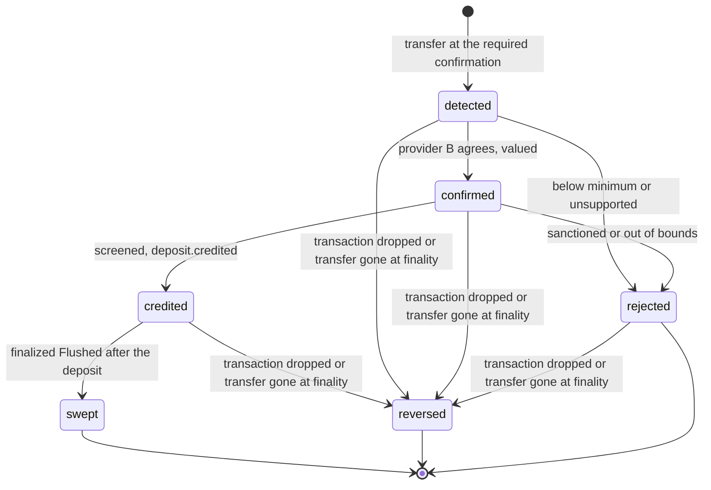
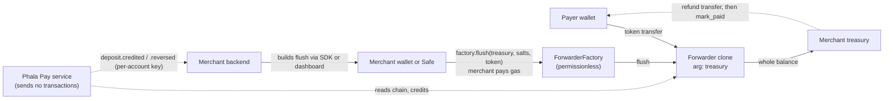
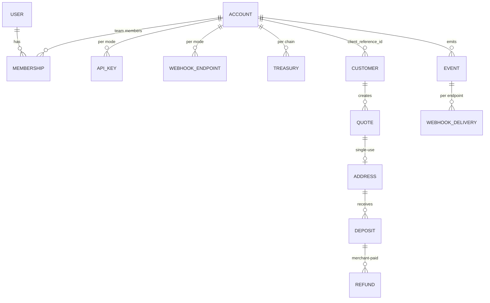
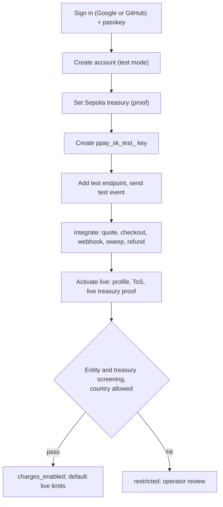

# Design: standard multi-tenant Phala Pay

Status: accepted (the owner delegated every decision; owner rulings of 2026-09-27 are applied).
Scope: turn Phala Pay from Phala Cloud's internal cashier into a self-serve, Stripe-shaped crypto
payments **software service** for any merchant. Phala Cloud becomes an ordinary account. This
document records decisions; the [architecture](../architecture.md) stays the specification and is
rewritten by the PRs in §16.

Every mechanism names the established practice it follows. External claims were checked on
2026-09-27 against the linked sources; where a source could not be verified, the text says so.

## 1. Context

Today (architecture §3, §4, §6, §7, §10, §12, §14):

- A **product** is the tenant, registered by the operator and named in an attested route file.
  `account_id` is the product's id for its end customer.
- Requests are signed with RFC 9421 ed25519 (`keyid = {product}/v1`). Webhooks are Standard
  Webhooks `v1a`, all signed with one attested key, `settlement/v1`.
- One `ForwarderFactory` per route with an immutable treasury (Phala's finance Safe). The
  service's operator key holds `OPERATOR_ROLE`, sweeps on a schedule, and pays gas.
- Deposits are credited only at Ethereum finality (`finalized`, about 15 minutes).
- Refunds: the product requests, finance approves and pays from the treasury Safe, the operator
  records.
- Test and live are separate deployments. Mainnet is not deployed; Phala Cloud's integration is a
  draft PR and is not live.

## 2. Principles

1. **Software, not custody.** Phala Pay prices quotes, detects payments, sends webhooks, and serves
   checkout and a dashboard. It holds no merchant funds, sends no transactions, pays no merchant
   gas, and charges no fee.
2. **One mechanism per job, for every account.** Phala Cloud is an ordinary account: same signup,
   keys, treasury setup, sweep, refunds, limits, and notifications as any merchant. No v1/v2 or
   legacy paths; nothing is live, so staging is reset and v1 retired.
3. **The operator runs the platform, never a merchant's business.** The admin API suspends abusive
   accounts, sets platform limits, and handles incidents. It does not create keys, set treasuries,
   move funds, record refunds, or replay a merchant's webhooks.
4. **Fast credit, recoverable reversal.** Credit at a small confirmation depth; watch to finality;
   a rare reorg becomes a `deposit.reversed` event, handled like a refund.

## 3. Decisions at a glance

| # | Topic | Decision | Standard followed |
|---|---|---|---|
| D1 | Credit timing | Credit at the stricter of the route floor and the account policy (Ethereum depth 2 ≈ 24 s; OP-stack `safe`); identity by receipt log position; follow re-inclusion; `reversed` + `deposit.reversed` only for a proven-dropped transaction | Exchange confirmations (Kraken, Binance); BTCPay confirmation setting; Etherscan "Dropped & Replaced"; Stripe post-success ACH failure → dispute |
| D2 | Custody | Non-custodial: forwarders pay only the merchant's treasury | BTCPay Server; FinCEN FIN-2019-G001 §1.1, §4.2 |
| D3 | Contracts | One permissionless factory per chain; clones carry `treasury` as the only immutable arg; public `flush` with per-target failure isolation | OZ `Clones.cloneDeterministicWithImmutableArgs` (pinned 5.7.0); BitGo public `flush()`; Multicall3 `allowFailure` |
| D4 | Sweeping | The merchant sweeps with its own wallet or Safe and pays gas; dashboard and SDK build the transaction | BTCPay (merchant wallet); EIP-1193; Safe via WalletConnect |
| D5 | Refunds | Declare destination and amount → pay from treasury → attach tx → verified | BTCPay payouts `mark-paid` |
| D6 | Names | Account `acct_`; `client_reference_id`; members and roles; API keys; webhook endpoints | Stripe |
| D7 | API auth | Bearer `ppay_sk_{live,test}_…` keys, hashed, rolled; restricted `ppay_rk_` later | Stripe keys; GitHub token format and secret scanning |
| D8 | Dashboard auth | Google (OIDC) or GitHub (OAuth, PKCE) login plus mandatory passkey; WebAuthn step-up for sensitive actions | OIDC Core, RFC 7636, WebAuthn |
| D9 | Test/live | One deployment; key selects mode; `livemode` on every row, object, and event; Sepolia = test | Stripe test mode |
| D10 | Treasury | EIP-4361 proof (EOA) or EIP-1271 (deployed Safe); live changes time-locked 48 h, cancellable | EIP-4361, EIP-1271; timelock on sensitive changes |
| D11 | Webhooks | Standard Webhooks `v1a` with one key **per account and mode**; endpoints per account; bounded retries | Standard Webhooks; Stripe endpoints |
| D12 | Go-live | Activation after profile, ToS, verified live treasury, entity screening; invite-only `live_access` until legal sign-off, then open to all | Stripe activation (`charges_enabled`, `tos_acceptance`) |
| D13 | Isolation | Typed `Scope (account_id, livemode)` built server-side; one authorization table; per-account limits | Stripe rate limits; OWASP authorization |
| D14 | Economics | No fee, no invoicing; merchants pay their own sweep and refund gas | BTCPay ("no transaction fees") |

## 4. Fast credit and reversal (D1)

**Decision.** One credit rule, evaluated per chain family by reviewed code (a new family needs a
reviewed code change, as today). A transfer is credited when both RPC providers report the same
block hash and the same log and the block has reached the **required confirmation**:

| Chain family | Confirmation values | Default |
|---|---|---|
| Ethereum L1 (mainnet, Sepolia) | a depth `head − block + 1 ≥ n`, or `finalized` | 2 |
| OP-stack L2 (Base, when enabled) | `safe` (derived from data posted to L1) or `finalized`; never the sequencer's unsafe head | `safe` |

The required confirmation is the **stricter of the route's value and the account's policy**. The
route value is the floor and default; an account may require more for a chain (for example
`finalized` for irreversible goods), never less. BTCPay stores set the same knob: "the minimum
amount of confirmations after which the invoice gets the 'confirmed' status"
([BTCPay stores FAQ](https://docs.btcpayserver.org/FAQ/Stores/)). A block at or below `finalized`
always qualifies, so `finalized` as the policy reproduces today's behaviour: one rule, one
parameter per account.

**Why 2 on Ethereum.** 0 confirmations is a mempool transaction the payer can still replace.
Depth-1 reorgs are routine on post-Merge Ethereum: Etherscan's forked-blocks list, sampled on
2026-09-27, shows 224 031 forked blocks in total, and the latest 1 000 (about April to September
2026) all have reorg depth 1 ([Etherscan forked blocks](https://etherscan.io/blocks_forked)).
Crediting at 1 would credit, reverse, and re-credit several times a day. Depth-2 reorgs did not
appear in that sample; proposer boost exists to prevent short-range reorgs, and reverting a
finalized block costs at least one third of staked ETH
([ethereum.org, proof-of-stake](https://ethereum.org/developers/docs/consensus-mechanisms/pos/)).
The owner accepts the residual risk because a reversal is recoverable (below).

**Why `safe` on OP-stack.** Sequencer blocks can reorg before their data reaches L1: Base reports
that "Only a single Base L2 block has ever reorged" at L2 inclusion and "There has never been a
reorg of L2 blocks that were batched to Ethereum L1"
([Base, transaction finality](https://docs.base.org/base-chain/network-information/transaction-finality));
the OP Stack calls a block *unsafe* until verifiers derive it from posted data, then *safe*, then
*finalized* with L1 ([OP Stack overview](https://docs.optimism.io/stack/rollup/overview)).

**What others use.** Kraken's deposit table lists 30 confirmations (about 6 minutes) for
Ethereum-network assets ([Kraken](https://support.kraken.com/articles/203325283-cryptocurrency-deposit-processing-times));
Binance announced 12 for ETH and ERC-20 in 2021, before the Merge
([Binance](https://www.binance.com/en/support/announcement/d57bbb741ecf408c8599e97e8dcc9083)).
Coinbase's and Gemini's pages refused automated access and are not cited. Exchanges credit
tradable, withdrawable balances to anonymous users; a merchant crediting a known customer can
claw back, so a shallower default is proportionate, and the account policy raises it where not.

**Detection keeps up.** One scanner per chain polls `eth_getBlockByNumber("latest")` every 2 s
(a sixth of the 12 s slot) on provider A. That is plain JSON-RPC over the HTTP providers already
configured, with no WebSocket subscription to keep alive. Each new head:

1. reads `Transfer` logs to watched addresses for the new blocks (by block hash) and upserts them
   as `seen` (`pending_transfers`, display only, as today);
2. promotes transfers that reach the required confirmation to deposits and runs the confirm step
   at once: provider B must return the same block hash and log;
3. values, screens, and credits in the same pump pass; the `deposit.credited` event is written in
   the credit transaction (outbox, architecture §11), and delivery starts immediately.

A payer's wallet shows the transaction in its block; checkout shows "Payment received" within about
2 s of the block and, at the default, "Credited" after the second block: **credited in about 30
seconds** after paying (inclusion wait, one more slot, polling and delivery). `GET /v1/config`
reports the typical credit time for the account's effective policy.

**Deposit identity survives re-inclusion.** A deposit is the transfer at position *i* among the
logs of its transaction's receipt: id `uuid_v5(NS, "{chain_id}:{tx_hash}:{receipt_log_index}")`.
The block-level `log_index`, block number, and hash are evidence that may change, not identity.
This replaces today's `chain:tx_hash:log_index` identity (architecture §0, §6, §11); staging is
reset, so no existing id is migrated.

**Watch to finality.** When `finalized` advances, the service re-reads, on both providers, the
receipt of every not-yet-final deposit's transaction:

- **Receipt at or below `finalized` with the same log at position *i*:** the deposit is `final`
  (a timestamp, not a state); evidence is updated if the block changed.
- **Receipt in a newer, not-yet-final block:** the transaction was re-included; follow it (update
  the evidence) and keep waiting. Nothing is reversed.
- **Receipt at or below `finalized` without the transfer** (the re-executed transaction reverted
  or emitted no such log), or **proven dropped**: both providers find no receipt and, at the
  finalized block, the sender's nonce is above the transaction's nonce, so another transaction
  consumed it. That is Etherscan's "Dropped & Replaced" ("a newly created transaction with the
  same FROM account nonce is accepted and confirmed", [Etherscan](https://info.etherscan.com/transaction-dropped-replaced/))
  and ethers' `TRANSACTION_REPLACED` ([ethers](https://docs.ethers.org/v6/api/utils/errors/)).
  The deposit becomes **`reversed`** (terminal).
- **No receipt and the nonce not yet consumed:** the transaction is pending again; keep waiting
  and alert after one hour (`TopupDepositPendingAfterReorg`).



- `deposit.reversed` (event id `uuid_v5(NS, "deposit.reversed:" + deposit UUID)`, like every
  event) is sent for a reversed deposit that was reported as credited or rejected. A quote consumed
  by it becomes `open` again if its window is still open, otherwise `expired`; its pending refunds
  are canceled.
- The merchant claws back the credit as for `deposit.refunded`. This is Stripe's pattern for
  payments that fail after success: "In rare situations, Stripe might receive an ACH failure from
  the bank after a PaymentIntent has transitioned to `succeeded`. If this happens, Stripe creates a
  dispute" ([Stripe ACH](https://docs.stripe.com/payments/ach-direct-debit/accept-a-payment?payment-ui=direct-api)),
  signalled by `charge.dispute.created`.
- A reversal raises the platform alert `TopupDepositReversed` (a chain-health signal) and an
  email and dashboard notice to the merchant.
- Price is observed when crediting (architecture rule 5, "together with the credit").
- Refunds require `final`: nothing is paid back for a deposit that could still be reversed (D5).
- A forwarder's balance can include unfinalized funds; a merchant's `flush` moves whatever is
  there. The service marks deposits `swept` only from **finalized** `Flushed` events after the
  deposit's log position, so the swept accounting never depends on an unfinalized sweep.

## 5. Funds: custody, contracts, sweeping, refunds (D2–D5, D14)

### D2: non-custodial

Each account sets a treasury per chain (an EOA or a deployed Safe). Every forwarder issued for that
account can pay only that treasury; nothing Phala runs can move funds anywhere else. This is BTCPay
Server's model: "Payments with BTCPay go directly to your wallet"
([BTCPay FAQ](https://docs.btcpayserver.org/FAQ/General/)).

At a high level, and not as legal advice: FinCEN classifies intermediaries by "whether the person
acting as intermediary has total independent control over the value"
([FIN-2019-G001](https://www.fincen.gov/sites/default/files/2019-05/FinCEN%20Guidance%20CVC%20FINAL%20508.pdf)
§4.2), treats processors that "collect the CVC from the customer and then transmit" it as money
transmitters (§4.6), and notes that a "developer or seller of … a software application … may be
exempt" (§1.1) while "suppliers of tools (communications, hardware, or software) … are engaged in
trade and not money transmission" (§4.5.1(b)). Phala Pay never controls value, collects no fee,
and sends no transactions. Phala's legal review (§17) confirms this before live mode opens.

### D3: contracts

```solidity
contract Forwarder {                               // implementation; clone args = abi.encodePacked(treasury)
    address public immutable factory;
    uint256 public constant NATIVE_SEND_GAS = 50_000;
    function treasury() public view returns (address);    // Clones.fetchCloneArgs(address(this))
    function flush(address token) external onlyFactory returns (uint256 amount);
        // SafeERC20 full balance → treasury; token == 0 → ETH via call{gas: NATIVE_SEND_GAS}
}
contract ForwarderFactory {                        // no roles, no admin, no constructor arguments
    Forwarder public immutable implementation;
    event ForwarderCreated(bytes32 indexed salt, address indexed forwarder, address indexed treasury);
    event Flushed(bytes32 indexed salt, address indexed forwarder, address indexed token,
                  address treasury, uint256 amount);
    event FlushFailed(bytes32 indexed salt, address indexed forwarder, address indexed token, bytes reason);
    function addressOf(address treasury, bytes32 salt) external view returns (address);
    function flush(address treasury, bytes32[] calldata salts, address token) external; // anyone
        // per salt: skip if the predicted address holds nothing; clone if no code
        // (ForwarderCreated); call flush through a bounded low-level call (revert data
        // truncated to 256 bytes); Flushed on success, FlushFailed and continue on failure
}
```

- **Immutable args.** Clones are created with `Clones.cloneDeterministicWithImmutableArgs` and
  predicted with `predictDeterministicAddressWithImmutableArgs`, added in OpenZeppelin 5.2.0; the
  pinned submodule is v5.7.0 (`cab19933`)
  ([CHANGELOG](https://github.com/OpenZeppelin/openzeppelin-contracts/blob/v5.7.0/CHANGELOG.md),
  [Clones.sol](https://github.com/OpenZeppelin/openzeppelin-contracts/blob/v5.7.0/contracts/proxy/Clones.sol)).
  The CREATE2 address commits to the factory, implementation, treasury, and salt.
- **Salt.** `keccak256(abi.encode(account, client_reference_id, "quote", quote_id))`; the merchant
  holds every input and recomputes each address.
- **Public flush.** Anyone can call `flush`; the destination is fixed in the address. BitGo's
  forwarders expose `function flush() public` for native coin
  ([ForwarderV4.sol](https://github.com/BitGo/eth-multisig-v4/blob/c175a6a56d4fd049d67417970b318e0500315f67/contracts/ForwarderV4.sol));
  their `flushTokens` is restricted to the parent and fee address. Here both are public because
  no party needs to be trusted with the timing: the only effect is moving funds to their owner.
- **Failure isolation.** A reverting treasury (a token blacklist, an EIP-7702-delegated EOA, a
  contract rejecting ETH) makes only its target fail, like Multicall3's `allowFailure`; native
  sends are gas-bounded so a treasury cannot burn the batch's gas. Treasury `address(0)` is refused.
- **Deployment.** No constructor arguments and no admin: the Arachnid deterministic deployment
  proxy with a fixed salt gives the same factory address on every chain, and anyone can deploy
  it. The factory and implementation are pinned in route files and verified at startup as today.
- **Audit.** The contracts shrink (no roles, no operator); the independent review before mainnet
  (`docs/plan.md`) covers them. Invariants for Foundry fuzz and invariant tests: a forwarder pays
  only its treasury; `addressOf` equals the deployed clone; one failing target leaves the others'
  transfers intact; a zero-balance target deploys nothing.

### D4: sweeping — the merchant's transaction

Every account sweeps the same way. The dashboard lists unswept balances per chain and token (from
the service's ledger and on-chain balances) and builds one `factory.flush(treasury, salts[],
token)` call per token. It never builds a flush to a treasury on a sanctions list and never
includes an address holding a sanctioned deposit (§8). The merchant
sends it through its connected wallet with EIP-1193 `eth_sendTransaction`
([EIP-1193](https://eips.ethereum.org/EIPS/eip-1193)); a Safe connects through WalletConnect,
which turns the request into a transaction proposal for the owners
([Safe help](https://help.safe.global/articles/6643739210-how-to-connect-a-safe-to-a-dapp-using-walletconnect)).
Scripts and cron jobs use the SDK's `flush_transaction(factory, treasury, salts, token)`, which
encodes the call offline from the address export (§13); `GET /v1/sweeps` is a convenience that
lists unswept balances and the same call. The merchant pays the gas and chooses when sweeping is worth it; the
dashboard shows the estimated gas next to the balance. Funds left in forwarders are safe: they can
only ever reach the treasury.

The service no longer sends transactions: the flusher, operator keys, `OPERATOR_ROLE`, the
operator gas reserve and its alerts, and the gas-refill runbook are removed.

### D5: refunds

The merchant refunds from its own treasury, in two steps (BTCPay's payouts: the store pays from its
own wallet, and Greenfield's `POST /api/v1/payouts/{payoutId}/mark-paid` records it;
[BTCPay payouts](https://docs.btcpayserver.org/Payouts/)):

1. `POST /v1/refunds {deposit, amount_atomic, destination_address}` → Refund `pending`; requires
   the deposit to be `final` (`409 deposit_not_final` otherwise) and refundable, the amount to fit
   its unrefunded remainder (reserved), and `destination_address` to pass sanctions screening.
2. After paying, `POST /v1/refunds/{id}/mark_paid {transaction_hash, log_index?}`. At `finalized`
   (refunds need no speed), both providers must show a `Transfer` of the deposit's token with
   `from == addresses.treasury` of the deposit's own address (not the account's current
   treasury), `to == destination_address`, `value == amount_atomic`, a log not used by another
   refund. Then `succeeded` and `deposit.refunded`; otherwise `failed` with `failure_reason` and
   the reservation released. `POST /v1/refunds/{id}/cancel` cancels a pending refund; a deposit
   that becomes `reversed` cancels its pending refunds.

Statuses are Stripe's Refund names (`pending`, `succeeded`, `failed`, `canceled`).

### D14: economics

No fee and no invoicing. Merchants pay their own sweep and refund gas; payers pay their payment
gas. Phala's infrastructure costs (CVM, RPC, price data, email) are out of scope of this design.
Route minimums (`min_credit_minor`) stay route-level for every account; merchants judge sweep
economics themselves.



## 6. Tenant model and names (D6)



| Concept | Today | Decision | Stripe reference |
|---|---|---|---|
| Tenant | product (`slug`) | **account** `acct_…`; `GET /v1/account` | [Account](https://docs.stripe.com/api/accounts/object) |
| People | operator only | **user** (login identity) with a **membership** and role | [Team roles](https://docs.stripe.com/get-started/account/teams/roles) |
| Roles | — | `owner`, `administrator`, `developer`, `view_only` | Account owner, Administrator, Developer, View Only |
| Credentials | product ed25519 key | **API key** | [API keys](https://docs.stripe.com/keys) |
| Webhook target | `products.webhook_url` | **webhook endpoint** `we_…` | [Webhooks](https://docs.stripe.com/webhooks) |
| End customer | `account_id` | **`client_reference_id`** (≤ 200 chars) | Checkout [`client_reference_id`](https://docs.stripe.com/api/checkout/sessions/create) |

"Account" in today's API means the end customer, the opposite of Stripe; renaming now, before any
integration is live, prevents every Stripe-literate integrator from misreading it. The end customer
is the merchant's own record, so no `cus_` object is added.

## 7. Authentication and authorization (D7, D8, D13)

### D7: API keys

- `Authorization: Bearer ppay_sk_live_…` or `ppay_sk_test_…` (Bearer only). The vendor prefix
  avoids Stripe's `sk_live_` pattern, which GitHub push protection attributes to Stripe; the
  format is prefix + 32 random bytes (base62) + CRC32 checksum, as GitHub's token format
  ([GitHub](https://github.blog/engineering/platform-security/behind-githubs-new-authentication-token-formats/));
  Phala registers the pattern with the GitHub secret scanning partner program
  ([partner program](https://docs.github.com/en/code-security/secret-scanning/secret-scanning-partnership-program/secret-scanning-partner-program))
  and revokes reported keys.
- Stored as SHA-256 (256-bit random keys need no slow hash); shown once; prefix and last four
  shown later; `last_used_at` per minute.
- Roll: the old key works until a chosen expiry of at most 7 days, Stripe's grace period
  ([keys](https://docs.stripe.com/keys)); expired → `401 api_key_expired` (Stripe's code).
- Restricted keys `ppay_rk_…` with per-resource `none | read | write` come after launch (PR 14),
  sharing the authorization table below.

RFC 9421 request signing is removed for merchants: every SDK and language needed signing,
`Content-Digest`, target-URI rebuilding, and replay tables. TLS terminates inside the attested CVM,
so only attested code sees a bearer key, and the database holds only hashes. The admin API keeps
its RFC 9421 admin key: it is the operator's surface, not a second merchant path.

### D8: dashboard login

- Sign in with Google (OpenID Connect: `nonce`, `iss`, `aud`, `exp`, `email_verified` checked per
  [OIDC Core §3.1.3.7](https://openid.net/specs/openid-connect-core-1_0.html#IDTokenValidation))
  or GitHub (OAuth 2.0 with `state` and PKCE, verified primary email). Both use the authorization
  code flow with PKCE ([RFC 7636](https://www.rfc-editor.org/rfc/rfc7636)).
- The identity providers do not guarantee MFA or a fresh login: GitHub's authorize endpoint has
  no `max_age` (its `prompt` only selects an account,
  [GitHub](https://docs.github.com/en/apps/oauth-apps/building-oauth-apps/authorizing-oauth-apps)),
  and Google returns `auth_time` only when requested and enabled
  ([Google](https://developers.google.com/identity/openid-connect/openid-connect)). So the
  dashboard requires its own **passkey** ([WebAuthn](https://www.w3.org/TR/webauthn-2/)) at first
  login, and a WebAuthn assertion with user verification within 5 minutes (step-up) for: treasury
  changes, key creation and rolls, member and role changes, endpoint changes, live activation.
- Enrolment issues 10 one-time recovery codes (stored hashed). A user who loses a passkey is
  reset by an owner or administrator of the account, as Stripe lets an owner or administrator reset
  a member's two-step authentication; a user can also use a recovery code. A sole owner without
  either is recovered by the operator after identity verification, as Stripe's account recovery
  form ([Stripe](https://support.stripe.com/questions/sign-in-to-your-stripe-account-without-a-2fa-device-and-or-backup-code))
  and GitHub's support-reviewed recovery ("A member of GitHub Support will review your request",
  [GitHub](https://docs.github.com/en/authentication/securing-your-account-with-two-factor-authentication-2fa/recovering-your-account-if-you-lose-your-2fa-credentials)):
  audited, with a 3-day notice to every member and address on file before access is restored.
- Sessions: server-side, a 256-bit id in `__Host-session` (`Secure; HttpOnly; SameSite=Lax`),
  stored hashed, 12 h idle and 7 d absolute; state-changing requests require a matching `Origin`
  (OWASP [Session Management](https://cheatsheetseries.owasp.org/cheatsheets/Session_Management_Cheat_Sheet.html),
  [CSRF](https://cheatsheetseries.owasp.org/cheatsheets/Cross-Site_Request_Forgery_Prevention_Cheat_Sheet.html)).

### D13: authorization and scoping

- **One authorization table** maps each permission (`quotes.write`, `refunds.write`,
  `treasury.write`, `keys.write`, `members.write`, `endpoints.write`, `activation.write`, reads) to
  the roles and key kinds that hold it. Secret keys hold every API permission and no dashboard
  permission; roles follow Stripe's (developer: keys, endpoints, refunds; view_only: reads;
  administrator: all but ownership; owner: all).
- **Scope.** Every merchant query takes `Scope { account_id, livemode }`, built by the server:
  from the key, or from the session's membership for the account in the dashboard URL
  (`/api/accounts/{acct}/…`), checked on every request. A client-supplied account id is never
  trusted (OWASP [IDOR](https://cheatsheetseries.owasp.org/cheatsheets/Insecure_Direct_Object_Reference_Prevention_Cheat_Sheet.html)).
  Tables without `account_id` are reached only through a scoped parent: `transitions`,
  `flushed`, and `pending_transfers` via `deposits`/`addresses`; `webhook_deliveries` via `events`;
  `identities` and `sessions` via the user. Tests assert `404` across accounts and modes on every
  endpoint. PostgreSQL row-level security is not added: one service and a typed scope give the same
  guarantee with fewer moving parts.

## 8. Security model changes

| Topic | Decision |
|---|---|
| Webhook forgery across tenants | Per-account, per-mode keys (D11): an event signed for account A never verifies at account B, so a self-registered attacker cannot replay its own `deposit.credited` to another merchant. |
| Where funds go | Fixed per address (treasury arg). The service sends no transactions and has no contract role. |
| Compromised service | Cannot move funds; could issue new addresses for a wrong treasury or sign unbacked events. The SDK always recomputes each quote's address from `(factory, implementation, treasury, salt)` and fails closed on a mismatch; `<Checkout>` renders only the `expected_address` the merchant backend passes after that check. Pinning expected treasuries in the SDK is optional hardening. |
| Hijacked session | Passkey login, step-up, and the treasury time-lock (D10) with notices to every owner and administrator. |
| Sanctions | Phala's software does not assist in moving blocked assets. A deposit from a sanctioned address is `rejected(sanctioned)`; the sweep builder never includes its address and never builds a flush to a sanctioned treasury; refund destinations are screened (D5). The contracts cannot freeze anything: public `flush` can still move such funds, only to the merchant's treasury, and the merchant's own compliance applies. A treasury that becomes sanctioned (screened when set and daily) pauses the account's `quotes` and `settlement`. Merchant entity screening and IP geo-blocking at activation (D12). |
| SSRF | All webhook egress goes through Stripe's [smokescreen](https://github.com/stripe/smokescreen) (a compose sidecar), the only IP filter: it refuses addresses that are not publicly routable. The service itself checks only the scheme (`https`, `http` in test mode), the port (443, 80 in test mode), and follows no redirects (Stripe counts 3xx as failure); 20 s timeout. |
| EIP-1271 and SIWE details | §10, D10. |
| Keys at rest | API keys and session ids hashed; recovery codes hashed; webhook keys derived on demand from dstack KMS, never stored. |

## 9. Test and live modes (D9)

Stripe: "Each mode has its own set of API keys, and objects in one mode aren't accessible to the
other" ([keys](https://docs.stripe.com/keys)).

- One production deployment serves both modes; the key selects the mode; every tenant row,
  object, and event carries `livemode`. Route files declare `livemode`; testnets (Sepolia) must be
  `false`, mainnets `true` (startup checks a built-in testnet list).
- A request for the other mode's route is `400 livemode_mismatch`, a live request from an account
  without `charges_enabled` is `403 testmode_charges_only` (Stripe's codes,
  [error codes](https://docs.stripe.com/error-codes)).
- Webhook keys, limits, delivery workers, and caps are separate per mode, so test traffic cannot
  delay live deliveries or exhaust live limits.
- The staging deployment is reset and stays Phala's internal pre-production (test mode only).
  Integrators, Phala Cloud included, use production with `ppay_sk_test_` keys.

## 10. Onboarding, treasury, go-live (D10, D12)



### D10: treasury proof and changes

- **Proof.** An EIP-4361 message ([EIP-4361](https://eips.ethereum.org/EIPS/eip-4361), Final):
  `domain` = `dashboard.pay.phala.com`, `uri` = the treasury settings page, `address` = the
  treasury, `chain-id` = the route's chain, `nonce` single-use and bound to `(session, account,
  chain)`, `issued-at` now and `expiration-time` 10 minutes later, statement "Set as treasury of
  acct_… on Phala Pay". EOAs: `ecrecover`. Contracts: EIP-1271 `isValidSignature(hash, signature)`
  must return `0x1626ba7e`, where `hash` is the EIP-191 personal-message hash of the message,
  called at the `finalized` block on both providers
  ([EIP-1271](https://eips.ethereum.org/EIPS/eip-1271), [EIP-191](https://eips.ethereum.org/EIPS/eip-191)).
  ERC-6492 signatures (for not-yet-deployed contracts) are refused: the treasury must exist on
  that chain ([ERC-6492](https://eips.ethereum.org/EIPS/eip-6492)). Safes sign through
  Safe{Wallet} message signing ([Safe](https://docs.safe.global/advanced/smart-account-signatures)).
  The proof prevents typos, exchange deposit addresses, and a Safe missing on that chain.
- **Changes.** The first treasury per chain applies at once. A later live change is time-locked
  48 h (the timelock pattern of OpenZeppelin's
  [TimelockController](https://docs.openzeppelin.com/contracts/5.x/api/governance#TimelockController)),
  emailed to every owner and administrator at once, and cancellable by any of them. Quotes use
  the old treasury until it applies; existing forwarders keep theirs forever. Test-mode changes
  apply at once.

### D12: go-live gate

Test mode opens at signup. Live mode (`charges_enabled`, Stripe's field) activates automatically
when: the owner's email is verified and a passkey enrolled; the business profile (legal name,
country, website, support email, owners' names) is submitted; the ToS is accepted
(`tos_acceptance {date, ip, user_agent}`, Stripe's field); a live treasury is proven; the entity,
its owners, and the treasury pass sanctions screening; and the country and signup IP are not in
the blocked-jurisdiction list. A screening hit leaves the account `restricted` for operator review.
New live accounts get default limits; the operator raises them on request. No document KYB: Phala
Pay is software and never touches funds.

**Live access allowlist.** Until Phala's legal review (§17) signs off, live activation is
invite-only: an account can start it only when `accounts.live_access` is set, granted by the
operator through the admin API (audited, owners notified). Invited accounts go through the full
activation above, with no exceptions. Phala Cloud is the first invited account. After sign-off the
operator grants live access at signup to every account: the same flag, no second mechanism.

## 11. Webhooks (D11)

- **Per-account keys.** Standard Webhooks: "Signing keys should be unique per endpoint for
  symmetric signatures, and unique per endpoint (or potentially customer) for asymmetric
  signatures. Reusing keys across customers can lead to security issues!"
  ([spec](https://github.com/standard-webhooks/standard-webhooks/blob/7537d2a2d3d52d8f2e0ecd12527af4a9307fd81b/spec/standard-webhooks.md)).
  Each account has one ed25519 `v1a` key per mode, derived from dstack KMS at
  `settlement/{acct}/{live|test}/v1`. The service stores no secret; the merchant holds a public
  key. Rotation bumps the version and sends both signatures during the overlap (the spec's
  multi-signature rotation).
- **Attestation.** `GET /v1/attestation?nonce=…`, authenticated with the account's key, returns
  the TDX quote with `report_data = sha256(nonce ‖ account_id ‖ livemode ‖ account public key)`.
  The merchant verifies it once with the dstack verifier and pins the **public key**, which is
  stable across releases because the KMS derives it from the app id and path; merchants do not
  track each release's compose hash.
- **SDK.** `construct_event(payload, headers, public_key, expected_account)` verifies the
  signature and requires `event.account == expected_account` and `event.livemode` to match the
  key's mode; it fails closed.
- **Endpoints.** Stripe-style: up to 16 per account and mode, `url`, `enabled_events`, status.
  No URL challenge (Stripe has none); "Send test event" instead. `https` required in live mode.
- **Delivery.** At least once, full-jitter backoff, per endpoint, with per-endpoint concurrency 4
  and round-robin scheduling across endpoints (one slow receiver cannot block others) and separate
  test and live workers. Retries span 3 days, as Stripe's live mode ("up to three days",
  [webhooks](https://docs.stripe.com/webhooks)); then the endpoint is disabled and every owner and
  administrator emailed, as the spec recommends ("notify the consumers using other channels …
  and … disable future delivery"). A `410 Gone` disables at once (spec). Undelivered events stay
  readable in `GET /v1/events`; the merchant re-enables and resends from the dashboard.

## 12. Isolation, limits, abuse

- **Rate limits** per account and mode, in process: 100 requests/s live and 25 test, Stripe's
  global numbers ([rate limits](https://docs.stripe.com/rate-limits)); a platform-wide test-mode
  ceiling (500/s) protects the service; per-customer quote creation and unsigned `client_secret`
  reads keep today's limits. `429 rate_limit`.
- **Caps** are per account and per mode only: open quotes (default 1 000 live, 100 test), open
  amount per customer and per account *(policy)*, max deposit (route). There is no global cap: the
  merchant, not Phala, bears price exposure. Open quotes bound the scanner's watched-address set.
- **Pause** scopes per account (`quotes`, `settlement`, `refunds`) and per route; the operator
  uses them for abuse and incidents. Owners and administrators can pause and resume their own
  account's `quotes` from the dashboard (step-up), for emergencies such as a compromise during a
  treasury time-lock: no new addresses are issued while paused.
- **Signup abuse.** Identity-provider login plus passkey, one account creation per user per hour,
  test mode moves no money and costs Phala no gas.

## 13. Operations

- **Idempotency.** Every `POST` accepts `Idempotency-Key`, stored per `(account, livemode, key)`
  with a request fingerprint and the response for 24 hours; a different request with the same key
  is `400 idempotency_error`. Stripe's model
  ([idempotent requests](https://docs.stripe.com/api/idempotent_requests)).
- **Security history.** Merchant-visible audit log of logins, key, member, endpoint, treasury, and
  activation changes (Stripe exposes "security history audit logs" to roles). Same `audit` table,
  scoped by account.
- **Reconciliation per forwarder.** At each finalized block the reconciler checks, for every
  forwarder with activity, that its balance per token equals its final deposits minus its
  finalized `Flushed` amounts. A mismatch freezes the chain's crediting (architecture §13) and
  alerts. The indexer accepts `ForwarderCreated`, `Flushed`, and `FlushFailed` only for known
  `(address, treasury)` pairs from `addresses`; anyone can call the factory, so other events are
  ignored.
- **Closure and export.** Owners export account data (JSON/CSV) at any time (GDPR Art. 20),
  including every address's `(factory, salt, treasury)`, so funds stay sweepable without Phala. Closure
  deletes members' personal data and pseudonymizes audit actors (Art. 17); payment records are kept
  for the retention period (architecture §15, 7 years) under the legal-obligation exception
  (Art. 17(3)(b)) ([GDPR](https://eur-lex.europa.eu/eli/reg/2016/679/oj)). Forwarders keep
  forwarding to the treasury after closure; webhooks stop.
- **Email.** Amazon SES from `notify.pay.phala.com` with SPF ([RFC 7208](https://www.rfc-editor.org/rfc/rfc7208)),
  DKIM ([RFC 6376](https://www.rfc-editor.org/rfc/rfc6376)), and DMARC `p=reject`
  ([RFC 7489](https://www.rfc-editor.org/rfc/rfc7489)); messages are written to the outbox in the
  transaction that causes them and delivered at least once. SES credentials are a dstack encrypted
  variable.
- **Observability.** Sentry alerts are platform health only: service errors, chain lag, provider
  disagreement, reconciliation, `TopupDepositReversed`, aggregate delivery backlog. Tags stay
  low-cardinality (`route`, `chain`, `state`, `mode`); the account id goes in event context, never
  a tag. Per-account conditions (failing endpoint, unswept balance, rejected or reversed deposit)
  are merchant notifications by email and dashboard, the same for every account.
- **Disaster recovery.** `ForwarderCreated` and `Flushed` carry the treasury, so swept status and
  clone arguments are rebuilt from the chain. As today, quotes issued within the RPO window are lost
  by a restore. Security changes inside the window (key revocations, member removals, treasury
  changes) could be undone, so after a restore every account's owners are emailed the restore
  point and asked to re-apply changes made after it; `deploy/RESTORE.md` gains this step.
- **Admin API** (operator, RFC 9421 admin key): account restrict/pause/resume, platform limits,
  route pause, reconciliation block lift, deposit nudge, read-only support views, daily platform
  report. Each writes `audit` and notifies the account's owners when it touches the account.

## 14. Data model

Fresh schema (staging is reset); unchanged tables of architecture §6 keep their columns.

```text
accounts        id, public_id (acct_…), name, business_profile jsonb, country, tos_acceptance jsonb,
                live_access bool, charges_enabled bool, restricted bool, paused_scopes text[],
                webhook_key_version jsonb ({"live": 1, "test": 1}), created_at
confirmation_policies account_id, chain_id, required (depth | safe | finalized)
                PRIMARY KEY (account_id, chain_id)          -- absent: the route's value
account_limits  account_id, livemode, max_open_quotes, max_open_minor_account,
                max_open_minor_customer                           PRIMARY KEY (account_id, livemode)
users           id, email, name, created_at
identities      user_id, provider (google|github), subject        UNIQUE (provider, subject)
passkeys        id, user_id, credential_id UNIQUE, public_key, sign_count, created_at
recovery_codes  user_id, code_hash, used_at
memberships     account_id, user_id, role                         PRIMARY KEY (account_id, user_id)
invitations     id, account_id, email, role, token_hash, invited_by, expires_at, accepted_at
sessions        id_hash PK, user_id, created_at, last_seen_at, stepped_up_at, expires_at
permissions     permission, principal (role:… | key:secret | key:restricted)   -- the one table (§7)
api_keys        id, account_id, livemode, kind, name, permissions jsonb, prefix, last4,
                key_hash UNIQUE, created_by, created_at, expires_at, last_used_at, revoked_at
treasuries      id, account_id, chain_id, address, proof_message, proof_signature, verified_at,
                effective_at, canceled_at, screened_at, created_by
customers       id, account_id, livemode, client_reference_id, paused_scopes
                UNIQUE (account_id, livemode, client_reference_id)
addresses       id, account_id, livemode, chain_id, quote_id, salt, treasury, address UNIQUE (chain_id, address)
quotes          (today's rate_locks) + account_id, livemode, customer_id
deposits        + account_id, livemode, receipt_log_index, confirmations_at, final_at;
                state adds `reversed`; UNIQUE (chain_id, tx_hash, receipt_log_index)
flushed         chain_id, tx_hash, log_index, address_id, token, treasury, amount_atomic,
                block_number, block_hash                     -- from finalized Flushed events, any sender
refunds         id, account_id, livemode, chain_id, deposit_id, amount_atomic, destination_address,
                tx_hash, log_index, status, failure_reason, created_at
                UNIQUE (chain_id, tx_hash, log_index)
webhook_endpoints id (we_…), account_id, livemode, url, enabled_events text[], status, disabled_reason
events          id (evt_…), account_id, livemode, type, object_type, object_id, data jsonb, created
webhook_deliveries event_id, endpoint_id, next_attempt_at, attempts, delivered_at, response jsonb
                PRIMARY KEY (event_id, endpoint_id)
idempotency_keys account_id, livemode, key, fingerprint, response jsonb, created_at
                PRIMARY KEY (account_id, livemode, key)      -- pruned after 24 h
audit           id, account_id, actor_type (user|api_key|admin|system), actor_id, action, subject,
                reason, created_at
```

Removed: `products`, `settlements`, `flushes` (operator plans and nonces), outbox formats 1 and 2
(one event format), `addresses.kind`/`version`/legacy persistent addresses, refund
`requested_by`/`approved_by`.

**Route file.** No `product`, no `treasury`, no operator or `chain.flush` settings. Adds
`livemode` and `confirmations` (the floor and default); keeps chain, factory, implementation,
asset, pricing, and limits.

## 15. API surface

```text
GET    /v1/account
GET    /v1/config                                    routes of the key's mode (confirmations, typical credit time)
POST   /v1/quotes {client_reference_id, amount, currency, chain_id, asset}
GET    /v1/quotes/{id}                               unsigned ?client_secret= as today
POST   /v1/quotes/{id}/cancel
GET    /v1/deposits?client_reference_id&quote&status&tx_hash&created[...]&limit&starting_after&ending_before
GET    /v1/deposits/{id}
POST   /v1/refunds {deposit, amount_atomic, destination_address}
POST   /v1/refunds/{id}/mark_paid {transaction_hash, log_index?}
POST   /v1/refunds/{id}/cancel
GET    /v1/refunds/{id}
GET    /v1/sweeps?chain_id&token                     unswept balances and the flush call {to, data}
GET    /v1/events, /v1/events/{id}
GET|POST /v1/webhook_endpoints, GET|POST|DELETE /v1/webhook_endpoints/{id}
GET    /v1/attestation?nonce=…                       authenticated; binds the account's key
```

- The dashboard API adds the account's confirmation policy per chain and the self-serve `quotes`
  pause; the admin API adds `live_access`.
- Objects and events carry `livemode`; events carry `account`. Deposit gains `status: reversed`,
  `confirmations`, `final` (bool), `swept`. Quote gains `treasury`. Events add `deposit.reversed`.
- The dashboard lives on its own origin, `https://dashboard.pay.phala.com`, served by the same
  CVM through dstack-ingress (a second custom domain; PR 11 verifies ingress support). Its private
  API is `/api/…` on that origin with session cookies; the public API origin ignores cookies. CSP:
  `default-src 'self'; script-src 'self'; frame-ancestors 'none'; connect-src 'self'` plus the
  WalletConnect relay.
- Errors adopt Stripe's codes and types: `api_key_expired`, `livemode_mismatch`,
  `testmode_charges_only`, `rate_limit`, `resource_missing`, type `idempotency_error`; `signature_invalid` and
  `signature_replayed` are removed.

## 16. Plan

Each PR is sized for one agent, has its own branch and green CI, and updates the docs it touches.
The **launch set** (PRs 1–13) must land before any account, Phala Cloud included, takes live
payments. After it, the independent security review and the HUMAN-ONLY factory deployments on
Sepolia and mainnet open live mode to invited accounts (`live_access`); the legal sign-off (§17)
opens it to everyone.

| PR | Title | Launch set | Depends on |
|---|---|---|---|
| 1 | Fast credit and reversal | ✓ | — |
| 2 | Contracts and core address math | ✓ | — |
| 3 | Schema reset and tenancy scope | ✓ | 1 |
| 4 | Chain-sourced sweeps; remove the flusher | ✓ | 2, 3 |
| 5 | Users, login, passkeys, members, email | ✓ | 3 |
| 6 | API keys, idempotency, rate limits | ✓ | 3 |
| 7 | Modes and per-account webhook keys | ✓ | 6 |
| 8 | Treasuries: proof, time-lock, screening | ✓ | 4, 5 |
| 9 | Webhook endpoints and delivery | ✓ | 7 |
| 10 | Refunds | ✓ | 4 |
| 11 | API vocabulary, SDKs, sweep builder | ✓ | 6–10 |
| 12 | Dashboard and onboarding | ✓ | 5, 8, 9, 11 |
| 13 | Deploy, docs, staging reset | ✓ | 1–12 |
| 14 | Restricted keys | | 6 |
| 15 | Account closure and export | | 12 |

**PR 1 — fast credit and reversal** (on today's code, before multi-tenancy). Scope: route
`confirmations` (default 2; `safe`/`finalized` per chain family); deposit identity by receipt log
position; scanner polls the head every 2 s; confirm step on both providers; finality watch by
receipt with re-inclusion following and dropped-transaction proof (nonce consumed); state
`reversed`, event `deposit.reversed`, quote re-opening; `TopupDepositReversed`,
`TopupDepositPendingAfterReorg`; swept linkage from finalized `Flushed` only; checkout copy and the integration guide's "about 15 minutes" become "credited in about 30
seconds" with the reversal obligation. Files: `crates/core` (state machine, route), scanner, pump,
reconciler, outbox, `docs/architecture.md` §2/§7/§8/§11/§12, `docs/integration.md`,
`sdk/js` copy. Tests: Anvil reorg simulation with `anvil_reorg` (a depth-1 reorg before credit
changes nothing; a transaction re-included in a later block keeps its deposit id and is followed,
not reversed, even when its block-level `log_index` changes; a transaction replaced by another
with the same nonce gives `reversed` and one `deposit.reversed`); provider B lagging; time from inclusion to
event under 30 s on a 12 s Anvil block time. Acceptance: `confirmations: finalized` passes today's
suite unchanged.

**PR 2 — contracts and core.** Replace the contracts with D3 (no roles), a new fixed factory salt, `expected-codehashes.json`, deploy scripts without admin or treasury arguments; `crates/core`
CREATE2 prediction with immutable args and the new salt; startup checks. Tests: Foundry unit, fuzz,
invariant (§5); Rust vectors generated by Foundry. Acceptance: `forge test`, `check-build.sh
--check`, `cargo test`.

**PR 3 — schema reset and tenancy.** One squashed migration with §14's schema; `Scope` type and
scoped repository; the authorization table; route schema per §14. Tests: cross-account and
cross-mode `404` per endpoint; migration on an empty database. Acceptance: all tests green;
HUMAN-ONLY staging reset listed in PR 13.

**PR 4 — chain-sourced sweeps.** Index `ForwarderCreated`, `Flushed`, `FlushFailed` from the
factory at finality whoever sent them, only for known `(address, treasury)` pairs; reconciliation
per forwarder freezing crediting on mismatch; delete the flusher, operator
keys, `OPERATOR_ROLE` handling, gas alerts, and attestation operator records. Tests (Anvil): a
third party's flush marks deposits swept only after finality; a failing target is reported.

**PR 5 — users and login.** OIDC/OAuth with PKCE, passkeys, step-up, recovery codes, member
reset by owners, operator-assisted owner recovery (audited, 3-day notice), invitations, sessions, security history, SES email via outbox. Tests: token validation
cases, WebAuthn ceremonies (virtual authenticator), CSRF `Origin`, role matrix.

**PR 6 — API keys.** `ppay_sk_` keys, Bearer auth, roll and expiry, hashing, checksum pre-check,
per-account and platform rate limits, `idempotency_keys` for every POST; RFC 9421 removed from
merchant routes. Tests: valid, unknown, expired, revoked, wrong-mode keys; idempotent retries.

**PR 7 — modes and webhook keys.** `livemode` end to end; per-account key derivation and
signing with `webhook_key_version` and dual signatures during rotation; authenticated attestation with a new `report_data` vector; separate test and live workers.
Tests: a key never sees the other mode; an event for A fails verification with B's key.

**PR 8 — treasuries.** SIWE and EIP-1271 verification (both providers, `finalized`, ERC-6492
refused), nonce binding, 48 h time-lock with cancel and notices, screening; quotes take the
effective treasury. Tests: EOA, deployed Safe, undeployed Safe, expired message, reused nonce,
cancel during the lock.

**PR 9 — webhook endpoints.** Endpoints API, `enabled_events`, smokescreen sidecar (scheme,
port, and no-redirect checks in the service), fair per-endpoint scheduling, 3-day disable with email, `410`, resend, `/v1/events`.
Tests: fan-out, smokescreen refusing private, CGNAT, and IPv4-mapped IPv6 targets, redirects
refused, a slow endpoint not delaying another.

**PR 10 — refunds.** D5 flow: final deposits only, destination screening, finalized
verification, reservation, auto-cancel on reversal. Tests: valid refund; non-final deposit refused;
sanctioned destination refused; wrong sender (current treasury instead of the address's), wrong
destination or amount, reused log, cancel, reversal cancelling a pending refund.

**PR 11 — vocabulary and SDKs.** `client_reference_id`, `livemode`, `account`, Quote `treasury`,
Deposit fields, `/v1/sweeps`; OpenAPI regenerated; Python `phala-pay` (Bearer, `construct_event`
with `expected_account`, address recompute failing closed, offline `flush_transaction`); JS `@phala/pay`
(`<Checkout expected_address>`, `livemode`, reversal status). Tests: SDK suites, recompute vectors.

**PR 12 — dashboard and onboarding.** SPA on `dashboard.pay.phala.com` with CSP: payments,
deposits, refunds (declare, mark paid), sweep builder (EIP-1193, WalletConnect), keys, endpoints
and deliveries, members, treasuries, confirmation policy, `quotes` pause, security history,
test/live toggle; signup, profile, ToS, screening, geo-blocking, activation for accounts with
`live_access`; address export. Tests: component tests; one browser
run from signup to a credited, swept, and refunded test payment.

**PR 13 — deploy and docs.** Compose with smokescreen and the second domain; route files with
`livemode` and `confirmations`; architecture and integration rewritten; runbooks: remove gas refill,
flush-reverted, operator-key compromise, treasury change, product-key compromise, rejected funds at
treasury, refund execution; add merchant sweep guide (including a note for Phala Cloud's
finance: its Safe owners sign a sweep periodically, like any merchant), reversal handling,
restore notice, `live_access` grants. HUMAN-ONLY
steps listed, not executed: staging reset (procedure in `deploy/README.md`, "Staging reset",
written with PR 3), factory deployment on Sepolia and mainnet, second domain DNS, SES domain
verification.

**Phala Cloud** (monorepo draft PR, after the launch set) integrates like any merchant: sign up,
set Phala's Safe as treasury with a Safe signature, create `ppay_sk_test_`/`ppay_sk_live_` keys,
register its endpoint, pin its account's webhook public keys, use `client_reference_id` (team id),
handle `deposit.reversed` like `deposit.refunded`, pass `expected_address` to `<Checkout>`, and
sweep and refund from its Safe through the dashboard. It is the first account granted
`live_access`.

## 17. Legal review (gate for opening live mode to everyone)

Until Phala's legal review signs off, live mode is invite-only (`live_access`, D12). The review
confirms:

1. Phala Pay as pure software with no fee and no control of funds is outside money transmission
   (US federal and state) and crypto-asset service licensing (EU
   [MiCA](https://eur-lex.europa.eu/eli/reg/2023/1114/oj)) where Phala offers it.
2. Obligations, if any, around sanctioned funds that public `flush` lets anyone sweep to a
   merchant's treasury, and the screening scope (entity, owners, treasury, payers).
3. Terms of Service, prohibited-business list, blocked-jurisdiction list, privacy notice, data
   processing terms, and retention.
