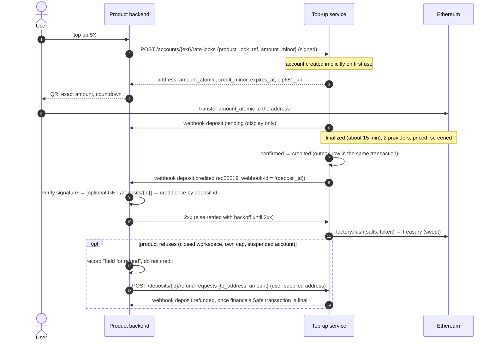

# Design: payment-processor product integration (webhook fulfillment)

Status: proposal for review. Nothing here is implemented yet. It replaces the synchronous
settlement protocol of [architecture §11](../architecture.md#11-settlement-contract) with the
pattern payment processors use: the merchant creates a checkout session, the processor decides
when the payment has succeeded, and the merchant fulfills from a signed webhook with one
idempotent function (Stripe Checkout fulfillment; Coinbase Commerce and BitPay for crypto).

## 0. Summary

| Today | Proposed |
|---|---|
| The product implements a settlement endpoint (`POST {settlement_url}`, `GET {settlement_url}/{key}`), six obligations, and a 12-case conformance suite. | The product implements one webhook receiver and one idempotent `fulfill(deposit_id)` function. |
| `cleared → credited` needs the product's `200 accepted`; `processing`, `409`, `422`, `rejected`, and unknown answers each have a protocol path. | `confirmed → credited` when screening passes. The payment's state does not depend on the product's answer. |
| The product verifies every cited log on its own RPC and recomputes the deposit id. | Optional hardening. The product trusts what the attested service signs, as a merchant trusts Stripe. |
| The product refuses with `200 rejected`, recorded as `rejected(product_refused)`. | The product records its refusal and asks for a refund with the existing refund-request API. |
| After a restore, every deposit past `cleared` is looked up by key at the product before the service resumes. | No product lookups. Event ids are deterministic, so a replayed credit deduplicates at the product. |

Unchanged: forwarders can pay only the treasury; the only thing that authorizes a credit is a
signature by the TEE-held `settlement/v1` ed25519 key; the product pins that public key from
verified attestation; product requests stay RFC 9421 signed with the product key.

Estimated change: about 10,000 lines deleted and 1,000 added (§3).

## 1. Product contract

### 1.1 Calls and events



**Product → service (unchanged except where noted).** All RFC 9421 signed with the product key.

| Call | Change |
|---|---|
| `POST /accounts/{ext}/rate-locks` | Creates the account when it does not exist (find-or-create on `(product, external_id)`), so a quote is one call, like creating a Checkout Session. Idempotent on `product_lock_ref`, as today. |
| `POST /accounts/{ext}/deposit-address` | Same implicit account creation. Persistent addresses stay: the exchange-deposit flow needs them. |
| `POST /accounts` | Kept, idempotent, no longer required. |
| `GET /deposits/{id}`, `GET /accounts/{ext}/deposits`, support lookup | Kept. `DepositResponse` gains `external_id` and `price_source`, so a fetched deposit carries everything the credit needs. |
| `POST /deposits/{id}/refund-requests` | Now also accepted for `credited` and `swept` deposits (§2.4). |
| Everything else (rotate, cancel lock, pending view, limits, pause) | Unchanged. |

**Service → product.** Standard Webhooks, asymmetric `v1a`, as today
([integration §6](../integration.md#6-webhooks)). The event types stay; only
`deposit.credited` changes meaning and payload:

| Type | Meaning | Product action |
|---|---|---|
| `deposit.credited` | **The fulfillment event.** The deposit is final, priced, and screened; the service owes the product `amount_minor` USD for `external_id`. | `fulfill(deposit_id)`. |
| `deposit.pending`, `deposit.confirmed`, `deposit.rejected`, `deposit.refunded`, `rate_lock.expired` | Informational, unchanged. | UI and notifications only. |

`deposit.credited` payload (replaces the current one, which carried `destination_tx_id` and no
account):

```json
{"event_id": "<uuid>", "type": "deposit.credited", "created_at": "…",
 "data": {"product_id": "…", "external_id": "team-42", "deposit_id": "3f1c…",
          "state": "credited", "unit": "USD", "amount_minor": "1234",
          "price_source": "lock", "price_scaled": "…", "price_scale": 8, "valuation_at": "…",
          "product_lock_ref": "q-981", "address": "0x…", "route": "…", "route_version": 1,
          "chain_id": 1, "asset_contract": "0x…", "tx_hash": "0x…", "log_index": 12,
          "amount_atomic": "…"}}
```

- `external_id` names the account, so the product no longer needs its own address records to map
  a credit (today only `deposit.pending` and `rate_lock.expired` carry it).
- `product_lock_ref` is the receiving address's lock reference, set also when the payment was
  valued at spot (late, wrong amount, second payment); `price_source` says which price applied.
  The product closes its quote from these two fields.
- `amount_minor` is the credit: exactly the quoted `credit_minor` when `price_source = "lock"`,
  otherwise spot at finality ([architecture §9](../architecture.md#9-quote-first-deposits-rate-locks)).
- **`event_id` is deterministic:** `uuid_v5(DEPOSIT_NAMESPACE, "deposit.credited:" + deposit_id)`,
  also sent as `webhook-id`. The outbox primary key then admits one row per deposit (the
  transition writer's insert in `db/deposits.rs` gains `ON CONFLICT (id) DO NOTHING`), and a
  service rebuilt from a backup emits the same id (§2.3). Today every event id is a random v4
  (`steps/settle.rs::event`).

### 1.2 Signature, retries, idempotency

- **Signature.** `webhook-signature: v1a,<base64 ed25519 over "{webhook-id}.{webhook-timestamp}.{raw body}">`
  by `settlement/v1`. The product holds only the public key, pinned with its key id from
  verified attestation ([integration §3.3](../integration.md#33-pin-the-services-settlement-key)).
  A leak of the product's configuration cannot forge a credit, which a leaked Stripe `whsec_`
  secret can. Timestamp tolerance 300 s (SDK default). The key id keeps its name: it is a dstack
  key domain, and renaming it is a key rotation
  ([architecture §15](../architecture.md#15-operating-policies), Rotation).
- **Delivery.** The existing outbox (`crates/topup/src/outbox/delivery.rs`): the event row is
  written in the same transaction as the `credited` transition; `POST` to the product's
  registered `webhook_url`, 20 s timeout, no redirects; any non-`2xx` or timeout is retried with
  full-jitter backoff, ceiling 30 s doubling to 1 h, **forever** (Stripe stops after 3 days).
  An undelivered event older than 24 h raises the existing age warning
  ([outbox-backlog runbook](../../deploy/runbooks/outbox-backlog.md)); the operator can replay any
  event with `POST /v1/admin/outbox/{event_id}/replay`. No ordering guarantee.
- **Idempotency.** The product's fulfillment key is the deposit id. Keep the existing key format
  `deposit:<uuid>` as the product's `provider_order_id`, so deposits already credited through the
  old settlement protocol (staging's reference product) deduplicate against the new path.
  `webhook-id` equals a function of the deposit id, so deduplicating by either is equivalent.

### 1.3 The fulfillment function

```python
def handle_webhook(headers, raw_body) -> int:
    try:
        event = verify_webhook(headers, raw_body, SETTLEMENT_KEY)   # pinned from attestation
    except SignatureError:
        return 400
    if event.type == "deposit.credited":
        fulfill(CreditedDeposit.from_event(event))   # fast: one DB transaction
    return 204                                       # unknown types: acknowledge and ignore

def fulfill(credit: CreditedDeposit) -> None:
    # Optional: deposit = client.get_deposit(credit.deposit_id); require state in
    # {credited, swept} and equal amount_minor/external_id, else hold for review.
    with db.transaction():
        if orders.exists(provider_order_id=f"deposit:{credit.deposit_id}"):   # unique index
            alert_if_amount_differs(credit)                                     # §2.3
            return
        if refuses(credit):   # closed workspace, own cap, suspended: product policy
            orders.insert(..., status="held_for_refund")
            return            # support later collects an address and calls refund-requests
        orders.insert(..., status="paid"); ledger.credit(credit.external_id, credit.amount_minor)
```

A unique index on the fulfillment key is what makes concurrent and repeated calls credit once.
The receiver returns `2xx` after the transaction commits; a failure before that returns `5xx`
and the service retries. A cap or refusal is a product decision recorded durably and answered
with `2xx`: it never asks the service to change the deposit.

The SDK ships this shape as `topup_sdk.fulfillment` (§4.1). A product in another language needs
only ed25519 verification and a unique index.

### 1.4 Comparison with Stripe

Sources: [docs.stripe.com/checkout/fulfillment](https://docs.stripe.com/checkout/fulfillment)
and [docs.stripe.com/webhooks](https://docs.stripe.com/webhooks), read 2026-09-26.

| Stripe guidance | This design |
|---|---|
| Create a Checkout Session server-side; the customer pays on it. | `POST rate-locks`: address, exact amount, expiry, EIP-681 URI. The persistent address is the no-session variant. |
| "Create a function on your server to fulfill successful payments … `fulfill_checkout`." | `fulfill(deposit_id)`, one function. |
| "Correctly handle being called multiple times with the same Checkout Session ID", "possibly concurrently". | Unique index on `deposit:<id>`; the same event id on every retry and after a restore. |
| "Retrieve the Checkout Session from the API." | Optional `GET /deposits/{id}`. The signed payload already carries every field; the fetch is a consistency check, not the authority (credits come only from signed events). |
| "Check the `payment_status` … to determine if it requires fulfillment." | The event exists only when the deposit is `credited`; a fetched deposit must be `credited` or `swept`. |
| "Perform fulfillment … Record fulfillment status." | Credit and order row in one transaction. |
| Handle `checkout.session.completed` and `checkout.session.async_payment_succeeded`. | One event, `deposit.credited`; every crypto payment is "delayed" until finality, so there is no instant variant. |
| "Trigger fulfillment on your landing page (recommended)" because webhooks can be delayed. | Not adopted. The landing page shows state from `GET rate-locks/{ref}` and `GET /deposits/{id}` but does not credit: credits come only from signed events, and delivery follows the `credited` commit within the outbox poll interval (1 s), while finality takes about 15 minutes anyway. |
| Verify `Stripe-Signature` (HMAC-SHA256, shared `whsec_` secret) over the raw body; 5-minute tolerance. | Standard Webhooks `v1a` ed25519 over the raw body; product holds only the public key; 300 s tolerance. |
| "Quickly return a successful status code (2xx) before any complex logic that might cause a timeout." | Same; 20 s timeout. The credit is one short transaction; anything slower (emails) goes to the product's own queue. |
| "Track event IDs to identify duplicate deliveries"; two Event objects for one object: dedupe on object id and type. | Deduplicate on the deposit id; the event id is derived from it, so the two cases coincide. |
| "Stripe doesn't guarantee the delivery of events in the order that they're generated." | Same; act on the event itself or on fetched state. |
| Retries "for up to three days with an exponential back off"; manual resend up to 15 or 30 days. | Retried forever (ceiling 1 h), alert at 24 h, admin replay at any age. |
| Roll endpoint secrets; both signatures sent for up to 24 h. | `settlement/v2` rotation: both signatures sent, products accept both for 30 days (existing §15 rule). |
| IP allowlisting in addition to signatures. | Not offered: egress leaves through the dstack gateway. The signature alone authenticates. |
| Refunds are merchant-initiated after success (Refunds API). | Product-initiated `refund-requests`; finance approves and executes from the treasury Safe. |

## 2. Service-side changes

### 2.1 State machine

```text
today:    detected → confirmed → cleared → credited → swept     (cleared → credited needs the product's 200 accepted)
proposed: detected → confirmed → credited → swept
                  ↘ rejected(reason)
```

- `cleared` is removed. The screen step (`steps/screen.rs`) already checks sanctions, bounds, and
  pause scopes; on a pass it now advances `confirmed → credited` and writes the
  `deposit.credited` outbox row in the same transaction (the transition writer already does
  this for every step).
- **`credited` means: final, priced, screened, and owed to the product.** It no longer means
  "the product acknowledged". Delivery is tracked by the outbox row (`delivered_at`,
  `attempts`, `response`), never by the deposit's state, as a Stripe payment is `succeeded`
  whether or not the merchant's endpoint answered.
- `credited → swept` is unchanged (flush linkage by log position, §7).
- `core::deposit`: remove `Cleared`, `StepOutcome::AdoptProductAnswer`, and
  `WaitReason::ProductProcessing`. `RejectReason::ProductRefused` stays readable for history
  (staging has such rows) and is never produced again.
- The `settlement` pause scope keeps its code (renaming would rewrite stored `paused_scopes`
  arrays for no gain) and now documents "stop crediting": deposits wait in `confirmed`, as the
  screen step already does today. Pausing never rolls back `credited`.

### 2.2 What happens to each component

| Component | Today | Proposed |
|---|---|---|
| Settle step (`steps/settle.rs`) | Signed POST, answer adoption, pricing adoption, pause check | Deleted. |
| Settlement client (`adapters/settlement/http.rs`) | POST and GET by key, answer parsing | Deleted. `http_signature::sign` goes with it; `verify` stays for product requests. |
| `settlements` table | intent/sent/accepted/rejected per deposit | Kept read-only as audit history (§3.3). No code reads or writes it. |
| Confirm step GET-first (`steps/confirm.rs` `ProductLookup`, `adopt_answer`) | GETs the product before quoting, adopts its answer | Deleted. The confirm step only reads chain and price. |
| Product answers (`accepted`, `processing`, `409`, `422`, `rejected`, unknown) | Six paths | Gone. The only product answer is the webhook's HTTP status. |
| Reconciler `sent_settlement` check | GETs sent settlements and adopts | Deleted. |
| Reconciler `post_restore_settlement` and the restore gate | GETs every deposit past `cleared`; resume waits for all | Deleted. The restore check keeps its other checks (§2.3). |
| Reconciler `credit_recomputation`, `missing_deposit`, `missing_flush_link`, `custody_balance`, `address_derivation` | — | Unchanged. |
| Refunds | Only `rejected` (not `sanctioned`, at or above `min_refund_atomic`) | Also `credited` and `swept`, on the product's request (§2.4). |
| Flusher, sweeps | Every routed-token deposit, any state | Unchanged. |
| Daily report | `settlements_by_status` per route | Replaced by `credited_undelivered` (count and oldest age of undelivered `deposit.credited` rows). |
| Alerts | `TopupDepositStateAgeExceeded` for `cleared` | That state is gone; stuck delivery is the outbox age warning. |
| Route file | `destination.settlement_url` | Removed (`deny_unknown_fields` makes this a new attested route version). The `http` webhook exception for local stacks moves from "settlement URL is `http`" to "`TOPUP_PUBLIC_ORIGIN` is `http`". |
| Product registration | `webhook_url` in `products`, key id in the route | Unchanged. |

### 2.3 Restore

Today the product's settlement record is authoritative, so a restored service GETs every deposit
past `cleared` before it resumes. Proposed: the service's own record is authoritative, as
Stripe's is, and a restore loses at most the RPO window (≤ 1 minute of WAL, architecture §14):

- A deposit whose `credited` transition was lost is rebuilt by the scanner and reprocessed. Its
  `deposit.credited` has the same event id and deposit id, so the product's unique index
  ignores it.
- A lock-priced deposit gets the same `amount_minor` (the lock price is stored with the lock,
  which is older than the payment). A spot-priced deposit is repriced at a new observation time,
  so the rebuilt amount can differ from the credit the product already applied. The product
  keeps its first credit (Stripe semantics: the merchant's fulfillment record is final) and
  raises an alert on a differing amount (the SDK helper reports it). The restore runbook asks the
  product for that alert list and records each case in `audit`. Exposure: spot deposits credited
  in the last minute before the loss, differing by one minute of price movement.
- Event rows whose delivery was lost are re-sent: same id, deduplicated.

`deploy/RESTORE.md` and `restore.rs` drop the "post-restore settlement check did not complete"
gate and the `settlements ≤ deposits` row-count sanity.

### 2.4 Refusal and refunds

The product never answers "rejected". It either prevents crediting or refunds after it:

- **Before crediting (delay):** pause `settlement` on the account (existing
  `POST /accounts/{ext}/pause`). New deposits wait in `confirmed` until resume.
- **After crediting (refuse):** the product does not apply the credit, records it as held, and
  when the user supplies an address calls `POST /deposits/{id}/refund-requests {to_address,
  amount}`. `core::refund` accepts `credited` and `swept` deposits (still not `sanctioned`,
  which never reach `credited`, and still at least `min_refund_atomic`). Finance approval, Safe
  execution, `deposit.refunded`, and reconciliation are unchanged
  ([refund-execution runbook](../../deploy/runbooks/refund-execution.md)).

Policy text changes in architecture §15: "credited USD is not refundable" becomes "a credited
deposit is refunded only on the product's request, for a credit the product did not apply or
has reversed". Workspace closure no longer relies on a `product_refused` answer.

### 2.5 Abnormal payments

| Payment | Today | Proposed |
|---|---|---|
| Exact lock amount, in time | Settled at lock price, `lock_ref` set | `deposit.credited`, `price_source = lock`, `amount_minor` = quoted `credit_minor`. |
| Under, over, late, second payment, cancelled lock | Settled at spot, `lock_ref: null` | `deposit.credited` at spot, `price_source = spot`, `product_lock_ref` still set. |
| Persistent address | Settled at spot | `deposit.credited` at spot, `product_lock_ref: null`. |
| Unsupported token, below minimum, out of bounds, out of range, sanctioned | `rejected(reason)`, `deposit.rejected` | Unchanged; never credited. |
| Product refuses (closed workspace, cap, suspended) | `200 rejected` → `rejected(product_refused)` | Product holds the credit and requests a refund (§2.4). |
| Settlement or crediting paused | Waits in `confirmed` or `cleared` | Waits in `confirmed`. |
| Product endpoint down | Settlement retried; deposit stays `cleared` | Deposit is `credited`; the event is retried until `2xx`; 24 h age warning. |

## 3. Deletions, additions, migration

### 3.1 Deleted (estimated lines)

| Area | Items | Lines |
|---|---|---|
| Service | `steps/settle.rs` (692), `adapters/src/settlement/` (557), `db/settlements.rs` (227), `http_signature::sign` (~70), settlement parts of `reconciler/mod.rs` and `types.rs` (~465), confirm-step product lookup and adoption (~240 plus ~100 tests), `SettlementAdoption` and pricing adoption in `db/deposits.rs` (~90), `core::deposit` states and outcomes (~40), route `settlement_url` (~40), restore gate, `main.rs` wiring, daily report (~85) | ~2,700 |
| Service tests | `tests/settle.rs` (967), `adapters/tests/settlement_http.rs` (373) and its fixture (33), settlement tests in `tests/reconciler.rs` (~370), `tests/database.rs` (~150), `tests/pump.rs` (~110), `tests/support/seed.rs` (~40) | ~2,050 |
| Conformance | The whole `crates/conformance` crate (3,719 lines of Rust), `docs/conformance.md` (262), `deploy/product/conformance.sh` (74), the `product-conformance` Make target and CI job | ~4,100 |
| Reference product | `settlement.py` (356, replaced by ~120), `tests/test_settlement.py` (258, replaced by ~120), settlement and ledger-hook routes in `server.py`, conformance accounts in `config.py`, `product_refused` paths in `driver.py` and the sandbox scenarios | ~550 net |
| SDK | `verify_request` and its parsing helpers (~110), `tests/test_rust_settlement_vectors.py` (59), verification tests (~40), generated `route_daily_report_settlements_by_status.py` (50) | ~260 |
| Docs and runbooks | integration §5 and the settlement parts of §1, §7, §8 (~150); architecture §11 and the settlement rows of §0, §2, §3, §7, §13, §16 (~110); `payload-mismatch-422.md` (37), `stuck-settlement.md` (38) | ~330 |
| **Total** | | **~10,000** |

The conformance crate is deleted, not converted. The new obligations are ed25519 verification
(SDK function with cross-language vectors), a unique index, and a `2xx`; a harness for them
would test a database constraint. Receiver testing moves to a Stripe-CLI-style command
(`topup-sdk send-test-event`, §4.1).

### 3.2 Added (estimated lines)

| Item | Lines |
|---|---|
| Screen step emits `deposit.credited` with a deterministic id and the new payload | ~80 |
| Implicit account creation on rate-lock and deposit-address creation | ~30 |
| Refund eligibility for `credited` and `swept` | ~20 |
| `DepositResponse.external_id`, `price_source`; `credited_undelivered` in the daily report; OpenAPI and generated client | ~60 |
| Migration (up and down) | ~60 |
| Service tests: credit at clear, event id stability across a rebuild, refund of a credited deposit, implicit account, migration of `cleared` rows | ~300 |
| SDK `topup_sdk.fulfillment` (`CreditedDeposit.from_event`, amount-mismatch report) and `send-test-event` with tests | ~200 |
| Reference product fulfillment and its tests (counted net above) | — |
| Docs: integration §5 rewrite, architecture §7, §11, §12, §13, §15 edits, runbook updates | ~250 |
| **Total** | **~1,000** |

### 3.3 Schema and live-data migration

One additive migration (`crates/topup/migrations/README.md` rule: never edit an applied
migration):

1. **In-flight `cleared` deposits.** Move each back to `confirmed` with `next_attempt_at = now()`
   and the lease cleared, and append a `transitions` row (`cleared → confirmed`, evidence
   `{"migration": "webhook_fulfillment"}`). The new screen step re-screens it and credits it
   with its stored valuation (no re-quote). If the old settle step had already delivered a POST
   the service never recorded, the product's existing `deposit:<id>` record deduplicates the
   new event. No drain or maintenance window is needed.
2. **`deposits.state` CHECK** drops `cleared`. `transitions` keeps `cleared` in its CHECK, and
   `deposits.reason` keeps `product_refused`, so history stays valid.
3. **`settlements` becomes read-only history**: `REVOKE INSERT, UPDATE, DELETE` from
   `topup_app`, the same `BEFORE UPDATE OR DELETE` guard as `transitions`, and a table comment
   pointing to this document. Rows (payloads, receipts, `destination_tx_id`s) are retained for
   the 7-year retention rule (§15) and never dropped. The migrations README grant table is
   updated, and the database privilege test with it.
4. `credited`, `swept`, and `rejected` deposits, their transitions, outbox rows, and audit rows
   are untouched. Historical `deposit.credited` rows keep their old payload; a replay of one is
   ignored by the new SDK parser (no `external_id`) and deduplicated by the reference product.

Down migration: restore the CHECK and the grants. It cannot un-credit deposits that the new
code credited; a rollback past it is a restore.

Staging cutover: one deploy with the new image and the route file without `settlement_url`
(new compose hash), together with the new reference product. Before deploying, record
`SELECT state, count(*) FROM deposits GROUP BY state` and the `settlements` row count; after,
check that `settlements` is unchanged and every formerly `cleared` deposit is `credited` with a
delivered event. Production holds no deposits yet, so it needs no data step.

## 4. Impact outside the service

### 4.1 SDK (`sdk/python`)

- Add `topup_sdk.fulfillment`: `CreditedDeposit.from_event(event)` (typed, validates required
  fields, rejects legacy payloads) and a helper that compares a stored credit with a repeated
  event and reports a differing amount (§2.3).
- Add `topup-sdk send-test-event --url … --seed-file …`: signs a synthetic `deposit.credited`
  with a test seed and posts it, like `stripe trigger`; the product's test instance pins the
  test key.
- Remove `verify_request` (only the settlement endpoint used it; product request signing stays),
  the settlement vectors, and the regenerated `settlements_by_status` model.
- SemVer MAJOR for the SDK. `CHANGELOG.md` entries under `Removed` and `Changed`.

### 4.2 Reference product (`deploy/product/reference_product`)

Becomes the worked example of §1.3: webhook receiver, `fulfill` over the existing SQLite ledger
(orders keyed `deposit:<id>`, so staging's existing orders deduplicate), a suspended-team path
that records "held for refund", and no chain RPC, caps, or settlement routes. The staging
deposit driver asserts the §2.5 outcomes from the ledger and events instead of settlement
answers; the sandbox `product_refusal` scenario becomes "held, then refund-requested".

### 4.3 Conformance suite

Deleted (§3.1). `make product-conformance`, its CI job, and the go-live item "conformance report
`passed: true`" go with it. The go-live checklist instead requires: a `send-test-event` run
against the production code path returning `2xx`, a duplicate returning `2xx` without a second
credit, a bad signature returning `4xx`, and one staging deposit fulfilled end to end.

### 4.4 Integration guide and architecture

- `docs/integration.md`: §1 (diagram above), §3.2 (register `webhook_url` only), §5 replaced by
  "Fulfillment" (§1.2 and §1.3 here), §6 (`deposit.credited` payload and meaning; drop "Events
  never move balances"), §7 (outcomes of §2.5; refunds of credited deposits), §8 (checklist of
  §4.3; no own RPC).
- `docs/architecture.md`: §0 rows for idempotent HTTP; §1 success criterion; §2 rule 7 and §3
  trust model (§5 here); §6 `settlements` marked historical; §7 states; §11 replaced by
  "Fulfillment webhook"; §12 events; §13 checks; §14 route fields and the upgrade argument; §15
  refunds and closure; §16 tests. `docs/plan.md` gets a work-package row per PR of §6.

### 4.5 Phala Cloud PR ([phala-cloud-monorepo#2196](https://github.com/Phala-Network/phala-cloud-monorepo/pull/2196))

Open, documentation only (`docs/integrations/crypto-topup.md`, 108 lines). Update it after this
design is approved; `docs/phala-cloud-pr/README.md` here changes with it:

- "Settlement endpoint" section → "Fulfillment": verify `v1a` with the pinned key, `fulfill` by
  `deposit:<id>` in the same transaction as `Order` find-or-create, credit transaction, and
  `complete_order_payment` (the §11 ledger mapping carries over unchanged), `2xx` after commit.
- Remove own-RPC verification, deposit-id recomputation, `422`/`404`/`503` answers, the
  conformance hooks, and `CRYPTO_TOPUP_RPC_URL`, `…_CHAIN_ID`, `…_TOKEN`, `…_FACTORY`,
  `…_IMPLEMENTATION`. Caps become optional review holds.
- Add the refusal path (hold, then refund request) and the landing page reading state only.
- Monitoring: alert on webhook verification failures and on repeated-event amount mismatches.

### 4.6 In-flight branch `feat/reference-slug-and-key-rotation`

Product key rotation stays needed: product → service requests remain RFC 9421 signed with the
product key, and `destination.product_kid` stays in the route. Anything that branch adds around
`destination.settlement_url` or the reference product's settlement endpoint is dropped. Land it
first, then rebase the service PR of §6 on it.

## 5. Risks and what is given up

**Given up: independent chain verification by the product** (today's obligations 5 and 6). A
bug or exploit in the attested service that signs a `deposit.credited` without a matching
finalized transfer would credit the product. Today the product's own node would refuse it.
Why this matches the standard model: a Stripe merchant does not verify card networks or bank
settlement; it trusts the processor's signed event and reconciles against payouts. Here the
processor is code measured by attestation, whose key the product pins, and the money it
reports can land only in the treasury. Remaining controls:

- The product may keep per-deposit and per-period caps as review holds in `fulfill` (cheap,
  recommended for the pilot).
- The product may still verify the log itself: the event carries `tx_hash`, `log_index`,
  `address`, and `amount_atomic`, and the SDK keeps `deposit_id` and the address helpers.
- Finance reconciles treasury inflow (the daily report) with credited totals; the reconciler's
  custody and credit-recomputation checks are unchanged.

Other risks:

| Risk | Mitigation |
|---|---|
| The webhook endpoint is down, so the user is not credited. | Retries forever; 24 h age warning; admin replay; the deposit is visible as `credited` through the API for support. |
| A product bug credits twice. | Unique index on `deposit:<id>`; the SDK example shows it; the event id and deposit id are stable across retries and restores. |
| A refund of a credited deposit that the product did credit (double value). | Only the product can request it; finance approves each one; the refund references the deposit, and the product must reverse its credit first (§15 wording). |
| A spot-priced deposit re-valued after a restore. | Bounded to the RPO window; the product keeps its first credit and alerts (§2.3). |
| `deposit.credited` changes meaning inside `/v1` without the 90-day deprecation window. | No product consumes it yet (staging runs the reference product; Phala Cloud's PR is docs only). The change is recorded as breaking in `CHANGELOG.md`. The failure mode of an old receiver is safe: it never credits from events. |
| Losing the settlement request's per-deposit product receipt (`destination_tx_id`). | The product's order row holds it; the support lookup shows the event's `delivered_at` and response. |

## 6. Implementation plan (one PR each, in order)

1. **Design (this PR).**
2. **SDK additions** (additive): `topup_sdk.fulfillment`, `send-test-event`, tests.
3. **Small service changes, compatible with the old protocol:** implicit account creation;
   refund eligibility for `credited` and `swept`; `DepositResponse.external_id` and
   `price_source`; OpenAPI and client regeneration. Can land before the cutover.
4. **Service cutover** (after the key-rotation branch lands): state machine without `cleared`;
   screen step credits and emits the new `deposit.credited` with deterministic ids; migration of
   §3.3; delete the settle step, settlement client, `db/settlements.rs`, confirm-step lookup,
   reconciler settlement checks and restore gate; route `settlement_url` removal and the staging
   route file; daily report field; tests; architecture §6, §7, §11–§16 and `RESTORE.md`
   updates; CHANGELOG.
5. **Reference product and conformance removal:** fulfillment-based reference product, driver
   and sandbox scenarios, delete `crates/conformance`, `docs/conformance.md`,
   `deploy/product/conformance.sh`, the Make target, and the CI job. Merged together with or
   right after PR 4; staging is deployed once both are on `main`.
6. **SDK cleanup and docs:** remove `verify_request` and settlement vectors; rewrite
   integration §1 and §5–§8; runbooks (delete `payload-mismatch-422.md`, `stuck-settlement.md`;
   update `outbox-backlog.md`, `refund-execution.md`, restore); `docs/phala-cloud-pr/README.md`.
7. **Staging verification:** deploy PRs 4 and 5, check the migration counts of §3.3, run the
   abnormal-payment driver, and one refund of a held credit.
8. **Phala Cloud PR #2196 update** (root orchestrator, after owner approval).
