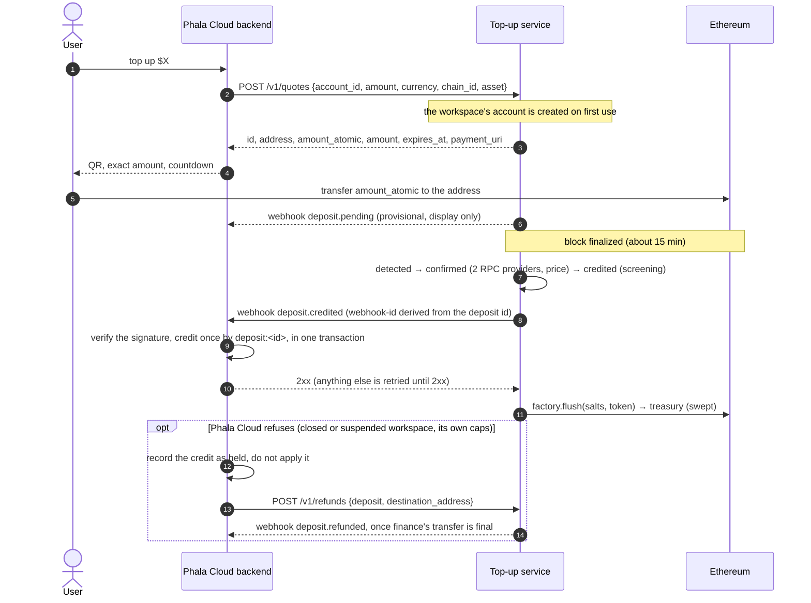

# Integration guide

For the Phala Cloud backend team, who connect Phala Cloud (product slug `phala-cloud`) to this
service. Where this guide and the code disagree, the code wins. The contract is defined by:

- [crates/topup/openapi.json](../crates/topup/openapi.json): every request and response shape,
  also served at `GET /openapi.json`;
- [deploy/product/reference_product](../deploy/product/reference_product): a complete Python
  product, the one staging credits today;
- [architecture.md](architecture.md): the design, especially §11 (the fulfillment webhook), §12
  (API, events, product UI), §14 (attestation), and §15 (refunds and policies).

The SDK is [sdk/python](../sdk/python): `topup_sdk` (signing, webhook verification, typed
`deposit.credited` credits, address and deposit-id recomputation, a retrying client, and
`topup-sdk send-test-event`) over `topup_client`, generated from the OpenAPI document. It is
not published to a package index; install it from this repository. Samples below use it; every
step is plain HTTP and ed25519, so any backend language can do the same.

## 1. What the service does

The service gives each Phala Cloud workspace deposit addresses, watches Ethereum for token
transfers to them, waits for finality, prices each deposit, and screens it. A deposit that passes
is credited, and the service tells Phala Cloud with a signed `deposit.credited` webhook. Phala
Cloud owns the balance: it verifies the signature and credits the deposit once. This is the
pattern of Stripe Checkout fulfillment
([docs.stripe.com/checkout/fulfillment](https://docs.stripe.com/checkout/fulfillment)). The
addresses are CREATE2 forwarders that can only pay the treasury; the service sweeps them there in
batches. The default flow is quote first: the user states an amount, receives a locked price, an
exact token amount, and a single-use address, and pays within the window.



## 2. Environments

| | Origin | Chain | Status |
|---|---|---|---|
| Production | `https://crypto-topup-api.phala.com` | Ethereum Mainnet (1) | Domain being set up |
| Staging | `https://crypto-topup-api-staging.phala.com` | Sepolia (11155111) | Domain being set up |

The origin is exact: it is the service's `TOPUP_PUBLIC_ORIGIN`, and every request signature
covers it (§4.1). Staging's route, with its forwarder factory, implementation, and test PHA token
(a `MockERC20` whose `mint(address,uint256)` is public), is
[deploy/config/routes/phala-cloud-sepolia-pha.yaml](../deploy/config/routes/phala-cloud-sepolia-pha.yaml).
Staging's `phala-cloud` product is currently the reference product; switching staging to Phala
Cloud's staging backend is an operator change: the admin replaces the product's key and webhook
URL (§3.4), and the route stays as it is.

## 3. Onboarding

### 3.1 Create the product key

On a machine you control, one key per environment:

```sh
cd sdk/python
uv run --locked topup-sdk keygen --keyid phala-cloud/v1 --seed-out ~/phala-cloud-staging.seed
```

It writes the 32-byte seed as hex to a new mode-0600 file and prints
`{"keyid": "phala-cloud/v1", "public_key": "<base64>"}`. Keep the seed in your secret store;
never send it. Use a distinct key per environment: each deployment records used signatures in its
own database, so a shared key would let a request be replayed against another deployment within
the five-minute window.

### 3.2 Registration (done by the operator)

Send the operator the printed `keyid` and `public_key` and your webhook URL (public `https`). The
operator then:

1. names your product in the attested route file (`product: phala-cloud`; your key id is
   `phala-cloud/v1`; a route change is a new attested deployment);
2. issues the product with the admin-signed `POST /v1/admin/products {slug, public_key,
   webhook_url}` ([deploy/README.md](../deploy/README.md#product-credentials)).

A repeat with the same values returns the same product; a different key or webhook URL for an
issued slug is refused with `409`, because changing them is a replacement (§3.4).

### 3.3 Pin the service's settlement key

The service signs its webhooks with one ed25519 key, `settlement/v1` (the name is a dstack key
domain and stays), derived inside its confidential VM. You hold only its public key, so nothing
you store can forge a credit. Pin it only from verified attestation ([architecture §14](architecture.md#14-configuration-and-deployment)):

```sh
export TOPUP_ORIGIN=https://crypto-topup-api-staging.phala.com
export NONCE="$(openssl rand -hex 32)"
curl -fsS "$TOPUP_ORIGIN/v1/attestation?nonce=$NONCE" > attestation.json
# The official dstack verifier, pinned by digest (Docker): quote, TCB, event log, OS image.
jq '{quote: null, attestation: .quote}' attestation.json |
  deploy/dstack-verifier.sh > verification.json
jq -e --arg app "$APP_ID" --arg compose "$COMPOSE_HASH" \
  --arg report_data "$(jq -r '.report_data' attestation.json)" '
  .details.tcb_status == "UpToDate" and .details.app_info.app_id == $app
  and .details.app_info.compose_hash == $compose
  and .details.report_data == $report_data + ("0" * 64)' verification.json
```

`APP_ID` and `COMPOSE_HASH` are the values the operator gives you for the deployment
([deploy/README.md](../deploy/README.md#attestation-ingress-and-egress) shows how the operator
derives them). Then check that `report_data` binds your nonce and the key:

```python
import json, os
from topup_client.models import AttestationResponse
from topup_sdk import verify_attestation_binding

response = AttestationResponse.from_dict(json.load(open("attestation.json")))
verify_attestation_binding(response, bytes.fromhex(os.environ["NONCE"]))  # raises AttestationError
assert response.keyid == "settlement/v1"
print(response.settlement_pubkey)  # hex; pin it together with the keyid
```

`TopupClient.attestation(nonce)` fetches and runs the same binding check. The binding alone is
worthless without the verifier step: it proves only that the response is self-consistent.

### 3.4 Rotate the product key

The key id, `phala-cloud/v1`, stays the same; a rotation replaces only the public key the service
stores for your slug:

1. Generate a new key under the same key id (§3.1) and send the operator its `public_key`.
2. The operator stores it with the admin-signed `PUT /v1/admin/products/phala-cloud {public_key,
   webhook_url, reason}` ([deploy/README.md](../deploy/README.md#product-credentials)); the same
   call changes your webhook URL.
3. Switch your signer to the new seed.

The cut is immediate: from step 2 the old key gets `401`, and the new key gets `401` before it.
There is no overlap window, because the service verifies a product against one stored key under the
one key id its routes name. Agree a time for step 2 and switch right after it; `TopupClient` does
not retry `401`. For a leaked seed, tell the operator at once: they follow the
[product key compromise runbook](../deploy/runbooks/product-key-compromise.md).

## 4. Calling the API

### 4.1 Request signing

Every product request carries an RFC 9421 HTTP Message Signature with your ed25519 key:

- covered components, in order: `"@method"`, `"@target-uri"`, `"content-digest"`, plus
  `"idempotency-key"` when that header is sent (the product API does not need it);
- `Content-Digest: sha-256=:<base64>:` over the exact body bytes, also for an empty body;
- parameters `created` (Unix seconds) and `keyid` (`phala-cloud/v1`), optionally
  `alg="ed25519"` and `nonce`, serialized as RFC 8941 structured fields;
- `@target-uri` is `scheme://host[:port]/path?query` of the public origin in §2, exactly as sent.
  The service rebuilds it from its configured origin and ignores `Host` and `X-Forwarded-*`, so a
  correctly signed request to any other URL gets `401`.

`created` must be within five minutes of the service clock. Each signature is accepted once; a
reused one gets `409 signature_replayed`. ed25519 is deterministic, so the SDK adds a random
128-bit `nonce` to every signature. Test vectors:
[rfc9421-python-signer.json](../crates/topup/tests/fixtures/rfc9421-python-signer.json) (verified
by the Rust tests; the Python signer reproduces them byte for byte).

```python
from topup_sdk import RequestSigner, TopupClient

signer = RequestSigner.from_seed_file("phala-cloud/v1", "/secrets/phala-cloud-staging.seed")
# The forwarder factory and implementation, pinned from the attested deployment like the settlement
# key (§3.3): the client recomputes every open quote's address before returning it.
forwarder = ("0x2407bE5Be2b632F5b166872A49E4946a70CCa531", "0x70B714508BFa441449DC09f790Ca03Baa5170360")
with TopupClient(
    "https://crypto-topup-api-staging.phala.com", signer, forwarder=forwarder
) as client:
    config = client.get_config()
    quote = client.create_quote("team-42", 2500, chain_id=11155111, asset="pha")
```

The key id names the product: `phala-cloud/v1` is product `phala-cloud`.

### 4.2 Idempotency and retries

Every product operation is idempotent, so a retry with a fresh signature is always safe:

| Operation | Idempotent on |
|---|---|
| create a quote | the `Idempotency-Key` header, covered by the signature: an RFC 8941 string (`"8e03…"`, as in the IETF Idempotency-Key draft) or a bare token (Stripe's form), up to 255 characters. The same key with the same parameters returns the same quote; with other parameters it is `409 idempotency_error`. Without a key every request creates a quote. |
| cancel a quote | the quote: canceling a canceled quote returns it |
| request a refund | `(deposit, to_address, amount)` |

`TopupClient.create_quote` sends a fresh key unless you pass one, and reuses it on every retry.

`TopupClient` retries transport errors, `429`, `500`, `502`, `503`, `504`, and
`409 signature_replayed`, re-signing each attempt, up to 4 attempts with exponential backoff from
0.5 s.

### 4.3 Endpoints

Every path is a top-level resource; the key id names your product, and a request for another
product's resources is refused. `account_id` is your workspace id (1 to 255 bytes).

| Method and path | Purpose | `TopupClient` |
|---|---|---|
| `GET /v1/config` | Payable assets (chain, asset code, contract, decimals), minimum and maximum amounts, quote window, spread, tolerance, and typical finality time: what your UI shows instead of hardcoding. | `get_config` |
| `POST /v1/quotes` `{account_id, amount, currency: "usd", chain_id, asset}` | Quote `amount` cents: a locked price, the exact token amount, and a single-use address. The account is created by its first quote. The response alone carries the quote's `client_secret`; a repeat with the same `Idempotency-Key` returns a new one. | `create_quote` |
| `GET /v1/quotes/{id}` | Resume a checkout: `status`, `expires_at`, and the seen `payment`. Unsigned with `?client_secret=`, the payer's page reads the public `ClientQuote` (`payment_status`: `none`, `seen`, `confirming`, `credited`, `rejected`); any origin, rate-limited. Give the secret only to the paying customer's page and do not log it. | `get_quote` |
| `POST /v1/quotes/{id}/cancel` | Cancel an unpaid quote; later payments to its address credit at spot. | `cancel_quote` |
| `GET /v1/deposits` | Final deposits, newest first, as a Stripe list `{object: "list", url, has_more, data}`: filters `account_id`, `quote`, `status`, `tx_hash`, `created[gte]`, `created[lte]`; `limit` (1 to 100, default 10) with `starting_after` or `ending_before` (a `dep_` id); `expand[]=data.quote`. | `list_deposits` (follows every page) |
| `GET /v1/deposits/{id}` | One deposit (`dep_…`); `expand[]=quote`. | `get_deposit` |
| `POST /v1/refunds` `{deposit, destination_address, amount_atomic?}` | Refund request for finance (§7); `amount_atomic` defaults to the unrefunded remainder; `Idempotency-Key` as for quotes. | `create_refund` |
| `GET /v1/refunds/{id}` | One refund (`re_…`): `pending` until the transfer is final, then `succeeded`; `expand[]=deposit`. | `get_refund` |
| `GET /v1/attestation?nonce=` | Settlement key evidence (§3.3); unauthenticated. | `attestation` |

A quote's `amount` is an integer in US cents with `currency: "usd"`; `amount_atomic` is a decimal
string in token base units; `exchange_rate` is USD per token, a decimal string with 8 places;
`expires_at` and `created` are Unix seconds. `status` is `open`, `complete` (a matching payment
consumed it), `expired`, or `canceled`; a quote stays `open` past `expires_at` until the finalized
chain passes it, so hide its address once `expires_at` has passed. Quote semantics (spread,
tolerance, expiry by finalized chain time, exposure caps) are
[architecture §9](architecture.md#9-quote-first-deposits-rate-locks); the pending view is
[§12](architecture.md#12-api-and-events). Other amounts are decimal strings: `*_minor` in US cents,
and `price_scaled` has scale 8.

**Recompute every address before you show it.** A quote's address salt is
`keccak256(abi.encode("phala-cloud", account_id, "lock", quote_id))`; with the pinned forwarder
`TopupClient` recomputes it and raises `AddressMismatchError`, so a user never pays an address you
did not derive. You need no address records of your own to credit:
`deposit.credited` names the workspace (`external_id`) and the quote id (`product_lock_ref`), also
for a late or wrong-amount payment.

### 4.4 Errors

Errors are Stripe's error object, `{"error": {"type", "code", "message", "param"}}`
([docs.stripe.com/api/errors](https://docs.stripe.com/api/errors)): `type` is
`invalid_request_error`, `idempotency_error`, or `api_error` (5xx); `param` names the request
parameter when there is one. Codes are stable; messages are not.

| Status | `code` | Meaning |
|---|---|---|
| 400 | `parameter_missing`, `parameter_unknown`, `parameter_invalid` | Malformed input, with `param`. Do not retry unchanged. |
| 400 | `amount_too_small`, `amount_too_large` | Below the minimum credit or deposit, or above the maximum deposit (`param: "amount"`). |
| 401 | `signature_invalid` | Signature failed: wrong origin, clock outside five minutes, wrong key, or body changed after signing. |
| 404 | `resource_missing` | Unknown or foreign resource. |
| 409 | `signature_replayed` | Re-sign and retry. |
| 409 | `idempotency_key_reused` (`type: idempotency_error`) | The same `Idempotency-Key` with other parameters. |
| 409 | `exposure_cap_exceeded` | Open quote exposure cap (account, product, or global); the message states what is left. |
| 409 | `quote_payment_received`, `quote_window_closed`, `quote_unexpected_state` | Quote cancel refused: its address already received a payment, its window closed, or it is complete or expired. |
| 409 | `paused`, `chain_frozen` | Scope paused, or chain frozen pending reconciliation; show "temporarily unavailable". Not retried. |
| 409 | `conflict` | Other state conflicts, for example a refund for an ineligible deposit or above the remaining amount. |
| 429 | `rate_limit` | Quote creation limit per account. |
| 503 | `unavailable` | Temporarily unavailable (for example no fresh price); retry. |
| 500 | `internal_error` | Retry with backoff. |

## 5. Fulfillment

### 5.1 The event

`deposit.credited` is the one event that moves a balance. The service writes it when a deposit
passes screening, in the same transaction that marks the deposit `credited`: the credit is final
and owed to you, whatever you answer.

```http
POST {webhook_url}
content-type: application/json
webhook-id: 26a20351-ab10-595a-852f-9c1aa0372d73
webhook-timestamp: 1790409600
webhook-signature: v1a,<base64 ed25519 over "{webhook-id}.{webhook-timestamp}.{raw body}">

{"event_id": "26a20351-…", "type": "deposit.credited", "created_at": "…",
 "data": {"product_id": "…", "external_id": "team-42", "deposit_id": "3f1c2b9e-…",
          "state": "credited", "unit": "USD", "amount_minor": "1234",
          "price_source": "lock", "price_scaled": "…", "price_scale": 8, "valuation_at": "…",
          "product_lock_ref": "checkout-981", "address": "0x…", "route": "…", "route_version": 1,
          "chain_id": 1, "asset_contract": "0x…", "tx_hash": "0x…", "log_index": 12,
          "amount_atomic": "…"}}
```

- `amount_minor` is the credit: exactly the quote's `credit_minor` when `price_source` is `lock`,
  otherwise spot at finality (§7).
- `product_lock_ref` is the lock of the receiving address, also when a late or wrong-amount
  payment was valued at spot; it is `null` only for a legacy persistent address.
- `webhook-id` is `uuid_v5(DEPOSIT_NAMESPACE, "deposit.credited:" + deposit_id)`
  (`topup_sdk.credited_event_id`): every retry, operator replay, and re-emission after a service
  restore carries the same id.
- Addresses and hashes are lowercase hex; amounts are decimal strings.

### 5.2 The fulfillment function

```python
from topup_sdk import CreditedDeposit, SignatureError, verify_webhook

def handle_webhook(headers: dict[str, str], raw_body: bytes) -> int:
    try:
        event = verify_webhook(headers, raw_body, SETTLEMENT_KEY)  # pinned (§3.3); 300 s tolerance
    except SignatureError:
        return 400
    if event.type == "deposit.credited":
        fulfill(CreditedDeposit.from_event(event))  # commits before returning
    store_once(event.id, event.type, event.data)     # notifications and history
    return 204

def fulfill(credit: CreditedDeposit) -> None:
    with db.transaction():
        if orders.exists(provider_order_id=credit.fulfillment_key):  # "deposit:<id>", unique
            return  # already done; a differing amount only follows a service restore: report it
        if refuses(credit):  # closed or suspended workspace, your own caps
            orders.insert(credit.fulfillment_key, status="held")
            return  # support later requests a refund (§5.4)
        orders.insert(credit.fulfillment_key, status="paid")
        ledger.credit(credit.external_id, credit.amount_minor)
```

[deploy/product/reference_product/fulfillment.py](../deploy/product/reference_product/fulfillment.py)
is this on SQLite, with its tests in [deploy/product/tests](../deploy/product/tests).

### 5.3 Obligations

| # | Obligation | Why |
|---|---|---|
| 1 | Verify the `v1a` signature over the raw body against the pinned `(settlement/v1, public key)`; answer `400` otherwise. | Only the attested service may credit. |
| 2 | Credit at most once per `deposit:<deposit_id>`: the credit and its record in one transaction under a unique index; concurrent deliveries credit once. | Delivery is at least once and may be concurrent. |
| 3 | Answer `2xx` only after that commit, and quickly (the service waits 20 s); do slow work (emails) from a queue. | Anything else is retried, with full-jitter backoff up to 1 h, forever. |
| 4 | Refuse by holding (§5.4), never by failing the delivery. | A refused credit answered `5xx` is retried forever. |
| 5 | On a repeat with a different `amount_minor`, keep the first credit and report it to the operator. | Only a service restored from backup re-prices a spot deposit ([architecture §14](architecture.md#14-configuration-and-deployment)). |

Optional hardening, your choice: fetch `GET /deposits/{id}` in `fulfill` and require `credited`
or `swept` with the same amount; recompute `deposit_id = uuid_v5(NS,
"{chain_id}:{tx_hash}:{log_index}")` (`topup_sdk.deposit_id`) and verify the cited log on your
own node at finality; per-deposit and per-period caps as review holds. None is needed for
correctness: as with a card processor, the credit is authorized by the service's signature.
Do not credit from a checkout page's own fetch of the deposit: credits come only from signed
events, and the event follows the `credited` commit within a second.

### 5.4 Refusing a credit

The service never asks whether you accept a deposit. To refuse one (a closed or suspended
workspace, your own caps), record it as held and answer `2xx`; when support has a destination
address from the user, request its refund with `POST /v1/refunds` (§7).
Finance approves it and executes it from the treasury Safe, and `deposit.refunded` follows. To
stop crediting an account before deposits arrive, pause its `settlement` scope
(the operator's `POST /v1/admin/products/phala-cloud/accounts/{account_id}/pause`): its deposits
then wait in `confirmed` until you resume.

### 5.5 Phala Cloud ledger mapping

Find-or-create an `Order` (`provider = crypto_topup`, `order_flow_code = 'crypto-top-up'`,
`provider_order_id = "deposit:<deposit_id>"`, unique per flow), the credit transaction with
`funding_source = crypto:<asset>:<chain>`, and `complete_order_payment`, in one transaction
([architecture §11](architecture.md#11-fulfillment-webhook)).

## 6. Webhooks

Every event, `deposit.credited` included, is Standard Webhooks with the asymmetric `v1a` scheme,
signed with the `settlement/v1` key and `POST`ed to the registered webhook URL:

```text
webhook-id: <event UUID>
webhook-timestamp: <Unix seconds of this attempt>
webhook-signature: v1a,<base64 ed25519 over "{webhook-id}.{webhook-timestamp}.{raw body}">

{"event_id": "<same UUID>", "type": "deposit.credited", "created_at": "…", "data": {…}}
```

```python
from topup_sdk import CreditedDeposit, SignatureError, verify_webhook

def handle_webhook(headers: dict[str, str], raw_body: bytes) -> int:
    try:
        event = verify_webhook(headers, raw_body, SETTLEMENT_KEY)  # 300 s tolerance by default
    except SignatureError:
        return 400
    if event.type == "deposit.credited":
        fulfill(CreditedDeposit.from_event(event))  # §5.2
    store_once(event.id, event.type, event.data)  # durable; a duplicate id is a no-op
    return 204
```

- Verify over the raw body bytes, never re-serialized JSON. Several space-separated signatures
  may appear during a key rotation; accept when one verifies.
- Answer `2xx` only after the credit and the event are durably stored. Anything else, or no
  answer within 20 s, is retried until delivered, with full-jitter backoff whose ceiling starts at
  30 s and doubles to 1 h; there is no final attempt. The operator is warned about events
  undelivered for 24 hours.
- Deduplicate by `webhook-id`; delivery is at least once.
- There is no ordering: `deposit.pending` can arrive after `deposit.credited`. Act on fetched
  state (the deposit or lock), never on event order.
- Only `deposit.credited` moves a balance (§5); every other event is for notifications, history,
  and UI refresh.
- Ignore unknown event types and unknown fields.
- A lost event can be replayed by the operator with the admin-signed
  `POST /v1/admin/outbox/{event_id}/replay {reason}`: same id, same payload. The operator's
  deposit view (`GET /v1/admin/deposits/{id}`) lists each deposit's `events` with `delivered_at`.

| Type | When | `data` |
|---|---|---|
| `deposit.pending` | Head scan first sees a routed-token transfer to a watched address, above `finalized`; at most once per chain event. | `provisional: true`, `product_id`, `external_id`, `deposit_id`, `chain_id`, `tx_hash`, `log_index`, `block_number`, `address`, `product_lock_ref`, `asset_contract`, `from_address`, `amount_atomic` |
| `deposit.confirmed` | Final, priced. | `product_id`, `deposit_id`, `chain_id`, `route`, `route_version`, `tx_hash`, `log_index`, `amount_atomic`, `price_scaled`, `price_scale`, `price_source` (`spot` or `lock`), `credit_minor`, `valuation_at` |
| `deposit.credited` | Final, priced, and screened: fulfill it (§5). | `product_id`, `external_id`, `deposit_id`, `state`, `unit`, `amount_minor`, `price_source`, `price_scaled`, `price_scale`, `valuation_at`, `product_lock_ref`, `address`, `route`, `route_version`, `chain_id`, `asset_contract`, `tx_hash`, `log_index`, `amount_atomic` |
| `deposit.rejected` | Rejected (§7). | `product_id`, `deposit_id`, `chain_id`, `state`, `route` (null without a route), `reason` |
| `deposit.refunded` | A refund transaction is final. | `product_id`, `deposit_id`, `refund_id`, `chain_id`, `asset_contract`, `amount_atomic`, `to_address`, `tx_hash` |
| `rate_lock.expired` | The finalized chain passed `expires_at` with the lock unconsumed. | `product_id`, `external_id`, `product_lock_ref`, `route`, `chain_id`, `address`, `amount_atomic`, `credit_minor`, `expires_at` |

`deposit.pending`, `deposit.credited`, and `rate_lock.expired` name the workspace; map the others
through their `deposit_id` (`GET /deposits/{id}` carries `external_id`).

## 7. Deposit outcomes

States: `detected → confirmed → credited → swept`, or `rejected` with a `reason`
([architecture §7](architecture.md#7-states-and-pump)). Nothing is reported as a deposit before
finality. The staging deposit driver asserts these outcomes on Sepolia
([deploy/README.md](../deploy/README.md#abnormal-paths)); the sandbox scenarios assert them
locally ([deploy/sandbox/README.md](../deploy/sandbox/README.md#scenarios)).

| Payment | Outcome visible to Phala Cloud |
|---|---|
| Exact lock amount, in time (within `lock_tolerance_bps`) | Lock `consumed`; `deposit.credited` with `price_source: "lock"` and exactly the quoted `credit_minor`. |
| Underpayment beyond tolerance | Credited at spot for what arrived; quote not completed and later `rate_lock.expired`; cancel refused with `409 quote_payment_received`. Payments are not accumulated against one lock: offer a re-quote for the shortfall. |
| Overpayment beyond tolerance | Credited at spot for the full amount; lock not consumed. |
| After the window (mined after `expires_at`) | `rate_lock.expired`, then credited at spot (`product_lock_ref` still names the quote). A payment mined inside the window stays at the lock price even if final later; the quote stays `open` past `expires_at` until then. |
| Second payment to a lock address, or to a cancelled lock | Credited at spot. |
| Legacy persistent address (issued before quotes were the only flow), any amount | Credited at spot at finality. |
| Token without a route | After finality `rejected(unsupported_asset)`; never credited; the tokens stay in the forwarder. |
| Below `min_credit_minor` | `rejected(below_minimum)`. |
| Outside `min_deposit_atomic`..`max_deposit_atomic`, or credit overflow | `rejected(out_of_bounds)` or `rejected(out_of_range)`. |
| Sanctioned sender | `rejected(sanctioned)`; not refundable. |
| You refuse the credit (for example a closed workspace) | Deposit `credited`; you hold it and request its refund (§5.4). Deposits refused under the retired settlement protocol show `rejected(product_refused)`. |

User-facing copy per state and reason, including what never to show, is in
[architecture §12, product UI](architecture.md#customer-experience-obligations-product-ui).

**Refunds.** A rejected deposit is refundable unless the reason is `sanctioned` or its amount is
below the route's `min_refund_atomic`. A credited deposit is refunded only when you ask, for a
credit you did not apply or have reversed
([architecture §15](architecture.md#15-operating-policies)). Ask the user for a destination
address they control (never default to `from_address`, which may be an exchange), then
`POST /v1/refunds {deposit, destination_address, amount_atomic}` (`amount_atomic` in base units, at
most and by default the unrefunded remainder). The request is `requested`; finance approves and executes it from the
treasury Safe; the service confirms the transaction on chain and sends `deposit.refunded`.
Ineligible deposits get `409 deposit_not_refundable`, a paused `refunds` scope `409 paused`.

## 8. Testing and go-live

### 8.1 Testing your receiver

`topup-sdk send-test-event` exercises your webhook receiver the way `stripe trigger` does:

```sh
cd sdk/python
uv run --locked topup-sdk keygen --keyid settlement/v1 --seed-out /tmp/test-service.seed
# Configure your test instance to pin the printed public key in place of the service key, then:
uv run --locked topup-sdk send-test-event --url https://test.example/topup/webhooks \
  --seed-file /tmp/test-service.seed --external-id test-workspace --amount-minor 250
```

It sends a signed `deposit.credited`, the same event again, and a copy signed by another key, and
passes when your answers are `2xx`, `2xx`, and `4xx`. Then check your ledger: exactly one credit
of `--amount-minor` for `--external-id`. The reference product's tests
([deploy/product/tests](../deploy/product/tests)) are a worked example of the §5 obligations.

### 8.2 Staging

Staging runs on Sepolia with the test PHA token (§2). Until Phala Cloud's staging backend is
registered there, the reference product receives staging's credits; it is the model for a
complete product (fulfillment, holds, refund requests). Once your receiver is registered, pay test
quotes with minted test PHA and Sepolia ETH for gas, and play the abnormal payments of §7. Sepolia
finality takes about 15 minutes per deposit.

### 8.3 Go-live checklist

- [ ] `topup-sdk send-test-event` passes against your production code path, and the ledger holds
      one credit.
- [ ] Fulfillment keyed by `deposit:<deposit_id>` under a unique index, committed before `2xx`;
      refusals recorded as holds, never answered `5xx`.
- [ ] Production product key generated for production only; seed in the secret store; public key
      and key id sent to the operator; webhook URL agreed.
- [ ] Settlement key pinned from verified attestation of production (§3.3), with the keyid.
- [ ] Every address recomputed before display.
- [ ] Webhook receiver verifies, stores every event by `webhook-id`, and drives UI from fetched
      state.
- [ ] Quote, waiting, history, and exception UI per
      [architecture §12](architecture.md#customer-experience-obligations-product-ui); refund
      request flow with a user-supplied address, also for held credits.
- [ ] Alerts on your side: webhook verification failures, a repeated `deposit.credited` with a
      different amount, and held credits waiting for a refund.
- [ ] Optional hardening decided: caps, `GET /deposits/{id}` check, own-node log verification.
- [ ] One quote-first deposit credited end to end on staging.

## 9. Versioning and deprecation

### API

- The path prefix carries the major version (`/v1`). Within it every change is backward
  compatible: new endpoints, optional request fields, response fields, error codes, and event
  types. Ignore unknown response fields and event types.
- A breaking change needs a new prefix (`/v2`); the old one keeps working for the deprecation
  window.
- `info.version` in `openapi.json` is the service release (the Cargo workspace version), SemVer
  on the published contract: MAJOR with a new prefix, MINOR when the document gains anything,
  PATCH otherwise.
- Integrator-visible API changes are recorded in [CHANGELOG.md](../CHANGELOG.md).

### SDK

- `crypto-topup-sdk` follows SemVer independently: MAJOR for a breaking change to the public
  Python API (`topup_sdk` exports, generated `topup_client` names) or a new API major version;
  MINOR for regeneration against an additive OpenAPI change or new helpers; PATCH for fixes.
- Each release records the `info.version` it was generated from.
- Only `make -C sdk/python generate` changes `src/topup_client`; CI fails if regeneration is not a
  no-op, so a PR that changes `openapi.json` regenerates the client in the same PR.

### Deprecation

- Anything integrators use is removed only after at least 90 days from the announcement:
  endpoints, fields, error codes, event types and fields, SDK public functions and parameters,
  and API major versions. The one exception so far was the move from settlement requests to
  webhook fulfillment, made before any product consumed the settlement protocol in production.
- Announcing means, in one release: `deprecated: true` in OpenAPI (and a `DeprecationWarning` from
  the SDK), a `Deprecated` changelog entry with the earliest removal date, and notice to every
  registered product contact.
- Removal happens in the sandbox first, in production no earlier than the announced date. Only a
  security fix may shorten the window, and its changelog entry says why.

### SDK changelog rules

[sdk/python/CHANGELOG.md](../sdk/python/CHANGELOG.md) follows Keep a Changelog: every PR that
changes `openapi.json`, `topup_sdk`, the generated client, or the signing profile adds an entry
under `Unreleased` (`Added`, `Changed`, `Deprecated`, `Removed`, `Fixed`, `Security`); a release
heading carries the SDK version, date, and OpenAPI `info.version`; `Deprecated` names the
replacement and earliest removal date; `Removed` links the deprecating release; breaking changes
come first.

## 10. SDK development

```sh
make -C sdk/python sync      # uv sync --locked --all-groups
make -C sdk/python check     # ruff, mypy --strict, pytest, and the regeneration no-op check
make -C sdk/python generate  # after an openapi.json change
```

Regenerate the signing vectors only after an intentional profile change, then rerun the Rust
test:

```sh
(cd sdk/python && uv run --locked python -m tests.vectors)
cargo test -p topup --lib api::auth
```

Also in this repository: [sdk/examples/phala_cloud_integration.py](../sdk/examples/phala_cloud_integration.py)
(pin, register, recompute, quote, verify) and the local sandbox, `make sandbox-local`
([deploy/sandbox/README.md](../deploy/sandbox/README.md)).
