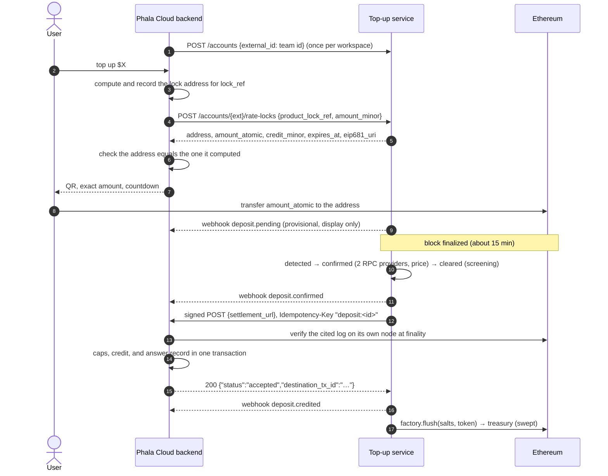

# Integration guide

For the Phala Cloud backend team, who connect Phala Cloud (product slug `phala-cloud`) to this
service. Where this guide and the code disagree, the code wins. The contract is defined by:

- [crates/topup/openapi.json](../crates/topup/openapi.json): every request and response shape,
  also served at `GET /openapi.json`;
- [deploy/product/reference_product](../deploy/product/reference_product): a complete Python
  product that settles staging;
- [architecture.md](architecture.md): the design, especially §11 (settlement), §12 (API, events,
  product UI), §14 (attestation), and §15 (refunds and policies).

The SDK is [sdk/python](../sdk/python): `topup_sdk` (signing, verification, address and deposit-id
recomputation, a retrying client) over `topup_client`, generated from the OpenAPI document. It is
not published to a package index; install it from this repository. Samples below use it; every
step is plain HTTP and ed25519, so any backend language can do the same.

## 1. What the service does

The service gives each Phala Cloud workspace deposit addresses, watches Ethereum for token
transfers to them, waits for finality, prices each deposit, screens it, and then asks Phala Cloud
to credit USD with a signed, idempotent settlement request. Phala Cloud owns the balance: it
verifies the request, checks the cited transfer on its own node, and commits the credit. The
addresses are CREATE2 forwarders that can only pay the treasury; the service sweeps them there in
batches. The default flow is quote first: the user states an amount, receives a locked price, an
exact token amount, and a single-use address, and pays within the window.



## 2. Environments

| | Origin | Chain | Status |
|---|---|---|---|
| Production | `https://crypto-topup-api.phala.com` | Ethereum Mainnet (1) | Domain being set up |
| Staging | `https://crypto-topup-api-staging.phala.com` | Sepolia (11155111) | Domain being set up |

The origin is exact: it is the service's `TOPUP_PUBLIC_ORIGIN`, and every request signature
covers it (§4.1). Staging's route, with its forwarder factory, implementation, and test PHA token
(a `MockERC20` whose `mint(address,uint256)` is public), is
[deploy/config/routes/phala-cloud-sepolia-pha.yaml](../deploy/config/routes/phala-cloud-sepolia-pha.yaml).
Staging's `phala-cloud` product is currently the reference product; switching staging
settlements to Phala Cloud's staging backend is an operator change (§3.2).

## 3. Onboarding

### 3.1 Create the product key

On a machine you control, one key per environment:

```sh
cd sdk/python
uv run --locked topup-sdk keygen --keyid phala-cloud/v1 --seed-out ~/phala-cloud-staging.seed
```

It writes the 32-byte seed as hex to a new mode-0600 file and prints
`{"keyid": "phala-cloud/v1", "public_key": "<base64>"}`. Keep the seed in your secret store;
never send it. Use a distinct key per environment: each deployment records used signatures in its
own database, so a shared key would let a request be replayed against another deployment within
the five-minute window.

### 3.2 Registration (done by the operator)

Send the operator the printed `keyid` and `public_key`, your settlement URL, and your webhook URL
(both public `https`). The operator then:

1. sets `destination.settlement_url` and `destination.product_kid` in the attested route file
   (the only source of both; a route change is a new attested deployment);
2. issues the product with the admin-signed `POST /v1/admin/products {slug, public_key,
   webhook_url}` ([deploy/README.md](../deploy/README.md#product-credentials)).

A repeat with the same values returns the same product; a different key or webhook URL for an
issued slug is refused with `409`, because changing them is a replacement (§3.4).

### 3.3 Pin the service's settlement key

The service signs settlement requests and webhooks with one ed25519 key, `settlement/v1`, derived
inside its confidential VM. Pin it only from verified attestation ([architecture §14](architecture.md#14-configuration-and-deployment)):

```sh
export TOPUP_ORIGIN=https://crypto-topup-api-staging.phala.com
export NONCE="$(openssl rand -hex 32)"
curl -fsS "$TOPUP_ORIGIN/v1/attestation?nonce=$NONCE" > attestation.json
# The official dstack verifier, pinned by digest (Docker): quote, TCB, event log, OS image.
jq '{quote: null, attestation: .quote}' attestation.json |
  deploy/dstack-verifier.sh > verification.json
jq -e --arg app "$APP_ID" --arg compose "$COMPOSE_HASH" \
  --arg report_data "$(jq -r '.report_data' attestation.json)" '
  .details.tcb_status == "UpToDate" and .details.app_info.app_id == $app
  and .details.app_info.compose_hash == $compose
  and .details.report_data == $report_data + ("0" * 64)' verification.json
```

`APP_ID` and `COMPOSE_HASH` are the values the operator gives you for the deployment
([deploy/README.md](../deploy/README.md#attestation-ingress-and-egress) shows how the operator
derives them). Then check that `report_data` binds your nonce and the key:

```python
import json, os
from topup_client.models import AttestationResponse
from topup_sdk import verify_attestation_binding

response = AttestationResponse.from_dict(json.load(open("attestation.json")))
verify_attestation_binding(response, bytes.fromhex(os.environ["NONCE"]))  # raises AttestationError
assert response.keyid == "settlement/v1"
print(response.settlement_pubkey)  # hex; pin it together with the keyid
```

`TopupClient.attestation(nonce)` fetches and runs the same binding check. The binding alone is
worthless without the verifier step: it proves only that the response is self-consistent.

### 3.4 Rotate the product key

The key id is attested in the route and stays the same; a rotation replaces only the public key
the service stores for your slug:

1. Generate a new key under the same key id (§3.1) and send the operator its `public_key`.
2. The operator stores it with the admin-signed `PUT /v1/admin/products/phala-cloud {public_key,
   webhook_url, reason}` ([deploy/README.md](../deploy/README.md#product-credentials)); the same
   call changes your webhook URL.
3. Switch your signer to the new seed.

The cut is immediate: from step 2 the old key gets `401`, and the new key gets `401` before it.
There is no overlap window, because the service verifies a product against one stored key under the
one key id its routes name. Agree a time for step 2 and switch right after it; `TopupClient` does
not retry `401`. For a leaked seed, tell the operator at once: they follow the
[product key compromise runbook](../deploy/runbooks/product-key-compromise.md).

## 4. Calling the API

### 4.1 Request signing

Every product request carries an RFC 9421 HTTP Message Signature with your ed25519 key:

- covered components, in order: `"@method"`, `"@target-uri"`, `"content-digest"`, plus
  `"idempotency-key"` when that header is sent (the product API does not need it);
- `Content-Digest: sha-256=:<base64>:` over the exact body bytes, also for an empty body;
- parameters `created` (Unix seconds) and `keyid` (`phala-cloud/v1`), optionally
  `alg="ed25519"` and `nonce`, serialized as RFC 8941 structured fields;
- `@target-uri` is `scheme://host[:port]/path?query` of the public origin in §2, exactly as sent.
  The service rebuilds it from its configured origin and ignores `Host` and `X-Forwarded-*`, so a
  correctly signed request to any other URL gets `401`.

`created` must be within five minutes of the service clock. Each signature is accepted once; a
reused one gets `409 signature_replayed`. ed25519 is deterministic, so the SDK adds a random
128-bit `nonce` to every signature. Test vectors:
[rfc9421-python-signer.json](../crates/topup/tests/fixtures/rfc9421-python-signer.json) (verified
by the Rust tests; the Python signer reproduces them byte for byte).

```python
from topup_sdk import RequestSigner, TopupClient

signer = RequestSigner.from_seed_file("phala-cloud/v1", "/secrets/phala-cloud-staging.seed")
with TopupClient("https://crypto-topup-api-staging.phala.com", "phala-cloud", signer) as client:
    client.register_account("team-42")
```

### 4.2 Idempotency and retries

Every product operation is idempotent on a natural key, so a retry with a fresh signature is
always safe:

| Operation | Idempotent on |
|---|---|
| register account, create or get the persistent address | `(product, external_id)` |
| rotate the persistent address | `from_version` |
| create a rate lock | `product_lock_ref`; the same ref with a different amount is `409 idempotency_mismatch` |
| cancel a rate lock | `product_lock_ref` |
| request a refund | `(deposit, to_address, amount)` |

`TopupClient` retries transport errors, `429`, `500`, `502`, `503`, `504`, and
`409 signature_replayed`, re-signing each attempt, up to 4 attempts with exponential backoff from
0.5 s.

### 4.3 Endpoints

Paths are under `/v1/products/phala-cloud`; `{ext}` is your workspace id (1 to 255 bytes). A
request for another product's resources is refused.

| Method and path | Purpose | `TopupClient` |
|---|---|---|
| `POST /accounts` | Register a workspace. Optional: creating a quote or an address creates it. | `register_account` |
| `POST /accounts/{ext}/deposit-address`, `GET` same | The persistent address (created at version 1 on first `POST`). | `create_deposit_address`, `get_deposit_address` |
| `POST /accounts/{ext}/deposit-address/rotate` | New version; older addresses stay valid and watched. | `rotate_deposit_address` |
| `POST /accounts/{ext}/rate-locks` | Quote: `{product_lock_ref, amount_minor \| amount_atomic}`. | `create_rate_lock` |
| `GET /accounts/{ext}/rate-locks/{ref}` | Resume a checkout; `status`, `remaining_seconds`, and the seen `payment`. | `get_rate_lock` |
| `DELETE /accounts/{ext}/rate-locks/{ref}` | Cancel an unpaid lock; later payments credit at spot. | `cancel_rate_lock` |
| `GET /accounts/{ext}/deposits` | Final deposits, newest first, paged (`state`, `from`, `to`, `cursor`). | `list_deposits` |
| `GET /accounts/{ext}/pending-deposits` | Transfers to persistent addresses seen above `finalized`; display only. | `list_pending_deposits` |
| `GET /deposits/{id}` | One deposit. | `get_deposit` |
| `GET /deposits?tx_hash= \| address= \| lock_ref=` | Support lookup with each deposit's transition `timeline` and webhook `events`. | `lookup_deposits` |
| `GET /accounts/{ext}/limits` | Route bounds and open rate-lock exposure. | `get_limits` |
| `POST /accounts/{ext}/pause`, `/resume` `{scopes}` | Account kill switch (`quotes`, `addresses`, `settlement`, `flush`, `refunds`). | — |
| `POST /deposits/{id}/refund-requests` `{to_address, amount}` | Refund request for finance (§7). | `request_refund` |
| `GET /v1/attestation?nonce=` | Settlement key evidence (§3.3); unauthenticated. | `attestation` |

Amounts are decimal strings: `amount_atomic` in token base units, `*_minor` in US cents.
`price_scaled` has scale 8. Rate-lock semantics (spread, tolerance, expiry by finalized chain
time, exposure caps) are [architecture §9](architecture.md#9-quote-first-deposits-rate-locks); the
pending view is [§12](architecture.md#12-api-and-events).

**Recompute and record every address before you show it.** Responses carry `salt_inputs`;
`topup_sdk.persistent_salt`, `lock_salt`, and `forwarder_address` recompute the address from the
route's factory and implementation. Record each lock address against its workspace *before*
calling `rate-locks` (the reference product's `create_quote`): a late or wrong-amount payment
settles with `lock_ref: null`, so the only way to tie that address to the workspace in §5 is your
own record.

### 4.4 Errors

Errors are `{"error": {"code", "message"}}`. Codes are stable; messages are not.

| Status | `code` | Meaning |
|---|---|---|
| 400 | `invalid_request` | Malformed input. Do not retry unchanged. |
| 401 | `unauthorized` | Signature failed: wrong origin, clock outside five minutes, wrong key, or body changed after signing. |
| 404 | `not_found` | Unknown or foreign resource; register the account first. |
| 409 | `signature_replayed` | Re-sign and retry. |
| 409 | `idempotency_mismatch` | Same `product_lock_ref`, different amount. |
| 409 | `exposure_cap_exceeded` | Open rate-lock exposure cap (account, product, or global). |
| 409 | `pending_payment`, `window_closed` | Lock cancel refused: its address already received a payment, or its window closed. |
| 409 | `conflict` | Other state conflicts, for example a refund for an ineligible deposit or above the remaining amount. |
| 423 | `paused`, `chain_frozen` | Scope paused, or chain frozen pending reconciliation; show "temporarily unavailable". |
| 429 | `rate_limited` | Rate-lock creation limit per account. |
| 503 | `unavailable` | Temporarily unavailable (for example no fresh price); retry. |
| 500 | `internal_error` | Retry with backoff. |

## 5. The settlement endpoint you implement

### 5.1 Request

```http
POST {settlement_url}
Content-Type: application/json
Content-Digest: sha-256=:…:
Idempotency-Key: "deposit:3f1c…"
Signature-Input: sig1=("@method" "@target-uri" "content-digest" "idempotency-key");created=…;keyid="settlement/v1";…
Signature: sig1=:…:

{"version": 1, "idempotency_key": "deposit:3f1c…", "account_id": "<external_id>",
 "unit": "USD", "amount_minor": "1234", "source": "crypto_deposit",
 "evidence": {"chain_id": 1, "asset_contract": "0x…", "route": "…", "route_version": 1,
              "tx_hash": "0x…", "log_index": 12, "to": "0x<forwarder>", "amount_atomic": "…",
              "price_scaled": "…", "price_scale": 8, "valuation_at": "…", "lock_ref": null}}
```

Addresses and hashes are lowercase hex. `lock_ref` is set only when the deposit consumed a lock
and is valued at the lock price. A resend keeps the payload byte-identical and re-signs with a
new `created`. The service also sends `GET {settlement_url}/deposit:<uuid>`, signed the same way
over an empty body with the same `Idempotency-Key`, before any resend and after a restore.
Requests time out after 30 s; redirects are not followed; response bodies over 64 KiB are
treated as outside the contract.

### 5.2 Verify the signature

```python
from topup_sdk import SignatureError, deposit_id, load_public_key, verify_request

SETTLEMENT_KEY = load_public_key("<pinned settlement_pubkey hex>")
PUBLIC_ORIGIN = "https://<your public host>"  # from configuration, never from Host

def verify(method: str, path_and_query: str, headers: dict[str, str], body: bytes) -> str | None:
    try:
        verified = verify_request(
            method=method, target_uri=PUBLIC_ORIGIN + path_and_query, headers=headers,
            body=body, public_key=SETTLEMENT_KEY, keyid="settlement/v1",
            require_idempotency_key=True,
        )
    except SignatureError:
        return None  # answer 401
    return verified.idempotency_key  # unquoted, e.g. "deposit:3f1c…"
```

Rust test vectors of the service's own signer (a POST and a GET by key):
[rfc9421-rust-settlement.json](../crates/adapters/tests/fixtures/rfc9421-rust-settlement.json).

### 5.3 The six obligations

| # | Obligation | Why |
|---|---|---|
| 1 | Verify the signature against the pinned `(keyid, public key)`, covering `idempotency-key`; reject a stale `created` or a changed body with `401`. | Only the attested service may credit. |
| 2 | Keep an idempotency record per key forever; a replay returns the stored answer; the same key with a different payload returns `422`. | The service resends the same key after timeouts, outages, and restores from backup, at any age. An expired record means a second credit. |
| 3 | Commit the record and the credit in one transaction before answering `accepted`; under concurrent identical requests credit once (others may get `409`). | An `accepted` without a durable credit loses money; a credit without a record double-credits on the next resend. |
| 4 | Enforce your own per-deposit and per-period caps, the period check atomic with the credit. | Bounds what a compromised service could forge. |
| 5 | Verify the cited log on your own RPC: in a finalized block at `tx_hash`/`log_index`, emitted by the approved `asset_contract`, `to` an address you computed for `account_id`, exactly `amount_atomic`. | The service's evidence is a claim; your node's finalized chain is the fact. |
| 6 | Recompute `deposit_id = uuid_v5(NS, "{chain_id}:{tx_hash}:{log_index}")` (`topup_sdk.deposit_id`) and require `idempotency_key == "deposit:" + deposit_id`. | One chain event can never be credited under a second key. |

For obligation 5, only facts that cannot change once final may become a stored rejection: a
reverted transaction, or a finalized log that is missing or has another emitter, recipient, or
amount. A failed RPC call, a missing receipt, or a block your node has not finalized yet is
transient: store nothing and answer `503`.
The service settles only after two providers saw finality, so your node lagging is the common
case, not an error.

For Phala Cloud, [architecture §11](architecture.md#11-settlement-contract) fixes the ledger
mapping: find-or-create an `Order` (`provider = crypto_topup`, `order_flow_code =
'crypto-top-up'`, `provider_order_id` = the key, unique per flow), the credit transaction with
`funding_source = crypto:<asset>:<chain>`, and `complete_order_payment` in the same transaction;
`destination_tx_id` is the credit transaction id. The reference product's
[settlement.py](../deploy/product/reference_product/settlement.py) is this, on SQLite.

### 5.4 Answers

| Your answer | The service |
|---|---|
| `200 {"status":"accepted","destination_tx_id":"…"}` | Marks the deposit `credited`, adopts the payload's `amount_minor` and pricing, sends `deposit.credited`. |
| `200 {"status":"processing"}` | Stays `cleared` and polls `GET` by key later. Keep the record retrievable. |
| `200 {"status":"rejected","reason":"…"}` | Marks the deposit `rejected(product_refused)` and sends `deposit.rejected` with your `reason` as `product_reason`. The funds become refundable (§7). Use it only for durable business refusals: closed or unknown workspace, cap exceeded, evidence proven wrong at finality. |
| `409` | Treats it as in progress: stays, `GET`s later. |
| `422` | Records a payload mismatch and alerts; adopts your stored answer from `GET` if there is one and never resends the payload ([runbook](../deploy/runbooks/payload-mismatch-422.md)). |
| `503` or anything else (timeout, other status, `accepted` without `destination_tx_id`, `rejected` without `reason`) | Unknown: keeps the first 4 KiB of the body as retry evidence (the reference answers `{"retry_reason": "…"}`; with no logs in the service, this is your diagnostic), retries with jittered backoff (at most 1 h), `GET`s by key, and resends if you answer `404`. Alerts on age. |

`GET {settlement_url}/{key}` returns `200` with `status`, `destination_tx_id` or `reason` as
above, and `payload`: the original payload you accepted. The service checks that its
`idempotency_key`, `account_id`, `chain_id`, `tx_hash`, and `log_index` match the deposit. Answer
an unknown key with `404`, the only answer on which the service resends; any other answer, such
as `200 {"status":"unknown"}`, makes it poll again without ever resending.

## 6. Webhooks

Standard Webhooks, asymmetric `v1a` scheme, signed with the same `settlement/v1` key, `POST`ed to
the registered webhook URL:

```text
webhook-id: <event UUID>
webhook-timestamp: <Unix seconds of this attempt>
webhook-signature: v1a,<base64 ed25519 over "{webhook-id}.{webhook-timestamp}.{raw body}">

{"event_id": "<same UUID>", "type": "deposit.credited", "created_at": "…", "data": {…}}
```

```python
from topup_sdk import SignatureError, verify_webhook

def handle_webhook(headers: dict[str, str], raw_body: bytes) -> int:
    try:
        event = verify_webhook(headers, raw_body, SETTLEMENT_KEY)  # 300 s tolerance by default
    except SignatureError:
        return 401
    store_once(event.id, event.type, event.data)  # durable; a duplicate id is a no-op
    return 204
```

- Verify over the raw body bytes, never re-serialized JSON. Several space-separated signatures
  may appear during a key rotation; accept when one verifies.
- Answer `2xx` only after the event is durably stored. Anything else, or no answer within 20 s,
  is retried until delivered, with full-jitter backoff whose ceiling starts at 30 s and
  doubles to 1 h.
- Deduplicate by `webhook-id`; delivery is at least once.
- There is no ordering: `deposit.pending` can arrive after `deposit.credited`. Act on fetched
  state (the deposit or lock), never on event order.
- Events never move balances. Credit only from the settlement request.
- Ignore unknown event types and unknown fields.
- A lost event can be replayed by the operator with the admin-signed
  `POST /v1/admin/outbox/{event_id}/replay {reason}`: same id, same payload. The support lookup
  (`GET /deposits?tx_hash=…`) lists each deposit's `events` with `delivered_at`.

| Type | When | `data` |
|---|---|---|
| `deposit.pending` | Head scan first sees a routed-token transfer to a watched address, above `finalized`; at most once per chain event. | `provisional: true`, `product_id`, `external_id`, `deposit_id`, `chain_id`, `tx_hash`, `log_index`, `block_number`, `address`, `product_lock_ref`, `asset_contract`, `from_address`, `amount_atomic` |
| `deposit.confirmed` | Final, priced. | `product_id`, `deposit_id`, `chain_id`, `route`, `route_version`, `tx_hash`, `log_index`, `amount_atomic`, `price_scaled`, `price_scale`, `price_source` (`spot` or `lock`), `credit_minor`, `valuation_at` |
| `deposit.credited` | You answered `accepted`. | `product_id`, `deposit_id`, `chain_id`, `state`, `route`, `destination_tx_id`, `amount_minor`, `unit`, `price_scaled`, `price_scale`, `valuation_at` |
| `deposit.rejected` | Rejected (§7). | `product_id`, `deposit_id`, `chain_id`, `state`, `route` (null without a route), `reason`, and `product_reason` for `product_refused` |
| `deposit.refunded` | A refund transaction is final. | `product_id`, `deposit_id`, `refund_id`, `chain_id`, `asset_contract`, `amount_atomic`, `to_address`, `tx_hash` |
| `rate_lock.expired` | The finalized chain passed `expires_at` with the lock unconsumed. | `product_id`, `external_id`, `product_lock_ref`, `route`, `chain_id`, `address`, `amount_atomic`, `credit_minor`, `expires_at` |

Only `deposit.pending` and `rate_lock.expired` name the workspace; map the others through the
deposit's `address`, which you recorded (§4.3).

## 7. Deposit outcomes

States: `detected → confirmed → cleared → credited → swept`, or `rejected` with a `reason`
([architecture §7](architecture.md#7-states-and-pump)). Nothing is reported as a deposit before
finality. The staging deposit driver asserts these outcomes on Sepolia
([deploy/README.md](../deploy/README.md#abnormal-paths)); the sandbox scenarios assert them
locally ([deploy/sandbox/README.md](../deploy/sandbox/README.md#scenarios)).

| Payment | Outcome visible to Phala Cloud |
|---|---|
| Exact lock amount, in time (within `lock_tolerance_bps`) | Lock `consumed`; credited exactly the quoted `credit_minor`; settlement `lock_ref` set. |
| Underpayment beyond tolerance | Credited at spot for what arrived; lock not consumed and later `rate_lock.expired`; cancel refused with `409 pending_payment`. Payments are not accumulated against one lock: offer a re-quote for the shortfall. |
| Overpayment beyond tolerance | Credited at spot for the full amount; lock not consumed. |
| After the window (mined after `expires_at`) | `rate_lock.expired`, then credited at spot. A payment mined inside the window stays at the lock price even if final later; the lock stays `open` with `remaining_seconds = 0` until then. |
| Second payment to a lock address, or to a cancelled lock | Credited at spot. |
| Persistent address, any amount | Credited at spot at finality. |
| Token without a route | After finality `rejected(unsupported_asset)`; you are never asked to settle; the tokens stay in the forwarder. |
| Below `min_credit_minor` | `rejected(below_minimum)`. |
| Outside `min_deposit_atomic`..`max_deposit_atomic`, or credit overflow | `rejected(out_of_bounds)` or `rejected(out_of_range)`. |
| Sanctioned sender | `rejected(sanctioned)`; not refundable. |
| You answered `rejected` (for example a closed workspace) | `rejected(product_refused)`. |

User-facing copy per state and reason, including what never to show, is in
[architecture §12, product UI](architecture.md#customer-experience-obligations-product-ui).

**Refunds.** A rejected deposit is refundable unless the reason is `sanctioned` or its amount is
below the route's `min_refund_atomic`. A credited deposit is refunded only when you ask, for a
credit you did not apply or have reversed
([architecture §15](architecture.md#15-operating-policies)). Ask the user for a destination
address they control (never default to `from_address`, which may be an exchange), then
`POST /deposits/{id}/refund-requests {to_address, amount}` (`amount` in atomic units; at most the
unrefunded remainder). The request is `requested`; finance approves and executes it from the
treasury Safe; the service confirms the transaction on chain and sends `deposit.refunded`.
Ineligible deposits get `409`, a paused `refunds` scope `423`.

## 8. Testing and go-live

### 8.1 Testing your endpoint

The settlement endpoint is being replaced by webhook fulfillment
([design](design/stripe-style-integration.md)), and its conformance suite was removed with it.
Test the webhook receiver with `topup-sdk send-test-event`
([sdk/python/README.md](../sdk/python/README.md)): your test instance pins the public key of a test
seed in place of the service key; the command sends a signed event, its duplicate, and a forged
copy, and expects `2xx`, `2xx`, and `4xx`. The reference product's tests
([deploy/product/tests](../deploy/product/tests)) are the worked example of the settlement
obligations until then.

### 8.2 Staging

Staging runs on Sepolia with the test PHA token (§2). Until Phala Cloud's staging backend is
registered there, the reference product settles staging; it is the model for a complete product
(settlement, webhooks, recording quote addresses before quoting). Once your endpoint is
registered, pay test quotes with minted test PHA and Sepolia ETH for gas, and play the abnormal
payments of §7. Sepolia finality takes about 15 minutes per deposit.

### 8.3 Go-live checklist

- [ ] `topup-sdk send-test-event` passes against your production code path.
- [ ] Settlement endpoint answers `404` for unknown keys, `503` for transient chain reads, and
      its idempotency records have no expiry.
- [ ] Your RPC for obligation 5 is your own node or provider on the route's chain, and its
      `finalized` block keeps up (a lagging node delays every settlement with `503`).
- [ ] Per-deposit and per-period caps configured and agreed with finance.
- [ ] Production product key generated for production only; seed in the secret store; public key
      and key id sent to the operator; settlement and webhook URLs agreed.
- [ ] Settlement key pinned from verified attestation of production (§3.3), with the keyid.
- [ ] Every address recomputed before display; lock addresses recorded before quoting.
- [ ] Webhook receiver verifies, stores by `webhook-id`, and drives UI from fetched state.
- [ ] Quote, waiting, history, and exception UI per
      [architecture §12](architecture.md#customer-experience-obligations-product-ui); refund
      request flow with a user-supplied address.
- [ ] Alerts on your side: settlement `401` (key or URL drift), sustained `503` answers, webhook
      verification failures.
- [ ] One quote-first deposit credited end to end on staging.

## 9. Versioning and deprecation

### API

- The path prefix carries the major version (`/v1`). Within it every change is backward
  compatible: new endpoints, optional request fields, response fields, error codes, and event
  types. Ignore unknown response fields and event types.
- A breaking change needs a new prefix (`/v2`); the old one keeps working for the deprecation
  window.
- `info.version` in `openapi.json` is the service release (the Cargo workspace version), SemVer
  on the published contract: MAJOR with a new prefix, MINOR when the document gains anything,
  PATCH otherwise.
- Settlement payloads carry `"version": 1`; refuse versions you do not implement. A new payload
  version is sent only to products that opted in.
- Integrator-visible API changes are recorded in [CHANGELOG.md](../CHANGELOG.md).

### SDK

- `crypto-topup-sdk` follows SemVer independently: MAJOR for a breaking change to the public
  Python API (`topup_sdk` exports, generated `topup_client` names) or a new API major version;
  MINOR for regeneration against an additive OpenAPI change or new helpers; PATCH for fixes.
- Each release records the `info.version` it was generated from.
- Only `make -C sdk/python generate` changes `src/topup_client`; CI fails if regeneration is not a
  no-op, so a PR that changes `openapi.json` regenerates the client in the same PR.

### Deprecation

- Anything integrators use is removed only after at least 90 days from the announcement:
  endpoints, fields, error codes, event types and fields, settlement payload versions, SDK public
  functions and parameters, and API major versions.
- Announcing means, in one release: `deprecated: true` in OpenAPI (and a `DeprecationWarning` from
  the SDK), a `Deprecated` changelog entry with the earliest removal date, and notice to every
  registered product contact.
- Removal happens in the sandbox first, in production no earlier than the announced date. Only a
  security fix may shorten the window, and its changelog entry says why.

### SDK changelog rules

[sdk/python/CHANGELOG.md](../sdk/python/CHANGELOG.md) follows Keep a Changelog: every PR that
changes `openapi.json`, `topup_sdk`, the generated client, or the signing profile adds an entry
under `Unreleased` (`Added`, `Changed`, `Deprecated`, `Removed`, `Fixed`, `Security`); a release
heading carries the SDK version, date, and OpenAPI `info.version`; `Deprecated` names the
replacement and earliest removal date; `Removed` links the deprecating release; breaking changes
come first.

## 10. SDK development

```sh
make -C sdk/python sync      # uv sync --locked --all-groups
make -C sdk/python check     # ruff, mypy --strict, pytest, and the regeneration no-op check
make -C sdk/python generate  # after an openapi.json change
```

Regenerate the signing vectors only after an intentional profile change, then rerun the Rust
test:

```sh
(cd sdk/python && uv run --locked python -m tests.vectors)
cargo test -p topup --lib api::auth
```

Also in this repository: [sdk/examples/phala_cloud_integration.py](../sdk/examples/phala_cloud_integration.py)
(pin, register, recompute, quote, verify) and the local sandbox, `make sandbox-local`
([deploy/sandbox/README.md](../deploy/sandbox/README.md)).
