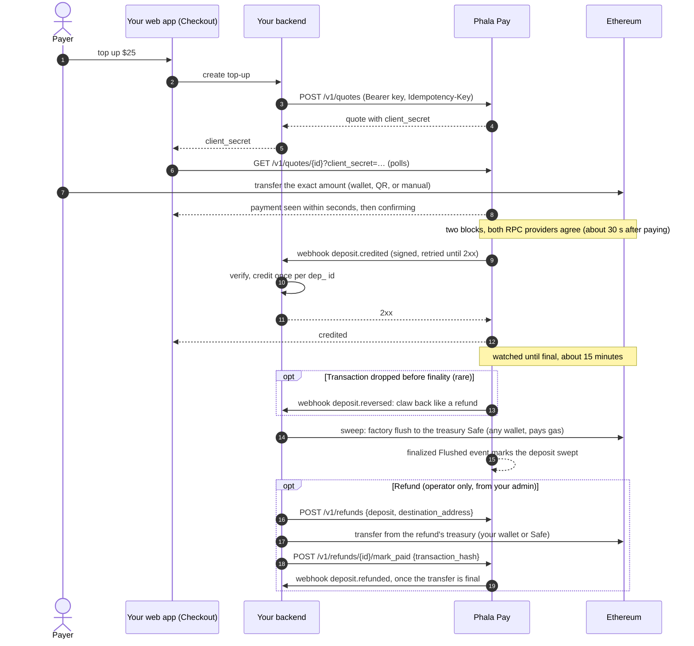

# Integration guide

For the Phala Cloud backend team, who connect Phala Cloud (a Phala Pay account, `acct_…`) to this
service. Where this guide and the code disagree, the code wins. The contract is defined by:

- [crates/topup/openapi.json](../crates/topup/openapi.json): every request and response shape,
  also served at `GET /openapi.json`;
- [deploy/product/reference_product](../deploy/product/reference_product): a complete Python
  product, the one staging credits today;
- [architecture.md](architecture.md): the design, especially §11 (the fulfillment webhook), §12
  (API, events, product UI), §14 (attestation), and §15 (refunds and policies).

Phala Pay has two SDKs, both in this repository:

- [sdk/python](../sdk/python), `phala-pay` (import `phala_pay`): the backend client,
  `PhalaPay(...).quotes.create(...)` and `.webhooks.construct_event(...)` in Stripe's shape, over
  `topup_sdk` (signing, verification, address recomputation, `topup-sdk send-test-event`) and
  `topup_client`, generated from the OpenAPI document.
- [sdk/js](../sdk/js), `@phala/pay`: the browser checkout, `<Checkout>` and `<DepositAddress>`
  for React and a framework-agnostic core, and `@phala/pay/server` (webhook `constructEvent`,
  address recomputation, offline `flushTransaction` and `safeBatch`), which never takes a secret
  key.

Samples below use them; every step is plain HTTP and ed25519, so any backend language can do the
same.

## Quickstart

The whole integration is three pieces, as with Stripe's Payment Element: the backend creates a
quote, the browser renders the checkout with the quote's client secret, and the webhook fulfils.

**Install.** `@phala/pay` is on npm (0.1.2); `phala-pay` installs from this repository until its
first PyPI release:

```sh
npm install @phala/pay viem
uv add "phala-pay @ git+https://github.com/Phala-Network/phala-pay#subdirectory=sdk/python"
```

Some resolvers drop the `#subdirectory=` fragment (PDM delegating resolution to uv, for
example) and fail to find the package; install it with `uv` or `pip` directly, and switch to
`phala-pay` from PyPI once it is released.

**Configure.** The operator creates your account and sends your contact its first secret key,
`ppay_sk_test_…` (§5.1); roll it at once and keep the new key in your secret store. Pin your
account's webhook key for the mode from its attestation (§5.3). Set your treasury on each chain
you accept (§1.6): payments go only there, and quotes answer `409 treasury_not_set` until it is.

**1. Backend: create a quote, return its client secret.** Only the create response carries
`client_secret`; repeating the call with the same `idempotency_key` within 24 hours returns the
same response, secret included, which is how a reloaded page resumes.

```python
from phala_pay import PhalaPay

# PHALA_PAY_SECRET_KEY is your secret key, "ppay_sk_test_…" or "ppay_sk_live_…". FORWARDER is the
# (factory, implementation) pair pinned from the attested deployment (§5.5): every quote's address
# is recomputed from it before it is returned, and one you cannot derive raises.
pay = PhalaPay(api_base=PHALA_PAY_API_BASE, api_key=PHALA_PAY_SECRET_KEY, forwarder=FORWARDER)

@app.post("/topups")
def create_topup(body: TopupRequest, team: Team = Depends(current_team)) -> dict[str, str]:
    quote = pay.quotes.create(
        client_reference_id=team.id, amount=body.amount, chain_id=11155111, asset="pha",
        idempotency_key=body.order_id,
    )
    return {"client_secret": quote.client_secret, "expected_address": quote.address}
```

**2. Frontend: render the checkout.** The component reads the quote's public view with the client
secret (no signature, CORS `*`) and offers a browser wallet (EIP-6963), a QR code (EIP-681), and
manual payment, with live status until the payment is credited.

```tsx
"use client";
import { Checkout } from "@phala/pay/react";

<Checkout
  clientSecret={clientSecret}
  expectedAddress={expectedAddress}
  apiBase={PHALA_PAY_API_BASE}
  onSuccess={() => router.refresh()}
  onExpire={() => startOver()}
/>
```

`expectedAddress` is required: it is the address your backend recomputed, and the checkout fails
closed, showing nothing to pay, when the quote it reads names another one. Its wallet button reads
"Pay with crypto" (`buttonText`); `appearance` themes it to match the page, a test-mode quote says
"Test mode", and `onChange` reports every status change (§1.2). Without React,
`new PhalaPay({ apiBase }).checkout(clientSecret, { expectedAddress })` gives the same live
status.

**3. Webhook: verify and fulfil once.** Credit `amount` cents to `client_reference_id` once per
deposit id,
commit, then answer `2xx`; `onSuccess` in the browser is display only (§2).

```python
from phala_pay import SignatureVerificationError

@app.post("/webhooks/phala-pay")
async def webhook(request: Request) -> Response:
    try:
        event = pay.webhooks.construct_event(
            await request.body(), request.headers, WEBHOOK_KEYS, ACCOUNT, expected_livemode=False
        )
    except (SignatureVerificationError, ValueError):
        return Response(status_code=400)
    if event.type == "deposit.credited":
        credit_once(event.deposit.id, event.deposit.client_reference_id, event.deposit.amount)
    elif event.type in ("deposit.reversed", "deposit.refunded"):
        claw_back_once(event.id, event.deposit.id)
    return Response(status_code=200)
```

A Node backend verifies the same way with `constructEvent(rawBody, headers, WEBHOOK_KEYS,
{ expectedAccount: ACCOUNT, expectedLivemode: false })` from `@phala/pay/server`.
[sdk/examples/fastapi_app.py](../sdk/examples/fastapi_app.py) is this backend in full, with an
idempotent SQLite ledger and tests; the staging reference product serves the Phala Pay demo, a
cloud console's billing page, at `/demo/`.

## 1. Quotes

### 1.1 How it works

A quote is the way to pay a known amount, as a PaymentIntent is in Stripe: the user states an
amount in dollars and receives a locked price, an exact token amount, and a single-use address to
pay within the window. For top-ups of any amount at any time, give the customer a persistent
deposit address instead (§1.5). The service watches Ethereum for transfers to its addresses, waits for the
route's confirmation (two blocks on Ethereum), prices each deposit, and screens it. A deposit that
passes is credited, typically **about 30 seconds after paying**, and the service tells Phala Cloud
with a signed `deposit.credited` webhook. It keeps watching the deposit until it is final (about
15 minutes on Ethereum); in the rare case that the payment's transaction is dropped from the
chain before then, the deposit is reversed and a signed `deposit.reversed` tells you to claw the
credit back, exactly as for a refund (§2.3). Phala Cloud owns the balance: it
verifies the signature and credits the deposit once, the pattern of Stripe Checkout fulfillment
([docs.stripe.com/checkout/fulfillment](https://docs.stripe.com/checkout/fulfillment)). The
addresses are CREATE2 forwarders that can only pay your treasury; you sweep them there when you
choose, from your own wallet or Safe (§1.7).



### 1.2 Creating and showing a quote

Read `GET /v1/config` (`pay.config.retrieve()`) for what the page shows instead of hardcoding:
the payable assets (chain, asset code, contract, decimals), the minimum `amount` in cents
(`min_amount`), the maximum deposit in token units (`max_deposit_atomic`), the per-account cap on
open quotes in cents (`max_open_amount_per_account`), the refund floor, the quote window, spread,
and tolerance, the route's `confirmations` (`"2"` on Ethereum: the payment's block and one more),
the typical credit time (`typical_credit_seconds`, 30), and the typical finality time
(`typical_finality_seconds`, 900). Quotes are priced at
`spot / (1 + quote_spread_bps / 10 000)`; a payment valued at spot (late, wrong amount, second
payment) carries no spread; network and exchange fees are the payer's; sweep gas is yours, paid
when you sweep, and never reduces a credit.

`POST /v1/quotes {client_reference_id, amount, currency: "usd", chain_id, asset, metadata?}` with an
`Idempotency-Key` returns the quote:

```json
{
  "id": "qt_0c6e1d0a9b3f4c2e8d7a6b5c4d3e2f10", "object": "quote", "livemode": false,
  "client_reference_id": "team-42", "treasury": "0x…", "amount": 2500, "currency": "usd", "chain_id": 11155111, "asset": "pha",
  "amount_atomic": "100502600000000000000", "exchange_rate": "0.24875621",
  "address": "0x…", "payment_uri": "ethereum:0x…@11155111/transfer?address=0x…&uint256=…",
  "status": "open", "expires_at": 1790410500, "created": 1790409600,
  "payment": null, "deposit": null, "client_secret": "qt_…_secret_…",
  "metadata": {"order_id": "6735"}
}
```

- `client_reference_id` is your customer's id, such as your workspace id (1 to 200 characters,
  Stripe Checkout's name); the customer is created by its first quote or deposit address.
- `treasury` is the treasury the quote's address pays: your treasury of the chain when it was
  created (§1.6).
- `amount` is an integer in US cents; `amount_atomic` is the exact token amount to pay, a decimal
  string in base units, rounded up to four token decimals (the route's `quote.amount_decimals`) so
  the payer reads and types a short amount such as `100.5026 PHA`; show every digit of it. The
  rounding is the payer's, below 0.0001 token, and the credit stays exactly `amount`;
  `exchange_rate` is the locked price in USD per token with 8 decimal
  places; times are Unix seconds.
- `status` is `open`, `complete` (a matching payment consumed it), `expired`, or `canceled`. A
  quote stays `open` past `expires_at` until the finalized chain passes it, so a payment mined in
  time is never reported as expired: hide the address once `expires_at` has passed and offer a
  new quote.
- `payment` is what the waiting screen shows once a transfer is seen on chain, display only:
  `status` (`seen` once in a block, `recorded` once it is a deposit at the route's
  confirmation), `chain_id`, `asset`, `tx_hash`, `amount_atomic`,
  `confirmations` and `estimated_final_at` while `seen`, `matches_quote` (credited at the quoted
  price when true), and the `dep_` id it has or will have. A seen payment can disappear in a
  reorg and is never a credit.
- `deposit` is the deposit that completed the quote (`expand[]=deposit` returns it whole).
- `metadata` holds your own key/value pairs, such as your order id; the deposit that pays the
  quote starts with a copy (§1.4).
- `GET /v1/quotes/{id}` resumes a checkout; `POST /v1/quotes/{id}/cancel` cancels an unpaid
  quote, after which any payment to its address is credited at spot.
- A quote above the remaining open exposure fails with `409 exposure_cap_exceeded`; its message
  states what is left.

Validate the amount against `/v1/config` before creating the quote, and map a refused creation
(`ApiError.code` in Python) to a message the user can act on; never show the service's message
verbatim:

| `code` | Tell the user |
|---|---|
| `amount_too_small` (400) | The minimum top-up is `min_amount`. |
| `amount_too_large` (400) | The amount is above the maximum for one payment; split it. |
| `exposure_cap_exceeded` (409) | Too many unpaid quotes are open; pay or wait for one to expire, or enter a smaller amount. |
| `paused`, `chain_frozen` (409) | Crypto top-ups are temporarily unavailable. |
| `unavailable` (503), `rate_limit` (429) | Try again in a minute. |

Semantics (spread, tolerance, expiry by finalized chain time, exposure caps) are
[architecture §9](architecture.md#9-quotes).

**Recompute every address before you show it.** A quote's address salt is
`keccak256(abi.encode(account, client_reference_id, "lock", quote_id))` with `account` your
`acct_` id, and the address is the factory's `CREATE2` clone of the implementation over the
quote's `treasury` and that salt. `PhalaPay` requires the pinned `forwarder=(factory,
implementation)`, recomputes every quote, and raises `AddressMismatchError`, so a user never pays
an address you did not derive; `treasuries={chain_id: treasury}` additionally refuses a quote over
any treasury but yours. Pass the recomputed `address` to the page as `<Checkout expectedAddress>`,
which fails closed on any other. You need no address records of your own to credit:
`deposit.credited` carries the deposit, which names the customer (`client_reference_id`) and the
quote (`quote`), also for a late or wrong-amount payment.

**The payer's page.** Hand the quote's `client_secret` to the paying customer's page only, and
do not log it. The page reads `GET /v1/quotes/{id}?client_secret=…` without an API key, from any
origin, as Stripe.js reads a PaymentIntent: `{id, object, livemode, status, amount, currency,
asset, decimals, chain_id, amount_atomic, address, payment_uri, expires_at, payment_status,
confirmations}`, where `payment_status` is `none`, `seen`, `confirming` (at the route's
confirmation, being valued and screened), `credited`, `rejected` (contact support), or `reversed`
(the credited payment's transaction left the chain before finality: it did not happen). It
carries no account, price, deposit id,
or transaction hash, and is rate-limited per quote. Only `POST /v1/quotes` returns the secret; a
repeat with the same `Idempotency-Key` within 24 hours returns the same response, secret included.
`@phala/pay`'s `<Checkout>` is this page.

**Resume a checkout.** Keep the quote's `client_secret` in the browser (for example
`localStorage`, keyed by the signed-in account) until the checkout reaches `credited`, `expired`,
or `canceled`, or reports `error`. A payer who closes
the tab after paying then reopens the page on the same quote's progress instead of an empty form,
and does not pay twice.

**Drive the page from the checkout.** `<Checkout onChange>` is called once per status change with
`{ status, quote, error }`, like Stripe Elements' `onChange`. Hide your own "new payment" or
amount controls while the status is `seen` or `confirming`, so that a waiting payer does not
start a second payment. While waiting, tell the payer that the payment is credited in about 30
seconds (`typical_credit_seconds`), that they can close the page, and that the credit arrives
automatically.

**Theme it.** `appearance` takes a `theme` (`light` or `dark`) and `variables` named as in Stripe's
Appearance API: `colorPrimary`, `accessibleColorOnColorPrimary` (text on the primary color; set a
dark one with a light brand color), `colorBackground`, `colorText`, `colorTextSecondary`,
`colorBorder`, `colorDanger`, `colorSuccess`, `fontFamily`, `borderRadius`
([sdk/js/README.md](../sdk/js/README.md#appearance)).

```tsx
<Checkout
  clientSecret={clientSecret}
  expectedAddress={expectedAddress}
  apiBase={PHALA_PAY_API_BASE}
  appearance={{ theme: "dark", variables: { colorPrimary: "#cdfa50", accessibleColorOnColorPrimary: "#161616" } }}
  onChange={({ status }) => setPaymentInFlight(status === "seen" || status === "confirming")}
  onSuccess={() => { forgetClientSecret(account.id); router.refresh(); }}
  onExpire={() => forgetClientSecret(account.id)}
/>
```

### 1.3 Payment outcomes

A deposit's `status` is `pending` (recorded at the route's confirmation and being valued and
screened, or held while `settlement` is paused), then `credited`, or `rejected` with a
`rejection_reason`, or `reversed` (Stripe's `status` with booleans beside it). `final` turns true
once the deposit's block is final (about 15 minutes after paying on Ethereum; a final deposit can
no longer be reversed, and only a final one is refunded), and `swept` once a finalized sweep after
it moved its forwarder's balance to your treasury (§1.7). Nothing is reported as a deposit before
the route's confirmation (two blocks on Ethereum)
([architecture §7](architecture.md#7-states-and-pump)).
The staging deposit driver asserts these outcomes on Sepolia
([deploy/README.md](../deploy/README.md#abnormal-paths)); the sandbox scenarios assert them
locally ([deploy/sandbox/README.md](../deploy/sandbox/README.md#scenarios)).

| Payment | Outcome visible to Phala Cloud |
|---|---|
| Exact quoted amount, in time (within `quote_tolerance_bps`) | Quote `complete`; `deposit.credited` with `price_source: "quote"` and exactly the quoted `amount`. |
| Underpayment beyond tolerance | Credited at spot for what arrived; quote not completed and later `quote.expired`; cancel refused with `409 quote_payment_received`. Payments are not accumulated against one quote: offer a new quote for the shortfall. |
| Overpayment beyond tolerance | Credited at spot for the full amount; quote not completed. |
| After the window (mined after `expires_at`) | `quote.expired`, then credited at spot (the deposit's `quote` still names the quote). A payment mined inside the window stays at the quoted price even if final later; the quote stays `open` past `expires_at` until then. |
| Second payment to a quote's address, or to a canceled quote's | Credited at spot. |
| Deposit address (§1.5), active or retired, any amount of any supported token on any listed network | Credited at spot when confirmed; the deposit has `quote: null` and names the `deposit_address`, its `chain_id`, and its `address`. |
| Token without a route | Once confirmed, `rejected(unsupported_asset)`; never credited; the tokens stay in the forwarder. |
| Below `min_credit_minor` | `rejected(below_minimum)`. |
| Outside `min_deposit_atomic`..`max_deposit_atomic`, or credit overflow | `rejected(out_of_bounds)` or `rejected(out_of_range)`. |
| Sanctioned sender | `rejected(sanctioned)`; not refundable. |
| Transaction dropped before finality (another transaction took its nonce), or its transfer is gone at finality | Deposit `reversed`; `deposit.reversed` if you were told of it (credited or rejected): claw back the credit as for `deposit.refunded`. A quote it completed opens again while its window lasts, otherwise expires. A transaction re-included in another block keeps its deposit id and is not reversed. |
| You refuse the credit (for example a closed workspace) | Deposit `credited`; you hold it and request its refund (§2.4). Deposits refused under the retired settlement protocol show `rejected(product_refused)`. |

User-facing copy per state and reason, including what never to show, is in
[architecture §12, product UI](architecture.md#customer-experience-obligations-product-ui).

### 1.4 Metadata

Quotes, deposits, and refunds carry `metadata`, as Stripe objects do
([docs.stripe.com/api/metadata](https://docs.stripe.com/api/metadata),
[docs.stripe.com/metadata](https://docs.stripe.com/metadata)): up to 50 key/value pairs for your
own use, keys of up to 40 characters without square brackets, values of up to 500 characters,
strings only. Phala Pay never reads it. **Do not store sensitive information in metadata**, such
as personal data, credentials, or payment details; keep those in your own database and put its
record id in metadata instead.

- Set it on create: `metadata` on `POST /v1/quotes` and `POST /v1/refunds`. A key set to `""` is
  left out.
- Update it with `POST /v1/quotes/{id}`, `POST /v1/deposits/{id}`, or `POST /v1/refunds/{id}`
  `{"metadata": {…}}`, in any status. The update merges: a key with a value is set, a key set to
  `""` is unset, keys you do not send are kept, and `{"metadata": ""}` unsets every key. The
  50-key limit applies to the result.
- A deposit's metadata is initialized from its quote's (or its deposit address's, §1.5) when the
  deposit is recorded, and is
  independent afterwards: updating one does not change the other. This is how Stripe Checkout's
  `payment_intent_data.metadata` sets the PaymentIntent's metadata, and how a PaymentIntent's
  metadata is copied to its Charge. So an order id set on the quote arrives in the
  `deposit.credited` webhook's `data.object.metadata`, and a second payment to the same address
  carries it too.
- Reads with your API key and every webhook's `data.object` include it; the payer's
  `client_secret` view does not, as Stripe omits metadata from publishable-key reads.
- A limit violation is `400 parameter_invalid` with `param` naming `metadata[key]` (the key,
  value, or type is invalid) or `metadata` (too many keys, or not an object or `""`).
- `metadata` is part of the request an `Idempotency-Key` identifies (§5.6): the same key with
  other metadata is `400 idempotency_key_reused`.

```python
quote = pay.quotes.create(client_reference_id="team-42", amount=2500, chain_id=11155111, asset="pha",
                          idempotency_key=order.id, metadata={"order_id": order.id})
pay.deposits.update(deposit.id, metadata={"fulfilled_at": str(now)})
pay.refunds.update(refund.id, metadata={"ticket": ""})   # unsets `ticket`
```

### 1.5 Deposit addresses

A deposit address is the customer's own address, **one address for all supported tokens and
networks**, like the stable bank-transfer details Stripe gives each customer
([customer balance funding instructions](https://docs.stripe.com/payments/customer-balance/funding-instructions)),
and like the one deposit address an exchange gives a user for every token and every EVM chain.
It never expires: the customer sends **any amount of a supported token, at any time, on any
supported network**, and each transfer is credited at the market (spot) rate when it arrives,
about 30 seconds after paying, through the same `deposit.credited` webhook as a quote payment.
**Send only supported tokens**: a token that is not listed is not credited.

| Use | When |
|---|---|
| A quote (§1.2) | The customer buys something of a known price and must see the exact token amount and the rate before paying. |
| A deposit address | Top-ups and balances: the amount is the customer's choice, they may pay repeatedly, or they pay from an exchange that cannot send an exact amount within a window. |

```python
address = pay.deposit_addresses.create(client_reference_id="team-42",
                                       metadata={"team_id": "team-42"})
# {"id": "da_…", "object": "deposit_address", "livemode": false, "client_reference_id": "team-42",
#  "address": "0xabc…", "version": 1, "salt": "0x…", "status": "active",
#  "created": 1790409600, "retired_at": null, "metadata": {"team_id": "team-42"},
#  "networks": [
#    {"chain_id": 11155111, "address": "0xabc…", "treasury": "0x…",
#     "assets": [{"asset": "pha", "contract": "0x…", "decimals": 18,
#                 "payment_uri": "ethereum:0x…@11155111/transfer?address=0xabc…"}]},
#    {"chain_id": 84532, "address": "0xabc…", "treasury": "0x…", "assets": [ … ]}]}
```

- `POST /v1/deposit_addresses {client_reference_id}` returns the customer's **active** address
  with a new `client_secret` for the customer's page,
  issuing it the first time: call it whenever the page opens; the same request returns the same
  address until it is rotated, and it adds a network supported since. Addresses are per mode: a
  test key never sees a live address, and `networks` lists the chains of that mode.
- **One address, or one per network.** The address is the same on every network whose treasury is
  the same address (an EOA, or a Safe deployed at the same address on each chain); then the
  top-level `address` is it. Where a network's treasury differs, that network's address differs,
  and the top-level `address` is `null`: show each network's own `networks[].address` then, never
  one address for all.
- Show only the networks in `networks` and the tokens in their `assets`. A transfer of a listed
  token on a listed network is credited; any other token is recorded as `rejected
  (unsupported_asset)` and not credited. Funds sent on a network that is not listed are not seen:
  they stay at the address on that chain and can be swept only once the forwarder factory is
  deployed there, and only if your treasury is the same address on that chain; contact the
  operator.
- `POST /v1/deposit_addresses/{id}/rotate` retires the address and returns the customer's next
  one, a new address on every network (for example after the address was exposed somewhere it
  should not be). **A retired address is still credited**; stop showing it, but never tell the
  customer a payment to it is lost. A customer rotates at most 10 times an hour
  (`429 rate_limit`), and rotating a retired address is `409 deposit_address_retired`.
- `metadata` (§1.4) on the create request is merged into the returned address's;
  `POST /v1/deposit_addresses/{id} {"metadata": {…}}` updates it on an active or retired address,
  a rotation carries it to the next address, and each deposit to the address starts with a copy,
  so it arrives in `deposit.credited` like a quote's. The deposit names the `deposit_address` and
  the `chain_id` and `address` it arrived on.
- `GET /v1/deposit_addresses/{id}` and `GET /v1/deposit_addresses?client_reference_id=…&status=…`
  read them; `GET /v1/deposits?deposit_address=da_…` lists what reached one.
- `payments` lists the address's payments of the last 24 hours, newest first, in a quote's
  `payment` shape: `seen` within about a block of arriving (with its `confirmations`), then
  `recorded` as a deposit, which `GET /v1/deposits?deposit_address=da_…` follows to `credited`.
  Display only: credit from `deposit.credited`. The customer's page reads the same, without an
  API key, from `GET /v1/deposit_addresses/{id}?client_secret=…` (`ClientDepositAddress`, any
  origin, rate-limited), with each payment's progress: `seen`, `confirming`, `credited`,
  `rejected`, or `reversed`. Each create or rotation issues a new secret and the newest 10 stay
  valid, as a Stripe CustomerSession's; give it only to that customer's page and do not log it.
- Recompute the address before showing it, as for quotes: the salt is
  `keccak256(abi.encode(account, livemode, client_reference_id, "deposit_address", version))`
  with the types `(string, bool, string, string, uint256)` (no chain, no asset), and each
  network's address is the factory's `CREATE2` for that network's `treasury` and the salt.
  `PhalaPay(..., forwarder=(factory, implementation))` checks every network of an active address
  over its `treasury` (and against `treasuries=` when pinned) and raises `AddressMismatchError`;
  `topup_sdk.deposit_address(...)` recomputes any version offline.
- A network pays the treasury it was issued for, forever. When your treasury on one network
  changes, that network's address changes (the others do not); payments to the old address on
  that network are still credited and still reach the old treasury, and a refund of such a deposit
  is paid from the old treasury, so keep control of it (you are told through `account.treasury.*`
  events, §1.6). A network is issued only on a chain where you have a treasury.
- Limits: 100 000 active addresses per account in live mode and 1 000 in test mode
  (`409 deposit_address_cap_exceeded`; ask the operator to raise it); no new address is issued
  while `quotes` is paused (`409 paused`), and a network frozen by reconciliation gets no new
  address until it is lifted.

**Page copy.** "One address for all supported tokens and networks. Send only supported tokens."
Let the customer pick the network and the token; show that network, the token contract, the full
address with a copy button, and a QR of that token's `payment_uri` (it carries the token, chain,
and address and no amount): "Send only PHA, USDC on Sepolia, Base Sepolia. Any amount is credited
at the market rate when it arrives, usually in about 30 seconds. You can reuse this address."
`<DepositAddress depositAddress={…} clientSecret={…} apiBase={…}>` from `@phala/pay/react`
renders exactly that from `address` and `networks` (pass only those and the `client_secret` to the
browser) and, with the secret, shows each payment as it arrives: "1.5 PHA received on Sepolia, 1
confirmation", then "credited".

### 1.6 Treasuries

Your treasury is the only address your forwarders can pay: one per chain and mode, an EOA or a
Safe deployed on that chain. You set it through the API with a signed EIP-4361 (Sign-In with
Ethereum) message, which proves you control it and that it exists on the chain; the operator never
sets it.

```sh
# 1. The message to sign, usable once: 10 minutes for an EOA, 24 hours for a Safe.
curl -sS https://api.phala-pay.example/v1/treasuries/challenge -H "Authorization: Bearer $KEY" \
  -H 'content-type: application/json' -d '{"chain_id": 11155111, "address": "0x…"}'
# 2. Sign `message` exactly as returned, then submit it.
curl -sS https://api.phala-pay.example/v1/treasuries -H "Authorization: Bearer $KEY" \
  -H 'content-type: application/json' -d '{"chain_id": 11155111, "message": "…", "signature": "0x…"}'
```

- **EOA:** sign with `personal_sign` (EIP-191), for example `cast wallet sign "$MESSAGE"`;
  `deploy/sandbox/set-treasury.sh` does both steps from a test key, and the Python SDK does them
  with `pay.treasuries.set_eoa(chain_id=…, address=…, private_key=…)` (install
  `phala-pay[eoa]`); it refuses a key that is not the address's before anything is sent.
- The address is screened for sanctions (`400 treasury_sanctioned`), again when a pending change
  is due to apply (a listed one is `canceled` with `cancellation_reason: "sanctioned"`), and every
  day while it is your treasury: a listed treasury pauses your account's `quotes` and
  `settlement` until the operator reviews it with you.
- **When it applies.** A chain's first treasury, and any test-mode change, apply at once. A later
  live change is `pending` for 48 hours, then applies; `account.treasury.pending` tells every
  enabled webhook endpoint of the mode at once, whatever events it subscribes to, so a leaked key
  cannot redirect payments unseen: cancel an unrequested change with
  `POST /v1/treasuries/{id}/cancel` and roll your keys (§5.4). One change waits per chain
  (`409 treasury_change_pending`).
- **What changes.** New quotes, and the chain's network of each of your deposit addresses (§1.5),
  pay the new treasury; each quote shows the `treasury` its address pays. Everything issued before
  keeps paying the old treasury for good (the address commits to it): those payments are still
  credited, and their refunds are paid from the old treasury (§3), so keep control of it.

**Safe treasuries.** The Safe must be deployed on the chain, at its `finalized` block (about 15
minutes on Ethereum): a counterfactual Safe is refused (`treasury_not_deployed`), and so are
ERC-6492 signatures. The service calls the Safe's EIP-1271 `isValidSignature(bytes32 hash, bytes
signature)` with `hash` the message's EIP-191 hash, on two RPC providers at `finalized`, and
requires `0x1626ba7e`. On a Safe (v1.3.0 and later, with the default CompatibilityFallbackHandler)
that call does not check the owners' signatures of `hash` itself: the handler wraps it in the
EIP-712 `SafeMessage(bytes message)` of the Safe's domain `{chainId, verifyingContract: <Safe>}`,
with `message = hash`, and checks the owners' signatures of that, as the Safe executes a
transaction. So the owners never `personal_sign` the challenge (that is refused); they sign it as a
**Safe message**, which is what Safe{Core} SDK's Protocol Kit does for a string message
([Safe docs, message signatures](https://docs.safe.global/sdk/protocol-kit/guides/signatures/messages);
[`CompatibilityFallbackHandler` v1.4.1](https://github.com/safe-global/safe-smart-account/blob/v1.4.1/contracts/handler/CompatibilityFallbackHandler.sol);
[Protocol Kit `generateTypedData`](https://github.com/safe-global/safe-core-sdk/blob/0cc12cbb18128c5e1c1067ac3917f08ab9b4fd21/packages/protocol-kit/src/utils/eip-712/index.ts)):

```typescript
import Safe, { hashSafeMessage, SigningMethod } from '@safe-global/protocol-kit'

const challenge = await createChallenge({ chain_id, address: SAFE_ADDRESS }) // POST /v1/treasuries/challenge
let protocolKit = await Safe.init({ provider: RPC_URL, signer: OWNER_1_KEY, safeAddress: SAFE_ADDRESS })
let safeMessage = protocolKit.createMessage(challenge.message) // the EIP-4361 text, unchanged
safeMessage = await protocolKit.signMessage(safeMessage, SigningMethod.ETH_SIGN_TYPED_DATA_V4)
// Up to the threshold, each further owner signs the same object:
protocolKit = await protocolKit.connect({ provider: RPC_URL, signer: OWNER_2_KEY })
safeMessage = await protocolKit.signMessage(safeMessage, SigningMethod.ETH_SIGN_TYPED_DATA_V4)

const signature = safeMessage.encodedSignatures() // 65 bytes per owner, in ascending owner order
// Optional: the same check the service makes (at the latest block instead of `finalized`).
await protocolKit.isValidSignature(hashSafeMessage(challenge.message), signature) // true
await submitTreasury({ chain_id, message: challenge.message, signature }) // POST /v1/treasuries
```

- **Owners in different places.** One owner proposes the message to the Safe Transaction Service
  with API Kit, `apiKit.addMessage(SAFE_ADDRESS, {message: challenge.message, signature:
  buildSignatureBytes([ownSignature])})`; the others add theirs with
  `apiKit.addMessageSignature(safeMessageHash, …)`, where `safeMessageHash =
  await protocolKit.getSafeMessageHash(hashSafeMessage(challenge.message))`; Safe{Wallet} lists the
  message at `https://app.safe.global/transactions/messages?safe=<prefix>:<Safe>`. Once the
  threshold is reached, `(await apiKit.getMessage(safeMessageHash)).preparedSignature` is the
  signature to submit. A Safe's challenge lasts 24 hours for this.
- **On chain instead.** A Safe transaction, executed by the owners like any other, with
  `operation: DelegateCall` to the Safe's `SignMessageLib`, calling
  `signMessage(hashSafeMessage(challenge.message))`, records the approval in the Safe; submit
  `"signature": "0x"` once that transaction is at `finalized`, within the challenge's 24 hours.
- Submit the collected signature with the Python SDK as for an EOA:
  `challenge = pay.treasuries.challenge(chain_id=…, address=SAFE)`, the owners sign
  `challenge.message` as above, then `pay.treasuries.create(chain_id=…, message=challenge.message,
  signature=signature)`.
- The service's tests run exactly these three flows (1-of-1, 2-of-3, and `SignMessageLib`) against
  Safe v1.4.1 built from `safe-global/safe-smart-account` at tag v1.4.1, whose code equals the
  canonical deployment's, and refuse a non-owner's signature, too few signatures, and an owner's
  `personal_sign` of the message.

### 1.7 Balance, sweeps, and the forwarder export

Payments wait in their forwarders until you sweep them to your treasury: nothing Phala runs can
move them, and a forwarder can pay only the treasury in its address. You choose when, and pay the
gas, with one `factory.flush(treasury, salts, token)` per token and treasury (design D4).

- `GET /v1/balance` (`pay.balance.retrieve()`, Stripe's Balance): per chain and token, the
  `amount_atomic` your forwarders hold (deposits not reversed, minus finalized sweeps) and the
  `final_amount_atomic` part of it from final deposits, which is safe to sweep.
- `GET /v1/forwarders` (`pay.forwarders.list()`): every forwarder issued in the mode, for quotes
  and for deposit address networks (current and superseded, `superseded_at`), with its `chain_id`,
  `address`, `factory`, `salt`, and `treasury`: the export that keeps your funds recomputable and
  sweepable even without Phala Pay. With `sweepable=<token>` it lists only forwarders with a final
  unswept balance of that token that may be swept: never one holding a deposit rejected as
  `sanctioned`, and never one paying a treasury a sanctions list names (`503` when screening
  cannot answer).
- `GET /v1/sweeps` (`pay.sweeps.list()`, Stripe's Payouts): every finalized `Flushed` event of
  your forwarders, whoever sent the flush, as `sw_…` objects with the forwarder, token, treasury,
  amount, and transaction. A deposit is `swept` once a sweep after it moved its forwarder's balance.

The call is built offline, from the forwarders, by the SDKs:

```python
from topup_sdk import flush_transactions, safe_batch, write_safe_batch

forwarders = list(pay.forwarders.list(chain_id=1, sweepable=PHA))
calls = flush_transactions(forwarders, PHA)  # one {to, data, value} per treasury, 200 each
# An EOA treasury, or any wallet: send each call as an ordinary transaction.
# A Safe treasury: write a Transaction Builder batch for the owners.
write_safe_batch("sweep.json", safe_batch(1, SAFE, calls, name="Phala Pay sweep 2026-10"))
```

The batch file is the Safe{Wallet} Transaction Builder's `BatchFile`
([models.ts](https://github.com/safe-global/safe-react-apps/blob/e8cccfb9a1042fa2954087988bae59c3b8c81780/apps/tx-builder/src/typings/models.ts)),
with the app's own `meta.checksum`, so it imports without a "modified" warning. An owner opens
Safe{Wallet} > Apps > Transaction Builder, drags the file in, and creates the batch; the owners
sign and execute it as any Safe transaction
([Safe help](https://help.safe.global/en/articles/40841-transaction-builder)).
`@phala/pay/server` has the same `flushTransactions` and `safeBatch` for a Node backend.
`pay.export_account(directory)` writes every list, `forwarders.json` included, to JSON files.

### 1.8 Confirmations and pausing

- **A stricter confirmation.** `POST /v1/account {"confirmation_policies": [{"chain_id": 1,
  "confirmations": "finalized"}]}` (`pay.account.update(confirmation_policies={1: "finalized"})`)
  credits that chain's payments only at the stricter of the route's floor and your value: a depth
  such as `"12"`, `"safe"`, or `"finalized"`, never weaker than the route's (`400` otherwise);
  `null` restores the route's. `GET /v1/config` then reports the chain's `confirmations` and
  `typical_credit_seconds`, and `GET /v1/account` lists your policies. Use `finalized` for goods
  you cannot claw back; a deposit waits `pending` meanwhile.
- **Pause issuing.** `POST /v1/account/pause {"scopes": ["quotes"]}` (`pay.account.pause_quotes()`)
  stops new quotes, deposit addresses, and networks in both modes, for an emergency such as a
  leaked key during a treasury time-lock; payments to existing addresses keep being credited.
  `POST /v1/account/resume` lifts your own pause; a pause the operator set stays in
  `paused_scopes` until the operator lifts it. Both are announced as `account.updated`.

## 2. Webhooks and fulfillment

### 2.1 The event

`deposit.credited` is the one event that moves a balance. The service writes it when a deposit
passes screening, in the same transaction that marks the deposit `credited`: the credit is final
and owed to you, whatever you answer.

```http
POST {your webhook endpoint's url}
content-type: application/json
webhook-id: evt_26a20351ab10595a852f9c1aa0372d73
webhook-timestamp: 1790409600
webhook-signature: v1a,<base64 ed25519 over "{webhook-id}.{webhook-timestamp}.{raw body}">

{"id": "evt_26a20351ab10595a852f9c1aa0372d73", "object": "event", "type": "deposit.credited",
 "created": 1790409590,
 "data": {"object": {"id": "dep_3f1c2b9e6a8d5c479e210b7d4f6a8c13", "object": "deposit",
                     "client_reference_id": "team-42", "quote": "qt_…", "status": "credited",
                     "amount": 1234, "currency": "usd", "price_source": "quote",
                     "metadata": {"order_id": "6735"}, …}}}
```

- `data.object` is the deposit as `GET /v1/deposits/{id}` returns it, rendered when the event is
  first delivered and never changed afterwards; its `status` is `credited` (its `swept` is true if
  a finalized sweep covered it before that first delivery).
- `amount` is the credit in cents: exactly the quote's `amount` when `price_source` is `quote`,
  otherwise spot when the deposit is confirmed (§1.3).
- `quote` is the quote of the receiving address, also when a late or wrong-amount payment was
  valued at spot; it is `null` for a deposit address's payment, which names its
  `deposit_address` instead.
- `metadata` is the deposit's, which starts as a copy of the quote's (§1.4). As the rest of
  `data.object`, it is what the deposit held at the first delivery.
- `webhook-id` is the event's `id`: `evt_` and the hex of
  `uuid_v5(DEPOSIT_NAMESPACE, "deposit.credited:" + deposit UUID)`
  (`topup_sdk.credited_event_id`), so every retry, resend, and re-emission after a service
  restore carries the same id.

### 2.2 The fulfillment function

```python
from topup_sdk import CreditedDeposit, SignatureError, verify_webhook

def handle_webhook(headers: dict[str, str], raw_body: bytes) -> int:
    try:
        # Pinned keys (§5.3); fails closed for another account or mode; 300 s tolerance.
        event = verify_webhook(
            headers, raw_body, WEBHOOK_KEYS, expected_account=ACCOUNT, expected_livemode=False
        )
    except SignatureError:
        return 400
    if event.type == "deposit.credited":
        fulfill(CreditedDeposit.from_event(event))  # commits before returning
    store_once(event.id, event.type, event.data)     # notifications and history
    return 204

def fulfill(credit: CreditedDeposit) -> None:
    with db.transaction():
        if orders.exists(provider_order_id=credit.fulfillment_key):  # "dep_…", unique
            return  # already done; a differing amount only follows a service restore: report it
        if refuses(credit):  # unknown, closed, or suspended workspace; your own caps
            orders.insert(credit.fulfillment_key, status="held")
            return  # support later requests a refund (§2.4)
        orders.insert(credit.fulfillment_key, status="paid")
        ledger.credit(credit.client_reference_id, credit.amount)
```

`phala_pay`'s `webhooks.construct_event` (Quickstart) is the same verification with a typed
deposit. [deploy/product/reference_product/fulfillment.py](../deploy/product/reference_product/fulfillment.py)
is this on SQLite, with its tests in [deploy/product/tests](../deploy/product/tests).

### 2.3 Obligations

| # | Obligation | Why |
|---|---|---|
| 1 | Verify the `v1a` signature over the raw body against your account's pinned key for the mode, and that the event's `account` and `livemode` are yours; answer `400` otherwise. | Only the attested service may credit, and only your own account's events: a key is per account and mode, so another merchant cannot replay its events to you. |
| 2 | Credit at most once per deposit id (`dep_…`): the credit and its record in one transaction under a unique index; concurrent deliveries credit once. | Delivery is at least once and may be concurrent. |
| 3 | Answer `2xx` only after that commit, and quickly (the service waits 20 s); do slow work (emails) from a queue. | Anything else is retried, with full-jitter backoff up to 1 h, forever. |
| 4 | Refuse by holding (§2.4), never by failing the delivery. | A refused credit answered `5xx` is retried forever. |
| 5 | On a repeat with a different `amount`, keep the first credit and report it to the operator. | Only a service restored from backup re-prices a spot deposit ([architecture §14](architecture.md#14-configuration-and-deployment)). |
| 6 | On `deposit.reversed`, claw back the credit applied for that deposit id, as for `deposit.refunded`, once per event id (a held credit was never applied). | A credit is made about 30 seconds after paying, before finality; a reorg that drops the payment's transaction is rare and recoverable only this way. |

Optional hardening, your choice: fetch `GET /v1/deposits/{id}` in `fulfill` and require
`status: "credited"` with the same amount; recompute the deposit id, `dep_` and the hex of
`uuid_v5(NS, "{chain_id}:{tx_hash}:{receipt_log_index}")` (`topup_sdk.deposit_id`), where
`receipt_log_index` is the transfer's position among its transaction's receipt logs (0 for a plain
token transfer), and verify the cited log on your own node at finality; per-deposit and per-period caps as review holds. None is needed for
correctness: as with a card processor, the credit is authorized by the service's signature.
Do not credit from a checkout page's own fetch of the deposit: credits come only from signed
events, and the event follows the `credited` commit within a second.

### 2.4 Refusing a credit

The service never asks whether you accept a deposit. To refuse one (an account you do not know, a
closed or suspended workspace, your own caps), record it as held and answer `2xx`; when support
has a destination address from the user, an operator refunds it from your admin (§3): you pay
it from your treasury, attach the transaction, and `deposit.refunded` follows. To
stop crediting an account before deposits arrive, pause its `settlement` scope
(the operator's `POST /v1/admin/accounts/{acct}/customers/{client_reference_id}/pause`): its
deposits then wait `pending` until it is resumed.

### 2.5 Phala Cloud ledger mapping

Find-or-create an `Order` (`provider = crypto_topup`, `order_flow_code = 'crypto-top-up'`,
`provider_order_id` = the deposit id `dep_…`, unique per flow), the credit transaction with
`funding_source = crypto:<asset>:<chain>`, and `complete_order_payment`, in one transaction
([architecture §11](architecture.md#11-fulfillment-webhook)).

### 2.6 Delivery and event types

Every event, `deposit.credited` included, is Standard Webhooks with the asymmetric `v1a` scheme,
signed with your account's key in the event's mode and `POST`ed to each enabled webhook endpoint of
your account in that mode that subscribes to its type (§5.11):

```text
webhook-id: evt_…
webhook-timestamp: <Unix seconds of this attempt>
webhook-signature: v1a,<base64 ed25519 over "{webhook-id}.{webhook-timestamp}.{raw body}">
                   (one space-separated entry per key while a rotation overlaps, §5.3)

{"id": "<same evt_ id>", "object": "event", "account": "acct_…", "livemode": false,
 "type": "deposit.credited", "created": 1790409590, "data": {"object": {…}}}
```

The body is Stripe's [Event object](https://docs.stripe.com/api/events/object) without its
account fields; the signature is Standard Webhooks, not `Stripe-Signature`, because you hold only
the service's public key.

- Verify over the raw body bytes, never re-serialized JSON. Several space-separated signatures
  may appear during a key rotation; accept when one verifies.
- Answer `2xx` only after the credit and the event are durably stored. Anything else, a
  redirect (never followed), or no answer within 20 s is retried with full-jitter backoff whose
  ceiling starts at 30 s and doubles to 1 h, until delivered: an endpoint is never disabled for
  failing, so a credit is never dropped. While your endpoint keeps failing it is probed about once
  an hour, one event at a time; once it answers `2xx` its backlog is delivered. Answer `410 Gone`
  only to stop deliveries for good: it disables the endpoint at once (`disabled_reason: "gone"`)
  and your other endpoints get `webhook_endpoint.updated`. Every event stays in
  `GET /v1/events`; resend any with §5.11.
- Deduplicate by `webhook-id`; delivery is at least once.
- There is no ordering: `quote.expired` can arrive after the `deposit.credited` of a late
  payment. Act on fetched state (the deposit or quote), never on event order.
- Only `deposit.credited` moves a balance up, and `deposit.reversed` and `deposit.refunded` move
  it back (§2); every other event is for notifications, history, and UI refresh.
- Ignore unknown event types and unknown fields.
- Resend a lost event yourself with `POST /v1/events/{id}/resend {webhook_endpoint}`: same id,
  same body (§5.11). The operator does not manage your endpoints or resend your events.

| Type | When | `data.object` |
|---|---|---|
| `deposit.credited` | At the route's confirmation, priced and screened: fulfill it (§2). | The deposit |
| `deposit.rejected` | Rejected (§1.3); `rejection_reason` says why. | The deposit |
| `deposit.reversed` | The deposit's transaction left the chain before finality; sent if you were told of the deposit (credited or rejected). Claw back its credit as for `deposit.refunded` (§2.3). | The deposit, `status: "reversed"` |
| `deposit.refunded` | A refund transaction is final; one event per refund. | The deposit, with its `amount_refunded_atomic` |
| `refund.failed` | The transaction attached with `mark_paid` is final but does not pay the refund (§3); one event per refund. Create a new refund to try again. | The refund, `status: "failed"` with its `failure_reason` |
| `quote.expired` | The finalized chain passed `expires_at` with the quote unpaid. | The quote |
| `account.treasury.pending` | A live treasury change was proven and applies at `effective_at` (§1.6); sent to every enabled endpoint of the mode. Cancel it if you did not request it. | The treasury, `status: "pending"` |
| `account.treasury.updated` | A treasury took effect (§1.6); sent to every enabled endpoint of the mode. | The treasury, `status: "active"` |
| `account.treasury.canceled` | A pending change was canceled; sent to every enabled endpoint of the mode. | The treasury, `status: "canceled"` |
| `account.updated` | The operator changed your account (live mode, restriction), or your account settings changed. | The account |
| `api_key.created`, `api_key.updated`, `api_key.revoked` | A key of the mode was created, rolled, or revoked (§5.4). | The key, without its secret |
| `webhook_endpoint.created`, `webhook_endpoint.updated`, `webhook_endpoint.deleted` | An endpoint of the mode changed; `updated` carries the replaced values in `data.previous_attributes` (§5.11). | The endpoint, as it was after the change |
| `webhook_endpoint.test` | `POST /v1/webhook_endpoints/{id}/test`; sent to that endpoint only. | The endpoint |

The account events (`account.*` including `account.treasury.*`, `api_key.*`, `webhook_endpoint.*`) are your security notices:
every enabled endpoint of the mode receives them whatever its `enabled_events`. Every event names
its `actor`: the key id (`key_…`) that caused it, `admin` for the operator, or `system`.

Every deposit and quote names its `client_reference_id`. Before the route's confirmation nothing
is sent: a page shows the payment from the quote's `payment` or the deposit address's `payments`
(or the payer's view read by `client_secret`).

### 2.7 Receipts

Recommended if you already bill with Stripe, and not required: record each credited deposit in
Stripe, so the customer gets the same invoice and receipt as for a card top-up.

- On `deposit.credited`, after the credit commits, create an invoice for the customer with one
  line of `amount` cents, finalize it, and mark it paid with
  [`Invoice.pay(paid_out_of_band=True)`](https://docs.stripe.com/api/invoices/pay): no charge
  is made. Make the line's price tax-inclusive
  ([`tax_behavior: "inclusive"`](https://docs.stripe.com/tax/products-prices-tax-codes-tax-behavior)),
  so the invoice total equals the credited amount.
- Do it once per `dep_` id. Store the invoice id against the deposit right after creating it,
  and resume from the stored id (finalize, then pay) instead of creating another. Stripe
  idempotency keys alone are not enough: Stripe
  [keeps them 24 hours](https://docs.stripe.com/api/idempotent_requests), and a retry can come
  later.
- On `deposit.refunded` and `deposit.reversed`, issue a
  [credit note](https://docs.stripe.com/api/credit_notes/create) on that invoice with
  `out_of_band_amount` for the reversed credit, once per event.
- Do this from a queue, not inside the webhook's `2xx` path: a Stripe outage must not hold a
  credit (§2.3, obligation 3).

## 3. Refunds

A rejected deposit is refundable unless the reason is `sanctioned` or its amount is below the
route's `min_refund_atomic` (in `/v1/config`). A credited deposit is refunded only when you ask,
for a credit you did not apply or reverse, such as a held credit (§2.4;
[architecture §15](architecture.md#15-operating-policies)).

The service never moves funds: you pay every refund from your own treasury, in two steps, as
BTCPay Server's payouts do ([BTCPay payouts](https://docs.btcpayserver.org/Payouts/)). Refunds are
operator actions, as in Stripe's Dashboard: your support or finance staff start one
from your own internal admin, whose backend holds your secret key. Never offer a refund
as a self-service action to the paying user: a crypto refund is irreversible, and a credited
balance may already be spent. Request it by deposit id, not through the user's account, so that a
payment to an account that no longer exists (a deleted workspace, a mistyped id) is refundable
too. Ask the user for a destination address they control (never default to `from_address`,
which may be an exchange), then:

```http
POST /v1/refunds
Idempotency-Key: "…"

{"deposit": "dep_…", "destination_address": "0x…", "amount_atomic": "…",
 "metadata": {"reason": "duplicate", "ticket": "T-1"}}
```

```json
{"id": "re_…", "object": "refund", "deposit": "dep_…", "amount_atomic": "…",
 "destination_address": "0x…", "treasury": "0x…", "status": "pending",
 "failure_reason": null, "transaction_hash": null, "log_index": null, "created": 1790500000,
 "metadata": {"reason": "duplicate", "ticket": "T-1"}}
```

- `amount_atomic` is in token base units and defaults to the unrefunded remainder; more than the
  remainder is `400 amount_too_large`. A pending refund reserves its amount until it succeeds,
  fails, or is canceled.
- The destination is screened against the route's sanctions oracle: a listed address is
  `400 destination_sanctioned`, and `503 unavailable` means screening could not answer; retry.
- An ineligible deposit is `409 deposit_not_refundable`; a deposit that is not final yet (about
  15 minutes after its block on Ethereum) is `409 deposit_not_final`, so nothing is paid back for
  a payment that could still be reversed: retry after finality. A paused `refunds` scope is
  `409 paused`. The same `Idempotency-Key` with the same request returns the same response.

Then pay it: transfer exactly `amount_atomic` of the deposit's token from `treasury` to
`destination_address`, from your wallet or Safe, and attach the transaction:

```http
POST /v1/refunds/re_…/mark_paid

{"transaction_hash": "0x…", "log_index": 123}
```

- `treasury` is the treasury the deposit's own address pays, fixed when its quote was issued. It
  stays the sender to use even after you change your treasury; a transfer from any other address
  does not pay the refund.
- `log_index` (optional) names the transfer's block-wide log index when one transaction pays
  several refunds; without it, any matching transfer in the transaction counts. One transfer log
  pays one refund: naming a log another refund holds is `409 transfer_already_used`.
- Once the transaction is final on both of the service's providers (refunds need no speed), the
  refund is `succeeded`, `deposit.refunded` is sent, and the deposit's `amount_refunded_atomic`
  (and `refunded`, once whole) shows it. A final transaction that does not pay it makes the refund
  `failed` with a `failure_reason` (`transaction_failed`, `transfer_not_found`,
  `sender_mismatch`, `destination_mismatch`, `amount_mismatch`, or `transfer_already_used`) and
  releases its reservation, and `refund.failed` is sent; create a new refund to try again. Attaching the same transaction again
  returns the refund; another one is `409 refund_unexpected_state`.
- `POST /v1/refunds/{id}/cancel` cancels a pending refund, attached or not, and releases its
  reservation; a succeeded or failed refund cannot be canceled. A deposit that is reversed cancels
  its pending refunds. `GET /v1/refunds/{id}` reads a refund.
- When `deposit.refunded` arrives, reverse the credit you applied for that deposit (a held
  credit was never applied), once per event id.

## 4. Testing and go-live

### 4.1 Environments

| | Origin | Chain | Status |
|---|---|---|---|
| Production | `https://pay-api.phala.com` | Ethereum Mainnet (1) | Not deployed yet |
| Staging | `https://pay-api-staging.phala.com` | Sepolia (11155111) | Live |

Staging's route, with its forwarder factory, implementation, and test PHA token
(a `MockERC20` whose `mint(address,uint256)` is public), is
[deploy/config/routes/phala-cloud-sepolia-pha.yaml](../deploy/config/routes/phala-cloud-sepolia-pha.yaml).
Staging's `phala-cloud` account is currently the reference product; switching staging to Phala
Cloud's staging backend is a change of the account's webhook endpoint with its test key (§5.11),
and the route stays as it is. Your key selects the mode: `ppay_sk_test_` keys act on test routes (Sepolia), and
`ppay_sk_live_` keys, issued once the operator enables live mode, on live routes.

### 4.2 Testing your receiver

`topup-sdk send-test-event` exercises your webhook receiver the way `stripe trigger` does:

```sh
cd sdk/python
uv run --locked topup-sdk keygen --keyid test-webhooks/v1 --seed-out /tmp/test-service.seed
# Configure your test instance to pin the printed public key in place of your webhook key, then:
uv run --locked topup-sdk send-test-event --url https://test.example/topup/webhooks \
  --seed-file /tmp/test-service.seed --account acct_… --client-reference-id test-workspace \
  --amount 250
```

It sends a signed test-mode `deposit.credited` of your account, the same event again, a copy
signed by another key, and another account's event signed by the pinned key, and passes when
your answers are `2xx`, `2xx`, `4xx`, and `4xx`. Then check your ledger: exactly one credit
of `--amount` cents for `--client-reference-id`. The reference product's tests
([deploy/product/tests](../deploy/product/tests)) are a worked example of the §2 obligations.

### 4.3 Staging

Staging runs on Sepolia with the test PHA token (§4.1). Until Phala Cloud's staging backend is
registered there, the reference product receives staging's credits; it is the model for a
complete product (fulfillment, holds, refund requests). Once your receiver is registered, pay test
quotes with minted test PHA and Sepolia ETH for gas, and play the abnormal payments of §1.3.
Sepolia deposits are credited about 30 seconds after paying and final about 15 minutes later.

### 4.4 Go-live checklist

- [ ] `topup-sdk send-test-event` passes against your production code path, and the ledger holds
      one credit.
- [ ] Fulfillment keyed by the deposit id (`dep_…`) under a unique index, committed before `2xx`;
      refusals recorded as holds, never answered `5xx`.
- [ ] Live mode enabled by the operator; the first live key rolled on receipt and kept in the
      secret store, never in code or logs; webhook URL agreed.
- [ ] Your account's live webhook key pinned from verified attestation of production (§5.3),
      and the receiver checking your `acct_…` id and `livemode: true`.
- [ ] Your live treasury proven on every chain you accept (§1.6), and your receiver alerting you on
      `account.treasury.pending`.
- [ ] Every address recomputed before display (`PhalaPay(forwarder=…)`, optionally
      `treasuries=…`) and passed as `<Checkout expectedAddress>`; the `client_secret` handed only
      to the paying customer's page and never logged.
- [ ] A sweep path (§1.7): `flush_transactions` from an EOA, or a `safe_batch` file for the
      treasury Safe's owners.
- [ ] Webhook receiver verifies, stores every event by `webhook-id`, and drives UI from fetched
      state.
- [ ] Quote, waiting, history, and exception UI per
      [architecture §12](architecture.md#customer-experience-obligations-product-ui); amounts
      validated against `/v1/config` and quote-creation errors mapped to messages (§1.2); a
      checkout resumes after a reload; "new payment" hidden while a payment is `seen` or
      `confirming`.
- [ ] Refund path in your internal admin, by deposit id with a user-supplied address, also for
      held credits and unknown accounts; `deposit.refunded` reverses the credit (§3).
- [ ] `deposit.reversed` claws back the credit exactly as `deposit.refunded` does (§2.3,
      obligation 6).
- [ ] Alerts on your side: webhook signature failures (rate-limited, for example through error
      tracking rather than paging, since anyone can post to the URL), a repeated deposit id with a
      different amount, payments to unknown accounts, and held credits waiting for a refund.
- [ ] Receipts, if you issue them with Stripe: one out-of-band paid invoice per deposit, and a
      credit note per refund (§2.7).
- [ ] Optional hardening decided: caps, `GET /v1/deposits/{id}` check, own-node log verification.
- [ ] One quote-first deposit credited end to end on staging.

## 5. Reference

### 5.1 Your account and first keys (done by the operator)

There is no signup: the operator creates your account after due diligence done offline
(design D8). Send the operator your company's details and a security contact (name and email).
The operator then:

1. creates the account with the admin-signed `POST /v1/admin/accounts`
   ([deploy/README.md](../deploy/README.md#account-credentials)), which returns its id, `acct_…`,
   and its first secret key of test mode, `ppay_sk_test_…`;
2. sends the key to your contact through an encrypted channel. **Roll it on receipt** (§5.4), so
   no one at Phala holds a working key.

Live mode is the operator's decision (`charges_enabled`); enabling it returns your first live key,
`ppay_sk_live_…`, handed over and rolled the same way. Until then a live key answers
`403 testmode_charges_only`. You register your webhook endpoints yourself, per mode (§5.11).

### 5.2 Keys and modes

A secret key is `ppay_sk_{test|live}_`, 43 random base62 characters, and a 6-character CRC32
checksum (GitHub's token format), so a mistyped key is refused without a lookup and secret scanners
recognise a leaked one. The service stores only its SHA-256 and shows the key once.

The key selects your account and the mode: a test key quotes on test routes (Sepolia) and reads
only test objects, a live key only live ones; another account's or the other mode's objects
answer `404`, as a missing one does. Keep keys in your secret store, never in code, logs, or a
browser.

### 5.3 Pin your account's webhook keys

The service signs your webhooks with your account's own ed25519 key for each mode (design D11),
derived inside its confidential VM at `settlement/{acct}/{live|test}/v{n}`; no other account's
events are signed with it. You hold only its public key, so nothing you store can forge a credit,
and the key is stable across releases. Pin it only from verified attestation, fetched with a
secret key of the mode ([architecture §14](architecture.md#14-configuration-and-deployment)):

```sh
export TOPUP_ORIGIN=https://pay-api-staging.phala.com
export NONCE="$(openssl rand -hex 32)"
curl -fsS -H "Authorization: Bearer $PHALA_PAY_SECRET_KEY" \
  "$TOPUP_ORIGIN/v1/attestation?nonce=$NONCE" > attestation.json
# The official dstack verifier, pinned by digest (Docker): quote, TCB, event log, OS image.
jq '{quote: null, attestation: .tdx_quote}' attestation.json |
  deploy/dstack-verifier.sh > verification.json
jq -e --arg app "$APP_ID" --arg compose "$COMPOSE_HASH" \
  --arg report_data "$(jq -r '.report_data' attestation.json)" '
  .details.tcb_status == "UpToDate" and .details.app_info.app_id == $app
  and .details.app_info.compose_hash == $compose
  and .details.report_data == $report_data + ("0" * 64)' verification.json
```

`APP_ID` and `COMPOSE_HASH` are the values the operator gives you for the deployment
([deploy/README.md](../deploy/README.md#attestation-ingress-and-egress) shows how the operator
derives them). Then check that `report_data` binds your nonce, your account, the mode, and the
keys:

```python
import json, os
from topup_client.models import AttestationResponse
from topup_sdk import verify_attestation_binding

response = AttestationResponse.from_dict(json.load(open("attestation.json")))
keys = verify_attestation_binding(  # raises AttestationError
    response,
    bytes.fromhex(os.environ["NONCE"]),
    expected_account="acct_…",
    expected_livemode=False,
)
print([key.public_key for key in response.webhook_keys])  # hex, current first; pin them
```

`TopupClient.attestation(nonce)` fetches and runs the same binding check. The binding alone is
worthless without the verifier step: it proves only that the response is self-consistent.

`report_data` is `sha256(len(nonce) ‖ nonce ‖ len(account) ‖ account ‖ livemode ‖ (version ‖
public_key)*)`: one-byte lengths, the UTF-8 `acct_` id, one byte `1` live or `0` test, and each
listed key's version as 4 big-endian bytes followed by its 32 raw bytes.

**Rolling.** `POST /v1/account/webhook_keys/roll {expires_in}` (`TopupClient.roll_webhook_key`)
makes the next version sign every delivery; the current one keeps signing beside it for
`expires_in` seconds (at most 604800, 7 days; `0`, the default, stops it at once), so each
delivery carries one `v1a` entry per key. Fetch and verify the new key from attestation, pin it
next to the old one (`construct_event` and `verify_webhook` accept a list), and drop the old one
once it expires; `GET /v1/account` lists the versions and their `expires_at`. The roll is
announced as `account.updated`.

### 5.4 Manage and roll keys

With a secret key you manage the keys of its account and mode (design D7), as Stripe keys:

| Method and path | Purpose |
|---|---|
| `GET /v1/api_keys`, `GET /v1/api_keys/{id}` | The mode's keys (`key_…`), with `redacted` (prefix and last four), `status` (`active`, `expiring`, `expired`, `revoked`), `expires_at`, and `last_used` (to the minute); never the secret. |
| `POST /v1/api_keys` `{name?}` | A new secret key; its `secret` is in this response only. |
| `POST /v1/api_keys/{id}/roll` `{expires_in?}` | A new key with the same name; the old one keeps working for `expires_in` seconds (at most 604800, 7 days), then answers `401 api_key_expired`. `0`, the default, revokes it at once. |
| `DELETE /v1/api_keys/{id}` | Revoke at once. The mode's last key that is neither revoked nor expiring cannot be revoked (`409 last_api_key`), so you always keep one. |

A planned rotation: roll with an overlap (`{"expires_in": 86400}`), deploy the new key, and let
the old one expire. A leak: roll with `{"expires_in": 0}` at once. If you lost every key of a
mode, or cannot win against an attacker who rolls too, ask the operator from your recorded
contact: they verify the request, may revoke the mode's keys, and issue a recovery key
([runbook](../deploy/runbooks/api-key-compromise.md)). Every key change is an `api_key.created`,
`api_key.updated`, or `api_key.revoked` event to your webhook endpoints, with the `actor` (a key
id, or `admin`) that made it; an operator change of your account is `account.updated`.

### 5.5 Authentication

Every request carries your secret key as a Bearer token:

```http
Authorization: Bearer ppay_sk_test_…
```

Only `Bearer` is accepted (no HTTP Basic). A missing key is `401 api_key_missing`, a malformed,
unknown, or revoked one `401 api_key_invalid`, and a rolled key past its expiry
`401 api_key_expired`. Requests are limited per account and mode, 100 per second live and 25 test
(Stripe's numbers), with a platform-wide test-mode ceiling: `429 rate_limit`, retry with backoff.

```python
from phala_pay import PhalaPay

# The forwarder factory and implementation, pinned from the attested deployment like your webhook
# keys (§5.3): every quote and deposit address is recomputed before it is returned. Pinning your
# treasury per chain is optional hardening.
forwarder = (
    "0x2407bE5Be2b632F5b166872A49E4946a70CCa531",  # factory
    "0x70B714508BFa441449DC09f790Ca03Baa5170360",  # implementation
)
with PhalaPay(
    "https://pay-api-staging.phala.com",
    PHALA_PAY_SECRET_KEY,
    forwarder=forwarder,
    treasuries={11155111: "0x936c1991f8dA9a919fa11b557a3514719f5A4504"},
) as pay:
    config = pay.config.retrieve()
    quote = pay.quotes.create(client_reference_id="team-42", amount=2500, chain_id=11155111,
                              asset="pha")
```

A failed request raises `ApiError` with `status_code`, `code`, `param`, and `request_id` (the
response's `Request-Id`), to quote to support.

Your account id, `acct_…` (`GET /v1/account`), is the first input of every quote's address salt;
the client reads it once for the address check, or takes it as `account=`.

### 5.6 Idempotency and retries

Every `POST` accepts an `Idempotency-Key` header (design §13, Stripe's idempotent requests): an
RFC 8941 string (`"8e03…"`, as in the IETF Idempotency-Key draft) or a bare token (Stripe's form),
up to 255 characters, kept per account and mode for 24 hours. A repeat of the same request (method,
path, and body) returns the first response again with `Idempotent-Replayed: true`, errors
included; the same key with another request is `400 idempotency_key_reused`
(`type: idempotency_error`); a repeat while the first request still runs is
`409 idempotency_key_in_use`, retry. A `429` or `5xx` is not kept, so a retry runs the request
again. Without a key every `POST` runs. A replayed key creation or roll returns the key without
its `secret`, which is never stored: roll again if the first response was lost. Canceling a
canceled quote and revoking a revoked key return it unchanged. Updating metadata is
idempotent by its merge: sending the same `metadata` again leaves the object unchanged.

`TopupClient.create_quote` and `create_refund` send a fresh key unless you pass one, and reuse it
on every retry.

`TopupClient` retries transport errors, `429`, `500`, `502`, `503`, `504`, and
`409 idempotency_key_in_use`, up to 4 attempts with exponential backoff from 0.5 s.

### 5.7 Endpoints

Every path is a top-level resource; your key names your account and its mode, and another
account's or the other mode's objects answer `404`, as a missing one does. `client_reference_id`
is your customer's id (1 to 200 characters). `PhalaPay` has one resource per row, in Stripe's
shape (`pay.quotes.create`, `pay.events.list`, …); the column names the lower-level `TopupClient`
method.

| Method and path | Purpose | `TopupClient` |
|---|---|---|
| `GET /v1/account` | Your account: `id` (`acct_…`), `name`, `charges_enabled` (live mode), `paused_scopes` (the operator's and yours), the key's `livemode`, the mode's `webhook_keys` versions, and your `confirmation_policies`. | `get_account` |
| `POST /v1/account` `{confirmation_policies}` | Require a stricter confirmation per chain (§1.8). | `update_account` |
| `POST /v1/account/pause`, `POST /v1/account/resume` `{scopes: ["quotes"]}` | Pause or resume issuing quotes and deposit addresses (§1.8). | `pause_quotes`, `resume_quotes` |
| `GET /v1/config` | Payable assets (chain, asset code, contract, decimals), minimum and maximum amounts, quote window, spread, tolerance, confirmations, and typical credit and finality times: what your UI shows instead of hardcoding. | `get_config` |
| `POST /v1/quotes` `{client_reference_id, amount, currency: "usd", chain_id, asset, metadata?}` | Quote `amount` cents: a locked price, the exact token amount, and a single-use address. The customer is created by its first quote. The response alone carries the quote's `client_secret`; a repeat with the same `Idempotency-Key` replays it. | `create_quote` |
| `GET /v1/quotes` | Your quotes, newest first; filters `client_reference_id`, `status`; `limit`, `starting_after`, `ending_before` (`qt_…`). | `list_quotes` |
| `GET /v1/quotes/{id}` | Resume a checkout: `status`, `expires_at`, and the seen `payment`. Without an API key, with `?client_secret=`, the payer's page reads the public `ClientQuote` (`payment_status`: `none`, `seen`, `confirming`, `credited`, `rejected`, `reversed`); any origin, rate-limited. Give the secret only to the paying customer's page and do not log it. | `get_quote` |
| `POST /v1/quotes/{id}` `{metadata}` | Update the quote's metadata (§1.4). | `update_quote` |
| `POST /v1/quotes/{id}/cancel` | Cancel an unpaid quote; later payments to its address credit at spot. | `cancel_quote` |
| `POST /v1/deposit_addresses` `{client_reference_id, metadata?}`, `POST /v1/deposit_addresses/{id}/rotate` | The customer's active deposit address, with a new `client_secret` (§1.5). | `create_deposit_address`, `rotate_deposit_address` |
| `GET /v1/deposit_addresses`, `GET\|POST /v1/deposit_addresses/{id}` | Read and update deposit addresses, with their `payments`; with `?client_secret=` and no API key, the customer's `ClientDepositAddress`. | `list_deposit_addresses`, `get_deposit_address`, `update_deposit_address` |
| `GET /v1/deposits` | Deposits at the route's confirmation, newest first, as a Stripe list `{object: "list", url, has_more, data}`: filters `client_reference_id`, `quote`, `deposit_address`, `status` (`pending`, `credited`, `rejected`, `reversed`), `tx_hash`, `created[gte]`, `created[lte]`; `limit` (1 to 100, default 10) with `starting_after` or `ending_before` (a `dep_` id); `expand[]=data.quote`. | `list_deposits` (follows every page) |
| `GET /v1/deposits/{id}` | One deposit (`dep_…`); `expand[]=quote`. | `get_deposit` |
| `POST /v1/deposits/{id}` `{metadata}` | Update the deposit's metadata (§1.4); the quote's is unchanged. | `update_deposit` |
| `POST /v1/refunds` `{deposit, destination_address, amount_atomic?, metadata?}` | A `pending` refund of a final deposit (§3), paid by you from its `treasury`; `amount_atomic` defaults to the unrefunded remainder; `Idempotency-Key` as for quotes. | `create_refund` |
| `POST /v1/refunds/{id}/mark_paid` `{transaction_hash, log_index?}` | Attach the transaction that pays the refund; verified at finality (§3). | `mark_refund_paid` |
| `POST /v1/refunds/{id}/cancel` | Cancel a pending refund and release its reservation. | `cancel_refund` |
| `GET /v1/refunds` | Your refunds, newest first; filters `deposit`, `status`. | `list_refunds` |
| `GET /v1/refunds/{id}` | One refund (`re_…`): `pending` until its transaction is final, then `succeeded` or `failed`, or `canceled`; `expand[]=deposit`. | `get_refund` |
| `POST /v1/refunds/{id}` `{metadata}` | Update the refund's metadata (§1.4). | `update_refund` |
| `GET /v1/balance` | What your forwarders hold per chain and token (§1.7). | `get_balance` |
| `GET /v1/sweeps` | Finalized sweeps of your forwarders, newest first; filters `chain_id`, `forwarder`, `token` (§1.7). | `list_sweeps` |
| `GET /v1/forwarders` | Every forwarder with its `(factory, salt, treasury)`; `sweepable=<token>` for the ones to sweep (§1.7). | `list_forwarders` |
| `GET\|POST /v1/api_keys`, `GET\|DELETE /v1/api_keys/{id}`, `POST /v1/api_keys/{id}/roll` | Your keys (§5.4). | `list_api_keys`, `create_api_key`, `get_api_key`, `revoke_api_key`, `roll_api_key` |
| `POST /v1/treasuries/challenge` `{chain_id, address}` | The EIP-4361 message proving `address` as your treasury on `chain_id` (§1.6). | `create_treasury_challenge` |
| `POST /v1/treasuries` `{chain_id, message, signature}` | Set the chain's treasury with the signed message: `active`, or `pending` for 48 hours for a later live change (§1.6). | `create_treasury` |
| `GET /v1/treasuries`, `GET /v1/treasuries/{id}` | Your treasuries in the key's mode, newest first; filters `chain_id`, `status`. | `list_treasuries`, `get_treasury` |
| `POST /v1/treasuries/{id}/cancel` | Cancel a pending change. | `cancel_treasury` |
| `GET /v1/attestation?nonce=` | Your account's webhook keys in the key's mode, with evidence (§5.3). | `attestation` |
| `POST /v1/account/webhook_keys/roll` `{expires_in?}` | Roll the mode's webhook key (§5.3). | `roll_webhook_key` |
| `GET\|POST /v1/webhook_endpoints`, `GET\|POST\|DELETE /v1/webhook_endpoints/{id}`, `POST /v1/webhook_endpoints/{id}/test` | Your webhook endpoints (§5.11). | `*_webhook_endpoint(s)` |
| `GET /v1/events`, `GET /v1/events/{id}`, `POST /v1/events/{id}/resend` | Your events and audit log; resend one to an endpoint (§5.11). | `list_events`, `get_event`, `resend_event` |

### 5.8 Errors

Errors are Stripe's error object, `{"error": {"type", "code", "message", "param"}}`
([docs.stripe.com/api/errors](https://docs.stripe.com/api/errors)): `type` is
`invalid_request_error`, `idempotency_error`, or `api_error` (5xx); `param` names the request
parameter when there is one. Codes are stable; messages are not.

| Status | `code` | Meaning |
|---|---|---|
| 400 | `parameter_missing`, `parameter_unknown`, `parameter_invalid` | Malformed input, with `param`. Do not retry unchanged. |
| 400 | `amount_too_small`, `amount_too_large` | Below the minimum credit or deposit, or above the maximum deposit (`param: "amount"`), or above a refund's remainder (`param: "amount_atomic"`). |
| 400 | `destination_sanctioned` | A sanctions list names the refund's `destination_address` (§3). |
| 400 | `idempotency_key_reused` (`type: idempotency_error`) | The same `Idempotency-Key` with another request. |
| 401 | `api_key_missing`, `api_key_invalid`, `api_key_expired` | No Bearer key; a malformed, unknown, or revoked key; a rolled key past its expiry (§5.5). |
| 403 | `testmode_charges_only` | A live key of an account the operator has not enabled for live mode. |
| 403 | `permission_denied` | The key's kind does not hold the permission. |
| 404 | `resource_missing` | Unknown or foreign resource. |
| 409 | `idempotency_key_in_use` (`type: idempotency_error`) | A request with this key still runs; retry. |
| 409 | `api_key_inactive`, `last_api_key` | Roll of a revoked or already rolled key; revoke of the mode's last active key (§5.4). |
| 409 | `exposure_cap_exceeded` | Open quote exposure cap (account, product, or global); the message states what is left. |
| 409 | `quote_payment_received`, `quote_window_closed`, `quote_unexpected_state` | Quote cancel refused: its address already received a payment, its window closed, or it is complete or expired. |
| 409 | `paused`, `chain_frozen` | Scope paused, or chain frozen pending reconciliation; show "temporarily unavailable". Not retried. |
| 409 | `deposit_not_refundable` | The deposit is not eligible for a refund (§3). |
| 409 | `deposit_not_final` | The deposit could still be reversed; request the refund once it is final (§3). |
| 409 | `refund_unexpected_state`, `transfer_already_used` | `mark_paid` or cancel refused: the refund is not pending or already carries another transaction, or the named transfer log pays another refund (§3). |
| 409 | `conflict` | Other state conflicts. |
| 429 | `rate_limit` | Requests per account and mode (§5.5), quote creation per customer, or reads of one quote by its `client_secret`. |
| 503 | `unavailable` | Temporarily unavailable (for example no fresh price); retry. |
| 500 | `internal_error` | Retry with backoff. |

### 5.9 Versioning and deprecation

#### API

- The path prefix carries the major version (`/v1`). Within it every change is backward
  compatible: new endpoints, optional request fields, response fields, error codes, and event
  types. Ignore unknown response fields and event types.
- A breaking change needs a new prefix (`/v2`); the old one keeps working for the deprecation
  window.
- `info.version` in `openapi.json` is the service release (the Cargo workspace version), SemVer
  on the published contract: MAJOR with a new prefix, MINOR when the document gains anything,
  PATCH otherwise.
- Integrator-visible API changes are recorded in [CHANGELOG.md](../CHANGELOG.md).

#### SDK

- `phala-pay` and `@phala/pay` follow SemVer independently: MAJOR for a breaking
  change to the public API (`phala_pay` and `topup_sdk` exports, generated `topup_client`
  names, the JavaScript exports and component props) or a new API major version;
  MINOR for regeneration against an additive OpenAPI change or new helpers; PATCH for fixes.
- Each release records the `info.version` it was generated from.
- Only `make -C sdk/python generate` changes `src/topup_client`; CI fails if regeneration is not a
  no-op, so a PR that changes `openapi.json` regenerates the client in the same PR.

#### Deprecation

- Anything integrators use is removed only after at least 90 days from the announcement:
  endpoints, fields, error codes, event types and fields, SDK public functions and parameters,
  and API major versions. The one exception so far was the move from settlement requests to
  webhook fulfillment, made before any product consumed the settlement protocol in production.
- Announcing means, in one release: `deprecated: true` in OpenAPI (and a `DeprecationWarning` from
  the SDK), a `Deprecated` changelog entry with the earliest removal date, and notice to every
  registered product contact.
- Removal happens in the sandbox first, in production no earlier than the announced date. Only a
  security fix may shorten the window, and its changelog entry says why.

#### SDK changelog rules

[sdk/python/CHANGELOG.md](../sdk/python/CHANGELOG.md) follows Keep a Changelog: every PR that
changes `openapi.json`, `topup_sdk`, the generated client, or the signing profile adds an entry
under `Unreleased` (`Added`, `Changed`, `Deprecated`, `Removed`, `Fixed`, `Security`); a release
heading carries the SDK version, date, and OpenAPI `info.version`; `Deprecated` names the
replacement and earliest removal date; `Removed` links the deprecating release; breaking changes
come first.

### 5.10 SDK development

```sh
make -C sdk/python sync      # uv sync --locked --all-groups
make -C sdk/python check     # ruff, mypy --strict, pytest, and the regeneration no-op check
make -C sdk/python generate  # after an openapi.json change
(cd sdk/js && pnpm install && pnpm run check && pnpm run e2e)  # typecheck, lint, tests, build
```

Releases are tags: `sdk-py-v<version>` publishes `phala-pay` to PyPI and
`sdk-js-v<version>` publishes `@phala/pay` to npm, from `.github/workflows/release-sdks.yml`
after the SDK's tests pass on the tagged commit, with trusted publishing (no stored tokens) from the
`npm` and `pypi` environments.

Regenerate the signing vectors only after an intentional profile change, then rerun the Rust
test:

```sh
(cd sdk/python && uv run --locked python -m tests.vectors)
cargo test -p topup --lib api::auth
```

Also in this repository: the local sandbox, `make sandbox-local`, whose smoke check
[deploy/sandbox/smoke.py](../deploy/sandbox/smoke.py) pins, quotes, recomputes, and verifies
([deploy/sandbox/README.md](../deploy/sandbox/README.md)).

### 5.11 Webhook endpoints and events

You manage your receivers with your secret key, per mode, as Stripe's
[webhook endpoints](https://docs.stripe.com/api/webhook_endpoints): at most 16 per mode.

| Method and path | Purpose |
|---|---|
| `POST /v1/webhook_endpoints` `{url, enabled_events, description?, metadata?}` | Register an endpoint. `url` is `https` on port 443; in test mode also `http` on port 80; no credentials or fragment. `enabled_events` lists types (§2.6), or `["*"]` for all. `409 webhook_endpoint_cap_exceeded` past 16. |
| `GET /v1/webhook_endpoints` | Your endpoints, newest first; `limit`, `starting_after`, `ending_before` (`we_…`). |
| `GET /v1/webhook_endpoints/{id}` | One endpoint: `url`, `enabled_events`, `status` (`enabled` or `disabled`), `disabled_reason` (`gone` after a `410 Gone`, or `null` when you disabled it; failures never disable it), `description`, `metadata`. |
| `POST /v1/webhook_endpoints/{id}` `{url?, enabled_events?, description?, disabled?, metadata?}` | Change it; `disabled: true` stops it and its pending deliveries, `false` re-enables it. `metadata` merges as in §1.4. |
| `DELETE /v1/webhook_endpoints/{id}` | Delete it: `{id, object: "webhook_endpoint", deleted: true}`. |
| `POST /v1/webhook_endpoints/{id}/test` | Send it a signed `webhook_endpoint.test`, enabled or not; there is no URL challenge. |
| `GET /v1/events` | Every event of the mode, newest first, whether or not it was delivered: `type` (a type, or a group such as `deposit.*`), `created[gt\|gte\|lt\|lte]`, `limit`, `starting_after`, `ending_before` (`evt_…`). Each event carries `actor` and `pending_webhooks`: this is your account's audit log. |
| `GET /v1/events/{id}` | One event, as it was delivered. |
| `POST /v1/events/{id}/resend` `{webhook_endpoint}` | Deliver it again to one enabled endpoint (`409 webhook_endpoint_disabled` otherwise), with the same `webhook-id` and body, as the Stripe CLI's `events resend`. |

- A change to an endpoint is announced as `webhook_endpoint.updated` or `.deleted` to every enabled
  endpoint, and first to the changed one, at the URL it had before the change, even when the
  change disables or deletes it. Treat an endpoint change you did not make like a leaked key:
  roll your keys (§5.4) and restore the endpoint.
- Deliveries leave through an egress proxy that refuses addresses that are not publicly routable
  (private, loopback, link-local and cloud metadata, CGNAT); such a URL fails like an unreachable
  one: retried, never disabled. Redirects are never followed.
- Undelivered events stay in `GET /v1/events`. After re-enabling an endpoint, page through the
  events it missed (`created[gte]`) and resend each; your receiver deduplicates by `webhook-id`.
