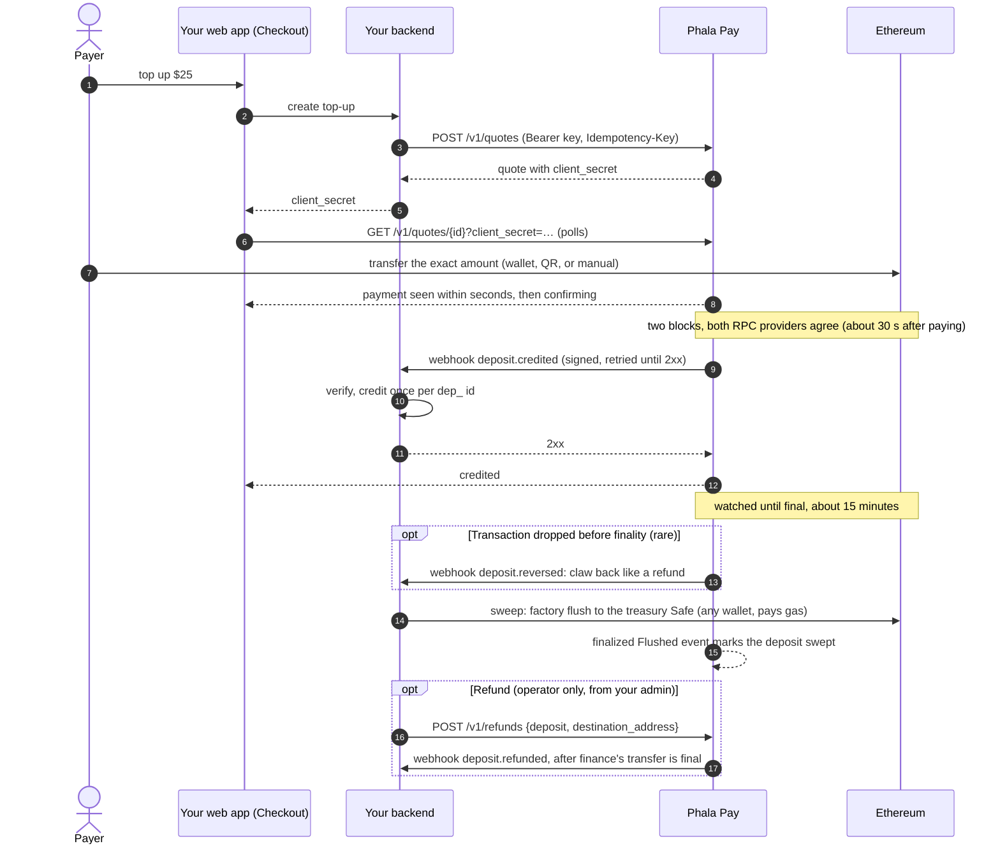

# Integration guide

For the Phala Cloud backend team, who connect Phala Cloud (a Phala Pay account, `acct_…`) to this
service. Where this guide and the code disagree, the code wins. The contract is defined by:

- [crates/topup/openapi.json](../crates/topup/openapi.json): every request and response shape,
  also served at `GET /openapi.json`;
- [deploy/product/reference_product](../deploy/product/reference_product): a complete Python
  product, the one staging credits today;
- [architecture.md](architecture.md): the design, especially §11 (the fulfillment webhook), §12
  (API, events, product UI), §14 (attestation), and §15 (refunds and policies).

Phala Pay has two SDKs, both in this repository:

- [sdk/python](../sdk/python), `phala-pay` (import `phala_pay`): the backend client,
  `PhalaPay(...).quotes.create(...)` and `.webhooks.construct_event(...)` in Stripe's shape, over
  `topup_sdk` (signing, verification, address recomputation, `topup-sdk send-test-event`) and
  `topup_client`, generated from the OpenAPI document.
- [sdk/js](../sdk/js), `@phala/pay`: the browser checkout, `<Checkout>` for
  React and a framework-agnostic core.

Samples below use them; every step is plain HTTP and ed25519, so any backend language can do the
same.

## Quickstart

The whole integration is three pieces, as with Stripe's Payment Element: the backend creates a
quote, the browser renders the checkout with the quote's client secret, and the webhook fulfils.

**Install.** `@phala/pay` is on npm (0.1.2); `phala-pay` installs from this repository until its
first PyPI release:

```sh
npm install @phala/pay viem
uv add "phala-pay @ git+https://github.com/Phala-Network/phala-pay#subdirectory=sdk/python"
```

Some resolvers drop the `#subdirectory=` fragment (PDM delegating resolution to uv, for
example) and fail to find the package; install it with `uv` or `pip` directly, and switch to
`phala-pay` from PyPI once it is released.

**Configure.** The operator creates your account and sends your contact its first secret key,
`ppay_sk_test_…` (§5.1); roll it at once and keep the new key in your secret store. Pin the
service's settlement key from its attestation (§5.3).

**1. Backend: create a quote, return its client secret.** Only the create response carries
`client_secret`; repeating the call with the same `idempotency_key` within 24 hours returns the
same response, secret included, which is how a reloaded page resumes.

```python
from phala_pay import PhalaPay

# PHALA_PAY_SECRET_KEY is your secret key, "ppay_sk_test_…" or "ppay_sk_live_…".
pay = PhalaPay(api_base=PHALA_PAY_API_BASE, api_key=PHALA_PAY_SECRET_KEY)

@app.post("/topups")
def create_topup(body: TopupRequest, team: Team = Depends(current_team)) -> dict[str, str]:
    quote = pay.quotes.create(
        account_id=team.id, amount=body.amount, chain_id=11155111, asset="pha",
        idempotency_key=body.order_id,
    )
    return {"client_secret": quote.client_secret}
```

**2. Frontend: render the checkout.** The component reads the quote's public view with the client
secret (no signature, CORS `*`) and offers a browser wallet (EIP-6963), a QR code (EIP-681), and
manual payment, with live status until the payment is credited.

```tsx
"use client";
import { Checkout } from "@phala/pay/react";

<Checkout
  clientSecret={clientSecret}
  apiBase={PHALA_PAY_API_BASE}
  onSuccess={() => router.refresh()}
  onExpire={() => startOver()}
/>
```

Its wallet button reads "Pay with crypto" (`buttonText`); `appearance` themes it to match the
page, and `onChange` reports every status change (§1.2). Without React,
`new PhalaPay({ apiBase }).checkout(clientSecret)` gives the same live status.

**3. Webhook: verify and fulfil once.** Credit `amount` cents to `account_id` once per deposit id,
commit, then answer `2xx`; `onSuccess` in the browser is display only (§2).

```python
from phala_pay import SignatureVerificationError

@app.post("/webhooks/phala-pay")
async def webhook(request: Request) -> Response:
    try:
        event = pay.webhooks.construct_event(await request.body(), request.headers, SETTLEMENT_KEY)
    except (SignatureVerificationError, ValueError):
        return Response(status_code=400)
    if event.type == "deposit.credited":
        credit_once(event.deposit.id, event.deposit.account_id, event.deposit.amount)
    elif event.type in ("deposit.reversed", "deposit.refunded"):
        claw_back_once(event.id, event.deposit.id)
    return Response(status_code=200)
```

[sdk/examples/fastapi_app.py](../sdk/examples/fastapi_app.py) is this backend in full, with an
idempotent SQLite ledger and tests; the staging reference product serves the Phala Pay demo, a
cloud console's billing page, at `/demo/`.

## 1. Quotes

### 1.1 How it works

A quote is the only way to pay, as a PaymentIntent is in Stripe: the user states an amount in
dollars and receives a locked price, an exact token amount, and a single-use address to pay
within the window. The service watches Ethereum for transfers to its addresses, waits for the
route's confirmation (two blocks on Ethereum), prices each deposit, and screens it. A deposit that
passes is credited, typically **about 30 seconds after paying**, and the service tells Phala Cloud
with a signed `deposit.credited` webhook. It keeps watching the deposit until it is final (about
15 minutes on Ethereum); in the rare case that the payment's transaction is dropped from the
chain before then, the deposit is reversed and a signed `deposit.reversed` tells you to claw the
credit back, exactly as for a refund (§2.3). Phala Cloud owns the balance: it
verifies the signature and credits the deposit once, the pattern of Stripe Checkout fulfillment
([docs.stripe.com/checkout/fulfillment](https://docs.stripe.com/checkout/fulfillment)). The
addresses are CREATE2 forwarders that can only pay the treasury; the service sweeps them there in
batches.



### 1.2 Creating and showing a quote

Read `GET /v1/config` (`pay.config.retrieve()`) for what the page shows instead of hardcoding:
the payable assets (chain, asset code, contract, decimals), the minimum `amount` in cents
(`min_amount`), the maximum deposit in token units (`max_deposit_atomic`), the per-account cap on
open quotes in cents (`max_open_amount_per_account`), the refund floor, the quote window, spread,
and tolerance, the route's `confirmations` (`"2"` on Ethereum: the payment's block and one more),
the typical credit time (`typical_credit_seconds`, 30), and the typical finality time
(`typical_finality_seconds`, 900). Quotes are priced at
`spot / (1 + quote_spread_bps / 10 000)`; a payment valued at spot (late, wrong amount, second
payment) carries no spread; network and exchange fees are the payer's; sweep gas is yours, paid
when you sweep, and never reduces a credit.

`POST /v1/quotes {account_id, amount, currency: "usd", chain_id, asset}` with an
`Idempotency-Key` returns the quote:

```json
{
  "id": "qt_0c6e1d0a9b3f4c2e8d7a6b5c4d3e2f10", "object": "quote", "account_id": "team-42",
  "amount": 2500, "currency": "usd", "chain_id": 11155111, "asset": "pha",
  "amount_atomic": "100502600000000000000", "exchange_rate": "0.24875621",
  "address": "0x…", "payment_uri": "ethereum:0x…@11155111/transfer?address=0x…&uint256=…",
  "status": "open", "expires_at": 1790410500, "created": 1790409600,
  "payment": null, "deposit": null, "client_secret": "qt_…_secret_…"
}
```

- `account_id` is your workspace id (1 to 200 characters); its account is created by its first quote.
- `amount` is an integer in US cents; `amount_atomic` is the exact token amount to pay, a decimal
  string in base units, rounded up to four token decimals (the route's `quote.amount_decimals`) so
  the payer reads and types a short amount such as `100.5026 PHA`; show every digit of it. The
  rounding is the payer's, below 0.0001 token, and the credit stays exactly `amount`;
  `exchange_rate` is the locked price in USD per token with 8 decimal
  places; times are Unix seconds.
- `status` is `open`, `complete` (a matching payment consumed it), `expired`, or `canceled`. A
  quote stays `open` past `expires_at` until the finalized chain passes it, so a payment mined in
  time is never reported as expired: hide the address once `expires_at` has passed and offer a
  new quote.
- `payment` is what the waiting screen shows once a transfer is seen on chain, display only:
  `status` (`seen` once in a block, `final` once it is a deposit at the route's confirmation;
  the name predates fast credit), `tx_hash`, `amount_atomic`,
  `confirmations` and `estimated_final_at` while `seen`, `matches_quote` (credited at the quoted
  price when true), and the `dep_` id it has or will have. A seen payment can disappear in a
  reorg and is never a credit.
- `deposit` is the deposit that completed the quote (`expand[]=deposit` returns it whole).
- `GET /v1/quotes/{id}` resumes a checkout; `POST /v1/quotes/{id}/cancel` cancels an unpaid
  quote, after which any payment to its address is credited at spot.
- A quote above the remaining open exposure fails with `409 exposure_cap_exceeded`; its message
  states what is left.

Validate the amount against `/v1/config` before creating the quote, and map a refused creation
(`ApiError.code` in Python) to a message the user can act on; never show the service's message
verbatim:

| `code` | Tell the user |
|---|---|
| `amount_too_small` (400) | The minimum top-up is `min_amount`. |
| `amount_too_large` (400) | The amount is above the maximum for one payment; split it. |
| `exposure_cap_exceeded` (409) | Too many unpaid quotes are open; pay or wait for one to expire, or enter a smaller amount. |
| `paused`, `chain_frozen` (409) | Crypto top-ups are temporarily unavailable. |
| `unavailable` (503), `rate_limit` (429) | Try again in a minute. |

Semantics (spread, tolerance, expiry by finalized chain time, exposure caps) are
[architecture §9](architecture.md#9-quotes).

**Recompute every address before you show it.** A quote's address salt is
`keccak256(abi.encode("phala-cloud", account_id, "lock", quote_id))`, and the address commits to
the factory, the implementation, your treasury, and that salt; with all three addresses pinned,
`TopupClient` recomputes it and raises
`AddressMismatchError`, so a user never pays an address you did not derive. You need no address
records of your own to credit: `deposit.credited` carries the deposit, which names the workspace
(`account_id`) and the quote (`quote`), also for a late or wrong-amount payment.

**The payer's page.** Hand the quote's `client_secret` to the paying customer's page only, and
do not log it. The page reads `GET /v1/quotes/{id}?client_secret=…` without an API key, from any
origin, as Stripe.js reads a PaymentIntent: `{id, object, status, amount, currency, asset,
decimals, chain_id, amount_atomic, address, payment_uri, expires_at, payment_status,
confirmations}`, where `payment_status` is `none`, `seen`, `confirming` (at the route's
confirmation, being valued and screened), `credited`, or `rejected` (contact support). It carries no account, price, deposit id,
or transaction hash, and is rate-limited per quote. Only `POST /v1/quotes` returns the secret; a
repeat with the same `Idempotency-Key` within 24 hours returns the same response, secret included.
`@phala/pay`'s `<Checkout>` is this page.

**Resume a checkout.** Keep the quote's `client_secret` in the browser (for example
`localStorage`, keyed by the signed-in account) until the checkout reaches `credited`, `expired`,
or `canceled`, or reports `error`. A payer who closes
the tab after paying then reopens the page on the same quote's progress instead of an empty form,
and does not pay twice.

**Drive the page from the checkout.** `<Checkout onChange>` is called once per status change with
`{ status, quote, error }`, like Stripe Elements' `onChange`. Hide your own "new payment" or
amount controls while the status is `seen` or `confirming`, so that a waiting payer does not
start a second payment. While waiting, tell the payer that the payment is credited in about 30
seconds (`typical_credit_seconds`), that they can close the page, and that the credit arrives
automatically.

**Theme it.** `appearance` takes a `theme` (`light` or `dark`) and `variables` named as in Stripe's
Appearance API: `colorPrimary`, `accessibleColorOnColorPrimary` (text on the primary color; set a
dark one with a light brand color), `colorBackground`, `colorText`, `colorTextSecondary`,
`colorBorder`, `colorDanger`, `colorSuccess`, `fontFamily`, `borderRadius`
([sdk/js/README.md](../sdk/js/README.md#appearance)).

```tsx
<Checkout
  clientSecret={clientSecret}
  apiBase={PHALA_PAY_API_BASE}
  appearance={{ theme: "dark", variables: { colorPrimary: "#cdfa50", accessibleColorOnColorPrimary: "#161616" } }}
  onChange={({ status }) => setPaymentInFlight(status === "seen" || status === "confirming")}
  onSuccess={() => { forgetClientSecret(account.id); router.refresh(); }}
  onExpire={() => forgetClientSecret(account.id)}
/>
```

### 1.3 Payment outcomes

A deposit's `status` is `detected → confirmed → credited → swept`, or `rejected` with a
`rejection_reason`, or `reversed`
([architecture §7](architecture.md#7-states-and-pump)). Nothing is reported as a deposit before
the route's confirmation (two blocks on Ethereum); a deposit is final about 15 minutes later.
The staging deposit driver asserts these outcomes on Sepolia
([deploy/README.md](../deploy/README.md#abnormal-paths)); the sandbox scenarios assert them
locally ([deploy/sandbox/README.md](../deploy/sandbox/README.md#scenarios)).

| Payment | Outcome visible to Phala Cloud |
|---|---|
| Exact quoted amount, in time (within `quote_tolerance_bps`) | Quote `complete`; `deposit.credited` with `price_source: "quote"` and exactly the quoted `amount`. |
| Underpayment beyond tolerance | Credited at spot for what arrived; quote not completed and later `quote.expired`; cancel refused with `409 quote_payment_received`. Payments are not accumulated against one quote: offer a new quote for the shortfall. |
| Overpayment beyond tolerance | Credited at spot for the full amount; quote not completed. |
| After the window (mined after `expires_at`) | `quote.expired`, then credited at spot (the deposit's `quote` still names the quote). A payment mined inside the window stays at the quoted price even if final later; the quote stays `open` past `expires_at` until then. |
| Second payment to a quote's address, or to a canceled quote's | Credited at spot. |
| Legacy persistent address (issued before quotes were the only flow), any amount | Credited at spot when confirmed. |
| Token without a route | Once confirmed, `rejected(unsupported_asset)`; never credited; the tokens stay in the forwarder. |
| Below `min_credit_minor` | `rejected(below_minimum)`. |
| Outside `min_deposit_atomic`..`max_deposit_atomic`, or credit overflow | `rejected(out_of_bounds)` or `rejected(out_of_range)`. |
| Sanctioned sender | `rejected(sanctioned)`; not refundable. |
| Transaction dropped before finality (another transaction took its nonce), or its transfer is gone at finality | Deposit `reversed`; `deposit.reversed` if you were told of it (credited or rejected): claw back the credit as for `deposit.refunded`. A quote it completed opens again while its window lasts, otherwise expires. A transaction re-included in another block keeps its deposit id and is not reversed. |
| You refuse the credit (for example a closed workspace) | Deposit `credited`; you hold it and request its refund (§2.4). Deposits refused under the retired settlement protocol show `rejected(product_refused)`. |

User-facing copy per state and reason, including what never to show, is in
[architecture §12, product UI](architecture.md#customer-experience-obligations-product-ui).

## 2. Webhooks and fulfillment

### 2.1 The event

`deposit.credited` is the one event that moves a balance. The service writes it when a deposit
passes screening, in the same transaction that marks the deposit `credited`: the credit is final
and owed to you, whatever you answer.

```http
POST {webhook_url}
content-type: application/json
webhook-id: evt_26a20351ab10595a852f9c1aa0372d73
webhook-timestamp: 1790409600
webhook-signature: v1a,<base64 ed25519 over "{webhook-id}.{webhook-timestamp}.{raw body}">

{"id": "evt_26a20351ab10595a852f9c1aa0372d73", "object": "event", "type": "deposit.credited",
 "created": 1790409590,
 "data": {"object": {"id": "dep_3f1c2b9e6a8d5c479e210b7d4f6a8c13", "object": "deposit",
                     "account_id": "team-42", "quote": "qt_…", "status": "credited",
                     "amount": 1234, "currency": "usd", "price_source": "quote", …}}}
```

- `data.object` is the deposit as `GET /v1/deposits/{id}` returns it, rendered when the event is
  first delivered and never changed afterwards; its `status` is `credited`, or `swept` if a
  finalized flush covered it before that first delivery.
- `amount` is the credit in cents: exactly the quote's `amount` when `price_source` is `quote`,
  otherwise spot when the deposit is confirmed (§1.3).
- `quote` is the quote of the receiving address, also when a late or wrong-amount payment was
  valued at spot; it is `null` only for a legacy persistent address.
- `webhook-id` is the event's `id`: `evt_` and the hex of
  `uuid_v5(DEPOSIT_NAMESPACE, "deposit.credited:" + deposit UUID)`
  (`topup_sdk.credited_event_id`), so every retry, operator replay, and re-emission after a
  service restore carries the same id.

### 2.2 The fulfillment function

```python
from topup_sdk import CreditedDeposit, SignatureError, verify_webhook

def handle_webhook(headers: dict[str, str], raw_body: bytes) -> int:
    try:
        event = verify_webhook(headers, raw_body, SETTLEMENT_KEY)  # pinned (§5.3); 300 s tolerance
    except SignatureError:
        return 400
    if event.type == "deposit.credited":
        fulfill(CreditedDeposit.from_event(event))  # commits before returning
    store_once(event.id, event.type, event.data)     # notifications and history
    return 204

def fulfill(credit: CreditedDeposit) -> None:
    with db.transaction():
        if orders.exists(provider_order_id=credit.fulfillment_key):  # "dep_…", unique
            return  # already done; a differing amount only follows a service restore: report it
        if refuses(credit):  # unknown, closed, or suspended workspace; your own caps
            orders.insert(credit.fulfillment_key, status="held")
            return  # support later requests a refund (§2.4)
        orders.insert(credit.fulfillment_key, status="paid")
        ledger.credit(credit.account_id, credit.amount)
```

`phala_pay`'s `webhooks.construct_event` (Quickstart) is the same verification with a typed
deposit. [deploy/product/reference_product/fulfillment.py](../deploy/product/reference_product/fulfillment.py)
is this on SQLite, with its tests in [deploy/product/tests](../deploy/product/tests).

### 2.3 Obligations

| # | Obligation | Why |
|---|---|---|
| 1 | Verify the `v1a` signature over the raw body against the pinned `(settlement/v1, public key)`; answer `400` otherwise. | Only the attested service may credit. |
| 2 | Credit at most once per deposit id (`dep_…`): the credit and its record in one transaction under a unique index; concurrent deliveries credit once. | Delivery is at least once and may be concurrent. |
| 3 | Answer `2xx` only after that commit, and quickly (the service waits 20 s); do slow work (emails) from a queue. | Anything else is retried, with full-jitter backoff up to 1 h, forever. |
| 4 | Refuse by holding (§2.4), never by failing the delivery. | A refused credit answered `5xx` is retried forever. |
| 5 | On a repeat with a different `amount`, keep the first credit and report it to the operator. | Only a service restored from backup re-prices a spot deposit ([architecture §14](architecture.md#14-configuration-and-deployment)). |
| 6 | On `deposit.reversed`, claw back the credit applied for that deposit id, as for `deposit.refunded`, once per event id (a held credit was never applied). | A credit is made about 30 seconds after paying, before finality; a reorg that drops the payment's transaction is rare and recoverable only this way. |

Optional hardening, your choice: fetch `GET /v1/deposits/{id}` in `fulfill` and require
`credited` or `swept` with the same amount; recompute the deposit id, `dep_` and the hex of
`uuid_v5(NS, "{chain_id}:{tx_hash}:{receipt_log_index}")` (`topup_sdk.deposit_id`), where
`receipt_log_index` is the transfer's position among its transaction's receipt logs (0 for a plain
token transfer), and verify the cited log on your own node at finality; per-deposit and per-period caps as review holds. None is needed for
correctness: as with a card processor, the credit is authorized by the service's signature.
Do not credit from a checkout page's own fetch of the deposit: credits come only from signed
events, and the event follows the `credited` commit within a second.

### 2.4 Refusing a credit

The service never asks whether you accept a deposit. To refuse one (an account you do not know, a
closed or suspended workspace, your own caps), record it as held and answer `2xx`; when support
has a destination address from the user, an operator refunds it from your admin (§3).
Finance approves it and executes it from the treasury Safe, and `deposit.refunded` follows. To
stop crediting an account before deposits arrive, pause its `settlement` scope
(the operator's `POST /v1/admin/accounts/{acct}/customers/{account_id}/pause`): its deposits
then wait in `confirmed` until you resume.

### 2.5 Phala Cloud ledger mapping

Find-or-create an `Order` (`provider = crypto_topup`, `order_flow_code = 'crypto-top-up'`,
`provider_order_id` = the deposit id `dep_…`, unique per flow), the credit transaction with
`funding_source = crypto:<asset>:<chain>`, and `complete_order_payment`, in one transaction
([architecture §11](architecture.md#11-fulfillment-webhook)).

### 2.6 Delivery and event types

Every event, `deposit.credited` included, is Standard Webhooks with the asymmetric `v1a` scheme,
signed with the `settlement/v1` key and `POST`ed to the registered webhook URL:

```text
webhook-id: evt_…
webhook-timestamp: <Unix seconds of this attempt>
webhook-signature: v1a,<base64 ed25519 over "{webhook-id}.{webhook-timestamp}.{raw body}">

{"id": "<same evt_ id>", "object": "event", "type": "deposit.credited", "created": 1790409590,
 "data": {"object": {…}}}
```

The body is Stripe's [Event object](https://docs.stripe.com/api/events/object) without its
account fields; the signature is Standard Webhooks, not `Stripe-Signature`, because you hold only
the service's public key.

- Verify over the raw body bytes, never re-serialized JSON. Several space-separated signatures
  may appear during a key rotation; accept when one verifies.
- Answer `2xx` only after the credit and the event are durably stored. Anything else, or no
  answer within 20 s, is retried until delivered, with full-jitter backoff whose ceiling starts at
  30 s and doubles to 1 h; there is no final attempt. The operator is warned about events
  undelivered for 24 hours.
- Deduplicate by `webhook-id`; delivery is at least once.
- There is no ordering: `quote.expired` can arrive after the `deposit.credited` of a late
  payment. Act on fetched state (the deposit or quote), never on event order.
- Only `deposit.credited` moves a balance up, and `deposit.reversed` and `deposit.refunded` move
  it back (§2); every other event is for notifications, history, and UI refresh.
- Ignore unknown event types and unknown fields.
- A lost event can be replayed by the operator with the admin-signed
  `POST /v1/admin/outbox/{event_id}/replay {reason}`: same id, same body. An event delivered
  before prefixed ids keeps its old envelope on replay (`event_id`, `created_at`, flat `data`);
  the SDK parses it, and `CreditedDeposit.from_event` refuses it because it was fulfilled when
  first delivered. The operator's
  deposit view (`GET /v1/admin/deposits/{id}`) lists each deposit's `events` with `delivered_at`.

| Type | When | `data.object` |
|---|---|---|
| `deposit.credited` | Final, priced, and screened: fulfill it (§2). | The deposit |
| `deposit.rejected` | Rejected (§1.3); `rejection_reason` says why. | The deposit |
| `deposit.reversed` | The deposit's transaction left the chain before finality; sent if you were told of the deposit (credited or rejected). Claw back its credit as for `deposit.refunded` (§2.3). | The deposit, `status: "reversed"` |
| `deposit.refunded` | A refund transaction is final; one event per refund. | The deposit, with its `amount_refunded_atomic` |
| `quote.expired` | The finalized chain passed `expires_at` with the quote unpaid. | The quote |

Every object names its `account_id`. Before the route's confirmation nothing is sent: a checkout
page shows the payment from the quote's `payment` (or the payer's `payment_status` read by
`client_secret`).

### 2.7 Receipts

Recommended if you already bill with Stripe, and not required: record each credited deposit in
Stripe, so the customer gets the same invoice and receipt as for a card top-up.

- On `deposit.credited`, after the credit commits, create an invoice for the customer with one
  line of `amount` cents, finalize it, and mark it paid with
  [`Invoice.pay(paid_out_of_band=True)`](https://docs.stripe.com/api/invoices/pay): no charge
  is made. Make the line's price tax-inclusive
  ([`tax_behavior: "inclusive"`](https://docs.stripe.com/tax/products-prices-tax-codes-tax-behavior)),
  so the invoice total equals the credited amount.
- Do it once per `dep_` id. Store the invoice id against the deposit right after creating it,
  and resume from the stored id (finalize, then pay) instead of creating another. Stripe
  idempotency keys alone are not enough: Stripe
  [keeps them 24 hours](https://docs.stripe.com/api/idempotent_requests), and a retry can come
  later.
- On `deposit.refunded` and `deposit.reversed`, issue a
  [credit note](https://docs.stripe.com/api/credit_notes/create) on that invoice with
  `out_of_band_amount` for the reversed credit, once per event.
- Do this from a queue, not inside the webhook's `2xx` path: a Stripe outage must not hold a
  credit (§2.3, obligation 3).

## 3. Refunds

A rejected deposit is refundable unless the reason is `sanctioned` or its amount is below the
route's `min_refund_atomic` (in `/v1/config`). A credited deposit is refunded only when you ask,
for a credit you did not apply or reverse, such as a held credit (§2.4;
[architecture §15](architecture.md#15-operating-policies)).

Refunds are operator actions, as in Stripe's Dashboard: your support or finance staff start one
from your own internal admin, whose backend holds your secret key. Never offer a refund
as a self-service action to the paying user: a crypto refund is irreversible, and a credited
balance may already be spent. Request it by deposit id, not through the user's account, so that a
payment to an account that no longer exists (a deleted workspace, a mistyped id) is refundable
too. Ask the user for a destination address they control (never default to `from_address`,
which may be an exchange), then:

```http
POST /v1/refunds
Idempotency-Key: "…"

{"deposit": "dep_…", "destination_address": "0x…", "amount_atomic": "…"}
```

```json
{"id": "re_…", "object": "refund", "deposit": "dep_…", "amount_atomic": "…",
 "destination_address": "0x…", "status": "pending", "tx_hash": null, "created": 1790500000}
```

- `amount_atomic` is in token base units and defaults to the unrefunded remainder; more than the
  remainder is `400 amount_too_large`.
- `status` is `pending` while finance approves and executes the transfer from the treasury Safe,
  and `succeeded` once the transfer is final, when `deposit.refunded` is sent and the deposit's
  `amount_refunded_atomic` (and `refunded`, once whole) shows it. `GET /v1/refunds/{id}` reads it.
- An ineligible deposit is `409 deposit_not_refundable`; a deposit that is not final yet (about
  15 minutes after its block on Ethereum) is `409 deposit_not_final`, so nothing is paid back for
  a payment that could still be reversed: retry after finality. A paused `refunds` scope is
  `409 paused`. The same `Idempotency-Key` with the same request returns the same response.
- When `deposit.refunded` arrives, reverse the credit you applied for that deposit (a held
  credit was never applied), once per event id.

## 4. Testing and go-live

### 4.1 Environments

| | Origin | Chain | Status |
|---|---|---|---|
| Production | `https://pay-api.phala.com` | Ethereum Mainnet (1) | Not deployed yet |
| Staging | `https://pay-api-staging.phala.com` | Sepolia (11155111) | Live |

Staging's route, with its forwarder factory, implementation, and test PHA token
(a `MockERC20` whose `mint(address,uint256)` is public), is
[deploy/config/routes/phala-cloud-sepolia-pha.yaml](../deploy/config/routes/phala-cloud-sepolia-pha.yaml).
Staging's `phala-cloud` account is currently the reference product; switching staging to Phala
Cloud's staging backend is an operator change of the account's webhook URL, and the route stays
as it is. Your key selects the mode: `ppay_sk_test_` keys act on test routes (Sepolia), and
`ppay_sk_live_` keys, issued once the operator enables live mode, on live routes.

### 4.2 Testing your receiver

`topup-sdk send-test-event` exercises your webhook receiver the way `stripe trigger` does:

```sh
cd sdk/python
uv run --locked topup-sdk keygen --keyid settlement/v1 --seed-out /tmp/test-service.seed
# Configure your test instance to pin the printed public key in place of the service key, then:
uv run --locked topup-sdk send-test-event --url https://test.example/topup/webhooks \
  --seed-file /tmp/test-service.seed --account-id test-workspace --amount 250
```

It sends a signed `deposit.credited`, the same event again, and a copy signed by another key, and
passes when your answers are `2xx`, `2xx`, and `4xx`. Then check your ledger: exactly one credit
of `--amount` cents for `--account-id`. The reference product's tests
([deploy/product/tests](../deploy/product/tests)) are a worked example of the §2 obligations.

### 4.3 Staging

Staging runs on Sepolia with the test PHA token (§4.1). Until Phala Cloud's staging backend is
registered there, the reference product receives staging's credits; it is the model for a
complete product (fulfillment, holds, refund requests). Once your receiver is registered, pay test
quotes with minted test PHA and Sepolia ETH for gas, and play the abnormal payments of §1.3.
Sepolia deposits are credited about 30 seconds after paying and final about 15 minutes later.

### 4.4 Go-live checklist

- [ ] `topup-sdk send-test-event` passes against your production code path, and the ledger holds
      one credit.
- [ ] Fulfillment keyed by the deposit id (`dep_…`) under a unique index, committed before `2xx`;
      refusals recorded as holds, never answered `5xx`.
- [ ] Live mode enabled by the operator; the first live key rolled on receipt and kept in the
      secret store, never in code or logs; webhook URL agreed.
- [ ] Settlement key pinned from verified attestation of production (§5.3), with the keyid.
- [ ] Every address recomputed before display; the `client_secret` handed only to the paying
      customer's page and never logged.
- [ ] Webhook receiver verifies, stores every event by `webhook-id`, and drives UI from fetched
      state.
- [ ] Quote, waiting, history, and exception UI per
      [architecture §12](architecture.md#customer-experience-obligations-product-ui); amounts
      validated against `/v1/config` and quote-creation errors mapped to messages (§1.2); a
      checkout resumes after a reload; "new payment" hidden while a payment is `seen` or
      `confirming`.
- [ ] Refund path in your internal admin, by deposit id with a user-supplied address, also for
      held credits and unknown accounts; `deposit.refunded` reverses the credit (§3).
- [ ] `deposit.reversed` claws back the credit exactly as `deposit.refunded` does (§2.3,
      obligation 6).
- [ ] Alerts on your side: webhook signature failures (rate-limited, for example through error
      tracking rather than paging, since anyone can post to the URL), a repeated deposit id with a
      different amount, payments to unknown accounts, and held credits waiting for a refund.
- [ ] Receipts, if you issue them with Stripe: one out-of-band paid invoice per deposit, and a
      credit note per refund (§2.7).
- [ ] Optional hardening decided: caps, `GET /v1/deposits/{id}` check, own-node log verification.
- [ ] One quote-first deposit credited end to end on staging.

## 5. Reference

### 5.1 Your account and first keys (done by the operator)

There is no signup: the operator creates your account after due diligence done offline
(design D8). Send the operator your company's details, a security contact (name and email), and
your webhook URL (public `https`). The operator then:

1. creates the account with the admin-signed `POST /v1/admin/accounts`
   ([deploy/README.md](../deploy/README.md#account-credentials)), which returns its id, `acct_…`,
   and its first secret key of test mode, `ppay_sk_test_…`;
2. sends the key to your contact through an encrypted channel. **Roll it on receipt** (§5.4), so
   no one at Phala holds a working key.

Live mode is the operator's decision (`charges_enabled`); enabling it returns your first live key,
`ppay_sk_live_…`, handed over and rolled the same way. Until then a live key answers
`403 testmode_charges_only`.

### 5.2 Keys and modes

A secret key is `ppay_sk_{test|live}_`, 43 random base62 characters, and a 6-character CRC32
checksum (GitHub's token format), so a mistyped key is refused without a lookup and secret scanners
recognise a leaked one. The service stores only its SHA-256 and shows the key once.

The key selects your account and the mode: a test key quotes on test routes (Sepolia) and reads
only test objects, a live key only live ones; another account's or the other mode's objects
answer `404`, as a missing one does. Keep keys in your secret store, never in code, logs, or a
browser.

### 5.3 Pin the service's settlement key

The service signs its webhooks with one ed25519 key, `settlement/v1` (the name is a dstack key
domain and stays), derived inside its confidential VM. You hold only its public key, so nothing
you store can forge a credit. Pin it only from verified attestation ([architecture §14](architecture.md#14-configuration-and-deployment)):

```sh
export TOPUP_ORIGIN=https://pay-api-staging.phala.com
export NONCE="$(openssl rand -hex 32)"
curl -fsS "$TOPUP_ORIGIN/v1/attestation?nonce=$NONCE" > attestation.json
# The official dstack verifier, pinned by digest (Docker): quote, TCB, event log, OS image.
jq '{quote: null, attestation: .quote}' attestation.json |
  deploy/dstack-verifier.sh > verification.json
jq -e --arg app "$APP_ID" --arg compose "$COMPOSE_HASH" \
  --arg report_data "$(jq -r '.report_data' attestation.json)" '
  .details.tcb_status == "UpToDate" and .details.app_info.app_id == $app
  and .details.app_info.compose_hash == $compose
  and .details.report_data == $report_data + ("0" * 64)' verification.json
```

`APP_ID` and `COMPOSE_HASH` are the values the operator gives you for the deployment
([deploy/README.md](../deploy/README.md#attestation-ingress-and-egress) shows how the operator
derives them). Then check that `report_data` binds your nonce and the key:

```python
import json, os
from topup_client.models import AttestationResponse
from topup_sdk import verify_attestation_binding

response = AttestationResponse.from_dict(json.load(open("attestation.json")))
verify_attestation_binding(response, bytes.fromhex(os.environ["NONCE"]))  # raises AttestationError
assert response.keyid == "settlement/v1"
print(response.settlement_pubkey)  # hex; pin it together with the keyid
```

`TopupClient.attestation(nonce)` fetches and runs the same binding check. The binding alone is
worthless without the verifier step: it proves only that the response is self-consistent.

### 5.4 Manage and roll keys

With a secret key you manage the keys of its account and mode (design D7), as Stripe keys:

| Method and path | Purpose |
|---|---|
| `GET /v1/api_keys`, `GET /v1/api_keys/{id}` | The mode's keys (`key_…`), with `redacted` (prefix and last four), `status` (`active`, `expiring`, `expired`, `revoked`), `expires_at`, and `last_used` (to the minute); never the secret. |
| `POST /v1/api_keys` `{name?}` | A new secret key; its `secret` is in this response only. |
| `POST /v1/api_keys/{id}/roll` `{expires_in?}` | A new key with the same name; the old one keeps working for `expires_in` seconds (at most 604800, 7 days), then answers `401 api_key_expired`. `0`, the default, revokes it at once. |
| `DELETE /v1/api_keys/{id}` | Revoke at once. The mode's last key that is neither revoked nor expiring cannot be revoked (`409 last_api_key`), so you always keep one. |

A planned rotation: roll with an overlap (`{"expires_in": 86400}`), deploy the new key, and let
the old one expire. A leak: roll with `{"expires_in": 0}` at once. If you lost every key of a
mode, or cannot win against an attacker who rolls too, ask the operator from your recorded
contact: they verify the request, may revoke the mode's keys, and issue a recovery key
([runbook](../deploy/runbooks/api-key-compromise.md)). Every key change is an `api_key.created`,
`api_key.updated`, or `api_key.revoked` event to your webhook endpoints, with the `actor` (a key
id, or `admin`) that made it; an operator change of your account is `account.updated`.

### 5.5 Authentication

Every request carries your secret key as a Bearer token:

```http
Authorization: Bearer ppay_sk_test_…
```

Only `Bearer` is accepted (no HTTP Basic). A missing key is `401 api_key_missing`, a malformed,
unknown, or revoked one `401 api_key_invalid`, and a rolled key past its expiry
`401 api_key_expired`. Requests are limited per account and mode, 100 per second live and 25 test
(Stripe's numbers), with a platform-wide test-mode ceiling: `429 rate_limit`, retry with backoff.

```python
from topup_sdk import TopupClient

# The forwarder factory and implementation, pinned from the attested deployment like the settlement
# key (§5.3), and your treasury: the client recomputes every open quote's address before returning it.
forwarder = (
    "0x2407bE5Be2b632F5b166872A49E4946a70CCa531",  # factory
    "0x70B714508BFa441449DC09f790Ca03Baa5170360",  # implementation
    "0x936c1991f8dA9a919fa11b557a3514719f5A4504",  # treasury
)
with TopupClient(
    "https://pay-api-staging.phala.com", PHALA_PAY_SECRET_KEY, forwarder=forwarder
) as client:
    config = client.get_config()
    quote = client.create_quote("team-42", 2500, chain_id=11155111, asset="pha")
```

Your account id, `acct_…` (`GET /v1/account`), is the first input of every quote's address salt;
the client reads it once for the address check, or takes it as `account=`.

### 5.6 Idempotency and retries

Every `POST` accepts an `Idempotency-Key` header (design §13, Stripe's idempotent requests): an
RFC 8941 string (`"8e03…"`, as in the IETF Idempotency-Key draft) or a bare token (Stripe's form),
up to 255 characters, kept per account and mode for 24 hours. A repeat of the same request (method,
path, and body) returns the first response again with `Idempotent-Replayed: true`, errors
included; the same key with another request is `400 idempotency_key_reused`
(`type: idempotency_error`); a repeat while the first request still runs is
`409 idempotency_key_in_use`, retry. A `429` or `5xx` is not kept, so a retry runs the request
again. Without a key every `POST` runs. A replayed key creation or roll returns the key without
its `secret`, which is never stored: roll again if the first response was lost. Canceling a
canceled quote and revoking a revoked key return it unchanged.

`TopupClient.create_quote` and `create_refund` send a fresh key unless you pass one, and reuse it
on every retry.

`TopupClient` retries transport errors, `429`, `500`, `502`, `503`, `504`, and
`409 idempotency_key_in_use`, up to 4 attempts with exponential backoff from 0.5 s.

### 5.7 Endpoints

Every path is a top-level resource; your key names your account and its mode, and another
account's or the other mode's objects answer `404`, as a missing one does. `account_id` is your workspace id (1 to 200 characters).

| Method and path | Purpose | `TopupClient` |
|---|---|---|
| `GET /v1/account` | Your account: `id` (`acct_…`), `name`, `charges_enabled` (live mode), `paused_scopes`, and the key's `livemode`. | `get_account` |
| `GET /v1/config` | Payable assets (chain, asset code, contract, decimals), minimum and maximum amounts, quote window, spread, tolerance, confirmations, and typical credit and finality times: what your UI shows instead of hardcoding. | `get_config` |
| `POST /v1/quotes` `{account_id, amount, currency: "usd", chain_id, asset}` | Quote `amount` cents: a locked price, the exact token amount, and a single-use address. The account is created by its first quote. The response alone carries the quote's `client_secret`; a repeat with the same `Idempotency-Key` replays it. | `create_quote` |
| `GET /v1/quotes/{id}` | Resume a checkout: `status`, `expires_at`, and the seen `payment`. Without an API key, with `?client_secret=`, the payer's page reads the public `ClientQuote` (`payment_status`: `none`, `seen`, `confirming`, `credited`, `rejected`); any origin, rate-limited. Give the secret only to the paying customer's page and do not log it. | `get_quote` |
| `POST /v1/quotes/{id}/cancel` | Cancel an unpaid quote; later payments to its address credit at spot. | `cancel_quote` |
| `GET /v1/deposits` | Deposits at the route's confirmation, newest first, as a Stripe list `{object: "list", url, has_more, data}`: filters `account_id`, `quote`, `status`, `tx_hash`, `created[gte]`, `created[lte]`; `limit` (1 to 100, default 10) with `starting_after` or `ending_before` (a `dep_` id); `expand[]=data.quote`. | `list_deposits` (follows every page) |
| `GET /v1/deposits/{id}` | One deposit (`dep_…`); `expand[]=quote`. | `get_deposit` |
| `POST /v1/refunds` `{deposit, destination_address, amount_atomic?}` | Refund request for finance (§3); `amount_atomic` defaults to the unrefunded remainder; `Idempotency-Key` as for quotes. | `create_refund` |
| `GET\|POST /v1/api_keys`, `GET\|DELETE /v1/api_keys/{id}`, `POST /v1/api_keys/{id}/roll` | Your keys (§5.4). | — |
| `GET /v1/refunds/{id}` | One refund (`re_…`): `pending` until the transfer is final, then `succeeded`; `expand[]=deposit`. | `get_refund` |
| `GET /v1/attestation?nonce=` | Settlement key evidence (§5.3); unauthenticated. | `attestation` |

### 5.8 Errors

Errors are Stripe's error object, `{"error": {"type", "code", "message", "param"}}`
([docs.stripe.com/api/errors](https://docs.stripe.com/api/errors)): `type` is
`invalid_request_error`, `idempotency_error`, or `api_error` (5xx); `param` names the request
parameter when there is one. Codes are stable; messages are not.

| Status | `code` | Meaning |
|---|---|---|
| 400 | `parameter_missing`, `parameter_unknown`, `parameter_invalid` | Malformed input, with `param`. Do not retry unchanged. |
| 400 | `amount_too_small`, `amount_too_large` | Below the minimum credit or deposit, or above the maximum deposit (`param: "amount"`), or above a refund's remainder (`param: "amount_atomic"`). |
| 400 | `idempotency_key_reused` (`type: idempotency_error`) | The same `Idempotency-Key` with another request. |
| 401 | `api_key_missing`, `api_key_invalid`, `api_key_expired` | No Bearer key; a malformed, unknown, or revoked key; a rolled key past its expiry (§5.5). |
| 403 | `testmode_charges_only` | A live key of an account the operator has not enabled for live mode. |
| 403 | `permission_denied` | The key's kind does not hold the permission. |
| 404 | `resource_missing` | Unknown or foreign resource. |
| 409 | `idempotency_key_in_use` (`type: idempotency_error`) | A request with this key still runs; retry. |
| 409 | `api_key_inactive`, `last_api_key` | Roll of a revoked or already rolled key; revoke of the mode's last active key (§5.4). |
| 409 | `exposure_cap_exceeded` | Open quote exposure cap (account, product, or global); the message states what is left. |
| 409 | `quote_payment_received`, `quote_window_closed`, `quote_unexpected_state` | Quote cancel refused: its address already received a payment, its window closed, or it is complete or expired. |
| 409 | `paused`, `chain_frozen` | Scope paused, or chain frozen pending reconciliation; show "temporarily unavailable". Not retried. |
| 409 | `deposit_not_refundable` | The deposit is not eligible for a refund (§3). |
| 409 | `deposit_not_final` | The deposit could still be reversed; request the refund once it is final (§3). |
| 409 | `conflict` | Other state conflicts. |
| 429 | `rate_limit` | Requests per account and mode (§5.5), quote creation per customer, or reads of one quote by its `client_secret`. |
| 503 | `unavailable` | Temporarily unavailable (for example no fresh price); retry. |
| 500 | `internal_error` | Retry with backoff. |

### 5.9 Versioning and deprecation

#### API

- The path prefix carries the major version (`/v1`). Within it every change is backward
  compatible: new endpoints, optional request fields, response fields, error codes, and event
  types. Ignore unknown response fields and event types.
- A breaking change needs a new prefix (`/v2`); the old one keeps working for the deprecation
  window.
- `info.version` in `openapi.json` is the service release (the Cargo workspace version), SemVer
  on the published contract: MAJOR with a new prefix, MINOR when the document gains anything,
  PATCH otherwise.
- Integrator-visible API changes are recorded in [CHANGELOG.md](../CHANGELOG.md).

#### SDK

- `phala-pay` and `@phala/pay` follow SemVer independently: MAJOR for a breaking
  change to the public API (`phala_pay` and `topup_sdk` exports, generated `topup_client`
  names, the JavaScript exports and component props) or a new API major version;
  MINOR for regeneration against an additive OpenAPI change or new helpers; PATCH for fixes.
- Each release records the `info.version` it was generated from.
- Only `make -C sdk/python generate` changes `src/topup_client`; CI fails if regeneration is not a
  no-op, so a PR that changes `openapi.json` regenerates the client in the same PR.

#### Deprecation

- Anything integrators use is removed only after at least 90 days from the announcement:
  endpoints, fields, error codes, event types and fields, SDK public functions and parameters,
  and API major versions. The one exception so far was the move from settlement requests to
  webhook fulfillment, made before any product consumed the settlement protocol in production.
- Announcing means, in one release: `deprecated: true` in OpenAPI (and a `DeprecationWarning` from
  the SDK), a `Deprecated` changelog entry with the earliest removal date, and notice to every
  registered product contact.
- Removal happens in the sandbox first, in production no earlier than the announced date. Only a
  security fix may shorten the window, and its changelog entry says why.

#### SDK changelog rules

[sdk/python/CHANGELOG.md](../sdk/python/CHANGELOG.md) follows Keep a Changelog: every PR that
changes `openapi.json`, `topup_sdk`, the generated client, or the signing profile adds an entry
under `Unreleased` (`Added`, `Changed`, `Deprecated`, `Removed`, `Fixed`, `Security`); a release
heading carries the SDK version, date, and OpenAPI `info.version`; `Deprecated` names the
replacement and earliest removal date; `Removed` links the deprecating release; breaking changes
come first.

### 5.10 SDK development

```sh
make -C sdk/python sync      # uv sync --locked --all-groups
make -C sdk/python check     # ruff, mypy --strict, pytest, and the regeneration no-op check
make -C sdk/python generate  # after an openapi.json change
(cd sdk/js && pnpm install && pnpm run check && pnpm run e2e)  # typecheck, lint, tests, build
```

Releases are tags: `sdk-py-v<version>` publishes `phala-pay` to PyPI and
`sdk-js-v<version>` publishes `@phala/pay` to npm, from `.github/workflows/release-sdks.yml`
after the SDK's tests pass on the tagged commit, with trusted publishing (no stored tokens) from the
`npm` and `pypi` environments.

Regenerate the signing vectors only after an intentional profile change, then rerun the Rust
test:

```sh
(cd sdk/python && uv run --locked python -m tests.vectors)
cargo test -p topup --lib api::auth
```

Also in this repository: the local sandbox, `make sandbox-local`, whose smoke check
[deploy/sandbox/smoke.py](../deploy/sandbox/smoke.py) pins, quotes, recomputes, and verifies
([deploy/sandbox/README.md](../deploy/sandbox/README.md)).
